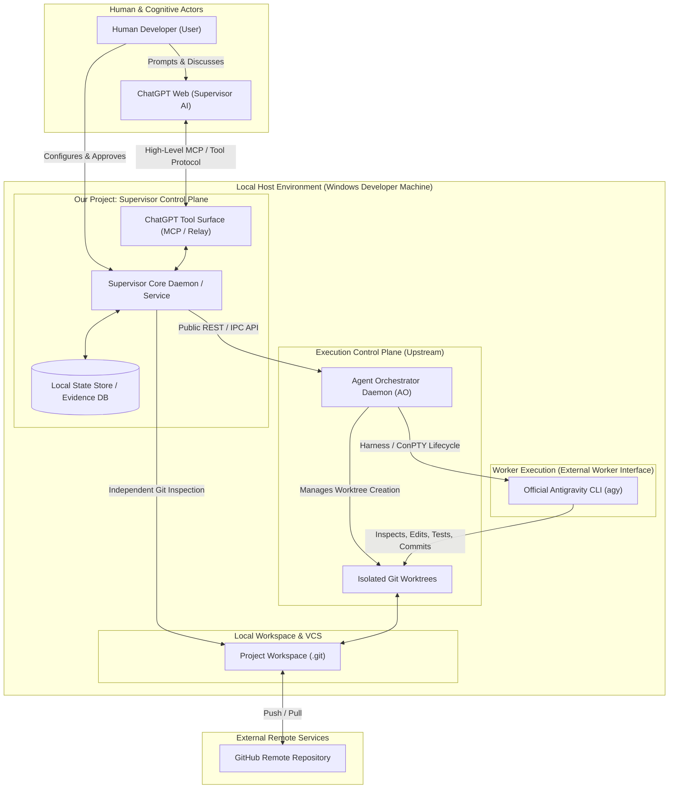

# 03. SYSTEM CONTEXT

> **Focus**: External Actors, Interfacing Systems, Trust Boundaries & Protocols  
> **Status**: Baseline Specification

---

# 1. System Context Diagram

---

# 2. Actors and Entities

### 2.1 Primary Actors
- **Human Developer (User)**:
  - Registers projects, binds the ChatGPT Supervisor session, reviews Phase audits, and holds ultimate authority over architectural decisions.
- **ChatGPT Web (Supervisor AI)**:
  - Operates as Chief Architect and Technical Lead. Formulates task objectives, sets constraints, reviews aggregated evidence bundles, and makes approval/revision decisions.

### 2.2 System Components
- **Supervisor Control Plane (Our System)**:
  - The central coordinator and evidence auditor. Exposes a slim, high-signal tool surface to ChatGPT, translates task intents into immutable Task Contracts, triggers the execution plane, and independently collects audit evidence.
- **Agent Orchestrator (AO - Upstream Dependency)**:
  - An industrial-grade daemon written in Go that manages agent harnesses, terminal ConPTY processes, Git worktree isolation, and session persistence.
- **Antigravity CLI (agy - Primary Worker)**:
  - Google Antigravity's official headless command-line interface. Runs inside isolated worktrees managed by AO to perform actual code edits, compilation, test executions, and git commits.
- **Git & Workspace Repository**:
  - The local repository filesystem acting as the absolute authority on code changes, branch history, and diffs.

---

# 3. Trust Boundaries & Communication Channels

| Boundary | Interfacing Components | Protocol / Mechanism | Security Controls |
|---|---|---|---|
| **Boundary 1: Web to Local** | ChatGPT Web ↔ Supervisor Tool Surface | Local MCP Relay / Secure WebSocket | Readonly defaults, loopback-only binding, token auth, path containment. |
| **Boundary 2: Supervisor to Execution** | Supervisor Core ↔ AO Daemon | Loopback HTTP REST / JSON API | Local IPC, strict schema validation, no internal db access. |
| **Boundary 3: Execution to Worker** | AO Daemon ↔ Antigravity CLI | OS Process / ConPTY Pipes | Process isolation, isolated git worktree, environment confinement. |
| **Boundary 4: Supervisor to Git** | Supervisor Core ↔ Local Git Repo | Readonly Git CLI commands (`git diff`, `git log`) | Strict read-only operations, no direct file writes. |
