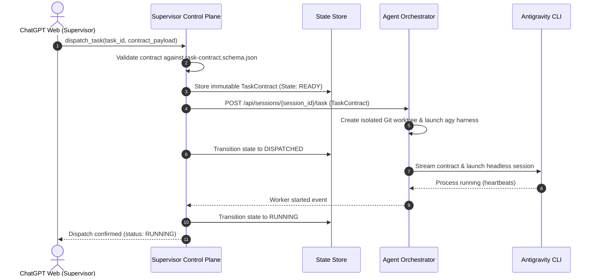
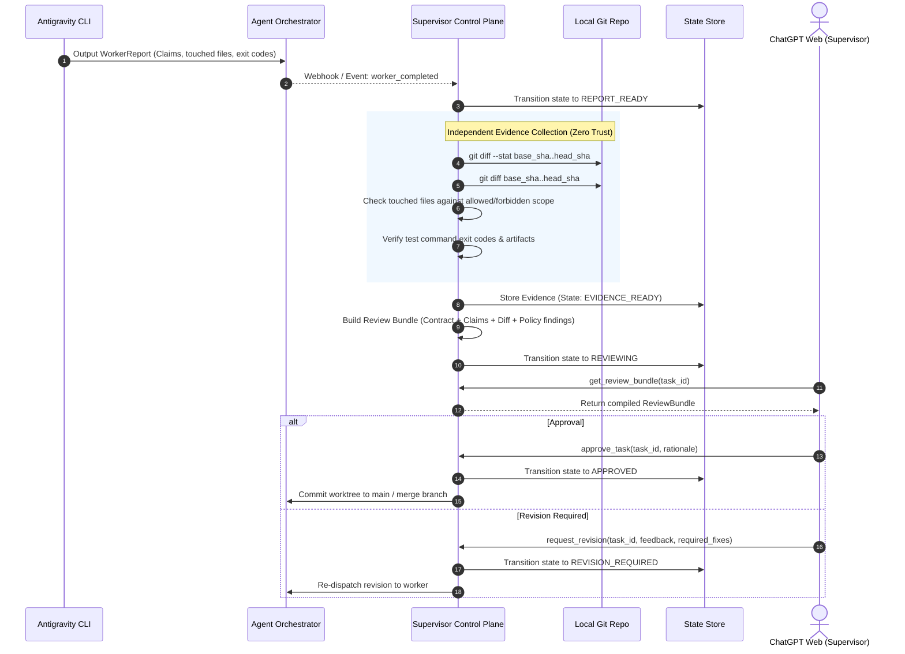

# 04. CANONICAL ARCHITECTURE

> **Authority**: System Architecture Blueprint (Single Canonical Reference)  
> **Status**: Approved Baseline

---

# 1. The Three Planes Architecture

The system is strictly decomposed into three decoupled planes:

```text
┌──────────────────────────────────────────────────────────────┐
│                    1. INTELLIGENCE PLANE                     │
│                        ChatGPT Web                           │
│  Role: Architect, Planner, Auditor, Decision Maker           │
│  Properties: High reasoning, no OS/file execution capability │
└──────────────────────────────┬───────────────────────────────┘
                               │ Structured Tool Invocations
                               ▼
┌──────────────────────────────────────────────────────────────┐
│                 2. SUPERVISOR CONTROL PLANE                  │
│                        (OUR PROJECT)                         │
│  Role: State Manager, Task Formulator, Evidence Collector    │
│  Modules:                                                    │
│  - Project & Pair Registry                                   │
│  - Task Contract Manager                                     │
│  - Review Bundle Builder                                     │
│  - Policy & Scope Engine                                     │
│  - Independent Evidence Collector                            │
│  - AO Public Adapter                                         │
│  - Sanitized Audit Trail                                     │
└──────────────────────────────┬───────────────────────────────┘
                               │ Stable Public API Contract
                               ▼
┌──────────────────────────────────────────────────────────────┐
│                 3. EXECUTION CONTROL PLANE                   │
│                 Untrivial Agent Orchestrator                 │
│  Role: Process Daemon, ConPTY Runtime, Worktree Manager      │
│  Modules:                                                    │
│  - Daemon Lifecycle                                          │
│  - Session Persistence                                       │
│  - Git Worktree Isolation                                    │
│  - Agent Harness Adapters (Antigravity CLI)                  │
└──────────────────────────────┬───────────────────────────────┘
                               │ Headless Process Execution
                               ▼
┌──────────────────────────────────────────────────────────────┐
│                        PRIMARY WORKER                        │
│                   Official Antigravity CLI                   │
│  Role: Implementation, Code Modification, Test & Fix         │
└──────────────────────────────────────────────────────────────┘
```

---

# 2. Core Execution & Review Flows

## 2.1 Task Dispatch Flow


## 2.2 Worker Completion & Independent Review Flow


---

# 3. Adapter Boundaries & Upstream Decoupling

To ensure our system is not tightly coupled to external tools:
1. **AOAdapter Boundary**:
   - Exposes clean domain methods: `health()`, `registerProject()`, `createWorkerSession()`, `dispatchTask()`, `getWorkerStatus()`, `stopWorker()`.
   - Shields Supervisor domain models from AO-internal DTOs.
2. **ChatGPT Transport Boundary**:
   - Isolates the protocol (MCP, local HTTP relay, or ChatGPT App) behind a uniform `SupervisorToolSurface` interface.
3. **Worker Abstraction**:
   - While Antigravity is the primary V1 worker, the contract format supports future addition of alternative workers (Codex CLI, Claude Code) without modifying the Supervisor Core.

---

# 4. Authority Boundaries & Explicit Non-Architecture

The following architectural constraints are strictly enforced:

> [!CRITICAL]
> 1. **AO internal database is NOT an integration API**: We never read or write directly to AO's SQLite database. All communication occurs via AO's published REST API or CLI interface.
> 2. **Worker runtime state belongs exclusively to AO**: Process PIDs, terminal ConPTY buffers, and active worktree paths are managed by AO.
> 3. **Task & Governance state belongs exclusively to the Supervisor**: Task contracts, review decisions, and phase statuses are mastered in the Supervisor State Store.
> 4. **Code truth belongs exclusively to Git**: The Git commit history, tree hashes, and diffs are the authoritative source on implementation state.
> 5. **Technical truth belongs exclusively to canonical documents**: Architecture, requirements, and ADRs in `docs/` are the authoritative guide for engineering logic.
