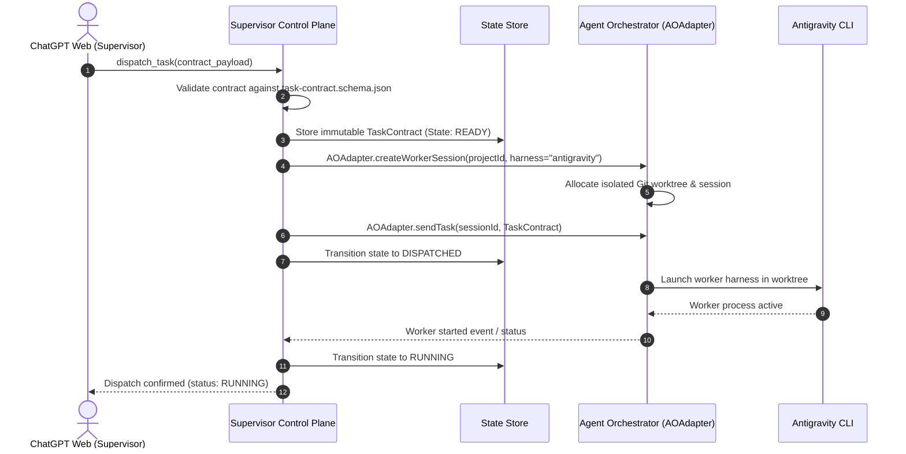
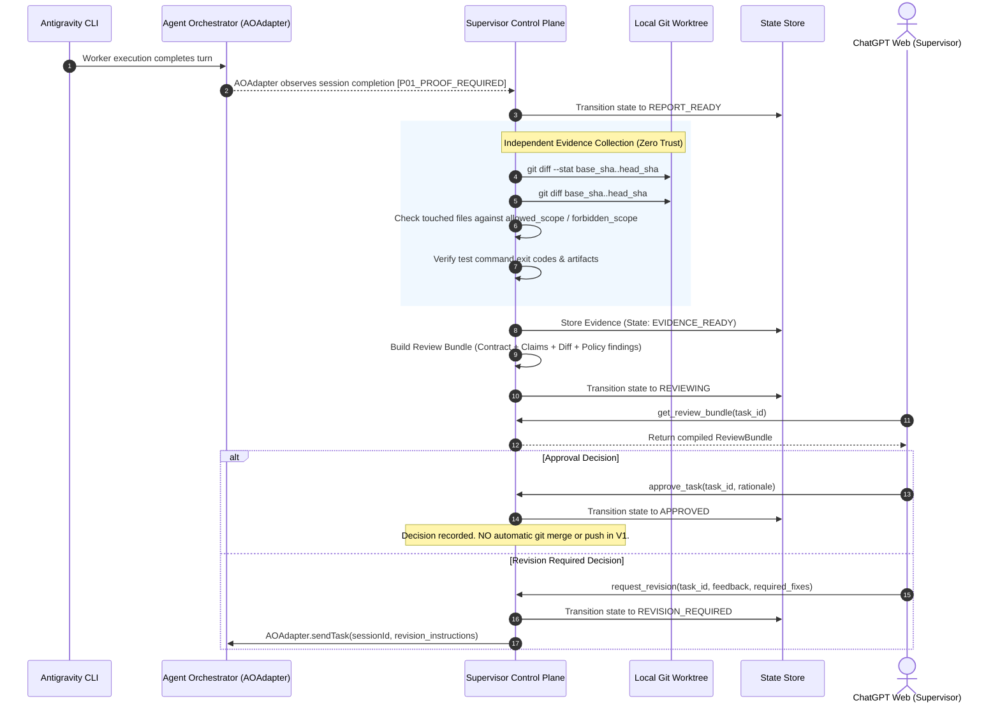

# 04. CANONICAL ARCHITECTURE

> **Authority**: System Architecture Blueprint (Single Canonical Reference)  
> **Status**: Verified Documentation Baseline (Post-Remediation)

---

# 1. The Three Planes Architecture

The system is strictly decomposed into three decoupled planes:

```text
┌──────────────────────────────────────────────────────────────┐
│                    1. INTELLIGENCE PLANE                     │
│                        ChatGPT Web                           │
│  Role: Architect, Planner, Auditor, Decision Maker           │
│  Properties: High reasoning, no OS/file execution capability │
└──────────────────────────────┬───────────────────────────────┘
                               │ Structured Tool Invocations (12 Tools)
                               ▼
┌──────────────────────────────────────────────────────────────┐
│                 2. SUPERVISOR CONTROL PLANE                  │
│                        (OUR PROJECT)                         │
│  Role: State Manager, Task Formulator, Evidence Collector    │
│  Modules:                                                    │
│  - Project & Pair Registry                                   │
│  - Task Contract Manager                                     │
│  - Review Bundle Builder                                     │
│  - Policy & Scope Engine                                     │
│  - Independent Evidence Collector                            │
│  - AO Public Adapter (Anti-Corruption Layer)                 │
│  - Sanitized Audit Trail                                     │
└──────────────────────────────┬───────────────────────────────┘
                               │ Domain Operations via AOAdapter
                               ▼
┌──────────────────────────────────────────────────────────────┐
│                 3. EXECUTION CONTROL PLANE                   │
│                 Untrivial Agent Orchestrator                 │
│  Role: Process Daemon, ConPTY Runtime, Worktree Manager      │
│  Modules:                                                    │
│  - Daemon Lifecycle (/healthz, /readyz)                      │
│  - Session Persistence & Worktree Creation (/sessions)       │
│  - Worker Process ConPTY Management (/send, /kill, /restore) │
│  - Agent Harness Adapters (Antigravity CLI)                  │
└──────────────────────────────┬───────────────────────────────┘
                               │ Headless Process / Harness Invocation
                               ▼
┌──────────────────────────────────────────────────────────────┐
│                        PRIMARY WORKER                        │
│                   Official Antigravity CLI                   │
│  Role: Autonomous Code Synthesis, Test Execution, Build      │
└──────────────────────────────────────────────────────────────┘
```

---

# 2. Canonical Execution & Review Flows

## 2.1 Task Dispatch Flow


## 2.2 Worker Completion & Independent Review Flow


---

# 3. Adapter Boundaries & Integration Realism

### 3.1 AOAdapter Boundary
All execution interactions flow strictly through `AOAdapter`. The adapter encapsulates:
- Daemon health checks (`GET /healthz`, `GET /readyz`);
- Project registration (`POST /api/v1/projects`);
- Session creation (`POST /api/v1/sessions`);
- Task transmission (`POST /api/v1/sessions/{id}/send`);
- Process control (`POST /api/v1/sessions/{id}/kill`, `POST /api/v1/sessions/{id}/restore`).
Detailed HTTP mappings reside exclusively in `docs/sources/UPSTREAM_CONTRACT_BASELINE.md`.

### 3.2 AO ↔ Agy Integration Realism & P01 Proof
- **Known Upstream Finding**: AO `v0.13.0` invokes Agy interactively using `--prompt-interactive`. Official Agy separately supports headless print mode (`--print`, `--output-format stream-json`, `--json-schema`).
- **Integration Boundary**: The exact mechanism for extracting normalized `WorkerReport` data from AO session runs is designated `P01_PROOF_REQUIRED`. The Supervisor treats worker report generation as a normalized contract requirement, not an unverified upstream native feature.

---

# 4. Authority Boundaries & Readonly Supervisor Policy

> [!CRITICAL]
> 1. **Zero Direct Code Mutation by Supervisor**: ChatGPT and the Supervisor Control Plane are strictly readonly regarding application source files.
> 2. **No Automatic Merge on Approval**: `approve_task` formally records review approval and updates task state to `APPROVED`. It does **NOT** automatically merge branches, commit to main, or push to remotes. Source promotion remains a human/explicit workflow.
> 3. **AO internal database is NOT an integration API**: We never read or write directly to AO SQLite stores.
> 4. **Code truth belongs exclusively to Git**: Commit SHAs, diffs, and worktree states are authoritative.
