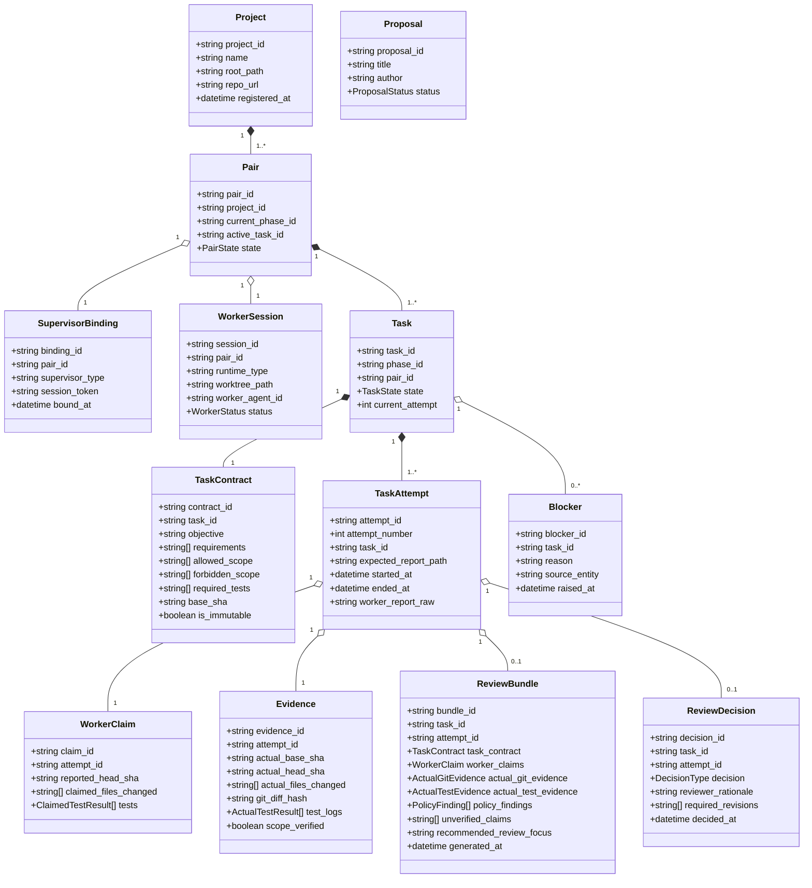

# 05. DOMAIN MODEL SPECIFICATION

> **Focus**: Ubiquitous Language, Aggregates, Entities, Value Objects & Domain Relationships
> **Status**: Approved Baseline

---

# 1. Domain Entities and Value Objects

---

# 2. Entity Dictionary & Invariants

1. **Project**:
   - Represents a registered codebase workspace.
   - *Invariant*: `root_path` must exist locally and contain a valid Git repository.
2. **Pair**:
   - Represents the active engineering collaboration lane between a Supervisor and Worker.
   - *Invariant*: Exactly one task may be in `DISPATCHED`, `RUNNING`, or `REVIEWING` state per Pair at any time.
3. **Task, TaskContract & TaskAttempt**:
   - `Task` manages overall task lifecycle and attempt history.
   - `TaskContract` defines the static, immutable work specification (`is_immutable == true`). It does **not** contain transient execution identities such as `attempt_id`.
   - `TaskAttempt` represents a single execution, retry, or revision iteration.
   - *Invariants*:
     - `attempt_id` is unique within the system.
     - Canonical report path derives deterministically from `task_id` and `attempt_id`: `.supervisor/reports/<task_id>/<attempt_id>.json`.
     - Review of an attempt binds strictly to that attempt's claims and evidence; an attempt cannot consume claims or evidence from another attempt.
4. **WorkerClaim vs. Evidence**:
   - `WorkerClaim`: Self-reported statements from the worker process, bound to `attempt_id`.
   - `Evidence`: Verified facts collected directly from Git and OS process execution logs by the Supervisor, bound to `attempt_id`.
   - *Invariant*: Evidence cannot be written or modified by the worker.
5. **ReviewBundle & ReviewDecision**:
   - `ReviewBundle` is attempt-scoped (`attempt_id`) and compiles the immutable contract, worker claims, independent Git/test evidence, policy findings, and review focus.
   - `ReviewDecision` is explicitly bound to both `task_id` and `attempt_id`, preventing review decisions from becoming ambiguous across revision cycles.
