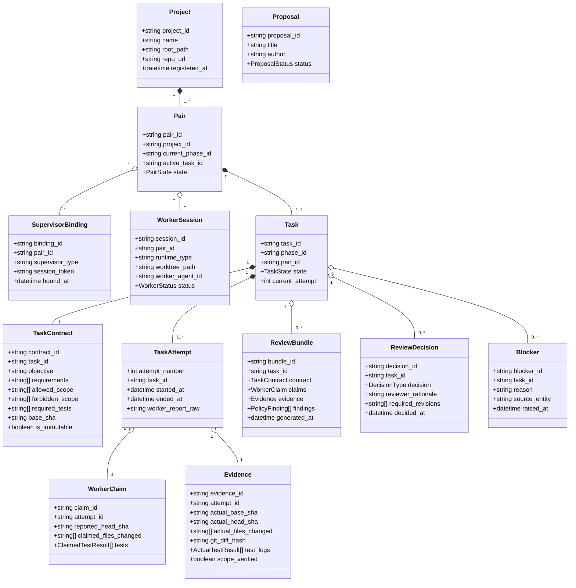

# 05. DOMAIN MODEL SPECIFICATION

> **Focus**: Ubiquitous Language, Aggregates, Entities, Value Objects & Domain Relationships  
> **Status**: Approved Baseline

---

# 1. Domain Entities and Value Objects

---

# 2. Entity Dictionary & Invariants

1. **Project**:
   - Represents a registered codebase workspace.
   - *Invariant*: `root_path` must exist locally and contain a valid Git repository.
2. **Pair**:
   - Represents the active engineering collaboration lane between a Supervisor and Worker.
   - *Invariant*: Exactly one task may be in `DISPATCHED`, `RUNNING`, or `REVIEWING` state per Pair at any time.
3. **Task & TaskContract**:
   - `Task` manages lifecycle and attempts. `TaskContract` defines the static work specification.
   - *Invariant*: Once dispatched, `TaskContract` is completely immutable (`is_immutable == true`).
4. **WorkerClaim vs. Evidence**:
   - `WorkerClaim`: Self-reported statements from the worker process.
   - `Evidence`: Verified facts collected directly from Git and OS process execution logs by the Supervisor.
   - *Invariant*: Evidence cannot be written or modified by the worker.
5. **ReviewBundle**:
   - The compiled data structure delivered to ChatGPT for auditing.
   - *Invariant*: Must include both worker claims and independent evidence side-by-side with policy findings.
