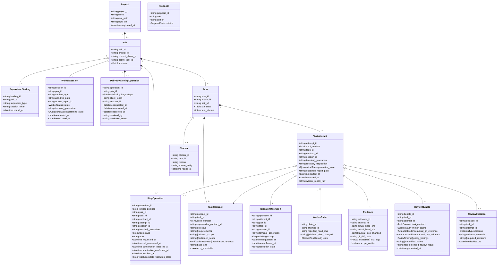

# 05. DOMAIN MODEL SPECIFICATION

> **Focus**: Ubiquitous Language, Aggregates, Entities, Value Objects & Domain Relationships
> **Status**: Approved Baseline (Updated Architecture V2.1 / ADR-012)

---

# 1. Domain Entities and Value Objects

---

# 2. Entity Dictionary & Invariants

1. **Project**:
   - Represents a registered codebase workspace.
   - *Invariant*: `root_path` must exist locally and contain a valid Git repository.

2. **Pair & WorkerSession**:
   - `Pair` represents the active engineering collaboration lane between a Supervisor and Worker.
   - `WorkerSession` represents the current physical worker session bound to the Pair.
     - Preserves canonical domain relationship `Pair "1" o-- "1" WorkerSession` with bidirectional uniqueness (`pair_id PRIMARY KEY`, `session_id UNIQUE`).
     - Attributes: `pair_id`, `session_id`, `runtime_type`, `worktree_path` (nullable string: `worktree_path TEXT NULL`, reflecting pinned AO v0.13.0 public API absence), `worker_agent_id`, `status` (`ACTIVE`, `IDLE`, `TERMINATED`), `terminal_generation` (opaque string generation identifier), `quarantine_state` (`CLEAN`, `QUARANTINED`, default `'CLEAN'`), `created_at`, `updated_at`.
   - *Invariants*:
     - Exactly one task may be in `DISPATCHED`, `RUNNING`, or `REVIEWING` state per Pair at any time.
     - Runtime lifecycle `status` (`ACTIVE` / `IDLE` / `TERMINATED`) is strictly separated from safety gate `quarantine_state` (`CLEAN` / `QUARANTINED`). A terminated session may be quarantined or clean.
     - `CREATE_NEW_WORKER_SESSION_ALLOWED_IFF` (ADR-016 §9): Creating a new worker session is permitted IF AND ONLY IF:
       1. Zero existing `worker_sessions` rows currently exist for the Pair (`COUNT(*) == 0`); AND
       2. Zero unresolved `pair_provisioning_operations` rows exist for the Pair (`# ONE_PAIR = AT_MOST_ONE_UNRESOLVED_PROVISIONING_OPERATION`, `stage IN ('PROVISION_REQUESTED', 'PROVISION_FAILED')`); AND
       3. Zero active quarantine blocks provisioning (`worker_sessions.quarantine_state == 'CLEAN'` and all prior `task_attempts.quarantine_state == 'CLEAN'`).
     - Session Non-Replacement & Exclusivity (`PROVISION_CONFIRMED` and `TERMINATED + CLEAN` do NOT authorize a second spawn):
       - If a `worker_sessions` row already exists for the Pair (`ACTIVE` or `IDLE`): the existing session MUST be reused for subsequent tasks; new spawn is rejected.
       - If the existing session is `TERMINATED` but restorable: the existing session MUST be resumed via the governed `ResumeWorker` wire path (`POST /api/v1/sessions/{sessionId}/restore`); allocating a new session ID is strictly prohibited.
       - If `QUARANTINED`: provisioning is strictly locked.
       - Unresolved crash / 404: Fail closed; requires operator administrative risk resolution. Blind overwrite or replacement of the Model-A current binding is strictly prohibited.

3. **Durable Saga Operations (ADR-016 §27)**:
   - **`PairProvisioningOperation` (`pair_provisioning_operations`)**:
     - Tracks durable Pair-scoped sandbox provisioning across external side effects, providing crash consistency and unowned session containment.
     - Schema (Authoritative DDL in ADR-016 §27): `operation_id TEXT PRIMARY KEY`, `pair_id TEXT NOT NULL REFERENCES pairs(pair_id) ON DELETE RESTRICT`, `stage TEXT NOT NULL CHECK (stage IN ('PROVISION_REQUESTED', 'PROVISION_CONFIRMED', 'PROVISION_FAILED', 'PROVISION_RESOLVED'))`, `client_token TEXT NOT NULL`, `session_id TEXT`, `requested_at TEXT NOT NULL`, `completed_at TEXT`, `resolved_at TEXT`, `resolved_by TEXT`, `resolution_notes TEXT`.
     - Partial Unique Index: `idx_pair_provisioning_unresolved ON pair_provisioning_operations(pair_id) WHERE stage IN ('PROVISION_REQUESTED', 'PROVISION_FAILED')`.
     - Lifecycle Tracking: Managed exclusively through `stage` and resolution audit metadata (`resolved_at`, `resolved_by`, `resolution_notes`). Authoritative candidate DDL defines NO `resolution_state` column.
   - **`DispatchOperation` (`dispatch_operations`)**:
     - Tracks the 3-stage dispatch saga and guarantees 1:1 attempt cardinality (`# ONE_TASK_ATTEMPT = ONE_DISPATCH_OPERATION`).
     - Schema (Authoritative DDL in ADR-016 §27): `operation_id TEXT PRIMARY KEY`, `attempt_id TEXT NOT NULL UNIQUE REFERENCES task_attempts(attempt_id) ON DELETE RESTRICT`, `pair_id TEXT NOT NULL REFERENCES pairs(pair_id) ON DELETE RESTRICT`, `task_id TEXT NOT NULL REFERENCES tasks(task_id) ON DELETE RESTRICT`, `session_id TEXT NOT NULL`, `terminal_generation TEXT NOT NULL`, `stage TEXT NOT NULL CHECK (stage IN ('DISPATCH_BOUND', 'SEND_REQUESTED', 'SEND_CONFIRMED'))`, `requested_at TEXT NOT NULL`, `confirmed_at TEXT`, `resolution_state TEXT`.
     - Persistence: `stage` records wire delivery facts. Authoritative candidate DDL defines `resolution_state TEXT` without an enumerated CHECK constraint; no closed resolution vocabulary is created by implication.
   - **`StopOperation` (`stop_operations`)**:
     - Tracks purpose-aware stop operations with restart-stable confirmation deadlines and stage provenance, preventing blind re-kill over runtimes lacking an atomic generation fence.
     - Schema (Authoritative DDL in ADR-016 §27): `operation_id TEXT PRIMARY KEY`, `purpose TEXT NOT NULL CHECK (purpose IN ('RUNNING_ATTEMPT_STOP', 'QUARANTINE_CLEANUP', 'PAIR_MAINTENANCE'))`, `pair_id TEXT NOT NULL REFERENCES pairs(pair_id) ON DELETE RESTRICT`, `task_id TEXT REFERENCES tasks(task_id) ON DELETE RESTRICT`, `contract_id TEXT REFERENCES task_contracts(contract_id) ON DELETE RESTRICT`, `attempt_id TEXT REFERENCES task_attempts(attempt_id) ON DELETE RESTRICT`, `session_id TEXT NOT NULL`, `terminal_generation TEXT NOT NULL`, `stage TEXT NOT NULL CHECK (stage IN ('STOP_REQUESTED', 'STOP_CALL_SUCCEEDED', 'STOP_CALL_FAILED', 'STOP_TERMINATION_CONFIRMED', 'STOP_TARGET_ABSENT'))`, `actor TEXT NOT NULL`, `requested_at TEXT NOT NULL`, `call_completed_at TEXT`, `confirmation_deadline_at TEXT`, `termination_confirmed_at TEXT`, `resolved_at TEXT`, `resolution_state TEXT NOT NULL DEFAULT 'IN_FLIGHT'`.
     - Governed Resolution States (ADR-016 §6 Item 5): `IN_FLIGHT`, `TERMINATION_CONFIRMED`, `STOP_TARGET_ABSENT`, `STOP_CONFIRMATION_TIMEOUT`, `STOP_GENERATION_MISMATCH`, `STOP_EFFECT_UNPROVEN_TARGET_ALREADY_TERMINATED`, `STOP_REISSUE_REQUIRES_HUMAN`, `STOP_CALL_FAILED`, `STOP_CALL_OUTCOME_UNKNOWN`, `ADMINISTRATIVE_RISK_ACCEPTED`.
     - `ADMINISTRATIVE_RISK_ACCEPTED` is also a distinct audit `event_type` for exact-lineage verified risk acceptance (ADR-016 D5; clarification); it is not D6 `QUARANTINE_RESOLVED_ADMINISTRATIVE`. Class B retains `STOP_TARGET_ABSENT`; Class C changes only stop resolution and `resolved_at` before separate Tx D and D6.
     - Invariant: `stage` (wire-effect fact) is strictly distinct from `resolution_state` (governed outcome). Resolution tokens are never stored in `stage`.

4. **Task, TaskContract & TaskAttempt (Model A Persistence)**:
   - `Task` manages overall task lifecycle and attempt history across revision cycles.
   - `TaskContract` defines the immutable work specification (`is_immutable == true`).
     - Each `Task` has one or more `TaskContract` revisions (`Task 1 -> 1..* TaskContract`).
     - Every revision has a unique `contract_id`, a monotonically increasing `revision_number` within the task, and an optional `supersedes_contract_id` (ADR-012).
     - Once dispatched, a `TaskContract` revision is permanently immutable. It **never** contains transient execution identities such as `attempt_id`.
   - `TaskAttempt` represents a single execution, retry, or revision iteration under **Model A Attempt Persistence**:
     - Each `TaskAttempt` binds to exactly one `TaskContract` revision (`contract_id`).
     - Core Attributes: `attempt_id` (unique opaque immutable attempt identity), `attempt_number` (monotonically increasing integer within the task), `task_id`, `contract_id`, `expected_report_path`, `started_at`, `ended_at`, `worker_report_raw`.
     - Candidate Snapshot Extensions (ADR-016 §27):
       - `session_id TEXT`: Immutable snapshot of the bound worker session identity, populated at `DISPATCH_BOUND` and permanently immutable once written.
       - `terminal_generation TEXT`: Opaque generation string launch fence, populated at `DISPATCH_BOUND` and permanently immutable once written (never deferred to attempt conclusion).
       - `recovery_disposition TEXT`: Diagnostic classification of execution outcome (e.g. `UNCERTAIN_DELIVERY_CRASH`, `MISSED_ACTIVE_WINDOW`, `AO_BLOCKED_DECISION`, `AO_BLOCKED_ESCALATED`, `WORKER_STOPPED`).
       - `quarantine_state TEXT NOT NULL DEFAULT 'CLEAN' CHECK (quarantine_state IN ('CLEAN', 'QUARANTINED'))`: Independent safety gate at attempt scope.
     - *Invariants*:
       - `task_attempts` contains zero undeclared columns (rejecting invented columns such as `terminal_error`; full error details reside in `audit_events.details_json`).
       - Diagnostic `recovery_disposition` is strictly distinct from safety gate `quarantine_state`.
       - A `TaskAttempt` is allocated before every `READY -> DISPATCHED` transition.
       - Canonical report path derives deterministically: `.supervisor/reports/<task_id>/<attempt_id>.json`.
       - `REVISION_REQUIRED -> READY` creates a new `TaskContract` revision (`revision_number + 1`, `supersedes_contract_id`).
       - `FAILED -> READY` retry without specification changes reuses the same `contract_id` and allocates a new `TaskAttempt` upon dispatch, provided both quarantine gates and provisioning guards are `CLEAN`.

5. **Double-Gated Quarantine Invariant (ADR-016 §12)**:
   - The Supervisor enforces defense-in-depth through two independent quarantine gates:
     1. **Pair Lane Gate (`worker_sessions.quarantine_state`)**: Controls whether the physical worker session lane is eligible for task dispatch or new session allocation.
     2. **Task Attempt Gate (`task_attempts.quarantine_state`)**: Controls whether the specific attempt has resolved its safety boundaries before task retry or completion.
   - Values for both gates are strictly `CLEAN` / `QUARANTINED`.
   - Retrying a failed task (`FAILED -> READY`) requires that:
     - `worker_sessions.quarantine_state == 'CLEAN'`;
     - All prior attempts for the task have `quarantine_state == 'CLEAN'`;
     - The Pair has zero rows in `pair_provisioning_operations` with `stage IN ('PROVISION_REQUESTED', 'PROVISION_FAILED')`.

6. **WorkerClaim vs. Evidence**:
   - `WorkerClaim`: Self-reported statements from the worker process, bound strictly to `attempt_id`.
   - `Evidence`: Verified facts collected directly from Git, file trees, and the trusted verification runner by the Supervisor, bound strictly to `attempt_id`.
   - *Invariant*: Evidence cannot be written or modified by the worker.

7. **ReviewBundle & ReviewDecision**:
   - `ReviewBundle` is attempt-scoped (`attempt_id`) and compiles the immutable contract revision, worker claims, independent Git/test evidence, policy findings, and recommended review focus.
   - `ReviewDecision` is explicitly bound to both `task_id` and `attempt_id`, preventing review decisions from becoming ambiguous across revision cycles.

## 3. ADR-016 addendum v4 entities và invariants

Schema v4 bổ sung restore_authorizations (one-shot authorization gắn operation_id/Pair/session/expected_generation/risk_scope/verified principal), pair_restore_operations (stage RESTORE_REQUESTED/RESTORE_CONFIRMED; resolution IN_FLIGHT/RESTORE_OUTCOME_UNKNOWN/RESTORE_RECOVERY_CLAIMED/RESTORE_CLEANUP_CLAIMED/RESTORE_RESOLVED; basis RESTORE_HTTP_200_CONFIRMED/PHYSICAL_EXECUTION_RESOLUTION/ADMINISTRATIVE_RISK_RESOLUTION), và nullable stop_operations.restore_operation_id với unique index cho linked stop. Exact CHECK/FK/index/trigger ở addendum §2. DISPATCH_UNRESOLVED xét mọi open attempt, SEND_REQUESTED/NULL kể cả closed và current_attempt inconsistency. Linked PAIR_MAINTENANCE cho new runtime generation không có attempt IDs, có restore link/authority/provenance; QUARANTINE_CLEANUP vẫn khớp immutable snapshot 3A. DELIVERY_OUTCOME_UNKNOWN là dispatch resolution terminal, không clear quarantine. PRE_SEND_PROTOCOL_UNVERIFIED mạnh hơn RECOVERY_PENDING; hold CAS exact lineage/old disposition.
