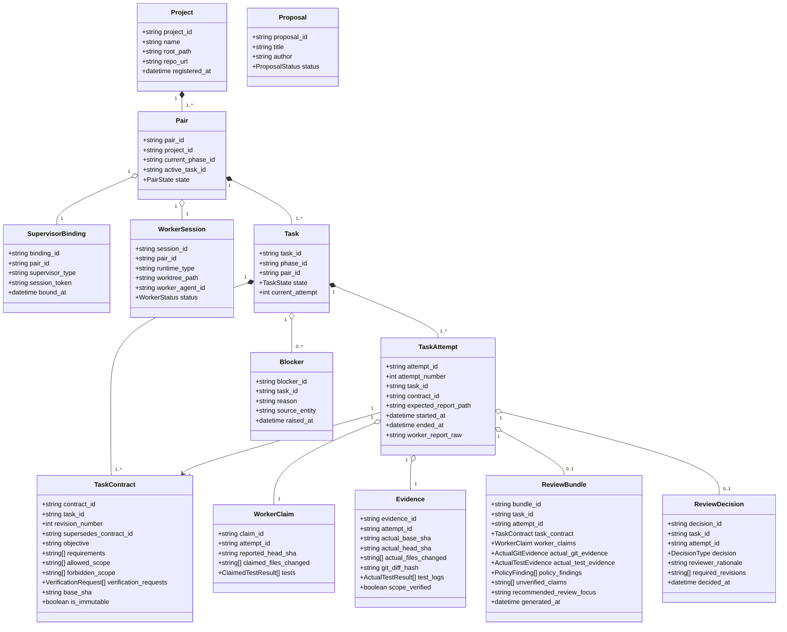

# 05. DOMAIN MODEL SPECIFICATION

> **Focus**: Ubiquitous Language, Aggregates, Entities, Value Objects & Domain Relationships
> **Status**: Approved Baseline (Updated Architecture V2.1 / ADR-012)

---

# 1. Domain Entities and Value Objects

---

# 2. Entity Dictionary & Invariants

1. **Project**:
   - Represents a registered codebase workspace.
   - *Invariant*: `root_path` must exist locally and contain a valid Git repository.
2. **Pair**:
   - Represents the active engineering collaboration lane between a Supervisor and Worker.
   - *Invariant*: Exactly one task may be in `DISPATCHED`, `RUNNING`, or `REVIEWING` state per Pair at any time.
3. **Task, TaskContract & TaskAttempt**:
   - `Task` manages overall task lifecycle and attempt history across revision cycles.
   - `TaskContract` defines the immutable work specification (`is_immutable == true`).
     - Each `Task` has one or more `TaskContract` revisions (`Task 1 -> 1..* TaskContract`).
     - Every revision has a unique `contract_id`, a monotonically increasing `revision_number` within the task, and an optional `supersedes_contract_id` (ADR-012).
     - Once dispatched, a `TaskContract` revision is permanently immutable. It **never** contains transient execution identities such as `attempt_id`.
   - `TaskAttempt` represents a single execution, retry, or revision iteration.
     - Each `TaskAttempt` binds to exactly one `TaskContract` revision (`contract_id`).
     - Attributes: `attempt_id` (unique opaque immutable attempt identity), `attempt_number` (monotonically increasing integer within the task), `task_id`, `contract_id`, `expected_report_path`, `started_at`, `ended_at`, `worker_report_raw`.
   - *Invariants*:
     - A `TaskAttempt` is allocated before every `READY -> DISPATCHED` transition.
     - Canonical report path derives deterministically: `.supervisor/reports/<task_id>/<attempt_id>.json`.
     - `REVISION_REQUIRED -> READY` creates a new `TaskContract` revision (`revision_number + 1`, `supersedes_contract_id`).
     - `FAILED -> READY` retry without specification changes reuses the same `contract_id` and allocates a new `TaskAttempt` upon dispatch.
4. **WorkerClaim vs. Evidence**:
   - `WorkerClaim`: Self-reported statements from the worker process, bound strictly to `attempt_id`.
   - `Evidence`: Verified facts collected directly from Git, file trees, and the trusted verification runner by the Supervisor, bound strictly to `attempt_id`.
   - *Invariant*: Evidence cannot be written or modified by the worker.
5. **ReviewBundle & ReviewDecision**:
   - `ReviewBundle` is attempt-scoped (`attempt_id`) and compiles the immutable contract revision, worker claims, independent Git/test evidence, policy findings, and recommended review focus.
   - `ReviewDecision` is explicitly bound to both `task_id` and `attempt_id`, preventing review decisions from becoming ambiguous across revision cycles.
