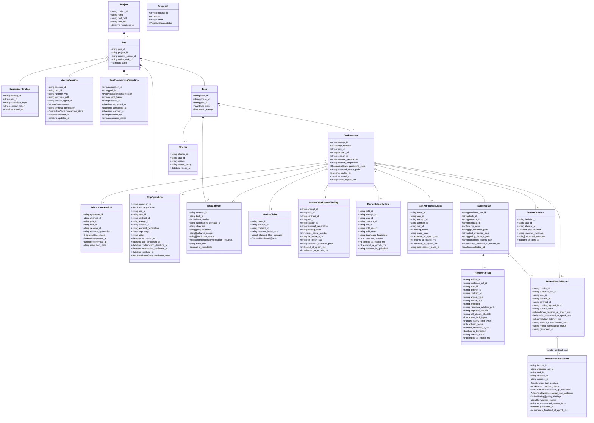

# 05. DOMAIN MODEL SPECIFICATION

> **Focus**: Ubiquitous Language, Aggregates, Entities, Value Objects & Domain Relationships
> **Status**: Approved Baseline (Updated Architecture V2.1 / ADR-012)

---

# 1. Domain Entities and Value Objects


```mermaid
classDiagram
    class Project {
        +string project_id
        +string name
        +string root_path
        +string repo_url
        +datetime registered_at
    }

    class Pair {
        +string pair_id
        +string project_id
        +string current_phase_id
        +string active_task_id
        +PairState state
    }

    class SupervisorBinding {
        +string binding_id
        +string pair_id
        +string supervisor_type
        +string session_token
        +datetime bound_at
    }

    class WorkerSession {
        +string session_id
        +string pair_id
        +string runtime_type
        +string worktree_path
        +string worker_agent_id
        +WorkerStatus status
        +string terminal_generation
        +QuarantineState quarantine_state
        +datetime created_at
        +datetime updated_at
    }

    class PairProvisioningOperation {
        +string operation_id
        +string pair_id
        +PairProvisioningStage stage
        +string client_token
        +string session_id
        +datetime requested_at
        +datetime completed_at
        +datetime resolved_at
        +string resolved_by
        +string resolution_notes
    }

    class DispatchOperation {
        +string operation_id
        +string attempt_id
        +string pair_id
        +string task_id
        +string session_id
        +string terminal_generation
        +DispatchStage stage
        +datetime requested_at
        +datetime confirmed_at
        +string resolution_state
    }

    class StopOperation {
        +string operation_id
        +StopPurpose purpose
        +string pair_id
        +string task_id
        +string contract_id
        +string attempt_id
        +string session_id
        +string terminal_generation
        +StopStage stage
        +string actor
        +datetime requested_at
        +datetime call_completed_at
        +datetime confirmation_deadline_at
        +datetime termination_confirmed_at
        +datetime resolved_at
        +StopResolutionState resolution_state
    }

    class Task {
        +string task_id
        +string phase_id
        +string pair_id
        +TaskState state
        +int current_attempt
    }

    class TaskContract {
        +string contract_id
        +string task_id
        +int revision_number
        +string supersedes_contract_id
        +string objective
        +string[] requirements
        +string[] allowed_scope
        +string[] forbidden_scope
        +VerificationRequest[] verification_requests
        +string base_sha
        +boolean is_immutable
    }

    class TaskAttempt {
        +string attempt_id
        +int attempt_number
        +string task_id
        +string contract_id
        +string session_id
        +string terminal_generation
        +string recovery_disposition
        +QuarantineState quarantine_state
        +string expected_report_path
        +datetime started_at
        +datetime ended_at
        +string worker_report_raw
    }

    class WorkerClaim {
        +string claim_id
        +string attempt_id
        +string contract_id
        +string reported_head_sha
        +string[] claimed_files_changed
        +ClaimedTestResult[] tests
    }

    class AttemptWorkspaceBinding {
        +string attempt_id
        +string task_id
        +string contract_id
        +string pair_id
        +string session_id
        +string terminal_generation
        +string binding_state
        +int volume_serial_number
        +string file_index_high
        +string file_index_low
        +string canonical_worktree_path
        +int bound_at_epoch_ms
        +int released_at_epoch_ms
    }

    class ReviewIntegrityHold {
        +string hold_id
        +string attempt_id
        +string task_id
        +string contract_id
        +string pair_id
        +string hold_reason
        +string hold_state
        +string diagnostic_fingerprint
        +int occurrence_number
        +int created_at_epoch_ms
        +int resolved_at_epoch_ms
        +string resolved_by_principal
    }

    class TaskVerificationLease {
        +string lease_id
        +string task_id
        +string attempt_id
        +string contract_id
        +string pair_id
        +int fencing_token
        +string lease_state
        +int acquired_at_epoch_ms
        +int expires_at_epoch_ms
        +int released_at_epoch_ms
        +string predecessor_lease_id
    }

    class EvidenceSet {
        +string evidence_set_id
        +string task_id
        +string attempt_id
        +string contract_id
        +int fencing_token
        +string git_evidence_json
        +string test_evidence_json
        +string policy_findings_json
        +string unverified_claims_json
        +int evidence_finalized_at_epoch_ms
        +datetime collected_at
    }

    class ReviewArtifact {
        +string artifact_id
        +string evidence_set_id
        +string task_id
        +string attempt_id
        +string contract_id
        +string artifact_type
        +string media_type
        +string encoding
        +string canonical_relative_path
        +string captured_sha256
        +string full_stream_sha256
        +int capture_limit_bytes
        +int hard_safety_limit_bytes
        +int captured_bytes
        +int total_observed_bytes
        +boolean is_truncated
        +string stream_state
        +int created_at_epoch_ms
    }

    class ReviewBundlePayload {
        +string bundle_id
        +string evidence_set_id
        +string task_id
        +string attempt_id
        +string contract_id
        +TaskContract task_contract
        +WorkerClaim worker_claims
        +ActualGitEvidence actual_git_evidence
        +ActualTestEvidence actual_test_evidence
        +PolicyFinding[] policy_findings
        +string[] unverified_claims
        +string recommended_review_focus
        +datetime generated_at
        +int evidence_finalized_at_epoch_ms
    }

    class ReviewBundleRecord {
        +string bundle_id
        +string evidence_set_id
        +string task_id
        +string attempt_id
        +string contract_id
        +string bundle_payload_json
        +string bundle_hash
        +int evidence_finalized_at_epoch_ms
        +int bundle_assembled_at_epoch_ms
        +int compilation_latency_ms
        +string latency_measurement_status
        +string nfr008_compliance_status
        +string generated_at
    }

    class ReviewDecision {
        +string decision_id
        +string task_id
        +string attempt_id
        +DecisionType decision
        +string reviewer_rationale
        +string[] required_revisions
        +datetime decided_at
    }

    class Blocker {
        +string blocker_id
        +string task_id
        +string reason
        +string source_entity
        +datetime raised_at
    }

    class Proposal {
        +string proposal_id
        +string title
        +string author
        +ProposalStatus status
    }

    Project "1" *-- "1..*" Pair
    Pair "1" o-- "1" SupervisorBinding
    Pair "1" o-- "1" WorkerSession
    Pair "1" *-- "0..*" PairProvisioningOperation
    Pair "1" *-- "0..*" StopOperation
    Pair "1" *-- "1..*" Task
    Task "1" *-- "1..*" TaskContract
    Task "1" *-- "1..*" TaskAttempt
    TaskAttempt "1" --> "1" TaskContract
    TaskAttempt "1" o-- "1" DispatchOperation
    TaskAttempt "1" o-- "0..*" StopOperation
    TaskAttempt "1" o-- "1" AttemptWorkspaceBinding
    TaskAttempt "1" o-- "0..*" ReviewIntegrityHold
    TaskAttempt "1" o-- "1" WorkerClaim
    TaskAttempt "1" o-- "0..1" TaskVerificationLease
    TaskAttempt "1" o-- "0..1" EvidenceSet
    EvidenceSet "1" *-- "0..*" ReviewArtifact
    EvidenceSet "1" o-- "0..1" ReviewBundleRecord
    TaskAttempt "1" o-- "0..1" ReviewBundleRecord
    ReviewBundleRecord o-- "1" ReviewBundlePayload : bundle_payload_json
    TaskAttempt "1" o-- "0..1" ReviewDecision
    Task "1" o-- "0..*" Blocker
```

---

# 2. Entity Dictionary & Invariants

1. **Project**:
   - Represents a registered codebase workspace.
   - *Invariant*: `root_path` must exist locally and contain a valid Git repository.

2. **Pair & WorkerSession**:
   - `Pair` represents the active engineering collaboration lane between a Supervisor and Worker.
   - `WorkerSession` represents the current physical worker session bound to the Pair.
     - Preserves canonical domain relationship `Pair "1" o-- "1" WorkerSession` with bidirectional uniqueness (`pair_id PRIMARY KEY`, `session_id UNIQUE`).
     - Attributes: `pair_id`, `session_id`, `runtime_type`, `worktree_path` (nullable string: `worktree_path TEXT NULL`, reflecting pinned AO v0.13.0 public API absence), `worker_agent_id`, `status` (`ACTIVE`, `IDLE`, `TERMINATED`), `terminal_generation` (opaque string generation identifier), `quarantine_state` (`CLEAN`, `QUARANTINED`, default `'CLEAN'`), `created_at`, `updated_at`.
   - *Invariants*:
     - Exactly one task may be in `DISPATCHED`, `RUNNING`, or `REVIEWING` state per Pair at any time.
     - Runtime lifecycle `status` (`ACTIVE` / `IDLE` / `TERMINATED`) is strictly separated from safety gate `quarantine_state` (`CLEAN` / `QUARANTINED`). A terminated session may be quarantined or clean.
     - `CREATE_NEW_WORKER_SESSION_ALLOWED_IFF` (ADR-016 §9): Creating a new worker session is permitted IF AND ONLY IF:
       1. Zero existing `worker_sessions` rows currently exist for the Pair (`COUNT(*) == 0`); AND
       2. Zero unresolved `pair_provisioning_operations` rows exist for the Pair (`# ONE_PAIR = AT_MOST_ONE_UNRESOLVED_PROVISIONING_OPERATION`, `stage IN ('PROVISION_REQUESTED', 'PROVISION_FAILED')`); AND
       3. Zero active quarantine blocks provisioning (`worker_sessions.quarantine_state == 'CLEAN'` and all prior `task_attempts.quarantine_state == 'CLEAN'`).
     - Session Non-Replacement & Exclusivity (`PROVISION_CONFIRMED` and `TERMINATED + CLEAN` do NOT authorize a second spawn):
       - If a `worker_sessions` row already exists for the Pair (`ACTIVE` or `IDLE`): the existing session MUST be reused for subsequent tasks; new spawn is rejected.
       - If the existing session is `TERMINATED` but restorable: the existing session MUST be resumed via the governed `ResumeWorker` wire path (`POST /api/v1/sessions/{sessionId}/restore`); allocating a new session ID is strictly prohibited.
       - If `QUARANTINED`: provisioning is strictly locked.
       - Unresolved crash / 404: Fail closed; requires operator administrative risk resolution. Blind overwrite or replacement of the Model-A current binding is strictly prohibited.

3. **Durable Saga Operations (ADR-016 §27)**:
   - **`PairProvisioningOperation` (`pair_provisioning_operations`)**:
     - Tracks durable Pair-scoped sandbox provisioning across external side effects, providing crash consistency and unowned session containment.
     - Schema (Authoritative DDL in ADR-016 §27): `operation_id TEXT PRIMARY KEY`, `pair_id TEXT NOT NULL REFERENCES pairs(pair_id) ON DELETE RESTRICT`, `stage TEXT NOT NULL CHECK (stage IN ('PROVISION_REQUESTED', 'PROVISION_CONFIRMED', 'PROVISION_FAILED', 'PROVISION_RESOLVED'))`, `client_token TEXT NOT NULL`, `session_id TEXT`, `requested_at TEXT NOT NULL`, `completed_at TEXT`, `resolved_at TEXT`, `resolved_by TEXT`, `resolution_notes TEXT`.
     - Partial Unique Index: `idx_pair_provisioning_unresolved ON pair_provisioning_operations(pair_id) WHERE stage IN ('PROVISION_REQUESTED', 'PROVISION_FAILED')`.
     - Lifecycle Tracking: Managed exclusively through `stage` and resolution audit metadata (`resolved_at`, `resolved_by`, `resolution_notes`). Authoritative candidate DDL defines NO `resolution_state` column.
   - **`DispatchOperation` (`dispatch_operations`)**:
     - Tracks the 3-stage dispatch saga and guarantees 1:1 attempt cardinality (`# ONE_TASK_ATTEMPT = ONE_DISPATCH_OPERATION`).
     - Schema (Authoritative DDL in ADR-016 §27): `operation_id TEXT PRIMARY KEY`, `attempt_id TEXT NOT NULL UNIQUE REFERENCES task_attempts(attempt_id) ON DELETE RESTRICT`, `pair_id TEXT NOT NULL REFERENCES pairs(pair_id) ON DELETE RESTRICT`, `task_id TEXT NOT NULL REFERENCES tasks(task_id) ON DELETE RESTRICT`, `session_id TEXT NOT NULL`, `terminal_generation TEXT NOT NULL`, `stage TEXT NOT NULL CHECK (stage IN ('DISPATCH_BOUND', 'SEND_REQUESTED', 'SEND_CONFIRMED'))`, `requested_at TEXT NOT NULL`, `confirmed_at TEXT`, `resolution_state TEXT`.
     - Persistence: `stage` records wire delivery facts. Authoritative candidate DDL defines `resolution_state TEXT` without an enumerated CHECK constraint; no closed resolution vocabulary is created by implication.
   - **`StopOperation` (`stop_operations`)**:
     - Tracks purpose-aware stop operations with restart-stable confirmation deadlines and stage provenance, preventing blind re-kill over runtimes lacking an atomic generation fence.
     - Schema (Authoritative DDL in ADR-016 §27): `operation_id TEXT PRIMARY KEY`, `purpose TEXT NOT NULL CHECK (purpose IN ('RUNNING_ATTEMPT_STOP', 'QUARANTINE_CLEANUP', 'PAIR_MAINTENANCE'))`, `pair_id TEXT NOT NULL REFERENCES pairs(pair_id) ON DELETE RESTRICT`, `task_id TEXT REFERENCES tasks(task_id) ON DELETE RESTRICT`, `contract_id TEXT REFERENCES task_contracts(contract_id) ON DELETE RESTRICT`, `attempt_id TEXT REFERENCES task_attempts(attempt_id) ON DELETE RESTRICT`, `session_id TEXT NOT NULL`, `terminal_generation TEXT NOT NULL`, `stage TEXT NOT NULL CHECK (stage IN ('STOP_REQUESTED', 'STOP_CALL_SUCCEEDED', 'STOP_CALL_FAILED', 'STOP_TERMINATION_CONFIRMED', 'STOP_TARGET_ABSENT'))`, `actor TEXT NOT NULL`, `requested_at TEXT NOT NULL`, `call_completed_at TEXT`, `confirmation_deadline_at TEXT`, `termination_confirmed_at TEXT`, `resolved_at TEXT`, `resolution_state TEXT NOT NULL DEFAULT 'IN_FLIGHT'`.
     - Governed Resolution States (ADR-016 §6 Item 5): `IN_FLIGHT`, `TERMINATION_CONFIRMED`, `STOP_TARGET_ABSENT`, `STOP_CONFIRMATION_TIMEOUT`, `STOP_GENERATION_MISMATCH`, `STOP_EFFECT_UNPROVEN_TARGET_ALREADY_TERMINATED`, `STOP_REISSUE_REQUIRES_HUMAN`, `STOP_CALL_FAILED`, `STOP_CALL_OUTCOME_UNKNOWN`, `ADMINISTRATIVE_RISK_ACCEPTED`.
     - `ADMINISTRATIVE_RISK_ACCEPTED` is also a distinct audit `event_type` for exact-lineage verified risk acceptance (ADR-016 D5; clarification); it is not D6 `QUARANTINE_RESOLVED_ADMINISTRATIVE`. Class B retains `STOP_TARGET_ABSENT`; Class C changes only stop resolution and `resolved_at` before separate Tx D and D6.
     - `STOP_OPERATION_RESOLVED` là audit `event_type` cho hai logical resolution `STOP_GENERATION_MISMATCH`, `STOP_EFFECT_UNPROVEN_TARGET_ALREADY_TERMINATED` (clarification TASK-P03-003C) và recovery của intent cũ `STOP_REQUESTED/IN_FLIGHT → STOP_REQUESTED/STOP_REISSUE_REQUIRES_HUMAN` khi fresh exact GET thấy target còn sống (clarification TASK-P03-003D). Event không chứng minh termination và không clear quarantine; các resolution có event riêng giữ nguyên event đó.
     - `POST_SEND_RECOVERY_PENDING` và `POST_SEND_STATUS_RECOVERED` là audit `event_type` cho exact post-send outage/recovery CAS của current open attempt tại `DISPATCHED/SEND_CONFIRMED` hoặc `RUNNING/SEND_CONFIRMED`. Chúng không clear quarantine hay cấp resend; xem clarification TASK-P03-003D.
     - Invariant: `stage` (wire-effect fact) is strictly distinct from `resolution_state` (governed outcome). Resolution tokens are never stored in `stage`.

4. **Task, TaskContract & TaskAttempt (Model A Persistence)**:
   - `Task` manages overall task lifecycle and attempt history across revision cycles.
   - `TaskContract` defines the immutable work specification (`is_immutable == true`).
     - Each `Task` has one or more `TaskContract` revisions (`Task 1 -> 1..* TaskContract`).
     - Every revision has a unique `contract_id`, a monotonically increasing `revision_number` within the task, and an optional `supersedes_contract_id` (ADR-012).
     - Once dispatched, a `TaskContract` revision is permanently immutable. It **never** contains transient execution identities such as `attempt_id`.
   - `TaskAttempt` represents a single execution, retry, or revision iteration under **Model A Attempt Persistence**:
     - Each `TaskAttempt` binds to exactly one `TaskContract` revision (`contract_id`).
     - Core Attributes: `attempt_id` (unique opaque immutable attempt identity), `attempt_number` (monotonically increasing integer within the task), `task_id`, `contract_id`, `expected_report_path`, `started_at`, `ended_at`, `worker_report_raw`.
     - Candidate Snapshot Extensions (ADR-016 §27):
       - `session_id TEXT`: Immutable snapshot of the bound worker session identity, populated at `DISPATCH_BOUND` and permanently immutable once written.
       - `terminal_generation TEXT`: Opaque generation string launch fence, populated at `DISPATCH_BOUND` and permanently immutable once written (never deferred to attempt conclusion).
       - `recovery_disposition TEXT`: Diagnostic classification of execution outcome (e.g. `UNCERTAIN_DELIVERY_CRASH`, `MISSED_ACTIVE_WINDOW`, `AO_BLOCKED_DECISION`, `AO_BLOCKED_ESCALATED`, `WORKER_STOPPED`).
       - `quarantine_state TEXT NOT NULL DEFAULT 'CLEAN' CHECK (quarantine_state IN ('CLEAN', 'QUARANTINED'))`: Independent safety gate at attempt scope.
     - *Invariants*:
       - `task_attempts` contains zero undeclared columns (rejecting invented columns such as `terminal_error`; full error details reside in `audit_events.details_json`).
       - Diagnostic `recovery_disposition` is strictly distinct from safety gate `quarantine_state`.
       - A `TaskAttempt` is allocated before every `READY -> DISPATCHED` transition.
       - Canonical report path derives deterministically: `.supervisor/reports/<task_id>/<attempt_id>.json`.
       - `REVISION_REQUIRED -> READY` creates a new `TaskContract` revision (`revision_number + 1`, `supersedes_contract_id`).
       - `FAILED -> READY` retry without specification changes reuses the same `contract_id` and allocates a new `TaskAttempt` upon dispatch, provided both quarantine gates and provisioning guards are `CLEAN`.

5. **Double-Gated Quarantine Invariant (ADR-016 §12)**:
   - The Supervisor enforces defense-in-depth through two independent quarantine gates:
     1. **Pair Lane Gate (`worker_sessions.quarantine_state`)**: Controls whether the physical worker session lane is eligible for task dispatch or new session allocation.
     2. **Task Attempt Gate (`task_attempts.quarantine_state`)**: Controls whether the specific attempt has resolved its safety boundaries before task retry or completion.
   - Values for both gates are strictly `CLEAN` / `QUARANTINED`.
   - Retrying a failed task (`FAILED -> READY`) requires that:
     - `worker_sessions.quarantine_state == 'CLEAN'`;
     - All prior attempts for the task have `quarantine_state == 'CLEAN'`;
     - The Pair has zero rows in `pair_provisioning_operations` with `stage IN ('PROVISION_REQUESTED', 'PROVISION_FAILED')`.

6. **WorkerClaim vs. Evidence**:
   - `WorkerClaim`: Self-reported statements from the worker process, bound strictly to `attempt_id`.
   - `Evidence`: Verified facts collected directly from Git, file trees, and the trusted verification runner by the Supervisor, bound strictly to `attempt_id`.
   - *Invariant*: Evidence cannot be written or modified by the worker.

7. **ReviewBundle & ReviewDecision**:
   - `ReviewBundlePayload`: Canonical JSON document validated against `docs/schemas/review-bundle.schema.json` and canonicalized via RFC 8785 JCS as the hash preimage for `bundle_hash`. Formed by Subtask P04D, it compiles `bundle_id`, `evidence_set_id`, `task_id`, `attempt_id`, `contract_id`, `task_contract`, `worker_claims`, `actual_git_evidence`, `actual_test_evidence`, `policy_findings`, `unverified_claims`, `recommended_review_focus`, `generated_at`, and `evidence_finalized_at_epoch_ms` (T0 committed in Transaction B prior to synthesis). It strictly excludes `bundle_hash` and post-hash assembly metadata.
   - `ReviewBundleRecord`: Persisted SQLite database row in table `review_bundles` (Schema v9, owned by Subtask P04D). Envelops the canonical `bundle_payload_json`, computed `bundle_hash` (64-character lowercase hex), assembly diagnostic interval fields (`evidence_finalized_at_epoch_ms`, `bundle_assembled_at_epoch_ms`, `compilation_latency_ms`), provenance discriminator `latency_measurement_status`, and `nfr008_compliance_status = 'UNVERIFIED'`.
   - `ReviewDecision` is explicitly bound to both `task_id` and `attempt_id`, preventing review decisions from becoming ambiguous across revision cycles.


## 3. ADR-016 addendum v4 entities và invariants

Schema v4 bổ sung restore_authorizations (one-shot authorization gắn operation_id/Pair/session/expected_generation/risk_scope/verified principal), pair_restore_operations (stage RESTORE_REQUESTED/RESTORE_CONFIRMED; resolution IN_FLIGHT/RESTORE_OUTCOME_UNKNOWN/RESTORE_RECOVERY_CLAIMED/RESTORE_CLEANUP_CLAIMED/RESTORE_RESOLVED; basis RESTORE_HTTP_200_CONFIRMED/PHYSICAL_EXECUTION_RESOLUTION/ADMINISTRATIVE_RISK_RESOLUTION), và nullable stop_operations.restore_operation_id với unique index cho linked stop. Exact CHECK/FK/index/trigger ở addendum §2. DISPATCH_UNRESOLVED xét mọi open attempt, SEND_REQUESTED/NULL kể cả closed và current_attempt inconsistency. Linked PAIR_MAINTENANCE cho new runtime generation không có attempt IDs, có restore link/authority/provenance; QUARANTINE_CLEANUP vẫn khớp immutable snapshot 3A. DELIVERY_OUTCOME_UNKNOWN là dispatch resolution terminal, không clear quarantine. PRE_SEND_PROTOCOL_UNVERIFIED mạnh hơn RECOVERY_PENDING; hold CAS exact lineage/old disposition.

## 4. Execution budget v5 được duyệt ở cấp thiết kế

`attempt_execution_budgets` có một row bất biến cho exact attempt/dispatch: `origin_at=dispatch_operations.confirmed_at`, `deadline_at`, positive `duration_ns`, `policy_ref`, `bound_at`, `binding_basis` `SEND_CONFIRMATION_ATOMIC` hoặc `LEGACY_OPERATOR_VERIFIED`, nullable `authorized_principal`/`evidence_ref` chỉ cho legacy. V5 thêm nullable `stop_operations.initiating_failure_reason='TIMEOUT'` và unique index live stop/attempt; DDL, FK/CHECK/trigger tại [addendum execution budget](adr/ADR-016-ADDENDUM-send-confirmation-execution-budget.md) §3. `EXECUTION_BUDGET_LEGACY_BOUND` là audit event cho verified historical policy binding, không là proof/clearance; `TIMEOUT` là stop cause/failure reason, không là recovery disposition. Tx R giữ `STOP_REQUESTED/IN_FLIGHT` và double quarantine nếu effect chưa được chứng minh; không có `RelinquishTimeoutEffect` hoặc token mới cho caller bỏ quyền. Legacy `DISPATCHED` không được ép `RUNNING` để manual stop. Contract Revision 3 đã RELEASED; schema v5 đã được migrate và kiểm thử hồi quy; implementation 3D EXTERNAL_AUDIT_APPROVED và code đã MERGED tại `35909d7b21cdfe6b9f5c309ea565c5f9f9fedeea`. Handoff dependencies (`HOST_QUIESCENCE_INTEGRATION=OPEN`, verified host principal chưa có bằng chứng runtime, `DESIGN_BLOCKER_3D_STARTUP_WIRING=PRESERVED`, `AUTOMATIC_RESTORE=DISABLED`) tiếp tục được bảo toàn.

---

# 5. Schema v6 and Schema v9 Persistence Model (ADR-018)

> **Authority**: Formally defined in [ADR-018](adr/ADR-018-evidence-review-and-verification-isolation.md), [PROPOSAL-P04-001](proposals/PROPOSAL-P04-001-evidence-review-engine-boundaries.md) Revision 22, and [PROPOSAL-P04-002](proposals/PROPOSAL-P04-002-review-bundle-latency-semantics.md) Revision 9.

## 5.1 Subtask P04A Persistence Ownership (Schema Migration v6)

Subtask P04A owns Schema Migration v6, establishing worktree binding authority, worker report ingestion persistence, and diagnostic integrity holds:

```sql
-- Schema v6: attempt_workspace_bindings (Owned by Subtask P04A)
CREATE TABLE attempt_workspace_bindings (
    attempt_id TEXT PRIMARY KEY REFERENCES task_attempts(attempt_id) ON DELETE RESTRICT,
    task_id TEXT NOT NULL REFERENCES tasks(task_id) ON DELETE RESTRICT,
    contract_id TEXT NOT NULL REFERENCES task_contracts(contract_id) ON DELETE RESTRICT,
    session_id TEXT NOT NULL CHECK (LENGTH(session_id) > 0),
    terminal_generation TEXT NOT NULL CHECK (LENGTH(terminal_generation) > 0),
    canonical_worktree_path TEXT NOT NULL CHECK (LENGTH(canonical_worktree_path) > 0),
    volume_serial_hex TEXT NOT NULL CHECK (
        LENGTH(volume_serial_hex) = 16 AND NOT (volume_serial_hex GLOB '*[^0-9a-f]*')
    ),
    file_id_hex TEXT NOT NULL CHECK (
        LENGTH(file_id_hex) = 32 AND NOT (file_id_hex GLOB '*[^0-9a-f]*')
    ),
    linked_gitdir_path TEXT NOT NULL CHECK (LENGTH(linked_gitdir_path) > 0),
    linked_gitdir_volume_serial_hex TEXT NOT NULL CHECK (
        LENGTH(linked_gitdir_volume_serial_hex) = 16 AND NOT (linked_gitdir_volume_serial_hex GLOB '*[^0-9a-f]*')
    ),
    linked_gitdir_file_id_hex TEXT NOT NULL CHECK (
        LENGTH(linked_gitdir_file_id_hex) = 32 AND NOT (linked_gitdir_file_id_hex GLOB '*[^0-9a-f]*')
    ),
    pinned_ao_commit TEXT NOT NULL CHECK (
        LENGTH(pinned_ao_commit) = 40 AND NOT (pinned_ao_commit GLOB '*[^0-9a-f]*')
    ),
    binding_state TEXT NOT NULL CHECK (
        binding_state IN ('ACTIVE', 'RETAINED_FOR_VERIFICATION', 'RELEASED', 'INVALIDATED')
    ),
    created_at_epoch_ms INTEGER NOT NULL CHECK (
        typeof(created_at_epoch_ms) = 'integer' AND created_at_epoch_ms > 0
    ),
    released_at_epoch_ms INTEGER NULL CHECK (
        released_at_epoch_ms IS NULL OR (
            typeof(released_at_epoch_ms) = 'integer' AND released_at_epoch_ms >= created_at_epoch_ms
        )
    ),
    FOREIGN KEY(contract_id, task_id) REFERENCES task_contracts(contract_id, task_id) ON DELETE RESTRICT,
    CHECK (
        (binding_state IN ('ACTIVE', 'RETAINED_FOR_VERIFICATION') AND released_at_epoch_ms IS NULL) OR
        (binding_state IN ('RELEASED', 'INVALIDATED') AND released_at_epoch_ms IS NOT NULL)
    )
);

CREATE TRIGGER trg_attempt_workspace_bindings_lineage_guard
BEFORE INSERT ON attempt_workspace_bindings
FOR EACH ROW
BEGIN
    SELECT RAISE(ABORT, 'lineage mismatch: attempt_id does not match task_id, contract_id in task_attempts or session in dispatch_operations with stage DISPATCH_BOUND')
    WHERE NOT EXISTS (
        SELECT 1 FROM task_attempts a
        JOIN dispatch_operations d ON d.attempt_id = a.attempt_id
        WHERE a.attempt_id = NEW.attempt_id
          AND a.task_id = NEW.task_id
          AND a.contract_id = NEW.contract_id
          AND d.session_id = NEW.session_id
          AND d.terminal_generation = NEW.terminal_generation
          AND d.stage = 'DISPATCH_BOUND'
    );
END;

CREATE TRIGGER trg_attempt_workspace_bindings_cas_guard
BEFORE UPDATE ON attempt_workspace_bindings
FOR EACH ROW
BEGIN
    SELECT RAISE(ABORT, 'immutable column modified in attempt_workspace_bindings')
    WHERE NEW.attempt_id != OLD.attempt_id
       OR NEW.task_id != OLD.task_id
       OR NEW.contract_id != OLD.contract_id
       OR NEW.session_id != OLD.session_id
       OR NEW.terminal_generation != OLD.terminal_generation
       OR NEW.canonical_worktree_path != OLD.canonical_worktree_path
       OR NEW.volume_serial_hex != OLD.volume_serial_hex
       OR NEW.file_id_hex != OLD.file_id_hex
       OR NEW.linked_gitdir_path != OLD.linked_gitdir_path
       OR NEW.linked_gitdir_volume_serial_hex != OLD.linked_gitdir_volume_serial_hex
       OR NEW.linked_gitdir_file_id_hex != OLD.linked_gitdir_file_id_hex
       OR NEW.pinned_ao_commit != OLD.pinned_ao_commit
       OR NEW.created_at_epoch_ms != OLD.created_at_epoch_ms;

    SELECT RAISE(ABORT, 'illegal state transition in attempt_workspace_bindings')
    WHERE NOT (
        (OLD.binding_state = 'ACTIVE' AND NEW.binding_state IN ('RETAINED_FOR_VERIFICATION', 'RELEASED', 'INVALIDATED')) OR
        (OLD.binding_state = 'RETAINED_FOR_VERIFICATION' AND NEW.binding_state IN ('RELEASED', 'INVALIDATED'))
    );
END;

CREATE TRIGGER trg_attempt_workspace_bindings_no_delete
BEFORE DELETE ON attempt_workspace_bindings
BEGIN
    SELECT RAISE(ABORT, 'attempt_workspace_bindings is immutable');
END;

-- Schema v6: worker_claims (Owned by Subtask P04A)
CREATE TABLE worker_claims (
    claim_id TEXT PRIMARY KEY,
    task_id TEXT NOT NULL REFERENCES tasks(task_id) ON DELETE RESTRICT,
    attempt_id TEXT NOT NULL UNIQUE REFERENCES task_attempts(attempt_id) ON DELETE RESTRICT,
    contract_id TEXT NOT NULL REFERENCES task_contracts(contract_id) ON DELETE RESTRICT,
    reported_head_sha TEXT NOT NULL CHECK (
        LENGTH(reported_head_sha) BETWEEN 7 AND 40
        AND NOT (reported_head_sha GLOB '*[^0-9a-f]*')
    ),
    payload_json TEXT NOT NULL CHECK (
        json_valid(payload_json) = 1
        AND json_type(payload_json, '$.claimed_files_changed') = 'array'
        AND json_type(payload_json, '$.tests') = 'array'
        AND json_type(payload_json, '$.textual_claims') = 'array'
    ),
    created_at_epoch_ms INTEGER NOT NULL CHECK (
        typeof(created_at_epoch_ms) = 'integer' AND created_at_epoch_ms > 0
    ),
    FOREIGN KEY(contract_id, task_id) REFERENCES task_contracts(contract_id, task_id) ON DELETE RESTRICT
);

CREATE TRIGGER trg_worker_claims_lineage_guard
BEFORE INSERT ON worker_claims
FOR EACH ROW
BEGIN
    SELECT RAISE(ABORT, 'lineage mismatch: attempt_id does not match task_id or contract_id in task_attempts')
    WHERE NOT EXISTS (
        SELECT 1 FROM task_attempts a
        WHERE a.attempt_id = NEW.attempt_id
          AND a.task_id = NEW.task_id
          AND a.contract_id = NEW.contract_id
    );
END;

CREATE TRIGGER trg_worker_claims_no_update
BEFORE UPDATE ON worker_claims
BEGIN
    SELECT RAISE(ABORT, 'worker_claims is immutable');
END;

CREATE TRIGGER trg_worker_claims_no_delete
BEFORE DELETE ON worker_claims
BEGIN
    SELECT RAISE(ABORT, 'worker_claims is immutable');
END;

-- Schema v6: review_integrity_holds (Owned by Subtask P04A, P04-ARCH-R16-001)
CREATE TABLE review_integrity_holds (
    hold_id TEXT PRIMARY KEY,
    task_id TEXT NOT NULL REFERENCES tasks(task_id) ON DELETE RESTRICT,
    attempt_id TEXT NOT NULL REFERENCES task_attempts(attempt_id) ON DELETE RESTRICT,
    contract_id TEXT NOT NULL REFERENCES task_contracts(contract_id) ON DELETE RESTRICT,
    hold_reason TEXT NOT NULL CHECK (
        hold_reason IN (
            'DIRTY_WORKTREE_DETECTED',
            'BUNDLE_HASH_CONFLICT',
            'INVARIANT_MISMATCH',
            'UNVERIFIED_CLAIM_DETECTED',
            'SECURITY_POLICY_VIOLATION'
        )
    ),
    hold_state TEXT NOT NULL CHECK (hold_state IN ('ACTIVE', 'RESOLVED')),
    diagnostic_fingerprint TEXT NOT NULL CHECK (
        LENGTH(diagnostic_fingerprint) = 64 AND NOT (diagnostic_fingerprint GLOB '*[^0-9a-f]*')
    ),
    occurrence_number INTEGER NOT NULL CHECK (
        typeof(occurrence_number) = 'integer' AND occurrence_number > 0
    ),
    rejection_audit_event_id TEXT NOT NULL UNIQUE REFERENCES audit_events(event_id) ON DELETE RESTRICT,
    resolution_audit_event_id TEXT NULL UNIQUE REFERENCES audit_events(event_id) ON DELETE RESTRICT,
    resolved_by_principal TEXT NULL CHECK (
        resolved_by_principal IS NULL OR LENGTH(TRIM(resolved_by_principal)) > 0
    ),
    created_at_epoch_ms INTEGER NOT NULL CHECK (
        typeof(created_at_epoch_ms) = 'integer' AND created_at_epoch_ms > 0
    ),
    resolved_at_epoch_ms INTEGER NULL CHECK (
        resolved_at_epoch_ms IS NULL OR (
            typeof(resolved_at_epoch_ms) = 'integer' AND resolved_at_epoch_ms >= created_at_epoch_ms
        )
    ),
    FOREIGN KEY(contract_id, task_id) REFERENCES task_contracts(contract_id, task_id) ON DELETE RESTRICT,
    UNIQUE(attempt_id, hold_reason, diagnostic_fingerprint, occurrence_number),
    CHECK (
        (hold_state = 'ACTIVE' AND resolved_at_epoch_ms IS NULL AND resolution_audit_event_id IS NULL AND resolved_by_principal IS NULL) OR
        (hold_state = 'RESOLVED' AND resolved_at_epoch_ms IS NOT NULL AND resolution_audit_event_id IS NOT NULL AND resolved_by_principal IS NOT NULL AND LENGTH(TRIM(resolved_by_principal)) > 0)
    )
);

CREATE UNIQUE INDEX idx_review_integrity_holds_active_dedup
ON review_integrity_holds(attempt_id, hold_reason, diagnostic_fingerprint) WHERE hold_state = 'ACTIVE';

CREATE TRIGGER trg_review_integrity_holds_lineage_guard
BEFORE INSERT ON review_integrity_holds
FOR EACH ROW
BEGIN
    SELECT RAISE(ABORT, 'lineage mismatch: attempt_id does not match task_id or contract_id in task_attempts')
    WHERE NOT EXISTS (
        SELECT 1 FROM task_attempts a
        WHERE a.attempt_id = NEW.attempt_id
          AND a.task_id = NEW.task_id
          AND a.contract_id = NEW.contract_id
    );
END;

CREATE TRIGGER trg_review_integrity_holds_cas_guard
BEFORE UPDATE ON review_integrity_holds
FOR EACH ROW
BEGIN
    SELECT RAISE(ABORT, 'immutable column modified in review_integrity_holds')
    WHERE NEW.hold_id != OLD.hold_id
       OR NEW.task_id != OLD.task_id
       OR NEW.attempt_id != OLD.attempt_id
       OR NEW.contract_id != OLD.contract_id
       OR NEW.hold_reason != OLD.hold_reason
       OR NEW.diagnostic_fingerprint != OLD.diagnostic_fingerprint
       OR NEW.occurrence_number != OLD.occurrence_number
       OR NEW.rejection_audit_event_id != OLD.rejection_audit_event_id
       OR NEW.created_at_epoch_ms != OLD.created_at_epoch_ms;

    SELECT RAISE(ABORT, 'illegal hold state transition: ACTIVE only transitions to RESOLVED')
    WHERE NOT (OLD.hold_state = 'ACTIVE' AND NEW.hold_state = 'RESOLVED');
END;

CREATE TRIGGER trg_review_integrity_holds_no_delete
BEFORE DELETE ON review_integrity_holds
BEGIN
    SELECT RAISE(ABORT, 'review_integrity_holds is immutable');
END;
```

---

## 5.2 Subtask P04D Persistence Ownership (Schema Migration v9)

Subtask P04D owns Schema Migration v9, introducing verification leases, durable evidence sets, review artifacts, and ReviewBundle CAS records:

```sql
-- Schema v9: task_verification_leases (Owned by Subtask P04D)
CREATE TABLE task_verification_leases (
    lease_id TEXT PRIMARY KEY,
    task_id TEXT NOT NULL REFERENCES tasks(task_id) ON DELETE RESTRICT,
    attempt_id TEXT NOT NULL REFERENCES task_attempts(attempt_id) ON DELETE RESTRICT,
    contract_id TEXT NOT NULL REFERENCES task_contracts(contract_id) ON DELETE RESTRICT,
    fencing_token INTEGER NOT NULL CHECK (
        typeof(fencing_token) = 'integer' AND fencing_token >= 1 AND fencing_token <= 9223372036854775807
    ),
    state TEXT NOT NULL CHECK (state IN ('ACTIVE', 'COMPLETED', 'EXPIRED', 'REVOKED')),
    worker_id TEXT NOT NULL CHECK (LENGTH(worker_id) > 0),
    ttl_seconds INTEGER NOT NULL CHECK (
        typeof(ttl_seconds) = 'integer' AND ttl_seconds BETWEEN 1 AND 600
    ),
    acquired_at_epoch_ms INTEGER NOT NULL CHECK (
        typeof(acquired_at_epoch_ms) = 'integer'
        AND acquired_at_epoch_ms > 0
        AND acquired_at_epoch_ms <= (9223372036854775807 - (ttl_seconds * 1000))
    ),
    expires_at_epoch_ms INTEGER NOT NULL CHECK (typeof(expires_at_epoch_ms) = 'integer'),
    released_at_epoch_ms INTEGER NULL CHECK (
        released_at_epoch_ms IS NULL OR (
            typeof(released_at_epoch_ms) = 'integer' AND released_at_epoch_ms >= acquired_at_epoch_ms
        )
    ),
    predecessor_lease_id TEXT NULL UNIQUE REFERENCES task_verification_leases(lease_id) ON DELETE RESTRICT,
    FOREIGN KEY(contract_id, task_id) REFERENCES task_contracts(contract_id, task_id) ON DELETE RESTRICT,
    UNIQUE(attempt_id, fencing_token),
    CHECK (expires_at_epoch_ms = acquired_at_epoch_ms + (ttl_seconds * 1000)),
    CHECK (predecessor_lease_id IS NULL OR predecessor_lease_id != lease_id),
    CHECK ((predecessor_lease_id IS NULL AND fencing_token = 1) OR (predecessor_lease_id IS NOT NULL AND fencing_token > 1)),
    CHECK (
        (state = 'ACTIVE' AND released_at_epoch_ms IS NULL) OR
        (state IN ('COMPLETED', 'EXPIRED', 'REVOKED') AND released_at_epoch_ms IS NOT NULL)
    )
);

CREATE UNIQUE INDEX idx_leases_single_active_attempt ON task_verification_leases(attempt_id) WHERE state = 'ACTIVE';
CREATE UNIQUE INDEX idx_leases_single_active_task ON task_verification_leases(task_id) WHERE state = 'ACTIVE';

CREATE TRIGGER trg_task_verification_leases_lineage_guard
BEFORE INSERT ON task_verification_leases
FOR EACH ROW
BEGIN
    SELECT RAISE(ABORT, 'lineage mismatch: attempt_id does not match task_id or contract_id in task_attempts')
    WHERE NOT EXISTS (
        SELECT 1 FROM task_attempts a
        WHERE a.attempt_id = NEW.attempt_id
          AND a.task_id = NEW.task_id
          AND a.contract_id = NEW.contract_id
    );

    SELECT RAISE(ABORT, 'predecessor lease mismatch: predecessor must match attempt/contract, be EXPIRED, and fencing_token must be predecessor.fencing_token + 1')
    WHERE NEW.predecessor_lease_id IS NOT NULL AND NOT EXISTS (
        SELECT 1 FROM task_verification_leases p
        WHERE p.lease_id = NEW.predecessor_lease_id
          AND p.task_id = NEW.task_id
          AND p.attempt_id = NEW.attempt_id
          AND p.contract_id = NEW.contract_id
          AND p.state = 'EXPIRED'
          AND p.released_at_epoch_ms IS NOT NULL
          AND NEW.fencing_token = (p.fencing_token + 1)
    );
END;

CREATE TRIGGER trg_task_verification_leases_cas_guard
BEFORE UPDATE ON task_verification_leases
FOR EACH ROW
BEGIN
    SELECT RAISE(ABORT, 'immutable column modified in task_verification_leases')
    WHERE NEW.lease_id != OLD.lease_id
       OR NEW.task_id != OLD.task_id
       OR NEW.attempt_id != OLD.attempt_id
       OR NEW.contract_id != OLD.contract_id
       OR NEW.worker_id != OLD.worker_id
       OR NEW.fencing_token != OLD.fencing_token
       OR NEW.acquired_at_epoch_ms != OLD.acquired_at_epoch_ms
       OR NEW.ttl_seconds != OLD.ttl_seconds
       OR NEW.expires_at_epoch_ms != OLD.expires_at_epoch_ms
       OR (NEW.predecessor_lease_id IS NOT OLD.predecessor_lease_id);

    SELECT RAISE(ABORT, 'released_at_epoch_ms rewrite forbidden')
    WHERE OLD.released_at_epoch_ms IS NOT NULL AND NEW.released_at_epoch_ms != OLD.released_at_epoch_ms;

    SELECT RAISE(ABORT, 'illegal lease state transition: ACTIVE only transitions to COMPLETED, EXPIRED, or REVOKED')
    WHERE NOT (OLD.state = 'ACTIVE' AND NEW.state IN ('COMPLETED', 'EXPIRED', 'REVOKED'));
END;

CREATE TRIGGER trg_task_verification_leases_no_delete
BEFORE DELETE ON task_verification_leases
BEGIN
    SELECT RAISE(ABORT, 'task_verification_leases is immutable');
END;

-- Note: review_integrity_holds is defined and created under Schema v6 (Owned by Subtask P04A, P04-ARCH-R16-001) and reused by P04D without duplicate DDL.

-- Schema v9: evidence_sets (Owned by Subtask P04D)
CREATE TABLE evidence_sets (
    evidence_set_id TEXT PRIMARY KEY,
    task_id TEXT NOT NULL REFERENCES tasks(task_id) ON DELETE RESTRICT,
    attempt_id TEXT NOT NULL UNIQUE REFERENCES task_attempts(attempt_id) ON DELETE RESTRICT,
    contract_id TEXT NOT NULL REFERENCES task_contracts(contract_id) ON DELETE RESTRICT,
    fencing_token INTEGER NOT NULL CHECK (
        typeof(fencing_token) = 'integer' AND fencing_token >= 1 AND fencing_token <= 9223372036854775807
    ),
    git_evidence_json TEXT NOT NULL CHECK (
        json_valid(git_evidence_json) = 1 AND
        json_type(git_evidence_json, '$.actual_changed_files') = 'array'
    ),
    test_evidence_json TEXT NOT NULL CHECK (
        json_valid(test_evidence_json) = 1 AND
        json_type(test_evidence_json, '$.executed_commands') = 'array'
    ),
    policy_findings_json TEXT NOT NULL CHECK (json_valid(policy_findings_json) = 1),
    unverified_claims_json TEXT NOT NULL CHECK (json_valid(unverified_claims_json) = 1),
    evidence_finalized_at_epoch_ms INTEGER NOT NULL CHECK (
        typeof(evidence_finalized_at_epoch_ms) = 'integer' AND evidence_finalized_at_epoch_ms > 0
    ),
    collected_at TEXT NOT NULL CHECK (LENGTH(collected_at) > 0),
    FOREIGN KEY(contract_id, task_id) REFERENCES task_contracts(contract_id, task_id) ON DELETE RESTRICT
);

CREATE TRIGGER trg_evidence_sets_lineage_guard
BEFORE INSERT ON evidence_sets
FOR EACH ROW
BEGIN
    SELECT RAISE(ABORT, 'lineage mismatch: attempt_id does not match task_id or contract_id in task_attempts')
    WHERE NOT EXISTS (
        SELECT 1 FROM task_attempts a
        WHERE a.attempt_id = NEW.attempt_id
          AND a.task_id = NEW.task_id
          AND a.contract_id = NEW.contract_id
    );
END;

CREATE TRIGGER trg_evidence_sets_no_update
BEFORE UPDATE ON evidence_sets
BEGIN
    SELECT RAISE(ABORT, 'evidence_sets is immutable');
END;

CREATE TRIGGER trg_evidence_sets_no_delete
BEFORE DELETE ON evidence_sets
BEGIN
    SELECT RAISE(ABORT, 'evidence_sets is immutable');
END;

-- Schema v9: review_artifacts (Owned by Subtask P04D)
CREATE TABLE review_artifacts (
    artifact_id TEXT PRIMARY KEY,
    evidence_set_id TEXT NOT NULL REFERENCES evidence_sets(evidence_set_id) ON DELETE RESTRICT,
    task_id TEXT NOT NULL REFERENCES tasks(task_id) ON DELETE RESTRICT,
    attempt_id TEXT NOT NULL REFERENCES task_attempts(attempt_id) ON DELETE RESTRICT,
    contract_id TEXT NOT NULL REFERENCES task_contracts(contract_id) ON DELETE RESTRICT,
    artifact_type TEXT NOT NULL CHECK (
        artifact_type IN ('VERIFICATION_LOG', 'GIT_DIFF', 'TEST_REPORT', 'WORKER_STDOUT', 'WORKER_STDERR')
    ),
    media_type TEXT NOT NULL CHECK (LENGTH(media_type) > 0),
    encoding TEXT NOT NULL CHECK (encoding IN ('identity', 'gzip')),
    canonical_relative_path TEXT NOT NULL,
    captured_sha256 TEXT NOT NULL CHECK (
        LENGTH(captured_sha256) = 64 AND NOT (captured_sha256 GLOB '*[^0-9a-f]*')
    ),
    full_stream_sha256 TEXT NULL CHECK (
        full_stream_sha256 IS NULL OR (
            LENGTH(full_stream_sha256) = 64 AND NOT (full_stream_sha256 GLOB '*[^0-9a-f]*')
        )
    ),
    capture_limit_bytes INTEGER NOT NULL CHECK (
        typeof(capture_limit_bytes) = 'integer' AND capture_limit_bytes > 0
    ),
    hard_safety_limit_bytes INTEGER NOT NULL CHECK (
        typeof(hard_safety_limit_bytes) = 'integer'
        AND hard_safety_limit_bytes > capture_limit_bytes
        AND hard_safety_limit_bytes <= 9223372036854775806
    ),
    captured_bytes INTEGER NOT NULL CHECK (
        typeof(captured_bytes) = 'integer'
        AND captured_bytes >= 0
        AND captured_bytes <= capture_limit_bytes
    ),
    total_observed_bytes INTEGER NOT NULL CHECK (
        typeof(total_observed_bytes) = 'integer'
        AND total_observed_bytes >= captured_bytes
        AND total_observed_bytes <= 9223372036854775807
    ),
    is_truncated INTEGER NOT NULL CHECK (is_truncated IN (0, 1)),
    stream_state TEXT NOT NULL CHECK (
        stream_state IN ('COMPLETE_EOF', 'TRUNCATED_AT_CAPTURE_LIMIT', 'HARD_LIMIT_TERMINATED', 'TIMEOUT_ABORTED')
    ),
    created_at_epoch_ms INTEGER NOT NULL CHECK (
        typeof(created_at_epoch_ms) = 'integer' AND created_at_epoch_ms > 0
    ),
    FOREIGN KEY(contract_id, task_id) REFERENCES task_contracts(contract_id, task_id) ON DELETE RESTRICT,
    CHECK (
        canonical_relative_path = 'artifacts/' || substr(captured_sha256, 1, 2) || '/' || captured_sha256 AND
        canonical_relative_path NOT GLOB '*:*' AND
        canonical_relative_path NOT GLOB '*\*' AND
        canonical_relative_path NOT GLOB '*..*' AND
        canonical_relative_path NOT GLOB '*//*'
    ),
    CHECK (
        (stream_state = 'COMPLETE_EOF' AND is_truncated = 0 AND full_stream_sha256 IS NOT NULL AND full_stream_sha256 = captured_sha256 AND captured_bytes = total_observed_bytes AND total_observed_bytes <= capture_limit_bytes)
        OR (stream_state = 'TRUNCATED_AT_CAPTURE_LIMIT' AND is_truncated = 1 AND full_stream_sha256 IS NOT NULL AND captured_bytes = capture_limit_bytes AND total_observed_bytes > capture_limit_bytes AND total_observed_bytes <= hard_safety_limit_bytes)
        OR (stream_state = 'HARD_LIMIT_TERMINATED' AND is_truncated = 1 AND full_stream_sha256 IS NULL AND captured_bytes = capture_limit_bytes AND total_observed_bytes = hard_safety_limit_bytes + 1)
        OR (stream_state = 'TIMEOUT_ABORTED' AND is_truncated = 1 AND full_stream_sha256 IS NULL AND total_observed_bytes <= hard_safety_limit_bytes AND (
            (total_observed_bytes <= capture_limit_bytes AND captured_bytes = total_observed_bytes) OR
            (total_observed_bytes > capture_limit_bytes AND captured_bytes = capture_limit_bytes)
        ))
    )
);

CREATE TRIGGER trg_review_artifacts_lineage_guard
BEFORE INSERT ON review_artifacts
FOR EACH ROW
BEGIN
    SELECT RAISE(ABORT, 'lineage mismatch: evidence_set_id does not match task_id, attempt_id, contract_id in evidence_sets')
    WHERE NOT EXISTS (
        SELECT 1 FROM evidence_sets e
        WHERE e.evidence_set_id = NEW.evidence_set_id
          AND e.task_id = NEW.task_id
          AND e.attempt_id = NEW.attempt_id
          AND e.contract_id = NEW.contract_id
    );
END;

CREATE TRIGGER trg_review_artifacts_no_update
BEFORE UPDATE ON review_artifacts
BEGIN
    SELECT RAISE(ABORT, 'review_artifacts is immutable');
END;

CREATE TRIGGER trg_review_artifacts_no_delete
BEFORE DELETE ON review_artifacts
BEGIN
    SELECT RAISE(ABORT, 'review_artifacts is immutable');
END;

-- Schema v9: review_bundles (Owned by Subtask P04D)
CREATE TABLE review_bundles (
    bundle_id TEXT PRIMARY KEY,
    evidence_set_id TEXT NOT NULL UNIQUE REFERENCES evidence_sets(evidence_set_id) ON DELETE RESTRICT,
    task_id TEXT NOT NULL REFERENCES tasks(task_id) ON DELETE RESTRICT,
    attempt_id TEXT NOT NULL UNIQUE REFERENCES task_attempts(attempt_id) ON DELETE RESTRICT,
    contract_id TEXT NOT NULL REFERENCES task_contracts(contract_id) ON DELETE RESTRICT,
    bundle_payload_json TEXT NOT NULL CHECK (
        json_valid(bundle_payload_json) = 1 AND
        json_type(bundle_payload_json, '$.worker_claims') = 'object' AND
        json_type(bundle_payload_json, '$.actual_git_evidence') = 'object'
    ),
    bundle_hash TEXT NOT NULL CHECK (
        LENGTH(bundle_hash) = 64 AND NOT (bundle_hash GLOB '*[^0-9a-f]*')
    ),
    evidence_finalized_at_epoch_ms INTEGER NOT NULL CHECK (
        typeof(evidence_finalized_at_epoch_ms) = 'integer' AND evidence_finalized_at_epoch_ms > 0
    ),
    bundle_assembled_at_epoch_ms INTEGER NOT NULL CHECK (
        typeof(bundle_assembled_at_epoch_ms) = 'integer' AND bundle_assembled_at_epoch_ms >= evidence_finalized_at_epoch_ms
    ),
    compilation_latency_ms INTEGER NOT NULL CHECK (
        typeof(compilation_latency_ms) = 'integer' AND
        compilation_latency_ms >= 0 AND
        compilation_latency_ms = (bundle_assembled_at_epoch_ms - evidence_finalized_at_epoch_ms)
    ),
    latency_measurement_status TEXT NOT NULL CHECK (
        latency_measurement_status IN ('MEASURED_IN_PROCESS', 'RECOVERED_AFTER_RESTART')
    ),
    nfr008_compliance_status TEXT NOT NULL CHECK (
        nfr008_compliance_status = 'UNVERIFIED'
    ),
    generated_at TEXT NOT NULL CHECK (LENGTH(generated_at) > 0),
    FOREIGN KEY(contract_id, task_id) REFERENCES task_contracts(contract_id, task_id) ON DELETE RESTRICT
);

CREATE TRIGGER trg_review_bundles_lineage_guard
BEFORE INSERT ON review_bundles
FOR EACH ROW
BEGIN
    SELECT RAISE(ABORT, 'lineage mismatch: evidence_set_id does not match task_id, attempt_id, contract_id in evidence_sets')
    WHERE NOT EXISTS (
        SELECT 1 FROM evidence_sets e
        WHERE e.evidence_set_id = NEW.evidence_set_id
          AND e.task_id = NEW.task_id
          AND e.attempt_id = NEW.attempt_id
          AND e.contract_id = NEW.contract_id
          AND e.evidence_finalized_at_epoch_ms = NEW.evidence_finalized_at_epoch_ms
    );
END;

CREATE TRIGGER trg_review_bundles_no_update
BEFORE UPDATE ON review_bundles
BEGIN
    SELECT RAISE(ABORT, 'review_bundles is immutable');
END;

CREATE TRIGGER trg_review_bundles_no_delete
BEFORE DELETE ON review_bundles
BEGIN
    SELECT RAISE(ABORT, 'review_bundles is immutable');
END;
```

---

## 5.3 Audit Event Derivation Descriptors & Variant Discrimination

### 5.3.1 Descriptors A, B, and C
To eliminate circular self-references and ambiguous keys, three canonical descriptors govern integrity hold creation and resolution:

1. **Descriptor A (`hold_identity_descriptor`)** (for `hold_id`):
   ```json
   {
     "attempt_id": "<attempt_id>",
     "contract_id": "<contract_id>",
     "diagnostic_fingerprint": "<64_hex_hash>",
     "hold_reason": "<hold_reason>",
     "kind": "review_integrity_hold",
     "occurrence_number": 1,
     "pair_id": "<pair_id>",
     "task_id": "<task_id>",
     "version": 1
   }
   ```
   $$\text{hold\_id} = \text{"hold-"} + \text{SHA256}(\text{RFC8785\_JCS}(\text{hold\_identity\_descriptor}))$$

2. **Descriptor B (`rejection_event_identity_descriptor`)** (for rejection `event_id`):
   Descriptor B incorporates standard discriminator `conflict_source` and exact variant fields:

   *Variant A (`AUDIT_EVENT_ID_COLLISION`)*:
   ```json
   {
     "attempt_id": "<attempt_id>",
     "attempted_event_type": "<attempted_event_type>",
     "colliding_event_id": "<colliding_event_id>",
     "conflict_source": "AUDIT_EVENT_ID_COLLISION",
     "conflict_type": "<PAYLOAD_MISMATCH|LINEAGE_MISMATCH>",
     "contract_id": "<contract_id>",
     "diagnostic_fingerprint": "<64_hex_hash>",
     "event_type": "REVIEW_INTEGRITY_CONFLICT",
     "hold_id": "<hold_id_from_descriptor_a>",
     "occurrence_number": 1,
     "pair_id": "<pair_id>",
     "sanitized_input_fingerprint": "<64_hex_hash>",
     "task_id": "<task_id>",
     "version": 2
   }
   ```

   *Variant B (`WORKSPACE_BINDING_GUARD`)*:
   ```json
   {
     "attempt_id": "<attempt_id>",
     "attempted_reason": "<WORKSPACE_BINDING_MISSING|WORKSPACE_BINDING_LINEAGE_MISMATCH|WORKSPACE_BINDING_NOT_ACTIVE|WORKSPACE_BINDING_PHYSICAL_IDENTITY_MISMATCH>",
     "conflict_source": "WORKSPACE_BINDING_GUARD",
     "conflict_type": "LINEAGE_MISMATCH",
     "contract_id": "<contract_id>",
     "diagnostic_fingerprint": "<64_hex_hash>",
     "dispatch_operation_id": "<dispatch_operation_id>",
     "event_type": "REVIEW_INTEGRITY_CONFLICT",
     "hold_id": "<hold_id_from_descriptor_a>",
     "occurrence_number": 1,
     "pair_id": "<pair_id>",
     "sanitized_input_fingerprint": "<64_hex_hash>",
     "task_id": "<task_id>",
     "version": 2
   }
   ```
   *(Note: in Variant B, `colliding_event_id` is strictly ABSENT; no dummy sentinels are created).*
   $$\text{rejection\_event\_id} = \text{SHA256}(\text{RFC8785\_JCS}(\text{rejection\_event\_identity\_descriptor}))$$

3. **Descriptor C (`resolution_event_identity_descriptor`)** (for resolution `event_id`):
   ```json
   {
     "attempt_id": "<attempt_id>",
     "contract_id": "<contract_id>",
     "event_type": "REVIEW_INTEGRITY_HOLD_RESOLVED",
     "hold_id": "<hold_id>",
     "kind": "review_integrity_resolution_event",
     "occurrence_number": 1,
     "pair_id": "<pair_id>",
     "resolved_by_principal": "<verified_principal>",
     "sanitized_resolution_rationale_fingerprint": "<64_hex_hash>",
     "task_id": "<task_id>",
     "version": 1
   }
   ```
   $$\text{resolution\_event\_id} = \text{SHA256}(\text{RFC8785\_JCS}(\text{resolution\_event\_identity\_descriptor}))$$

### 5.3.2 Variant Discrimination Rules
- **Variant A (`AUDIT_EVENT_ID_COLLISION`)**: Emitted upon encountering a duplicate `event_id` with semantic field mismatch. Scope is restricted to appending the audit event and inserting the hold; strictly does NOT touch `attempt_workspace_bindings`.
- **Variant B (`WORKSPACE_BINDING_GUARD`)**: Emitted when pre-send binding validation fails. Requires `dispatch_operation_id` and standardized `attempted_reason` literal; `colliding_event_id` is strictly absent. Diagnostic transaction conditionally invalidates `ACTIVE` binding (`released_at_epoch_ms = now`).
- **Pipeline Isolation**: Subtask P04D review pipeline conflicts never CAS mutate workspace bindings.
