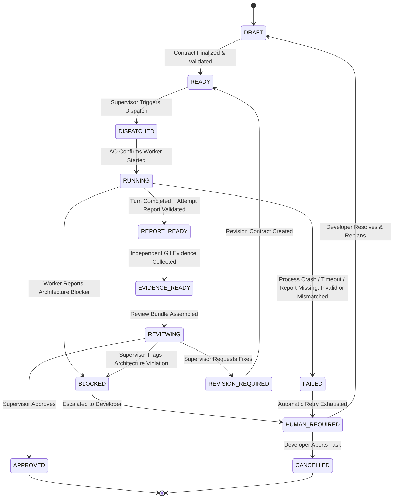

# 06. WORKFLOW STATE MACHINE

> **Authority**: Canonical 13-State Workflow Specification
> **Status**: Approved Baseline

---

# 1. State Machine Diagram

---

# 2. Canonical States & Transition Rules

| State | Owner | Trigger Event | Allowed Transitions | Required Evidence / Precondition |
|---|---|---|---|---|
| **`DRAFT`** | ChatGPT / User | Task formulated | `READY`, `CANCELLED` | Task contract fields populated. |
| **`READY`** | Supervisor | Contract validated | `DISPATCHED`, `CANCELLED` | Validated against `task-contract.schema.json`. |
| **`DISPATCHED`** | Supervisor | Dispatch sent to AO | `RUNNING`, `FAILED` | AO acknowledges receipt with HTTP 202/200. |
| **`RUNNING`** | AO / Worker | Worker process active in AO | `REPORT_READY`, `FAILED`, `BLOCKED` | Active session in AO daemon. Preconditions for `REPORT_READY`: (1) Turn completion signal observed (Agy Stop hook -> session IDLE); (2) Attempt report retrieved from `.supervisor/reports/<task_id>/<attempt_id>.json`; (3) JSON parses; (4) Validates against `worker-report.schema.json`; (5) `task_id` matches active Task; (6) `attempt_id` matches active TaskAttempt. If report handoff fails within bounded policy, transitions to `FAILED` with error code (`REPORT_MISSING`, `REPORT_INVALID`, or `REPORT_IDENTITY_MISMATCH`). |
| **`REPORT_READY`** | Supervisor | Attempt report verified | `EVIDENCE_READY`, `FAILED` | Attempt-scoped `WorkerReport` verified against schema and identities; candidate worker claims stored. |
| **`EVIDENCE_READY`** | Supervisor | Git inspection complete | `REVIEWING`, `FAILED` | Base/Head SHA verified; diff collected; exit codes checked. |
| **`REVIEWING`** | ChatGPT | Review Bundle loaded | `APPROVED`, `REVISION_REQUIRED`, `BLOCKED` | Review Bundle verified and submitted to ChatGPT. |
| **`APPROVED`** | ChatGPT | Formal approval decision | `[*]` (Terminal) | Review rationale provided; tests passed; scope verified. |
| **`REVISION_REQUIRED`**| ChatGPT | Revision request | `READY` | Specific defects, failing tests, or unverified claims listed. |
| **`BLOCKED`** | Worker / ChatGPT| Blocker flagged | `HUMAN_REQUIRED` | Explicit architectural or environmental blocker recorded. |
| **`FAILED`** | Supervisor | Crash, hang, or error | `HUMAN_REQUIRED`, `READY` (Retry) | Error log captured; max retry count checked. |
| **`HUMAN_REQUIRED`** | Human Developer | Human escalation | `DRAFT`, `CANCELLED` | Escalation notified to User with full diagnosis. |
| **`CANCELLED`** | Human Developer | Manual cancellation | `[*]` (Terminal) | Worktree cleaned up; session terminated. |
