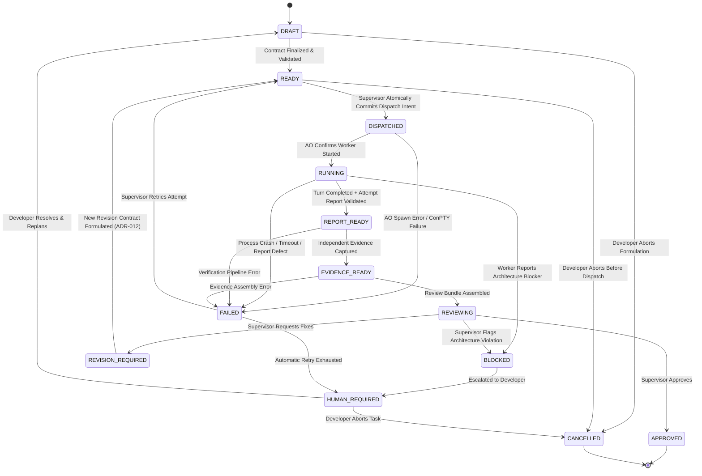

# 06. WORKFLOW STATE MACHINE

> **Authority**: Canonical 13-State Workflow Specification
> **Status**: Approved Baseline (Updated Architecture V2.1 / Reaudit 001)
> **Canonical Counts**: `TASK_STATE_COUNT = 13` | `DOMAIN_TRANSITION_COUNT = 22` | `CANONICAL_GRAPH_EDGE_COUNT = 25`
> **Count Semantics**: Exactly 22 executable state-to-state domain transitions. The 25 total lifecycle graph edges include 3 pseudo lifecycle edges (`[*] -> DRAFT`, `APPROVED -> [*]`, `CANCELLED -> [*]`). Terminal states `APPROVED` and `CANCELLED` have zero outgoing transitions.

---

# 1. State Machine Diagram

---

# 2. Canonical States & Transition Rules

| State | Owner | Trigger Event | Allowed Transitions | Required Evidence / Precondition |
|---|---|---|---|---|
| **`DRAFT`** | ChatGPT / User | Task formulated | `READY`, `CANCELLED` | Task contract fields populated. |
| **`READY`** | Supervisor | Contract validated | `DISPATCHED`, `CANCELLED` | Validated against `task-contract.schema.json` (`contract_id`, `task_id`, `revision_number`). Invariant: `TaskAttempt` is allocated and `READY → DISPATCHED` is atomically persisted together with dispatch intent before any external AO side effects. |
| **`DISPATCHED`** | Supervisor | Dispatch committed | `RUNNING`, `FAILED` | Supervisor has durably committed TaskAttempt allocation and dispatch intent. External AO session creation and task delivery are invoked. Does NOT require worker to already be running. Transitions to `RUNNING` on AO worker startup confirmation, or `FAILED` with specific `failure_reason` if session spawn or send fails. |
| **`RUNNING`** | AO / Worker | Worker process active in AO | `REPORT_READY`, `FAILED`, `BLOCKED` | Active session in AO daemon. Preconditions for `REPORT_READY`: (1) Turn completion signal observed (Agy Stop hook -> session IDLE); (2) Attempt report retrieved from `.supervisor/reports/<task_id>/<attempt_id>.json`; (3) JSON parses; (4) Validates against `worker-report.schema.json`; (5) `task_id` matches active Task; (6) `attempt_id` matches active TaskAttempt; (7) `WorkerClaim` persisted. If report handoff fails within bounded policy, transitions to `FAILED` with `failure_reason` set to `REPORT_MISSING`, `REPORT_INVALID`, or `REPORT_IDENTITY_MISMATCH`. |
| **`REPORT_READY`** | Supervisor | Attempt report verified | `EVIDENCE_READY`, `FAILED` | Attempt-scoped `WorkerReport` verified against schema and identities; candidate `WorkerClaim` persisted. Independent Git diff, test verification, and ReviewBundle assembly have NOT yet occurred. |
| **`EVIDENCE_READY`** | Supervisor | Evidence collected | `REVIEWING`, `FAILED` | Independent Git base/head/diff extraction complete; scope containment and policy rules verified against `allowed_scope`; trusted verification commands executed as applicable via constrained runner; `Evidence` entity persisted. `ReviewBundle` has NOT yet been assembled. |
| **`REVIEWING`** | ChatGPT | Review Bundle loaded | `APPROVED`, `REVISION_REQUIRED`, `BLOCKED` | `ReviewBundle` assembled from governing contract revision + worker claims + independent evidence + policy findings; `ReviewBundle` validated; reviewable attempt identity bound (`task_id`, `attempt_id`). ChatGPT evaluates synthesized bundle. Decision calls require explicit `task_id` and `attempt_id`. |
| **`APPROVED`** | ChatGPT | Formal approval decision | `[*]` (Terminal) | Review rationale provided; tests passed; scope verified. Decision recorded only; NO automatic git merge or push. |
| **`REVISION_REQUIRED`**| ChatGPT | Revision request | `READY` | Specific defects, failing tests, or unverified claims listed. `request_revision` records `ReviewDecision` bound to current `attempt_id`. To transition to `READY`, planning authority must formulate a complete NEW immutable `TaskContract` revision (`contract_id`, `revision_number + 1`, `supersedes_contract_id`, preserving initial `base_sha`) per ADR-012. |
| **`BLOCKED`** | Worker / ChatGPT| Blocker flagged | `HUMAN_REQUIRED` | Explicit architectural or environmental blocker recorded. |
| **`FAILED`** | Supervisor | Crash, hang, or error | `HUMAN_REQUIRED`, `READY` (Retry) | Error log captured; `failure_reason` recorded. Transition to `READY` reuses contract revision and allocates a new `TaskAttempt` upon dispatch per ADR-012. |
| **`HUMAN_REQUIRED`** | Human Developer | Human escalation | `DRAFT`, `CANCELLED` | Escalation notified to User with full diagnosis. |
| **`CANCELLED`** | Human Developer | Manual cancellation | `[*]` (Terminal) | Worktree cleaned up; session terminated. |