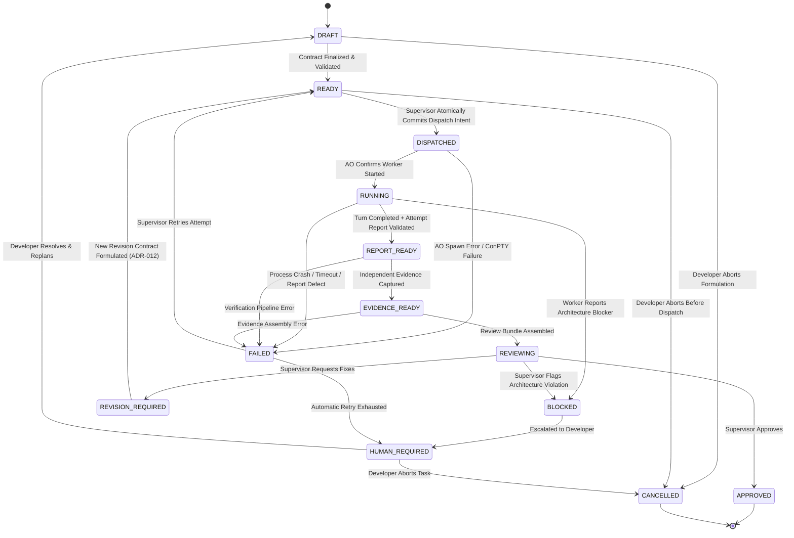

# 06. WORKFLOW STATE MACHINE

> **Authority**: Canonical 13-State Workflow Specification
> **Status**: Approved Baseline (Updated Architecture V2.1 / Reaudit 001)
> **Canonical Counts**: `TASK_STATE_COUNT = 13` | `DOMAIN_TRANSITION_COUNT = 22` | `CANONICAL_GRAPH_EDGE_COUNT = 25`
> **Count Semantics**: Exactly 22 executable state-to-state domain transitions. The 25 total lifecycle graph edges include 3 pseudo lifecycle edges (`[*] -> DRAFT`, `APPROVED -> [*]`, `CANCELLED -> [*]`). Terminal states `APPROVED` and `CANCELLED` have zero outgoing transitions.

---

# 1. State Machine Diagram

---

# 2. Canonical States & Transition Rules

| State | Owner | Trigger Event | Allowed Transitions | Required Evidence / Precondition |
|---|---|---|---|---|
| **`DRAFT`** | ChatGPT / User | Task formulated | `READY`, `CANCELLED` | Task contract fields populated. |
| **`READY`** | Supervisor | Contract validated | `DISPATCHED`, `CANCELLED` | Validated against `task-contract.schema.json` (`contract_id`, `task_id`, `revision_number`). Invariant: `TaskAttempt` is allocated and `READY → DISPATCHED` is atomically persisted together with `dispatch_operations` in `DISPATCH_BOUND` before any external AO side effects. |
| **`DISPATCHED`** | Supervisor | Dispatch committed | `RUNNING`, `FAILED` | Supervisor has durably committed TaskAttempt allocation and dispatch intent. Pre-send inspection evaluates worker session status against strict whitelist (`idle`, `waiting_input` only) via `GetWorkerStatus` before dispatch. Dispatch saga advances `DISPATCH_BOUND -> SEND_REQUESTED`. **Fail-Closed Rule (D5)**: If dispatch send fails or delivery is unconfirmed (network drop, crash between `SEND_REQUESTED` and `SEND_CONFIRMED`), execute fail-closed `DISPATCHED -> FAILED`, set `task_attempts.ended_at = now`, `recovery_disposition = 'UNCERTAIN_DELIVERY_CRASH'`, impose immediate double-gated quarantine (`quarantine_state = 'QUARANTINED'` on both session and attempt), and escalate `FAILED -> HUMAN_REQUIRED`. Blind resend is strictly prohibited. Normal path: Upon HTTP 200 write acceptance (`SEND_CONFIRMED`), observed execution advances `DISPATCHED -> RUNNING`. |
| **`RUNNING`** | AO / Worker | Worker process active in AO | `REPORT_READY`, `FAILED`, `BLOCKED` | Active session in AO daemon. **Observation Rules (D8, D9, D10, D11)**: (1) Observation of AO status `waiting_input` indicates worker paused at prompt with incomplete turn; preserves `RUNNING`, emits diagnostic telemetry, and continues polling (D9). (2) Fast `active -> idle` window records `recovery_disposition = 'MISSED_ACTIVE_WINDOW'` on attempt and verifies downstream handoff capability (D8). (3) Observation of AO status `blocked` records `recovery_disposition = 'AO_BLOCKED_DECISION'` while keeping TaskState `RUNNING`; formal developer escalation executes canonical sequence `RUNNING -> BLOCKED -> HUMAN_REQUIRED` (D10). (4) Stop purpose mapping: only stops initiated with `purpose = 'RUNNING_ATTEMPT_STOP'` on `RUNNING` tasks execute `RUNNING -> FAILED`; cleanup stops (`QUARANTINE_CLEANUP`, `PAIR_MAINTENANCE`) execute zero TaskState transitions (D11). Preconditions for `REPORT_READY`: (1) Turn completion signal observed (Agy Stop hook -> session IDLE); (2) Attempt report retrieved from `.supervisor/reports/<task_id>/<attempt_id>.json`; (3) JSON parses; (4) Validates against `worker-report.schema.json`; (5) `task_id` matches active Task; (6) `attempt_id` matches active TaskAttempt; (7) `WorkerClaim` persisted. If report handoff fails within bounded policy, transitions to `FAILED` with diagnostic error in `audit_events.details_json`. |
| **`REPORT_READY`** | Supervisor | Attempt report verified | `EVIDENCE_READY`, `FAILED` | Attempt-scoped `WorkerReport` verified against schema and identities; candidate `WorkerClaim` persisted. Independent Git diff, test verification, and ReviewBundle assembly have NOT yet occurred. |
| **`EVIDENCE_READY`** | Supervisor | Evidence collected | `REVIEWING`, `FAILED` | Independent Git base/head/diff extraction complete; scope containment and policy rules verified against `allowed_scope`; trusted verification commands executed as applicable via constrained runner; `Evidence` entity persisted. `ReviewBundle` has NOT yet been assembled. |
| **`REVIEWING`** | ChatGPT | Review Bundle loaded | `APPROVED`, `REVISION_REQUIRED`, `BLOCKED` | `ReviewBundle` assembled from governing contract revision + worker claims + independent evidence + policy findings; `ReviewBundle` validated; reviewable attempt identity bound (`task_id`, `attempt_id`). ChatGPT evaluates synthesized bundle. Decision calls require explicit `task_id` and `attempt_id`. |
| **`APPROVED`** | ChatGPT | Formal approval decision | `[*]` (Terminal) | Review rationale provided; tests passed; scope verified. Decision recorded only; NO automatic git merge or push. |
| **`REVISION_REQUIRED`**| ChatGPT | Revision request | `READY` | Specific defects, failing tests, or unverified claims listed. `request_revision` records `ReviewDecision` bound to current `attempt_id`. To transition to `READY`, planning authority must formulate a complete NEW immutable `TaskContract` revision (`contract_id`, `revision_number + 1`, `supersedes_contract_id`, preserving initial `base_sha`) per ADR-012. |
| **`BLOCKED`** | Worker / ChatGPT| Blocker flagged | `HUMAN_REQUIRED` | Explicit architectural or environmental blocker recorded. **Atomic Attempt Closure Invariant (D10, D12)**: When transitioning `BLOCKED -> HUMAN_REQUIRED`, the active `TaskAttempt` must be closed atomically (`ended_at = now`, `recovery_disposition = 'AO_BLOCKED_ESCALATED'`) under invariant `HUMAN_REQUIRED_WITH_PRIOR_EXECUTION MUST_NOT_RETAIN_RESUMABLE_OPEN_ATTEMPT` via `AtomicAttemptClosureTransition`, ensuring no open attempt dangles across human replanning or cancellation. |
| **`FAILED`** | Supervisor | Crash, hang, or error | `HUMAN_REQUIRED`, `READY` (Retry) | Terminal transition executed via unified StateStore `AtomicTerminalTransition` committing TaskState CAS, `task_attempts.ended_at = now`, and `recovery_disposition` in a single SQLite transaction with error details logged in `audit_events.details_json`. Transition to `READY` reuses contract revision and allocates a new `TaskAttempt` upon dispatch per ADR-012. **Double-Gated Retry Gate (D6)**: Retry (`FAILED -> READY`) is strictly prohibited unless `worker_sessions.quarantine_state == 'CLEAN'`, all prior attempts for the task have `task_attempts.quarantine_state == 'CLEAN'`, and the Pair has zero rows in `pair_provisioning_operations` with `stage IN ('PROVISION_REQUESTED', 'PROVISION_FAILED')`. |
| **`HUMAN_REQUIRED`** | Human Developer | Human escalation | `DRAFT`, `CANCELLED` | Escalation notified to User with full diagnosis. |
| **`CANCELLED`** | Human Developer | Manual cancellation | `[*]` (Terminal) | Worktree cleaned up; session terminated. |

## 3. ADR-016 addendum: operation states, không đổi TaskState graph

TaskState graph ở §2 giữ nguyên. Restore operation v4: RESTORE_REQUESTED/IN_FLIGHT → RESTORE_CONFIRMED/IN_FLIGHT khi HTTP 200 valid; lost/invalid response hoặc crash → RESTORE_OUTCOME_UNKNOWN; verified operator claim → RESTORE_RECOVERY_CLAIMED → RESTORE_CLEANUP_CLAIMED nếu linked stop, rồi RESTORE_RESOLVED. Operation resolution không tự clear quarantine. SEND_REQUESTED/NULL unknown → SEND_REQUESTED/DELIVERY_OUTCOME_UNKNOWN terminal, đồng thời D12 FAILED→HUMAN_REQUIRED/ended_at/quarantine/audit atomic; late 200 không đổi result. Pre-send protocol failure giữ PRE_SEND_PROTOCOL_UNVERIFIED qua timeout và GET thành công; chỉ verified operator decision + fresh matching GET mới CAS clear, còn RECOVERY_PENDING có thể clear bằng fresh matching GET. RecordSendRequested đòi disposition NULL.

## 4. Execution budget: operation lifecycle, TaskState graph giữ nguyên

HTTP 200 `/send` được xác nhận cùng immutable budget từ `confirmed_at`, không tự chứng minh `RUNNING`. Chỉ exact current open `RUNNING/SEND_CONFIRMED`, fresh active/waiting_input, hết deadline và không có stop/risk khác mới vào Tx R. `ReserveStopOperation` commit `RUNNING_ATTEMPT_STOP` `STOP_REQUESTED/IN_FLIGHT`, cause `TIMEOUT`, hai quarantine và request audit; TaskState vẫn `RUNNING`, `ended_at=NULL`. Caller thắng giữ one-use effect permit; second GET không admissible thì bỏ quyền, giữ intent/TaskState/quarantine nguyên trạng, không ghi resolution audit. 404/terminated/generation mismatch sau Tx R đi D11/D12 atomic outcome đã duyệt. `RUNNING→FAILED` chỉ sau D11 terminal result, với `failure_reason=TIMEOUT` từ durable cause; disposition theo D11. `DISPATCHED` không được ép `RUNNING` vì legacy thiếu budget. Xem addendum execution budget §5.1; không có edge TaskState mới.
