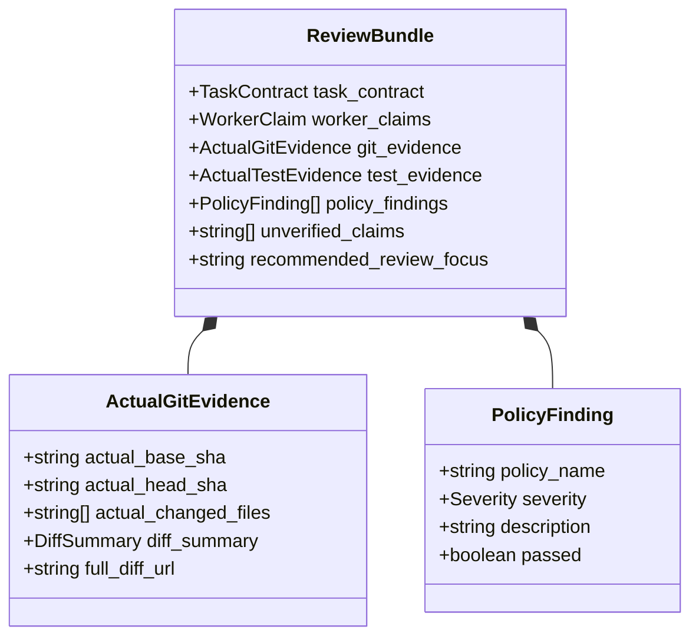

# 10. REVIEW BUNDLE SPECIFICATION

> **Focus**: High-Signal Audit Synthesis, Reducing ChatGPT Tool Calls & Evidence Correlation  
> **Status**: Approved Baseline

---

# 1. Purpose of the Review Bundle

In manual workflows, reviewing an agent's work requires ChatGPT to make 15–30 low-level tool calls (inspecting files, running git diffs, checking logs, reading configs). This exhausts conversation token limits and degrades reasoning focus.

The **Review Bundle** solves this by pre-correlating all evidence into a single structured, high-signal document prepared by the Supervisor Control Plane. ChatGPT needs only call `get_review_bundle(task_id)` to receive a complete, synthesized audit packet.

---

# 2. Review Bundle Structure

---

# 3. Canonical Review Bundle Fields

1. **`task_contract`**: The original immutable requirements, scope, and acceptance criteria.
2. **`worker_claims`**: What the worker claimed happened.
3. **`actual_git_evidence`**:
   - `actual_base_sha` vs `actual_head_sha` verified directly from Git.
   - `actual_changed_files`: Whitelist diff comparison.
   - `diff_summary`: Insertions, deletions, and structural summary.
4. **`actual_test_evidence`**:
   - Independent verification of test command exit codes and output artifacts.
5. **`policy_findings`**:
   - `ScopeCompliance`: PASSED or VIOLATION (flags any file touched outside `allowed_scope`).
   - `ArchitectureIntegrity`: PASSED or VIOLATION (flags any unauthorized edit to `docs/`).
   - `DependencyCheck`: PASSED or VIOLATION (flags any unauthorized package additions).
6. **`unverified_claims`**:
   - Claims made by the worker that could not be corroborated by Git or process logs.
7. **`recommended_review_focus`**:
   - Automated hints directing ChatGPT's attention to critical changes, edge-case tests, or suspicious deviations.
