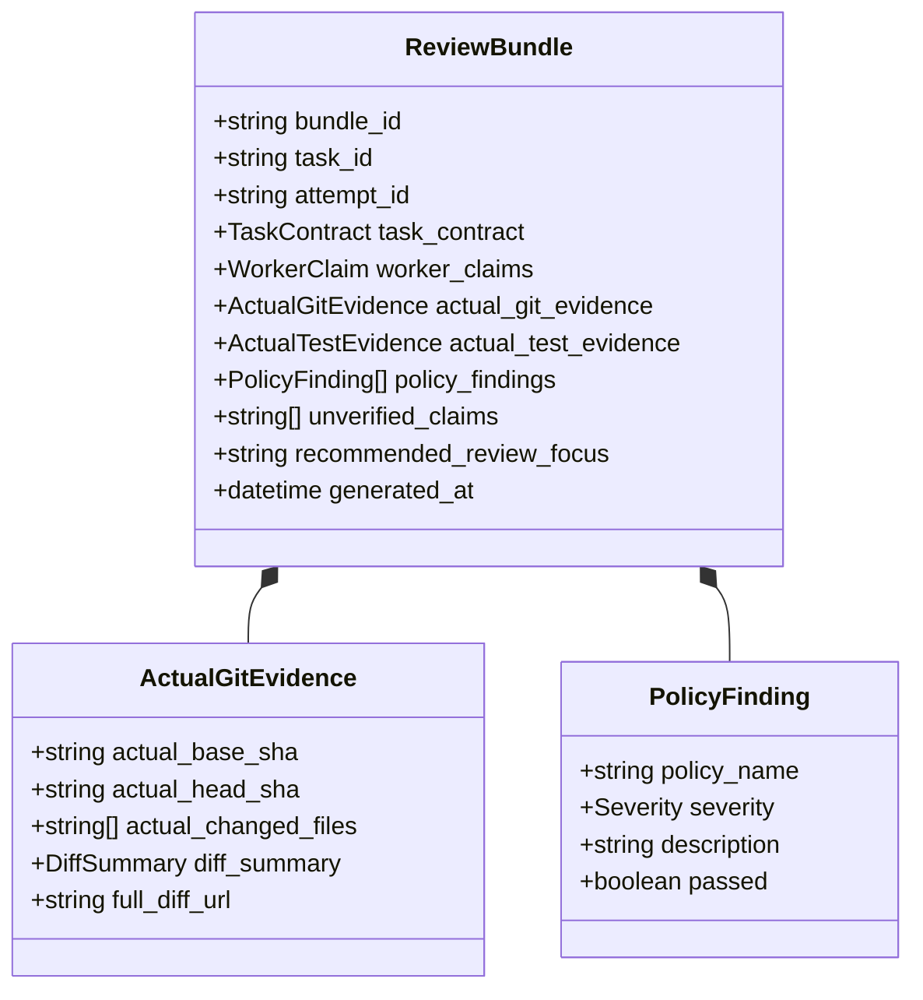

# 10. REVIEW BUNDLE SPECIFICATION

> **Focus**: High-Signal Audit Synthesis, Reducing ChatGPT Tool Calls & Evidence Correlation
> **Status**: Approved Baseline

---

# 1. Purpose of the Review Bundle

In manual workflows, reviewing an agent's work requires ChatGPT to make 15–30 low-level tool calls (inspecting files, running git diffs, checking logs, reading configs). This exhausts conversation token limits and degrades reasoning focus.

The **Review Bundle** solves this by pre-correlating all evidence into a single structured, high-signal document prepared by the Supervisor Control Plane. ChatGPT needs only call `get_review_bundle(task_id)` to receive a complete, synthesized audit packet.

---

# 2. Review Bundle Structure

---

# 3. Canonical Review Bundle Fields

1. **`bundle_id`**: Unique identifier for the compiled review bundle.
2. **`task_id`**: Identifier of the task being reviewed.
3. **`attempt_id`**: Specific execution attempt identifier, binding the bundle strictly to a `TaskAttempt`.
4. **`task_contract`**: The original immutable requirements, scope, and acceptance criteria.
5. **`worker_claims`**: Self-reported worker claims from the attempt's `WorkerReport`.
6. **`actual_git_evidence`**:
   - `actual_base_sha` vs `actual_head_sha` verified directly from Git.
   - `actual_changed_files`: Whitelist diff comparison against `allowed_scope`.
   - `diff_stat`: Insertions, deletions, and structural summary.
7. **`actual_test_evidence`**:
   - Independent verification of test command exit codes (`all_passed`, `executed_commands`).
8. **`policy_findings`**:
   - `rule_id`, `passed`, and `details` for all evaluated policy rules.
9. **`unverified_claims`**:
   - Claims made by the worker that could not be corroborated by Git or process logs.
10. **`recommended_review_focus`**:
    - Automated hints directing ChatGPT's attention to critical changes, edge-case tests, or suspicious deviations.
11. **`generated_at`**: ISO 8601 timestamp of bundle generation.
