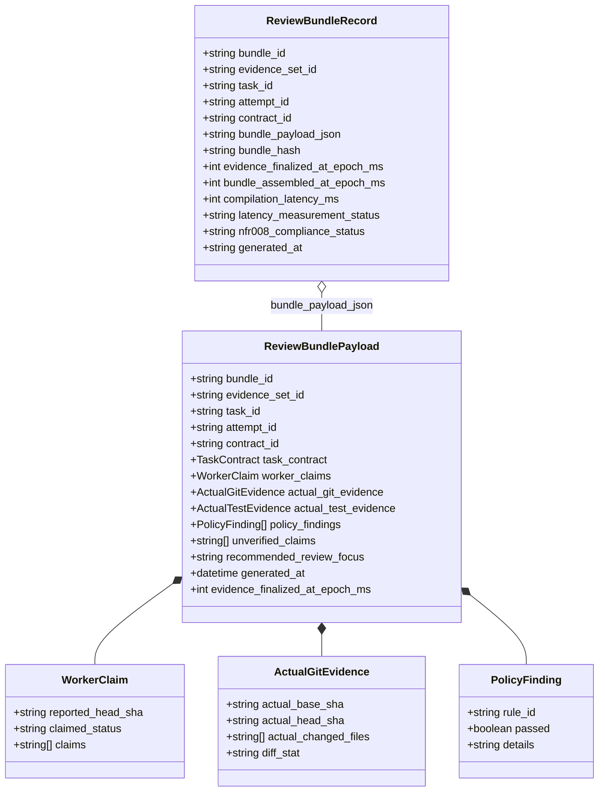

# 10. REVIEW BUNDLE SPECIFICATION

> **Focus**: High-Signal Audit Synthesis, Attempt-Scoped Evaluation & Evidence Correlation
> **Status**: Approved Baseline (Reconciled with accepted ADR-018, PROPOSAL-P04-002 Revision 9, and Plan Erratum 001)
> **Authority**: [ADR-018](adr/ADR-018-evidence-review-and-verification-isolation.md) & [PROPOSAL-P04-002](proposals/PROPOSAL-P04-002-review-bundle-latency-semantics.md) Revision 9

---

# 1. Purpose of the Review Bundle

In manual workflows, reviewing an agent's work requires ChatGPT to make 15–30 low-level tool calls (inspecting files, running git diffs, checking logs, reading configs). This exhausts conversation token limits and degrades reasoning focus.

The **Review Bundle** solves this by pre-correlating all evidence into a single structured, high-signal document prepared by the Supervisor Control Plane. ChatGPT needs only call `get_review_bundle(task_id, attempt_id)` to receive a complete, synthesized audit packet for the specific execution attempt under evaluation.

---

# 2. Review Bundle Structure: Payload vs. Database Record

To prevent circular self-referencing hash paradoxes and maintain strict persistence boundaries, the architecture enforces a strict two-tier separation:
1. **`ReviewBundlePayload`**: The canonical in-memory JSON document validated by `docs/schemas/review-bundle.schema.json` and canonicalized via RFC 8785 JSON Canonicalization Scheme (JCS). Its canonical serialized bytes serve as the hash preimage for `bundle_hash`. It strictly excludes `bundle_hash` and post-hash assembly metadata.
2. **`ReviewBundleRecord`**: The durable SQLite row envelope persisted in table `review_bundles` (Schema v9, owned by Subtask P04D). It stores the serialized `bundle_payload_json`, the computed `bundle_hash`, and the Transaction C assembly diagnostic interval metadata.

```mermaid
classDiagram
    class ReviewBundlePayload {
        +string bundle_id
        +string evidence_set_id
        +string task_id
        +string attempt_id
        +string contract_id
        +TaskContract task_contract
        +WorkerClaim worker_claims
        +ActualGitEvidence actual_git_evidence
        +ActualTestEvidence actual_test_evidence
        +PolicyFinding[] policy_findings
        +string[] unverified_claims
        +string recommended_review_focus
        +datetime generated_at
        +int evidence_finalized_at_epoch_ms
    }

    class ReviewBundleRecord {
        +string bundle_id
        +string evidence_set_id
        +string task_id
        +string attempt_id
        +string contract_id
        +string bundle_payload_json
        +string bundle_hash
        +int evidence_finalized_at_epoch_ms
        +int bundle_assembled_at_epoch_ms
        +int compilation_latency_ms
        +string latency_measurement_status
        +string nfr008_compliance_status
        +string generated_at
    }

    class WorkerClaim {
        +string reported_head_sha
        +string claimed_status
        +string[] claims
    }

    class ActualGitEvidence {
        +string actual_base_sha
        +string actual_head_sha
        +string[] actual_changed_files
        +string diff_stat
    }

    class PolicyFinding {
        +string rule_id
        +boolean passed
        +string details
    }

    ReviewBundlePayload *-- WorkerClaim
    ReviewBundlePayload *-- ActualGitEvidence
    ReviewBundlePayload *-- PolicyFinding
    ReviewBundleRecord o-- ReviewBundlePayload : bundle_payload_json
```

---

# 3. Canonical ReviewBundlePayload Fields (Pre-Hash Preimage)

The pre-hash payload contains exactly 14 required fields defined in `docs/schemas/review-bundle.schema.json`:

1. **`bundle_id`**: Unique identifier for the compiled review bundle.
2. **`evidence_set_id`**: Unique reference to the durably committed `evidence_sets` row (Schema v9).
3. **`task_id`**: Identifier of the task being reviewed.
4. **`attempt_id`**: Specific execution attempt identifier, binding the bundle strictly to a `TaskAttempt`.
5. **`contract_id`**: Immutable governing task contract identifier (`contract_id`).
6. **`task_contract`**: The governing immutable contract revision payload (`contract_id`, `revision_number`, requirements, scope, acceptance criteria).
7. **`worker_claims`**: Self-reported worker claims from the attempt's `WorkerReport`, strictly capturing `reported_head_sha` (`CHECK (LENGTH(reported_head_sha) BETWEEN 7 AND 40 AND NOT (reported_head_sha GLOB '*[^0-9a-f]*'))`).
8. **`actual_git_evidence`**:
   - `actual_base_sha` vs `actual_head_sha` verified directly from Git.
   - Dual head SHA validation: `actual_head_sha` is verified by the Supervisor and contrasted with `worker_claims.reported_head_sha`.
   - `actual_changed_files`: Whitelist diff comparison against `allowed_scope`.
   - `diff_stat`: Insertions, deletions, and structural summary.
9. **`actual_test_evidence`**:
   - Independent verification of test command exit codes (`all_passed`, `executed_commands`) captured via trusted verification runner executing host-owned verification profiles within isolated Windows AppContainers.
10. **`policy_findings`**:
    - `rule_id`, `passed`, and `details` for all evaluated policy rules.
11. **`unverified_claims`**:
    - Claims made by the worker that could not be corroborated by Git or process logs.
12. **`recommended_review_focus`**:
    - Automated hints directing ChatGPT's attention to critical changes, edge-case tests, or suspicious deviations.
13. **`generated_at`**: ISO 8601 timestamp of bundle generation.
14. **`evidence_finalized_at_epoch_ms`**: Durable committed timestamp ($T_0$) from Transaction B when verification evidence sets and artifacts were finalized, established prior to ReviewBundle synthesis.

### Prohibited from Pre-Hash Payload Schema:
- **`bundle_hash`**: Strictly excluded because $\text{bundle\_hash} = \text{SHA256}(\text{RFC8785\_JCS}(\text{ReviewBundlePayload}))$. Embedding it in the payload creates a circular self-referencing paradox.
- **Post-Hash Assembly Metadata**: `bundle_assembled_at_epoch_ms`, `compilation_latency_ms`, `latency_measurement_status`, and `nfr008_compliance_status` are determined during or after payload validation and hash computation. They belong strictly to the database row envelope (`review_bundles` table) and audit descriptors.

---

# 4. ReviewBundleRecord Envelope & Latency Semantics (ADR-018 / PROPOSAL-P04-002 Rev 9)

### 4.1 Persisted Database Row (`review_bundles` Table)
In Transaction C, Subtask P04D inserts a `ReviewBundleRecord` into SQLite table `review_bundles`:
- `bundle_payload_json`: Canonical JSON string of the validated `ReviewBundlePayload`.
- `bundle_hash`: RFC 8785 JCS SHA-256 hash (64 hex characters) of `bundle_payload_json`.
- `evidence_finalized_at_epoch_ms`: Durably committed timestamp ($T_0$) from Transaction B.
- `bundle_assembled_at_epoch_ms`: Timestamp ($T_1$) captured when ReviewBundle JSON assembly, RFC 8785 JCS canonicalization, and schema validation succeed, immediately before initiating Transaction C commit.
- `compilation_latency_ms`: Assembly diagnostic interval:
  $$\text{compilation\_latency\_ms} = \text{bundle\_assembled\_at\_epoch\_ms} - \text{evidence\_finalized\_at\_epoch\_ms}$$
- `latency_measurement_status`: Execution provenance discriminator (`'MEASURED_IN_PROCESS'` vs `'RECOVERED_AFTER_RESTART'`).
- `nfr008_compliance_status`: Held strictly as `'UNVERIFIED'` in Schema v9 (`CHECK (nfr008_compliance_status = 'UNVERIFIED')`).
- `generated_at`: ISO 8601 timestamp string.

### 4.2 2 × 2 Provenance × Threshold Matrix

| Measurement Provenance | Measured Latency Threshold | `latency_measurement_status` | `nfr008_compliance_status` | Assembly Latency Diagnostic | Operational Semantics |
| :--- | :--- | :--- | :--- | :--- | :--- |
| Continuous Execution (Normal P04D orchestration) | `compilation_latency_ms <= 3000` | `'MEASURED_IN_PROCESS'` | `'UNVERIFIED'` | None | Measured in continuous daemon process; meets empirical assembly target; no diagnostic emitted; Tx C commits cleanly. |
| Continuous Execution (Normal P04D orchestration) | `compilation_latency_ms > 3000` | `'MEASURED_IN_PROCESS'` | `'UNVERIFIED'` | Latency-breach diagnostic emitted | Measured in continuous daemon process; exceeds empirical assembly target due to load/delay; provenance remains `MEASURED_IN_PROCESS`; diagnostic logged; Tx C commits cleanly without deadlock. |
| Restart Recovery (P04D startup recovery path) | `compilation_latency_ms <= 3000` | `'RECOVERED_AFTER_RESTART'` | `'UNVERIFIED'` | None | Resumed attempt from prior daemon lifetime; recovery completed within 3,000 ms; provenance is `RECOVERED_AFTER_RESTART`; Tx C commits cleanly. |
| Restart Recovery (P04D startup recovery path) | `compilation_latency_ms > 3000` | `'RECOVERED_AFTER_RESTART'` | `'UNVERIFIED'` | Latency-breach diagnostic emitted | Resumed attempt from prior daemon lifetime; elapsed wall-clock recovery latency exceeds 3,000 ms; provenance is `RECOVERED_AFTER_RESTART`; diagnostic logged; Tx C commits cleanly without deadlock. |

### 4.3 Decoupled Commit Telemetry
Upon return from SQLite `tx.Commit()` in Transaction C, the orchestrator computes commit duration using in-process monotonic measurement (`time.Since(commitStart)`) purely as best-effort telemetry. It is strictly excluded from `audit_events`, `review_bundles`, and the durable audit chain.

### 4.4 Content-Addressed Storage Layout
All raw review artifacts referenced by the bundle are stored in Content-Addressed Storage:
- Path format: `artifacts/<first-two-hex>/<captured_sha256>`
- Content integrity: Verified against `captured_sha256` with strict size limits (10 MB capture limit vs 50 MB hard safety limit).
