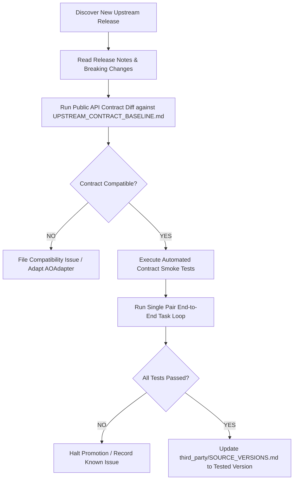

# 13. UPSTREAM UPDATE POLICY

> **Focus**: Controlled Upstream Version Promotion & Drift Prevention  
> **Status**: Approved Baseline

---

# 1. Strict Isolation Rule

> [!CRITICAL]
> **UPSTREAM UPGRADES AND APPLICATION FEATURE DEVELOPMENT MUST NEVER BE COMBINED IN THE SAME TASK.**  
> Any upgrade of Agent Orchestrator or Antigravity CLI must be executed as a dedicated, standalone upgrade task with its own contract test verification.

---

# 2. Step-by-Step Upstream Promotion Pipeline

### Procedure Details:
1. **Discovery & Triage**: Record candidate version in `third_party/SOURCE_VERSIONS.md`.
2. **Contract Diff**: Compare upstream changes against `docs/sources/UPSTREAM_CONTRACT_BASELINE.md`.
3. **Contract Test Suite**: Execute integration smoke tests verifying health, session creation, task dispatch, and clean termination.
4. **End-to-End Verification**: Run one complete task lifecycle (`READY` → `APPROVED`) on a sample project.
5. **Formal Promotion**: Commit version bump with audit log reference.

---

# 4. OpenAI Platform & Tunnel Client Update Policy

> **Governance Authority**: Added in Phase P01-D3A following Official Ingestion Dossiers (`10_OPENAI_PLUGIN_PLATFORM.md`, `11_OPENAI_API_MCP_RUNTIME.md`).

1. **Official `tunnel-client` Tracking**:
   - Per official OpenAI documentation, operational runbooks point to the latest public release (`https://github.com/openai/tunnel-client/releases/latest`).
   - Pinning for runtime proofs is recorded explicitly in audit dossiers (e.g. `v0.0.14` in `P01_D3A_OPENAI_MCP_RUNTIME_PROOF.md`).
   - Upgrading `tunnel-client` binaries must verify checksums against official `SHA256SUMS.txt` and run `tunnel-client doctor --profile <name> --explain`.

2. **Mutable Documentation Drift Management**:
   - OpenAI product, API, and plugin documentation surfaces are tracked in `docs/sources/SOURCE_REGISTRY.md#3-mutable-official-product-documentation-register`.
   - Any upstream changes to Responses API MCP schema, approval event models, or plugin submission criteria must be ingested via updated source dossiers before altering adapter logic.
