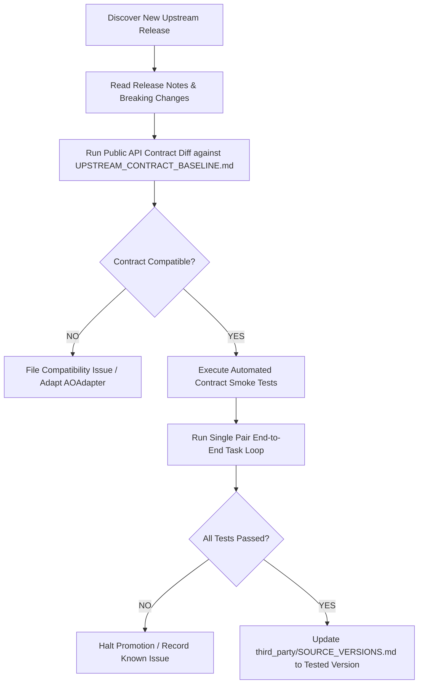

# 13. UPSTREAM UPDATE POLICY

> **Focus**: Controlled Upstream Version Promotion & Drift Prevention  
> **Status**: Approved Baseline

---

# 1. Strict Isolation Rule

> [!CRITICAL]
> **UPSTREAM UPGRADES AND APPLICATION FEATURE DEVELOPMENT MUST NEVER BE COMBINED IN THE SAME TASK.**  
> Any upgrade of Agent Orchestrator or Antigravity CLI must be executed as a dedicated, standalone upgrade task with its own contract test verification.

---

# 2. Step-by-Step Upstream Promotion Pipeline

### Procedure Details:
1. **Discovery & Triage**: Record candidate version in `third_party/SOURCE_VERSIONS.md`.
2. **Contract Diff**: Compare upstream changes against `docs/sources/UPSTREAM_CONTRACT_BASELINE.md`.
3. **Contract Test Suite**: Execute integration smoke tests verifying health, session creation, task dispatch, and clean termination.
4. **End-to-End Verification**: Run one complete task lifecycle (`READY` → `APPROVED`) on a sample project.
5. **Formal Promotion**: Commit version bump with audit log reference.
