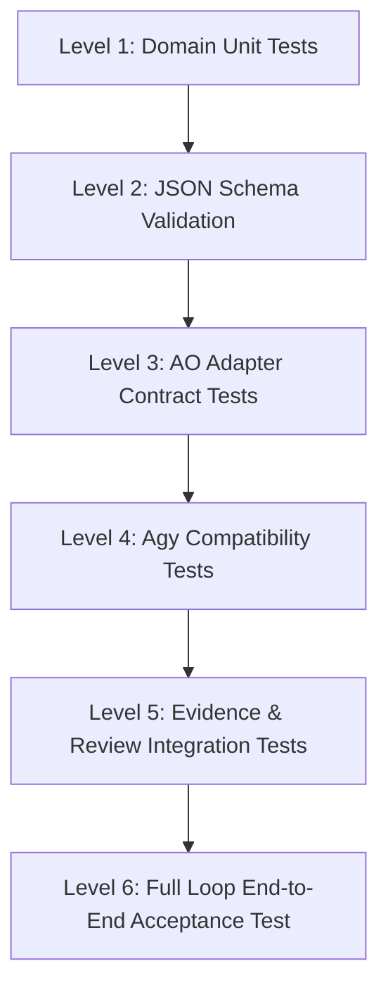

# 16. TEST STRATEGY

> **Focus**: Multi-Tier Testing, Upstream Verification & Full Task Loop End-to-End Test  
> **Status**: Approved Baseline

---

# 1. Verification Levels & Test Taxonomy



### Test Tiers:
1. **Level 1 — Unit Tests**: Fast, in-memory domain tests verifying entity invariants, state machine transitions, and policy checks.
2. **Level 2 — Schema Validation**: Validating that all generated TaskContracts, WorkerReports, and ReviewBundles conform to formal JSON schemas.
3. **Level 3 — AO Adapter Contract Tests**: Mock and live tests asserting compliance with `docs/sources/UPSTREAM_CONTRACT_BASELINE.md`.
4. **Level 4 — Antigravity Compatibility**: Smoke tests running `agy` in headless mode to verify input contract parsing and output formatting.
5. **Level 5 — Integration Tests**: Validating independent Git diff extraction, exit code verification, and Review Bundle assembly.
6. **Level 6 — Full Loop E2E Test**: The critical end-to-end acceptance loop:
   ```text
   ChatGPT Dispatch
     ↓
   Supervisor Contract Validation
     ↓
   AO Session Spawn
     ↓
   Antigravity Autonomous Code Edit & Test
     ↓
   Worker Completion Report
     ↓
   Independent Git Evidence Collection
     ↓
   Review Bundle Generation
     ↓
   ChatGPT Audit & Approval
   ```
