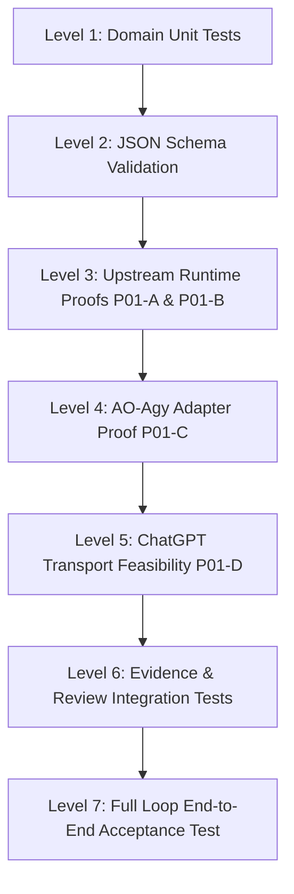

# 16. TEST STRATEGY

> **Focus**: Multi-Tier Testing, Upstream Verification & Full Task Loop End-to-End Test
> **Status**: Approved Baseline (Remediated Phase 0)

---

# 1. Verification Levels & Test Taxonomy



### Test Tiers:
1. **Level 1 — Unit Tests**: Fast, in-memory domain tests verifying entity invariants, strict 13-state transitions (`DRAFT`, `READY`, `DISPATCHED`, `RUNNING`, `REPORT_READY`, `EVIDENCE_READY`, `REVIEWING`, `APPROVED`, `REVISION_REQUIRED`, `BLOCKED`, `FAILED`, `HUMAN_REQUIRED`, `CANCELLED`), covering all allowed transitions and representative forbidden transitions, and policy bounds.
2. **Level 2 — Schema Validation**: Validating that all generated TaskContracts, WorkerReports, and ReviewBundles conform to formal JSON schemas (`docs/schemas/`).
3. **Level 3 — Upstream Runtime Proofs (P01-A & P01-B)**:
   - **Track P01-A (AO Runtime)**: Testing actual loopback endpoints (`GET /healthz`, `GET /readyz`, `POST /api/v1/projects`, `POST /api/v1/sessions`, `POST /api/v1/sessions/{id}/send`, `POST /api/v1/sessions/{id}/kill`, `POST /api/v1/sessions/{id}/restore`).
   - **Track P01-B (Antigravity CLI Runtime)**: Smoke tests running `agy 1.2.7` on Windows verifying `--print`, `--output-format stream-json`, `--input-format stream-json`, `--json-schema`, `--add-dir`, and `--conversation`.
4. **Level 4 — AO ↔ Agy Adapter Integration Proof (P01-C / ADR-011)**:
   - Tracing AO's invocation argv for Agy.
   - Determining session turn completion detection via Stop hook -> IDLE activity state.
   - Establishing attempt-scoped report handoff via public workspace file API under ADR-011.
5. **Level 5 — ChatGPT Transport Feasibility Proof (P01-D / FR-016)**:
   - Proving that the target ChatGPT Plus account can invoke Supervisor tools without OS-level GUI automation and without manual prompt/report copy-paste.
   - Validating loopback security, token scrubbing, and approval prompts.
6. **Level 6 — Evidence Collection & Review Integration Tests**:
   - Preconditioned on verified report handoff (Stop hook -> IDLE -> bounded fetch -> schema & identity validation -> `REPORT_READY`).
   - Independent Git diff extraction from worktree.
   - Process exit code verification.
   - Scope compliance verification against `allowed_scope`.
   - Unified Review Bundle generation in `< 3.0` seconds (`EVIDENCE_READY`).
7. **Level 7 — Full Loop E2E Acceptance Test**:
   The critical end-to-end supervision workflow:
   ```text
   ChatGPT Dispatch (create_task_contract)
     ↓
   Supervisor Contract Validation (PolicyEngine) [DRAFT → READY]
     ↓
   AO Session Spawn & Task Delivery (AOAdapter) [READY → DISPATCHED → RUNNING]
     ↓
   Antigravity Code Edit & Test in Isolated Worktree
     ↓
   Worker Stop Hook Signals Turn Complete → AO Session IDLE
     ↓
   Bounded Report Fetch, Schema & Identity Validation [RUNNING → REPORT_READY]
     ↓
   Independent Git Evidence Collection (diff, exit codes, hashes) [REPORT_READY → EVIDENCE_READY]
     ↓
   Unified Review Bundle Generation (get_review_bundle) [EVIDENCE_READY → REVIEWING]
     ↓
   ChatGPT Audit & Supervisor Decision (approve_task / request_revision)
     ↓
   State Recorded as APPROVED (Zero automatic merge / zero auto-commit)
   ```

---

# 2. Gate Conditions

- **Phase P01 Exit Gate**: Tri-state verdict model (`PASS`, `GAP_REQUIRES_ADR`, `BLOCKER`). Phase P02 cannot proceed if Track P01-D yields `BLOCKER`.
- **Phase P04 Evidence Gate**: No task may transition to `REVIEWING` unless independent Git evidence has been captured and validated.
- **Phase P05 Tool Gate**: Tool count exposed to ChatGPT must not exceed 12 high-level domain tools; low-level OS/process implementation details (such as worker PID) are hidden behind the domain boundary.
- **Approval Safety Gate**: Supervisor `approve_task` solely records the review decision and updates task state to `APPROVED`. Automatic branch merging or pushing is strictly forbidden in V1.
