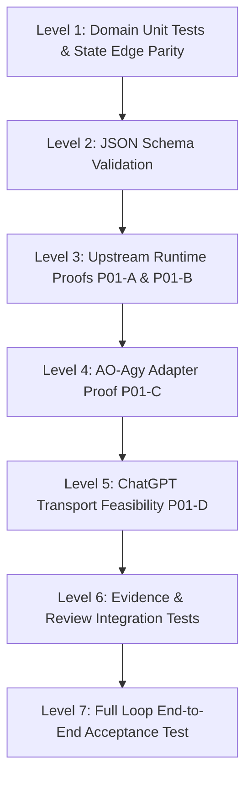

# 16. TEST STRATEGY

> **Focus**: Multi-Tier Testing, Upstream Verification, Contract Immutability & State Parity
> **Status**: Approved Baseline (Updated Architecture V2.1 / Reaudit 001)

---

# 1. Verification Levels & Test Taxonomy



### Test Tiers:
1. **Level 1 — Unit Tests & State Machine Edge Parity**:
   - In-memory domain tests verifying entity invariants, mathematical parity between state diagram and transition table (all 25 canonical transitions matching), and representative forbidden transitions.
   - Rejection of invalid transitions, verification of immutable TaskContract revisions post-dispatch, and rejection of stale attempts on review decisions.
2. **Level 2 — Schema Validation**:
   - Validating that all generated TaskContracts, WorkerReports, and ReviewBundles conform to formal JSON schemas (`docs/schemas/`).
   - Testing both valid fixture acceptance and invalid fixture rejection.
3. **Level 3 — Upstream Runtime Proofs (P01-A & P01-B)**:
   - **Track P01-A (AO Runtime)**: Testing actual loopback endpoints (`GET /healthz`, `GET /readyz`, `POST /api/v1/projects`, `POST /api/v1/sessions`, `POST /api/v1/sessions/{id}/send`, `POST /api/v1/sessions/{id}/kill`, `POST /api/v1/sessions/{id}/restore`).
   - **Track P01-B (Antigravity CLI Runtime)**: Smoke tests running `agy 1.2.7` on Windows verifying `--print`, `--output-format stream-json`, `--input-format stream-json`, `--json-schema`, `--add-dir`, and `--conversation`.
4. **Level 4 — AO ↔ Agy Adapter Integration Proof (P01-C / ADR-011)**:
   - Tracing AO's invocation argv for Agy.
   - Determining session turn completion detection via Stop hook -> IDLE activity state.
   - Establishing attempt-scoped report handoff via public workspace file API under ADR-011 and ADR-012.
5. **Level 5 — ChatGPT Transport Feasibility Proof (P01-D / FR-016)**:
   - Proving that the target ChatGPT Plus account can invoke Supervisor tools without OS-level GUI automation and without manual prompt/report copy-paste.
   - Proven topology: Target ChatGPT Plus -> Developer Mode App -> OpenAI Secure MCP Tunnel -> `tunnel-client` v0.0.14 -> private loopback MCP server (`127.0.0.1:3182/mcp`).
6. **Level 6 — Evidence Collection & Review Integration Tests**:
   - Preconditioned on verified report handoff (Stop hook -> IDLE -> bounded fetch -> schema & identity validation -> `REPORT_READY`).
   - Independent Git diff extraction from worktree.
   - Process exit code and test artifact verification via constrained verification runner.
   - Scope compliance verification against `allowed_scope`.
   - Independent evidence collection transitions state to `EVIDENCE_READY`.
   - ReviewBundle compilation transitions state to `REVIEWING`.
7. **Level 7 — Full Loop E2E Acceptance Test**:
   The critical end-to-end supervision workflow:
   ```text
   ChatGPT Dispatch (dispatch_task)
     ↓
   Supervisor Contract Validation (contract_id, revision_number) [DRAFT → READY]
     ↓
   Pre-Dispatch TaskAttempt Allocation (attempt_id, expected_report_path)
     ↓
   AO Session Spawn & Task Delivery (AOAdapter) [READY → DISPATCHED → RUNNING]
     ↓
   Antigravity Code Edit & Test in Isolated Worktree
     ↓
   Worker Stop Hook Signals Turn Complete → AO Session IDLE
     ↓
   Bounded Report Fetch, Schema & Identity Validation [RUNNING → REPORT_READY]
     ↓
   Independent Evidence Collection via Constrained Runner [REPORT_READY → EVIDENCE_READY]
     ↓
   Unified Review Bundle Generation (get_review_bundle) [EVIDENCE_READY → REVIEWING]
     ↓
   ChatGPT Audit & Supervisor Decision (approve_task / request_revision)
     ↓
   State Recorded as APPROVED (Zero automatic merge / zero auto-commit)
   ```

---

# 2. Canonical Test Invariants & Assertions

The automated test suite must explicitly cover the following canonical invariants:
1. **State Machine Edge Parity**: Automated assertion verifying that the 25 edges in the state machine diagram match the 25 table transitions exactly.
2. **Stale Attempt Rejection**: Any decision call (`approve_task`, `request_revision`, `block_task`) with a mismatched or historical `attempt_id` must be rejected with `STALE_ATTEMPT`.
3. **Contract Immutability**: Dispatched `TaskContract` instances cannot be modified in place.
4. **Revision Contract Generation**: `REVISION_REQUIRED -> READY` generates a new contract revision (`contract_id`, `revision_number + 1`, `supersedes_contract_id`).
5. **Retry Attempt Allocation**: `FAILED -> READY` followed by dispatch reuses the contract revision when specification is unchanged, but allocates a new `attempt_id`.
6. **Report Defect Safety**: A missing, malformed, or identity-mismatched report never reaches `REPORT_READY`; it transitions `RUNNING -> FAILED` with appropriate `failure_reason`.
7. **Approval Non-Mutation**: `approve_task` transitions task to `APPROVED` and records decision rationale only; it never performs git merge, commit, or push.
8. **Identity Guard**: A report with mismatched `task_id` or `attempt_id` triggers `FAILED` with `failure_reason = REPORT_IDENTITY_MISMATCH`.

---

# 3. Gate Conditions

- **Phase P01 Exit Gate**: Tri-state verdict model (`PASS`, `GAP_REQUIRES_ADR`, `BLOCKER`). Phase P02 cannot proceed if Track P01-D yields `BLOCKER`.
- **Phase P04 Evidence Gate**: No task may transition to `REVIEWING` unless independent Git evidence has been captured and validated.
- **Phase P05 Tool Gate**: Tool count exposed to ChatGPT must not exceed 12 high-level domain tools; low-level OS/process implementation details (such as worker PID) are hidden behind the domain boundary.
- **Approval Safety Gate**: Supervisor `approve_task` solely records the review decision and updates task state to `APPROVED`. Automatic branch merging or pushing is strictly forbidden in V1.