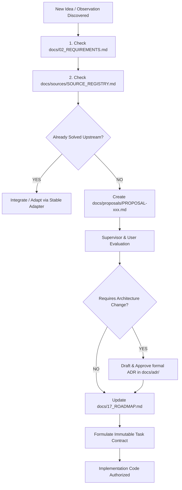

# 24. CHANGE GOVERNANCE & DECISION HIERARCHY

> **Authority**: Immutable Change Intake Workflow & Conflict Resolution Hierarchy  
> **Status**: Approved Baseline

---

# 1. The Change Intake Pipeline

Every new capability, requirement amendment, or architectural suggestion discovered during execution must strictly follow this pipeline before any implementation code is permitted:



---

# 2. Immutable Decision Hierarchy (Conflict Resolution)

Whenever a coding agent, developer prompt, or tool output presents conflicting guidance, the conflict **MUST** be resolved strictly in order of the following 9-level priority hierarchy:

```text
DECISION PRIORITY (HIGHEST TO LOWEST)

1. Confirmed User Requirement (Explicit User Direction)
2. Approved ADR (docs/adr/)
3. Canonical Architecture (docs/04_ARCHITECTURE.md)
4. Requirement Specification (docs/02_REQUIREMENTS.md)
5. Approved Roadmap (docs/17_ROADMAP.md)
6. Task Contract (docs/08_TASK_CONTRACT.md)
7. Source Repo / Reference Dossier (docs/sources/)
8. Worker Suggestion (Worker Report / Claims)
9. Chat Conversation History (Transient Dialogue)
```

### Concrete Conflict Rules:
- If a worker proposes an optimization that contradicts an ADR: **The ADR wins**.
- If an upstream repository adds a new feature that violates our architecture: **The Architecture wins** until a new ADR is formally approved.
- If a prior chat turn suggests something different from canonical documentation: **The Canonical Documentation wins**.
