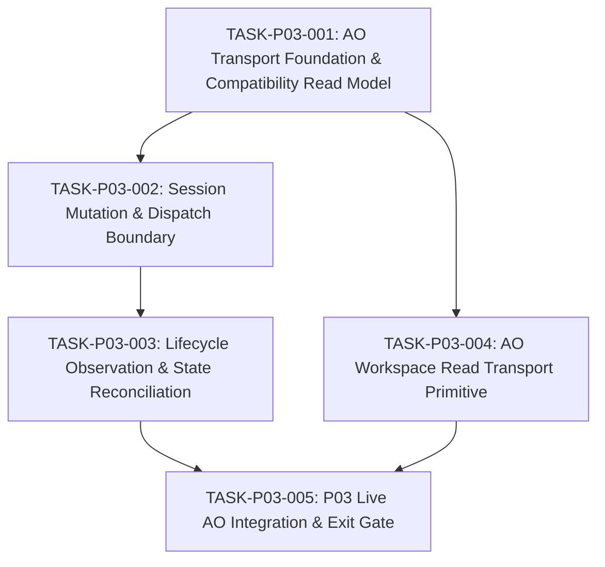

# P03_PRECODE_UPSTREAM_CONTRACT_REAUDIT_001.md — Upstream Contract Re-Audit Dossier (Revision 1)

> **Audited Commit**: `681bbd92bc720d59b1e422ac40808ecc1e4e1436`
> **Upstream Authority**: `Untrivial-ai/agent-orchestrator` v0.13.0 (Commit `15e9ea971f1711ec8b50e157d6eb300db6cbe0d6`)
> **Audit Date**: 2026-09-22
> **Re-Audit Status**: `READY_FOR_EXTERNAL_REAUDIT`
> **Historical Baseline Dossier**: Retained intact at [`P03_PRECODE_UPSTREAM_CONTRACT_AUDIT.md`](P03_PRECODE_UPSTREAM_CONTRACT_AUDIT.md)
> **Active Gate**: `EXTERNAL_SUPERVISOR_P03_PRECODE_REAUDIT`
> **Production Code Status**: `P03_CODE = HELD`

---

## 0. Executive Verdict & Reconciliation Status

This document is Revision 1 of the P03 pre-code upstream contract audit, responding to External Supervisor audit findings `P03PRE-001` through `P03PRE-008`.

```yaml
AUDITED_COMMIT: 681bbd92bc720d59b1e422ac40808ecc1e4e1436
P02_STATUS: COMPLETE
P02_FINAL_AUDIT: EXTERNAL_AUDIT_APPROVED
P03_PRECODE_AUDIT: READY_FOR_EXTERNAL_REAUDIT
P03_LIFECYCLE_EVENT_TRANSPORT: SUPERVISOR_NORMALIZATION_POSSIBLE
WORKER_HEARTBEAT: UNPROVEN
HEALTH_VERSION_FIELD: ABSENT
AO_DEFAULT_REQUEST_TIMEOUT: 60_SECONDS
FR015_LITERAL_PUBLIC_API_COMPLIANCE: PARTIAL_PENDING_GOVERNANCE
FR006_LITERAL_HEARTBEAT_COMPLIANCE: UNRESOLVED_PENDING_GOVERNANCE
P04_SCOPE_LEAK: CLOSED_IN_REVISED_DECOMPOSITION
P03_ARCHITECTURE_CHANGE: NO — PROVISIONAL
P03_ADR_REQUIRED: NO_PROVISIONAL_PENDING_PROPOSAL_REVIEW
P03_CODE: HELD
TASK_P03_001: NOT_RELEASED
ACTIVE_GATE: EXTERNAL_SUPERVISOR_P03_PRECODE_REAUDIT
```

---

## 1. External Findings Resolution Status

| Finding ID | Title | Re-Audit Resolution & Evidence |
|---|---|---|
| **P03PRE-001** | `REQUIREMENT_AMENDMENT_PIPELINE_SKIPPED` | **CLOSED IN REVISION 1 (PROPOSAL OPENED)**: Formally opened `PROPOSAL-P03-001-runtime-observation-and-compatibility-contract.md`. Evaluated Options A (Recommended: bounded liveness via session/activity state), B (Supervisor sample), and C (literal heartbeat, unsatisfiable). Proposal marked `RECOMMENDED_FOR_EXTERNAL_APPROVAL`. |
| **P03PRE-002** | `FR015_RUNTIME_COMPATIBILITY_EVIDENCE_INCOMPLETE` | **CLOSED IN REVISION 1**: Corrected factual record. Proved `daemonProbePayload()` in `backend/internal/httpd/router.go:394-420` returns status, service, pid, paths, but **NO version field**. Audited exact public surfaces: `/healthz`, `/readyz`, `/api/v1/agents`, `/api/v1/agents/readiness`, `/api/v1/openapi.yaml`. Established that version provenance is guaranteed out-of-band and via OpenAPI schema fingerprinting. Addressed in `PROPOSAL-P03-001`. |
| **P03PRE-003** | `P04_SCOPE_LEAK_IN_TASK_DECOMPOSITION` | **CLOSED IN REVISION 1**: Completely restructured proposed P03 tasks. Removed WorkerReport JSON parsing, schema validation, WorkerClaim creation, and `REPORT_READY` transition from P03. Restricted P03 to raw workspace file read transport primitive (`GetWorkspaceFile`). Semantic validation remains strictly P04 EvidenceCollector. |
| **P03PRE-004** | `AOADAPTER_CANONICAL_INTERFACE_INCOMPLETE` | **CLOSED IN REVISION 1**: Formally recorded interface omission of `GetWorkspaceFile` in canonical `IAOAdapter` (`docs/12_UPSTREAM_INTEGRATION.md`). Included proposed interface primitive and operational constraints in `PROPOSAL-P03-001` for external approval before editing canonical specs. |
| **P03PRE-005** | `CURRENT_STATE_INCONSISTENT` | **CLOSED IN REVISION 1**: Reconciled `docs/18_CURRENT_STATE.md`. Updated Active Gate to `EXTERNAL_SUPERVISOR_P03_PRECODE_REAUDIT`, recorded P03 status as `PRECODE_AUDIT_REVISION_REQUIRED`, set `P03_CODE = HELD`, and listed all 5 open implementation decisions. |
| **P03PRE-006** | `POLICY_INVENTORY_INACCURATE` | **CLOSED IN REVISION 1**: Corrected timeout inventory count to 9. Separated upstream server default (`UPSTREAM_AO_REQUEST_TIMEOUT = 60s default`) from Supervisor-owned policies (`SUPERVISOR_HTTP_TIMEOUT`, `SUPERVISOR_OPERATION_DEADLINES`). Reassigned report fetch duration to P04. |
| **P03PRE-007** | `RUNNING_STATE_TRANSITION_OMITTED` | **CLOSED IN REVISION 1**: Explicitly assigned `DISPATCHED -> RUNNING` state transition ownership to `TASK-P03-003` upon observing worker `ActivityActive`, using existing P02 StateStore/domain transition APIs without bypassing StateMachine. |
| **P03PRE-008** | `REC005_READONLY_CONFLICT` | **CLOSED IN REVISION 1**: Identified contradiction between `docs/14_FAILURE_RECOVERY.md` REC-005 ("Stash or clean untracked artifacts") and read-only Supervisor architecture. Proposed fail-closed escalation (`WORKTREE_DIRTY`) in `PROPOSAL-P03-001` without destructive git mutations. |

---

## 2. Corrected Upstream Public Surface Matrix (Pinned AO v0.13.0)

Independent verification against commit `15e9ea971f1711ec8b50e157d6eb300db6cbe0d6`:

| Route | Method | Handler / Source Location | Upstream Payload / Facts | Supervisor Canonical Usage |
|---|---|---|---|---|
| `/healthz` | GET | `router.go:164` (`daemonProbePayload("ok", cfg)`) | `{"status":"ok","service":"agent-orchestrator-daemon","pid":int,...}`. **NO version field.** | Daemon liveness preflight check. |
| `/readyz` | GET | `router.go:167` (`daemonProbePayload("ready", cfg)`) | `{"status":"ready","service":"agent-orchestrator-daemon","pid":int,...}`. **NO version field.** | Daemon readiness preflight check. |
| `/api/v1/agents` | GET | `controllers/agents.go:36` (`c.list`) | List of installed agent harnesses and capabilities (`"agy"`, etc.). | Harness inventory discovery. |
| `/api/v1/agents/readiness` | GET | `controllers/agents.go:38` (`c.readiness`) | Cached readiness status of all harnesses. | Pre-dispatch harness readiness verification. |
| `/api/v1/agents/readiness/ensure` | POST | `controllers/agents.go:39` (`c.ensureReadiness`) | Synchronously probes readiness for specified agent IDs. | Optional preflight verification. |
| `/api/v1/openapi.yaml` | GET | `api.go:182` (`apispec.ServeYAML`) | Embedded OpenAPI 3.1.0 specification. `info.version: "0.1.0-route-shell"`. | Public API contract schema & compatibility fingerprint. |
| `/api/v1/projects` | POST | `controllers/projects.go:34` (`c.register`) | Registers target repository project path. | Task preparation & project binding. |
| `/api/v1/projects/{projectId}` | GET | `controllers/projects.go:33` (`c.get`) | Inspects project configuration and paths. | Project verification. |
| `/api/v1/sessions` | POST | `controllers/sessions.go:174` (`c.spawn`) | Spawns isolated worker session in target repo worktree. | Task attempt dispatch initiation. |
| `/api/v1/sessions/{id}` | GET | `controllers/sessions.go:176` (`c.get`) | Returns `SessionView` containing `domain.Session` (`Activity.State`, `IsTerminated`, `Metadata`). | **Authoritative lifecycle observation baseline**. |
| `/api/v1/sessions/{id}/send` | POST | `controllers/sessions.go:200` (`c.send`) | Sends prompt / instructions to worker session. | Prompt dispatch execution. |
| `/api/v1/sessions/{id}/kill` | POST | `controllers/sessions.go:198` (`c.kill`) | Terminates active worker process. | Task abort / timeout enforcement. |
| `/api/v1/sessions/{id}/restore` | POST | `controllers/sessions.go:189` (`c.restore`) | Restores terminated session. | Crash recovery / task resumption. |
| `/api/v1/sessions/{id}/workspace/file` | GET | `controllers/sessions.go:570` (`c.getWorkspaceFile`) | Returns `WorkspaceFileResponse` (`Content`, `Size`, `FileFingerprint`). Query: `path`, optional `section`, `commitSha`. Confined to session workspace. | **Raw worker report & artifact retrieval primitive** (ADR-011). |
| `/api/v1/events` | GET | `events.go:42` (`c.stream`) | SSE stream backed by `change_log` table via SQLite triggers (`session_created`, `session_updated`). 10s `:

` transport keepalive. | Optional wake-up signal (must verify against GET snapshot). |

---

## 3. CDC SSE Stream Classification & Semantics

The External Supervisor independently reviewed the CDC SSE implementation in pinned AO v0.13.0 (`backend/internal/httpd/events.go` and `backend/internal/cdc/event.go`):

```yaml
P03_CDC_STREAM: PUBLIC_API_AVAILABLE
P03_CDC_RUNTIME_PROOF: NOT_PROVEN_BY_P01
P03_CDC_LIFECYCLE_SEMANTICS: ADAPTER_NORMALIZATION_REQUIRED
SSE_KEEPALIVE: TRANSPORT_KEEPALIVE_ONLY
WORKER_HEARTBEAT: UNPROVEN
```

### Key Technical Findings:
1. **Durable Cursor vs Live Stream**: AO captures database row modifications into `change_log` table via SQLite triggers. The `/api/v1/events` endpoint streams these changes, supporting replay cursors via `Last-Event-ID` / `X-AO-Event-After`.
2. **Event Types**: Upstream CDC events include `session_created`, `session_updated`, `pr_created`, `pr_updated`, etc. There is no `worker_started`, `worker_heartbeat`, or `worker_finished` event in CDC.
3. **Transport Keepalive vs Lifecycle Telemetry**: `eventsHeartbeatInterval = 10 * time.Second` in `backend/internal/httpd/events.go` sends an empty comment line `:

` to prevent intermediary proxy timeouts. It carries no worker identity, no process PID, and no activity state. It is strictly a transport keepalive.
4. **Conclusion**: SSE cannot be used as an authoritative lifecycle event source without adapter-level normalization. Even if used for wake-up notification, the Supervisor must query `GET /api/v1/sessions/{id}` to obtain the authoritative session snapshot.

---

## 4. Observation Transport Decision Analysis

| Evaluation Dimension | Option A: Pure Bounded Polling (`GET /sessions/{id}`) | Option B: CDC `/events` Wake-Up + Authoritative Snapshot | Option C: CDC Event Payload as Lifecycle Authority |
|---|---|---|---|
| **Correctness & Authority** | **Highest**: Directly reads authoritative `SessionRecord` (`Activity.State`, `IsTerminated`). | **High**: Snapshot query guarantees correctness. | **Low**: CDC payload reflects raw DB row trigger, not normalized domain state. |
| **Replay & Cursor Behavior** | Irrelevant (stateless snapshot). | Requires managing `Last-Event-ID` offset and handling replay duplicates. | Prone to duplicate state transitions during replay. |
| **Stale Event / Race Risk** | **Zero**: Always queries latest durable state. | Low: Snapshot verifies whether event is fresh. | **High**: Buffered SSE events may arrive out-of-order after reconnect. |
| **Implementation Complexity** | **Low**: Standard HTTP GET in bounded ticker loop. | High: Concurrent SSE stream reader + snapshot fallback. | High: Complex event deserialization and schema coupling. |
| **Testability** | **High**: Deterministic unit tests with mock HTTP server. | Medium: Requires testing SSE disconnects and buffers. | Low: Requires mocking SQLite trigger events. |
| **AO DB Schema Coupling** | **Zero**: Uses stable public JSON REST API. | **Zero**: Uses stream only as trigger; reads snapshot. | **Severe**: Directly coupled to internal trigger JSON payload. |
| **Disconnect Recovery** | Trivial: Next tick performs fresh GET. | Complex: Must catch up missed CDC events or resync snapshot. | Complex: Risk of permanently missed lifecycle transitions. |
| **ADR-011 Turn Completion** | **Exact**: Turn completion cleanly observed when `Activity.State == "idle"`. | **Exact**: Observed via snapshot. | Amorphous: `session_updated` does not delineate turn end. |
| **Verdict** | **RECOMMENDED FOR P03** | **DEFERRED (Optional Future Optimization)** | **REJECTED** |

---

## 5. Corrected Policy & Timeout Inventory

The previous audit reported "8 UNRESOLVED_POLICY items" while actually enumerating 9. Furthermore, it conflated an upstream AO server-side request timeout default with the Supervisor's production timeout policies.

The corrected inventory separates upstream facts from Supervisor governance decisions:

| # | Policy / Parameter Name | Scope & Level | Upstream AO Fact / Value | Supervisor Control Plane Status | Governance / Phase Ownership |
|---|---|---|---|---|---|
| **1** | `UPSTREAM_AO_REQUEST_TIMEOUT` | Upstream Server REST Timeout | `config.DefaultRequestTimeout = 60s` (`config.go:31`) | Informational baseline (server context cancellation). | AO Upstream Default |
| **2** | `SUPERVISOR_HTTP_TIMEOUT` | Client Transport Timeout | Independent of upstream server timeout. | `UNRESOLVED_POLICY` (Proposed default: 10s for REST calls). | P03 Configuration Policy |
| **3** | `SUPERVISOR_HEALTH_PROBE_TIMEOUT` | Preflight Liveness Deadline | AO responds immediately (`router.go:164`). | `UNRESOLVED_POLICY` (Proposed default: 2s). | P03 Configuration Policy |
| **4** | `SUPERVISOR_SPAWN_TIMEOUT` | Session Creation Deadline | Worktree creation and ConPTY spawn may take 2s–5s. | `UNRESOLVED_POLICY` (Proposed default: 15s). | P03 Configuration Policy |
| **5** | `SUPERVISOR_SEND_TIMEOUT` | Prompt Dispatch Deadline | Submits prompt to session input buffer. | `UNRESOLVED_POLICY` (Proposed default: 5s). | P03 Configuration Policy |
| **6** | `SUPERVISOR_ACTIVITY_POLL_INTERVAL` | Observation Polling Frequency | Hook updates `lastActivityAt` immediately. | `UNRESOLVED_POLICY` (Proposed default: 1.0s–2.0s). | P03 Configuration Policy |
| **7** | `SUPERVISOR_INACTIVITY_TIMEOUT` | Inactivity Inaction Limit | Bounded idle watchdog. | `UNRESOLVED_POLICY` (Proposed default: 300s configurable). | P03 Lifecycle Policy |
| **8** | `SUPERVISOR_KILL_STOP_TIMEOUT` | Session Teardown Deadline | Graceful SIGTERM + SIGKILL escalation. | `UNRESOLVED_POLICY` (Proposed default: 10s). | P03 Lifecycle Policy |
| **9** | `SUPERVISOR_REPORT_FETCH_TIMEOUT` | Raw File Transport Deadline | `GET /sessions/{id}/workspace/file`. | `UNRESOLVED_POLICY` (Proposed default: 5s). | P03 Transport / P04 Ingestion |

*Note: End-to-end task execution timeout and semantic report-parsing duration belong exclusively to Phase P04 / Task Contract governance.*

---

## 6. Revised P03 Task Decomposition (Canonical Phase Boundaries)

To strictly enforce canonical phase boundaries (`FR-006` in P03, `FR-007` in P04), the task structure is revised as follows:



### Task Scopes:
1. **TASK-P03-001: AO Transport Foundation & Compatibility Read Model**
   - Loopback HTTP transport (`http://127.0.0.1:{port}`);
   - Base URL validation;
   - Health/readiness checks (`/healthz`, `/readyz`);
   - Agent harness inventory & readiness (`/api/v1/agents`, `/api/v1/agents/readiness`);
   - Project registration & inspection (`/api/v1/projects`);
   - Read-only session inspection (`GET /api/v1/sessions/{id}`);
   - Error envelope decoding (`envelope.APIError`);
   - Zero session mutation; zero polling; zero WorkerReport ingestion.
2. **TASK-P03-002: Session Mutation & Dispatch Boundary**
   - Session spawn (`POST /api/v1/sessions`);
   - Session prompt send (`POST /api/v1/sessions/{id}/send`);
   - Session kill (`POST /api/v1/sessions/{id}/kill`);
   - Session restore (`POST /api/v1/sessions/{id}/restore`);
   - ADR-012 durable pre-dispatch state validation (task `DISPATCHED` check);
   - Zero attempt allocation inside adapter; zero direct SQLite access.
3. **TASK-P03-003: Lifecycle Observation & State Reconciliation**
   - Authoritative polling loop of `GET /api/v1/sessions/{id}`;
   - Worker active observation -> transitions task `DISPATCHED -> RUNNING` via existing P02 StateStore/domain APIs;
   - Turn completion observation via `Activity.State == "idle"` (from agent `stop` hook);
   - Process exit / failure observation (`IsTerminated`, `ActivityExited`) -> maps to `worker.stopped` / `worker.crashed`;
   - Bounded policy parameter injection;
   - Zero synthetic worker heartbeat events; zero direct SQL writes.
4. **TASK-P03-004: AO Workspace Read Transport Primitive**
   - Implements `GetWorkspaceFile(ctx, sessionID, relPath)` in `IAOAdapter`;
   - Calls `GET /api/v1/sessions/{id}/workspace/file?path={relPath}`;
   - Enforces session-scoped relative path confinement;
   - Returns raw bounded `[]byte`;
   - Zero WorkerReport parsing; zero schema validation; zero WorkerClaim creation; zero StateStore transitions (strictly P04).
5. **TASK-P03-005: P03 Live AO Integration & Exit Gate Validation**
   - End-to-end integration verification against live pinned AO daemon;
   - Proves full lifecycle (preflight, spawn, send, running observation, idle observation, raw file read, teardown);
   - Proves zero domain pollution by upstream DTOs;
   - Excludes Phase P04 EvidenceCollector behaviors from exit gate.

---

## 7. Requirement Governance & Next Steps

1. **Governance Proposal Opened**: `docs/proposals/PROPOSAL-P03-001-runtime-observation-and-compatibility-contract.md` is submitted for external review (`RECOMMENDED_FOR_EXTERNAL_APPROVAL`).
2. **No Canonical Requirement Amendments Applied Yet**: `docs/02_REQUIREMENTS.md`, `docs/12_UPSTREAM_INTEGRATION.md`, `docs/14_FAILURE_RECOVERY.md`, and `docs/phases/P03_AO_INTEGRATION.md` remain strictly unedited pending external approval of Proposal P03-001.
3. **P03 Code Authorization**: Remains strictly `HELD`. No production Go code may be created or edited until the External Supervisor approves Proposal P03-001 and issues a formal Task Contract.
