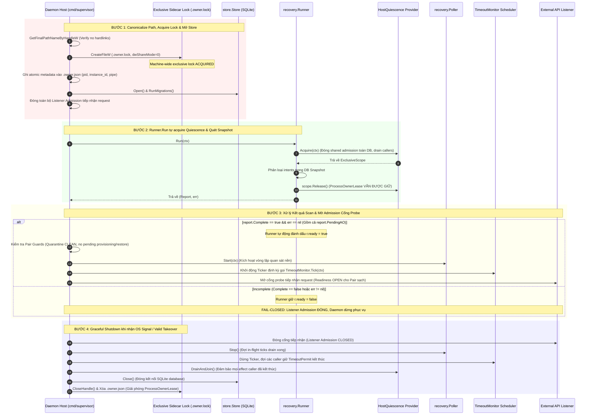

# Kế hoạch Phân định và Xử lý Dependency Host Quiescence Integration

> **Authority**: External Supervisor Governance Directive
> **Active Gate**: `TASK_P03_003D_HANDOFF_VERIFICATION`
> **Phạm vi tài liệu**: Kế hoạch kiến trúc và quản trị cho các dependency runtime còn thiếu sau khi merge TASK-P03-003D
> **Status**: REVISED_FOR_SUPERVISOR_REAUDIT (Revision 5)

---

## 1. Ranh giới Phase & Phân tích Roadmap / Module Provenance

Qua các subtask 3A, 3B, 3C, 3D của Task TASK-P03-003, toàn bộ phần code thư viện nội bộ phục vụ giao tiếp với Agent Orchestrator (AO), quản lý session lifecycle, stop coordinator, execution budget và recovery runner đã được hoàn tất và nghiệm thu độc lập trong thư viện Go (`internal/ao`, `internal/dispatch`, `internal/stop`, `internal/recovery`, `internal/store`).

Tuy nhiên, đối chiếu với `docs/17_ROADMAP.md` và `docs/22_MODULE_PROVENANCE.md`:
1. **Ranh giới Phase P03**: Task contract 3D chỉ giới hạn phạm vi code trong thư viện. Nhưng mục tiêu tổng thể của Phase P03 trên Roadmap (`docs/17_ROADMAP.md`) có Exit Gate: *"Automated session creation, dispatch, observation reconciliation, raw workspace file read, and teardown pass without P04 EvidenceCollector dependencies"*. Do đó, **chưa tuyên bố toàn bộ Phase P03 hoàn tất**. Subtasks 3A–3D đã hoàn thành phạm vi thư viện, nhưng việc nối với runtime thật để đạt exit gate P03 vẫn còn phụ thuộc vào Host Integration.
2. **Ranh giới Phase P04 & Loại bỏ Verification Runner khỏi P03**:
   - P04 sở hữu độc quyền Evidence & Review Engine (`EvidenceCollector`, `ReviewBundleBuilder`, policy validator, kiểm chứng Git diff).
   - Production verification runner và các công cụ thực thi verification profile thuộc sở hữu độc quyền của Phase P04 (`docs/22_MODULE_PROVENANCE.md`) và Phase P05 (`docs/21_TRACEABILITY_MATRIX.md`).
   - Subtask `TASK-P03-004` **loại bỏ production verification runner khỏi scope**, chỉ tập trung vào host/bootstrap (`cmd/supervisor`), admission và test harness kiểm chứng exit gate P03.
3. **Phân bổ Subtask `TASK-P03-004` Thuộc Phase P03**:
   - Theo định hướng chỉ đạo của External Supervisor, dự án chọn phương án phân bổ subtask `TASK-P03-004 Host Quiescence & Daemon Bootstrap Integration` nằm trong Phase P03 để hoàn tất exit gate của P03 trước khi bước sang P04.
   - Hồ sơ Change Governance gồm Proposal `docs/proposals/PROPOSAL-P03-005-host-quiescence-and-daemon-bootstrap-integration.md` và Draft ADR `docs/adr/DRAFT-ADR-017-host-quiescence-and-daemon-lifecycle-architecture.md` đã được khởi tạo để External Supervisor phê duyệt trước khi ban hành Task Contract.
   - **Quy tắc bất biến**: Không tự ý chỉnh sửa `docs/17_ROADMAP.md` hoặc các accepted ADR khi chưa có quyết định phê duyệt chính thức.

---

## 2. Phân Tách Hai Cấp Độ Quiescence & Căn chỉnh API Code Thực tế

### 2.1. Phân tách `ProcessOwnerLease` Dài hạn vs `ExclusiveScope` Ngắn hạn
1. **`ProcessOwnerLease` (Dài hạn, cấp Host Process)**:
   - Phạm vi: Cấp độ toàn bộ database (gắn với canonical DB path trên Windows).
   - Vòng đời: Giữ độc quyền từ **TRƯỚC** khi gọi `Store.Open()` hoặc chạy migration, xuyên suốt quá trình daemon chạy và phục vụ, cho đến **SAU** khi shutdown drain hoàn tất và `Store.Close()` đã đóng kết nối database.
   - Mục đích: Bảo đảm tại một thời điểm trên toàn bộ máy Windows chỉ có DUY NHẤT một tiến trình daemon sở hữu database (Single Active Daemon).
2. **`ExclusiveScope` (Ngắn hạn, cấp Recovery Scan)**:
   - Phạm vi: `HostQuiescence.Acquire(ctx)` (tại `internal/recovery/scanner.go`).
   - Vòng đời: `Runner.Run(ctx)` **tự động gọi** `r.Host.Acquire(ctx)` để lấy `ExclusiveScope` khi bắt đầu sweep và gọi `scope.Release()` ngay khi sweep snapshot hoàn tất.
   - Tách biệt: Khi `ExclusiveScope.Release()` được gọi, `ProcessOwnerLease` **vẫn tiếp tục được giữ** bởi daemon cho đến khi daemon tắt hoàn toàn.
   - **Nguyên tắc tích hợp**: Entrypoint chỉ inject provider struct vào `Runner.Host`. **Host entrypoint tuyệt đối không gọi `Host.Acquire()` lần hai** trước khi gọi `Run(ctx)`.

### 2.2. Nhất thể hóa Ba Interface vào Cùng Một Trusted Host Authority
Cùng một trusted host boundary phải đồng thời hiện thực và đảm bảo tính nhất quán giữa 3 interface:
1. `recovery.HostQuiescence`: `Acquire(ctx context.Context) (ExclusiveScope, error)` — đóng admission chung, drain/join toàn bộ callers trước đó trên toàn bộ DB, cấp exclusive scope cho startup scan.
2. `recovery.LegacyMaintenanceHost`: `AcquireMaintenance(ctx context.Context, pairID string, purpose string) (ExclusiveScope, error)` — cấp quyền maintenance độc quyền cho historical budget binding hoặc manual live stop.
3. `stop.TimeoutAdmission`: `AcquireEffect(ctx context.Context, pairID string, purpose string) (TimeoutPermit, error)` — tham số thứ ba là `purpose string` (ví dụ `"TIMEOUT_MONITOR"` như được gọi tại `internal/stop/coordinator.go:60`).
- **Yêu cầu bắt buộc**: Việc đóng admission, drain/join, cấp exclusive ownership và release permit của cả 3 interface trên phải tuân thủ **cùng một authority** duy nhất tại trusted host boundary.

### 2.3. Hiện trạng API của `TimeoutMonitor` và Kế hoạch Scheduling
- **Hiện trạng mã nguồn**: `TimeoutMonitor` (tại `internal/recovery/timeout_monitor.go`) **chỉ có duy nhất phương thức `func (m *TimeoutMonitor) Tick(ctx context.Context) error`**.
- Code hiện tại **chưa có vòng lặp `Start()` hay `Stop()`**.
- **Kế hoạch Host Scheduling**: Host daemon sẽ chịu trách nhiệm thiết lập cơ chế lập lịch bên ngoài (ví dụ một `time.Ticker` trong goroutine của host) để định kỳ kích hoạt `m.Tick(ctx)` sau khi startup scan đã hoàn tất (`Runner.ready == true`). Không mô tả API chưa tồn tại là đã có trong thư viện.

### 2.4. Vòng đời của `Poller`
- `Poller` (tại `internal/recovery/poller.go`) đã có sẵn `PollOnce(ctx)`, `Start(ctx)` (chạy vòng lặp quan sát nền), và `Stop()` (đặt cờ shutdown, drain ticks đang chạy).
- `Poller.Start(ctx)` gắn liền với `Runner` và chỉ được phép chạy khi `Runner.ready == true` và không có `Run()` hoặc `LegacyMaintenance` nào đang active.

---

## 3. Thiết kế Machine-Wide Exclusivity Phù hợp Windows & Xử lý Wire Effect Mơ hồ

### 3.1. Phân biệt Wire Effect Mới vs. Outcome Đã phát Chưa biết
Cần phân biệt rõ ràng hai khái niệm trực giao:
1. **"Caller cũ không thể phát effect MỚI sau khi quiescence được xác nhận"**:
   - Được bảo đảm chắc chắn khi tiến trình mới đã kiểm soát exclusivity, thu hồi permit và xác nhận tiến trình cũ đã thoát ở mức OS kernel. Sau mốc này, không có thêm bất kỳ request nào được gửi tới AO từ caller cũ.
2. **"Effect ĐÃ PHÁT có outcome chưa biết (In-flight Ambiguous Outcome)"**:
   - Các HTTP request (`/kill`, `/send`, `/restore`) đã được gửi ra dây mạng trước thời điểm quiescence có thể đã đến AO, đang xử lý trên AO, hoặc thất lạc trên mạng.
   - **Việc terminate process hoặc đóng local socket hoàn toàn KHÔNG chứng minh AO chưa nhận effect**.
   - **Nguyên tắc Xử lý**: Mọi intent mơ hồ (`STOP_REQUESTED`, `SEND_REQUESTED`, `RESTORE_REQUESTED`) phải được duy trì **fail-closed**, không bao giờ được replay mù quáng. Scanner và poller phải đối soát (reconcile) qua fresh GET / observation, hoặc nếu target đã terminated / generation mismatch thì ghi nhận governed logical resolution audit (`STOP_OPERATION_RESOLVED`), hoặc giữ nguyên quarantine và escalate cho human reconciliation.

### 3.2. Thuật toán Canonical DB & Lock Identity Duy Nhất
1. **Loại bỏ `Local\` Named Mutex khỏi Bằng chứng Exclusivity**:
   - Namespace `Local\` bị cô lập theo Windows Logon Session (Session 0 vs Session 1+), không bảo vệ được DB xuyên session.
2. **Khóa Độc quyền Chính: Windows Exclusive Sidecar Lock File Handle**:
   - Sử dụng `CreateFileW` với cờ `dwShareMode = 0` (exclusive, cấm share đọc/ghi/xóa) mở file `<canonical_db_path>.owner.lock`.
   - Giữ từ TRƯỚC `Store.Open()`/migration đến SAU shutdown drain và `Store.Close()`.
   - Có hiệu lực toàn máy (machine-wide), bảo vệ DB xuyên suốt mọi logon session trên Windows.
3. **Thuật toán Canonical Path Duy Nhất bằng Kernel Handle**:
   - Nếu DB file đã tồn tại: Mở handle DB file, kiểm tra hard links (`info.nNumberOfLinks > 1` => reject fail-closed `ERR_HARDLINK_ALIAS_UNSUPPORTED`), gọi `GetFinalPathNameByHandleW(VOLUME_NAME_DOS)` để resolve triệt để relative paths, symlinks, directory junctions, subst drives, casing.
   - Nếu DB file chưa tồn tại: Mở handle thư mục cha với `FILE_FLAG_BACKUP_SEMANTICS`, gọi `GetFinalPathNameByHandleW`, ghép với base name chuẩn hóa.
   - Chỉ hỗ trợ NTFS/ReFS cục bộ (cấm network/SMB shares). Alias không chứng minh được thì **fail-closed**, không dùng fallback naive.
4. **Bảo Mật Metadata `.owner.json`**:
   - Ghi atomically qua file tạm `.owner.json.tmp` và rename (`MoveFileExW`).
   - Chứa `pid`, `owner_instance_id` (UUIDv4), `pipe_name`, `started_at`, `canonical_db_path`. DACL chỉ cấp quyền ghi cho Owner/Admins/SYSTEM.
   - Nếu metadata hỏng/stale: fail-closed ngay lập tức; không suy đoán PID từ OS.
5. **Xác Thực Named Pipe Takeover**:
   - Named Pipe xác thực client SID (`ImpersonateNamedPipeClient`).
   - Request phải kèm `owner_instance_id` khớp với metadata. Request không hợp lệ bị từ chối và tuyệt đối không làm owner shutdown.
   - Owner cũ không hợp tác/không thoát: tiến trình mới **fail-closed**, không auto-kill.

---

## 4. Sơ đồ Quy trình Khởi động (Startup-Before-Serve & Graceful Drain)

---

## 5. Tách Bạch Hai Track Bằng Chứng & Ranh giới Tooling

### 5.1. Tách Bạch Hai Track Bằng Chứng
1. **Xóa Giả Định Effectful Supervisor HTTP Routes**:
   - Xóa bỏ giả định daemon P03 đã có sẵn các effectful HTTP routes tạo session, dispatch, workspace read, stop.
   - Tuyệt đối không dùng route AO trực tiếp vì bypass Supervisor sagas và store guards.
   - Thêm route Supervisor mới đòi hỏi governance riêng, không nhét vào ADR-017.
2. **Track 1: Binary Daemon Thật (`cmd/supervisor`)**:
   - Chứng minh: exclusive lock (`.owner.lock`), cạnh tranh 2 process, startup-before-serve (network probe socket đóng đến khi `r.ready == true`), PendingAO hold, graceful drain.
3. **Track 2: P03 Integration Test Harness (Kiểm Chứng 5 Bước AO)**:
   - Gọi trực tiếp các API điều phối nội bộ đã được duyệt của thư viện Go Supervisor (`internal/dispatch`, `internal/store`, `internal/stop`, `internal/ao`, `internal/recovery`).
   - Kiểm chứng 5 bước: 1) Session create, 2) Dispatch prompt, 3) Observation reconciliation, 4) Raw workspace-file read, 5) Teardown.
   - Bảo đảm đi qua toàn bộ Supervisor saga, store guards, state transitions và audit trail mà không cần production HTTP control surface hay code P04/P05.

### 5.2. Ma trận Kiểm chứng Runtime trên Binary Thật (`cmd/supervisor`)

| Kịch bản Kiểm chứng | Hành vi & Trạng thái Mong đợi | Phương pháp Kiểm tra Thực tế |
|---|---|---|
| **1. Trước Run** | `ProcessOwnerLease` được acquire (`.owner.lock` share mode 0). Listener chưa bind socket. | Network probe: Socket connect bị từ chối (Connection Refused). |
| **2. Đang Run** | `Runner.Run(ctx)` nắm `ExclusiveScope`. Listener tiếp tục đóng. | Network probe: Socket connect bị từ chối; log chỉ bổ trợ. |
| **3. Sau Run (Complete)** | `r.ready = true`. Pair guards sạch. Listener bind port thành công. | HTTP probe tới readiness probe port trả về `200 OK` (Admission OPEN). |
| **4. Sau Run (PendingAO)** | `r.ready = true`. Listener mở; Pair có hold trả về 409/503. | HTTP probe verify readiness mở nhưng Pair hold bị khóa admission. |
| **5. Run Lỗi / Incomplete** | `r.ready = false`. Admission đóng fail-closed; daemon exit non-zero. | Socket không bao giờ mở; process exit code != 0. |
| **6. Cạnh tranh 2 Process** | Process B phát hiện `.owner.lock` bị giữ (`ERROR_SHARING_VIOLATION`); cooperative takeover an toàn. | Process A drain và exit; Process B tiếp quản; nếu A không thoát thì B fail-closed. |
| **7. Shutdown Drain** | Nhận SIGINT: listener đóng -> poller drain -> timeout permit release -> Store.Close() -> đóng lock handle. | Probe socket đóng ngay; verify mọi in-flight connection hoàn tất trước khi DB đóng. |

### 5.3. Ma trận Kiểm chứng Canonical DB Identity & Alias Resolution

| Kịch bản Alias / Session | Đường dẫn Đầu vào Thử nghiệm | Kết quả Kỳ vọng |
|---|---|---|
| **Relative Path** | `.\data\db.sqlite` vs `data\..\data\db.sqlite` | Quy về cùng một canonical lock path `\\?\<Drive>:\...\data\db.sqlite.owner.lock` |
| **Case Differences** | `D:\data\db.sqlite` vs `d:\DATA\DB.SQLITE` | Quy về cùng một canonical lock path (case-folded khớp tên đĩa vật lý) |
| **Subst Drive** | `X:\db.sqlite` (với `subst X: D:\data`) | Kernel resolve về đường dẫn thực `\\?\D:\data\db.sqlite.owner.lock` |
| **Directory Junction / Symlink** | `D:\junction\db.sqlite` -> `D:\real\db.sqlite` | `GetFinalPathNameByHandleW` resolve về `\\?\D:\real\db.sqlite.owner.lock` |
| **DB Mới (Chưa tồn tại)** | File chưa có trên đĩa | Resolve canonical parent directory + lowercase base name |
| **Hard Link Detection** | File có `nNumberOfLinks > 1` | Bị từ chối ngay lập tức: **FAIL-CLOSED** (`ERR_HARDLINK_ALIAS_UNSUPPORTED`) |
| **Cross-Session Competition** | Session 0 (Service) vs Session 1 (Interactive) cùng trỏ DB | Process thứ hai nhận ngay `ERROR_SHARING_VIOLATION` (32) xuyên session |

### 5.4. Ranh giới Tooling P03/P04/P05 & An ninh SEC-003
1. **Loại bỏ Production Verification Runner khỏi Scope P03**:
   - P03 host chỉ giới hạn ở daemon bootstrap (`cmd/supervisor`), admission control và test harness tối thiểu cho exit gate P03.
   - Bỏ hoàn toàn production verification runner khỏi P03; `EvidenceCollector`, verification runner và profile execution tools thuộc sở hữu độc quyền của Phase P04 (`docs/22_MODULE_PROVENANCE.md`) và Phase P05 (`docs/21_TRACEABILITY_MATRIX.md`).
2. **Ghi nhận Yêu cầu Người dùng & An ninh SEC-003**:
   - ChatGPT Web đóng vai trò là **agent suy luận** (reasoning agent). Supervisor Control Plane cung cấp local tool surface (bridge-not-brain).
   - Ở các phase P04/P05, các công cụ phục vụ ChatGPT Web (bao gồm tool đọc log và tool yêu cầu chạy profile verification) phải được đối soát nghiêm ngặt với `docs/11_CHATGPT_TOOL_SURFACE.md`, `docs/02_REQUIREMENTS.md`, và `docs/07_SECURITY_MODEL.md` (SEC-003).
   - **Tuyệt đối KHÔNG cấp arbitrary shell execution**; mọi lệnh kiểm thử phải qua runner độc lập có whitelist và hard timeout ở Phase P04/P05.

### 5.5. Invariants Bất biến
- `AUTOMATIC_RESTORE = DISABLED`: Giữ nguyên disable fail-closed.
- 8 Operational policies tiếp tục giữ nguyên ở trạng thái **`UNSET`** trong tài liệu; runtime bắt buộc phải được inject giá trị cấu hình hợp lệ khi khởi động, thiếu bất kỳ giá trị nào thì fail-closed ngay lập tức.
- Tách biệt hoàn toàn test Mock AO tự động trong CI khỏi bài kiểm chứng Live AO có kiểm soát.
