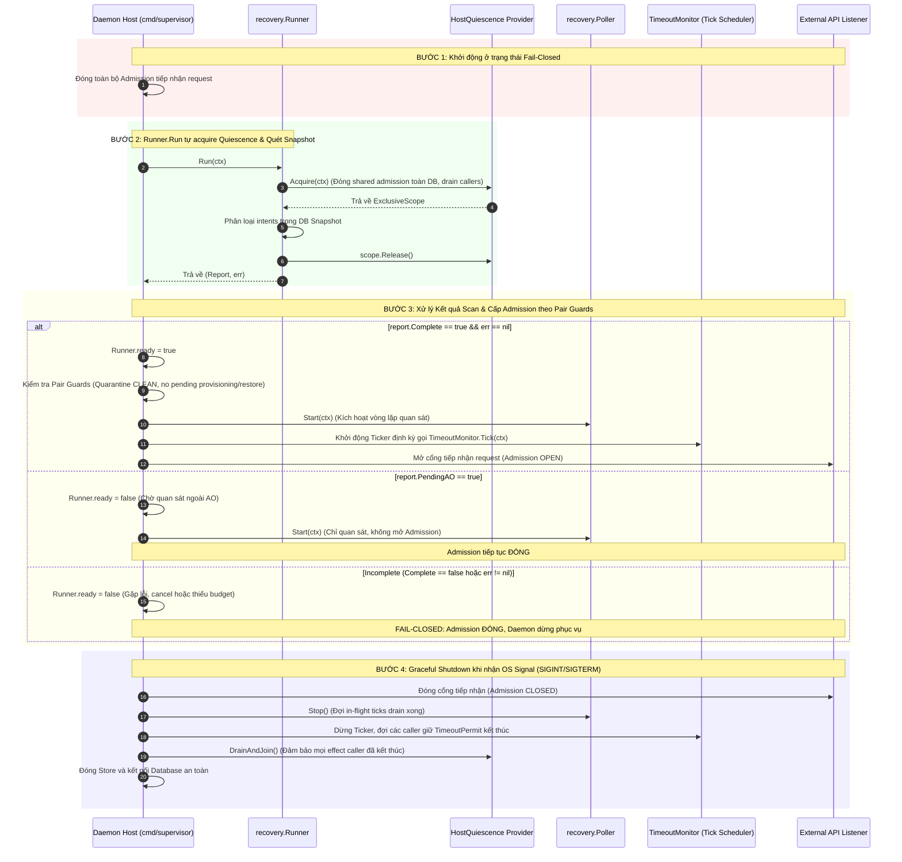

# Kế hoạch Phân định và Xử lý Dependency Host Quiescence Integration

> **Authority**: External Supervisor Governance Directive
> **Active Gate**: `TASK_P03_003D_HANDOFF_VERIFICATION`
> **Phạm vi tài liệu**: Kế hoạch kiến trúc và quản trị cho các dependency runtime còn thiếu sau khi merge TASK-P03-003D
> **Status**: REVISED_FOR_SUPERVISOR_REVIEW

---

## 1. Ranh giới Phase & Phân tích Roadmap / Module Provenance

Qua các subtask 3A, 3B, 3C, 3D của Task TASK-P03-003, toàn bộ phần code thư viện nội bộ phục vụ giao tiếp với Agent Orchestrator (AO), quản lý session lifecycle, stop coordinator, execution budget và recovery runner đã được hoàn tất và nghiệm thu độc lập trong thư viện Go (`internal/ao`, `internal/dispatch`, `internal/stop`, `internal/recovery`, `internal/store`).

Tuy nhiên, đối chiếu với `docs/17_ROADMAP.md` và `docs/22_MODULE_PROVENANCE.md`:
1. **Ranh giới Phase P03**: Task contract 3D chỉ giới hạn phạm vi code trong thư viện. Nhưng mục tiêu tổng thể của Phase P03 trên Roadmap (`docs/17_ROADMAP.md`) có Exit Gate: *"Automated session creation, dispatch, observation reconciliation, raw workspace file read, and teardown pass without P04 EvidenceCollector dependencies"*. Do đó, **chưa tuyên bố toàn bộ Phase P03 hoàn tất**. Subtasks 3A–3D đã hoàn thành phạm vi thư viện, nhưng việc nối với runtime thật để đạt exit gate P03 vẫn còn phụ thuộc vào Host Integration.
2. **Ranh giới Phase P04**: P04 sở hữu độc quyền Evidence & Review Engine (`EvidenceCollector`, `ReviewBundleBuilder`, policy validator, kiểm chứng Git diff). **P04 hoàn toàn không sở hữu daemon bootstrap, server entrypoint, hay host quiescence**.
3. **Đối chiếu Hai Hướng Tiếp cận Quyền Sở hữu (Ownership & Roadmap)**:
   - **Lựa chọn 1 (Host Task độc lập thuộc P03)**: Lập subtask `TASK-P03-004 Host Quiescence & Bootstrap Integration` để xây dựng daemon entrypoint, thỏa mãn exit gate P03 trước khi mở P04.
   - **Lựa chọn 2 (Kết hợp Host Integration vào P05)**: Giữ nguyên P03 ở mức thư viện hoàn tất, triển khai P04 (Evidence/Review) trong thư viện, sau đó thực hiện Host Integration kết hợp với P05 Local HTTP/MCP Relay & Server Entrypoint.
   - **Nguyên tắc Quản trị Thay đổi (Change Governance)**: Nếu lựa chọn phương án làm thay đổi roadmap hoặc quyền sở hữu module giữa các phase, phải lập proposal (`docs/proposals/`) và draft ADR (`docs/adr/`) để External Supervisor phê duyệt trước khi ban hành Task Contract. **Không tự ý sửa roadmap hoặc accepted ADR trong tài liệu này**.

---

## 2. Căn chỉnh Kế hoạch theo API Code Thực tế Đã Tồn Tại

Kế hoạch host integration phải tuân thủ nghiêm ngặt các interface và phương thức đã hiện thực trong codebase:

### 2.1. `Runner.Run(ctx)` và Cơ chế Tự Acquire Quiescence
- **Chữ ký hàm hiện có**: `func (r *Runner) Run(ctx context.Context) (report Report, err error)` (tại `internal/recovery/scanner.go`).
- **Cơ chế hoạt động**: `Runner.Run` **tự động gọi** `r.Host.Acquire(ctx)` để nhận `ExclusiveScope`, và dùng `defer scope.Release()`.
- **Nguyên tắc tích hợp**: Host entrypoint chỉ đóng vai trò inject provider struct vào `Runner.Host`. **Host entrypoint tuyệt đối không gọi `Host.Acquire()` lần hai** trước khi gọi `Run(ctx)`.
- **Phạm vi Quiescence**: Interface `HostQuiescence.Acquire(context.Context) (ExclusiveScope, error)` có phạm vi là **toàn bộ database và shared effect admission chung**, không chỉ giới hạn ở một Pair cụ thể.

### 2.2. Nhất thể hóa Ba Interface vào Cùng Một Trusted Host Authority
Cùng một trusted host boundary phải đồng thời hiện thực và đảm bảo tính nhất quán giữa 3 interface:
1. `recovery.HostQuiescence`: `Acquire(context.Context) (ExclusiveScope, error)` — đóng admission chung, drain/join toàn bộ callers trước đó trên toàn bộ DB, cấp exclusive scope cho startup scan.
2. `recovery.LegacyMaintenanceHost`: `AcquireMaintenance(ctx context.Context, pairID, purpose string) (ExclusiveScope, error)` — cấp quyền maintenance độc quyền cho historical budget binding hoặc manual live stop.
3. `stop.TimeoutAdmission`: `AcquireEffect(ctx context.Context, pairID, attemptID string) (TimeoutPermit, error)` — cấp quyền effect một lần duy nhất cho timeout stop coordinator.
- **Yêu cầu bắt buộc**: Việc đóng admission, drain/join, cấp exclusive ownership và release permit của cả 3 interface trên phải tuân thủ **cùng một authority** duy nhất tại trusted host boundary.

### 2.3. Hiện trạng API của `TimeoutMonitor` và Kế hoạch Scheduling
- **Hiện trạng mã nguồn**: `TimeoutMonitor` (tại `internal/recovery/timeout_monitor.go`) **chỉ có duy nhất phương thức `func (m *TimeoutMonitor) Tick(ctx context.Context) error`**.
- Code hiện tại **chưa có vòng lặp `Start()` hay `Stop()`**.
- **Kế hoạch Host Scheduling**: Host daemon sẽ chịu trách nhiệm thiết lập cơ chế lập lịch bên ngoài (ví dụ một `time.Ticker` trong goroutine của host) để định kỳ kích hoạt `m.Tick(ctx)` sau khi startup scan đã hoàn tất (`Runner.ready == true`). Không mô tả API chưa tồn tại là đã có trong thư viện.

### 2.4. Vòng đời của `Poller`
- `Poller` (tại `internal/recovery/poller.go`) đã có sẵn `PollOnce(ctx)`, `Start(ctx)` (chạy vòng lặp quan sát nền), và `Stop()` (đặt cờ shutdown, drain ticks đang chạy).
- `Poller.Start(ctx)` gắn liền với `Runner` và chỉ được phép chạy khi `Runner.ready == true` và không có `Run()` hoặc `LegacyMaintenance` nào đang active.

---

## 3. So sánh các Phương án Exclusivity Liên Tiến Trình (Multi-Process Exclusivity)

### 3.1. Phân tích Vấn đề: Tại sao các Giải pháp Thông thường Không Đủ?
Bất kỳ phương án exclusivity nào cũng phải **chứng minh được các caller cũ đã thực sự kết thúc trước khi scanner phân loại intent**.
1. **DB Lease Expiry / TTL không đủ bằng chứng**: Nếu tiến trình cũ bị network partition, GC pause, hoặc CPU starvation, lease trên database có thể hết hạn. Khi đó tiến trình mới chiếm lease và scanner bắt đầu phân loại intent. Nhưng đúng lúc đó, tiến trình cũ tỉnh lại và hoàn tất HTTP wire call (`/send`, `/kill`, hoặc `/restore`) tới AO. Điều này phá vỡ tính nguyên tử của intent classification.
2. **Timestamp / Clock Comparison không đủ**: Đồng hồ hệ thống giữa các máy/tiến trình có thể bị lệch; timestamp không phải bằng chứng vật lý chứng minh socket mạng đã đóng.
3. **Row Reread / Database CAS không đủ**: Reread DB chỉ thấy dữ liệu trong database, không thấy được các request đang bay lơ lửng trên đường truyền mạng (in-flight network packets).
4. **Process Mutex (`sync.Mutex`) không đủ**: Hoàn toàn vô hiệu giữa các OS process độc lập.
5. **AO `/kill` và `/send` không có Fencing Token**: REST API của Untrivial AO không hỗ trợ epoch fencing token để từ chối các request xuất phát từ tiến trình mang thế hệ cũ.

### 3.2. So sánh các Phương án Khả thi

| Tiêu chí | Phương án 1 (Khuyến nghị): Single Active Host + OS-level Exclusive Lock & Pre-Scan Hard Drain | Phương án 2: Outbound Proxy Gateway với Ephemeral Epoch Fencing | Phương án 3: Dual-Phase DB Lease kết hợp Host Connection Severing |
|---|---|---|---|
| **Cơ chế thực thi** | Một daemon active duy nhất trên node/DB. Sử dụng OS exclusive file lock (hoặc flock trên DB file). Tiến trình mới khi khởi động phải kích hoạt graceful takeover: yêu cầu tiến trình cũ drain và đóng socket. Nếu quá hạn, buộc tiến trình cũ terminate (SIGKILL) và OS kernel đóng toàn bộ TCP sockets trước khi trả về `ExclusiveScope`. | Dựng một local proxy trung gian kiểm soát toàn bộ outbound traffic tới AO. Proxy lưu `current_epoch`. Mọi wire call mang epoch cũ bị drop ngay tại tầng proxy. | Sử dụng bảng `host_leases` trong database, nhưng bổ sung cơ chế ép ngắt kết nối mạng (TCP RST / close socket descriptor) trước khi scanner chạy. |
| **Bằng chứng caller cũ đã dừng** | **Rất mạnh**: OS kernel giải phóng socket và process terminate là bằng chứng vật lý chắc chắn rằng không còn wire call nào có thể được gửi đi. | **Mạnh**: Được enforce tại proxy gateway. | **Trung bình**: Phụ thuộc vào việc quản lý file descriptor mạng của host. |
| **Độ phức tạp kiến trúc** | **Thấp / Tối giản**: Phù hợp hoàn hảo với kiến trúc single-daemon hiện tại của dự án; không thêm component mới. | **Cao**: Phải phát triển và vận hành thêm proxy service; chưa có trong ADR-016. | **Cao**: Đòi hỏi quyền can thiệp sâu vào tầng network socket của hệ điều hành. |
| **Hỗ trợ Multi-Active** | Chỉ Active-Passive (Failover). | Có thể hỗ trợ Multi-node. | Hỗ trợ Multi-process. |

### 3.3. Phương án Khuyến nghị & Phép thử Bác bỏ Giả định (Falsification Test)
- **Khuyến nghị**: Chọn **Phương án 1 (Single Active Host with OS-level Exclusive Lock & Pre-Scan Hard Drain)**.
- **Phép thử Bác bỏ Giả định (Falsification Test)**:
  - *Giả định cần kiểm chứng*: "Khi tiến trình mới nhận `ExclusiveScope` từ `Host.Acquire(ctx)`, tuyệt đối không còn bất kỳ wire call nào từ tiến trình cũ đến được AO".
  - *Thiết kế phép thử*:
    1. Chạy Tiến trình 1, thực hiện một thao tác gửi `/kill` hoặc `/send` nhưng inject độ trễ mạng giả lập 3–5 giây.
    2. Khởi động Tiến trình 2 trỏ vào cùng DB và gọi `Runner.Run(ctx)`.
    3. *Điều kiện Bác bỏ*: Nếu Tiến trình 2 hoàn tất `Acquire` và phân loại intent trong khi Mock AO vẫn nhận được request `/kill` từ Tiến trình 1 -> **GIẢ ĐỊNH BỊ BÁC BỎ (TEST FAILED)**.
    4. *Tiêu chí Chấp thuận*: Tiến trình 2 bắt buộc phải block chờ Tiến trình 1 drain xong, hoặc Tiến trình 1 bị terminate và connection bị ngắt hoàn toàn trước khi `Acquire` trả về thành công.

### 3.4. Xử lý Failure, Cancellation, Restart và Giới hạn Rollback
1. **Failure / Cancellation trong lúc Acquire**: Nếu việc acquire quiescence bị lỗi hoặc context bị hủy, trả lỗi ngay lập tức, `Runner.Run` hủy bỏ, admission tiếp tục đóng fail-closed.
2. **Crash trong lúc `Run()`**: Bất kỳ crash nào trong `Run()` sẽ khiến transaction Store chưa commit tự động rollback; `STARTUP_RECOVERY_SWEEP_STARTED` đã ghi sẽ đánh dấu sweep chưa hoàn thành; lần restart tiếp theo sẽ quét lại snapshot.
3. **Giới hạn Rollback**: Rollback của database không thể thu hồi wire call đã phát ra ngoài AO (vì AO không hỗ trợ 2-Phase Commit). Vì vậy, ranh giới giữa `STOP_REQUESTED` (chưa proven effect) và `STOP_CALL_SUCCEEDED` (đã proven wire call) như quy định tại ADR-016 là chốt chặn bất biến cuối cùng.

---

## 4. Sơ đồ Quy trình Khởi động (Startup-Before-Serve & Graceful Drain)

---

## 5. Dự kiến Phạm vi File & Tiêu chí Fail-Closed

### 5.1. Dự kiến File Scope
- `cmd/supervisor/main.go`: Entrypoint duy nhất của tiến trình Supervisor daemon.
- `internal/host/quiescence.go`: Hiện thực `HostQuiescence`, `LegacyMaintenanceHost`, và `TimeoutAdmission` trên cùng một provider.
- `internal/host/scheduler.go`: Bộ lập lịch định kỳ gọi `TimeoutMonitor.Tick(ctx)`.
- `internal/host/lifecycle.go`: Bộ điều phối lifecycle (khởi động `Run` -> kiểm tra Report -> kích hoạt Poller -> mở Listener -> xử lý OS signal drain).
- `internal/host/bootstrap_test.go`: Bộ test suite kiểm chứng toàn bộ kịch bản startup-before-serve, falsification test, và graceful drain.

### 5.2. Tiêu chí Chấp thuận Fail-Closed (Fail-Closed Acceptance Criteria)
1. **Không mở cổng nếu scan chưa Complete**: Nếu `Runner.Run` trả về lỗi, bị hủy, `PendingAO == true`, hoặc `Complete == false`, listener tuyệt đối không được mở cổng.
2. **Không phân loại intent khi chưa có exclusive scope**: `Runner.Run` chỉ chạy khi `Host.Acquire(ctx)` thành công và trả về non-nil `ExclusiveScope`.
3. **Một authority duy nhất**: Mọi hành động cấp quyền effect hoặc maintenance đều phải đi qua cùng một host admission boundary.
4. **Drain trước khi đóng Store**: Khi shutdown, database connection chỉ được đóng sau khi tất cả goroutine effect caller đã hoàn tất và release permit.
5. **Invariants bất biến**: `AUTOMATIC_RESTORE=DISABLED`, không gọi AO thật, không tự ý cấp quyền code P04.
