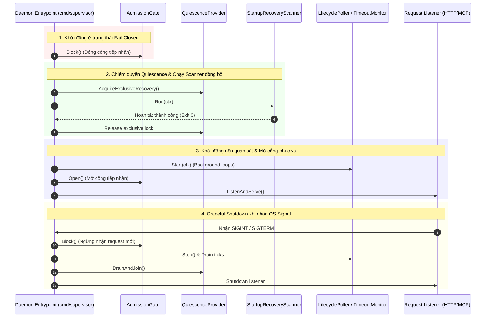

# Kế hoạch Phân định và Xử lý Dependency Host Quiescence Integration

> **Authority**: External Supervisor Governance Directive
> **Active Gate**: `TASK_P03_003D_HANDOFF_VERIFICATION`
> **Phạm vi tài liệu**: Kế hoạch kiến trúc và quản trị cho các dependency runtime còn thiếu sau khi merge TASK-P03-003D
> **Status**: READY_FOR_SUPERVISOR_AUDIT

---

## 1. Bối cảnh & Phân tích Roadmap / Module Provenance

Qua các phase P01, P02 và P03 (3A, 3B, 3C, 3D), toàn bộ các thành phần thư viện nội bộ phục vụ giao tiếp với Agent Orchestrator (AO), quản lý lifecycle phiên làm việc, stop coordinator, execution budget và startup recovery scanner đã được hoàn tất và nghiệm thu độc lập ở cấp độ thư viện Go (`internal/ao`, `internal/dispatch`, `internal/stop`, `internal/recovery`, `internal/store`).

Tuy nhiên, đối chiếu với `docs/17_ROADMAP.md` và `docs/22_MODULE_PROVENANCE.md`:
1. **P03 (AO Integration)**: Chỉ bao gồm adapter REST, domain lifecycle/dispatch, quan sát trạng thái và xử lý crash recovery trong phạm vi thư viện. P03 nghiêm cấm tạo daemon entrypoint (`cmd/**` là forbidden scope).
2. **P04 (Evidence & Review Engine)**: Được quy hoạch chuyên biệt cho `EvidenceCollector`, `ReviewBundleBuilder`, policy validator và kiểm chứng Git diff. **P04 hoàn toàn không sở hữu daemon bootstrap hay host server lifecycle**.
3. **Daemon Bootstrap / Host Quiescence**: Việc xây dựng entrypoint thực thi (`cmd/supervisor` hoặc tương đương), cấu hình listener HTTP/MCP, cơ chế graceful shutdown và bảo đảm thứ tự `StartupRecoveryScanner.Run(ctx)` chạy xong trước khi mở cổng nhận request là trách nhiệm của lớp **Host Integration**.
4. **Nguyên tắc Quản trị Thay đổi (Change Governance)**: Không được tự ý gán trách nhiệm daemon bootstrap vào P04. Nếu việc phân định này làm thay đổi roadmap hoặc bổ sung phase/task mới (ví dụ Task chuyên trách Host Bootstrap hoặc tích hợp vào P05 Tool Interface), cần lập hồ sơ Change Governance (Proposal / ADR) trước khi ban hành Task Contract.

---

## 2. Phân định Bằng chứng: Thư viện Đã đạt vs. Runtime Còn thiếu

| Thành phần | Bằng chứng Thư viện Đã đạt (Library Scope) | Bằng chứng Runtime Còn thiếu (Unproven Runtime) |
|---|---|---|
| **Startup Recovery** | `StartupRecoveryScanner.Run(ctx)` phân loại chính xác các trạng thái crash/incomplete, xử lý atomic rollback, emit đầy đủ audit events và được kiểm chứng qua `internal/recovery/integration_test.go`. | Chưa có entrypoint thật (`cmd/`) bảo đảm scanner được kích hoạt trước khi mở cổng phục vụ request (`DESIGN_BLOCKER_3D_STARTUP_WIRING=PRESERVED`). |
| **Quiescence Boundary** | Interface `QuiescenceProvider` định nghĩa đầy đủ các barrier và drain logic; test harness mô phỏng chính xác thứ tự gọi. | Chưa có cơ chế khóa/thuê quyền độc quyền liên tiến trình (Cross-process exclusivity) trên database/Pair dùng chung; test harness chỉ dùng `sync.Mutex` nội bộ (`HOST_QUIESCENCE_INTEGRATION=OPEN`). |
| **Graceful Shutdown** | `Poller` và `TimeoutMonitor` có logic hủy context (`ctx.Done()`) và drain ticks công khai. | Chưa có signal handler thực tế (bắt OS SIGINT/SIGTERM) để kích hoạt drain/join và dừng an toàn trước khi tiến trình tắt. |
| **Operator Principal** | Store và Coordinator kiểm tra chặt chẽ `authorized_principal`, từ chối thao tác nếu thiếu principal. | Test suite chỉ sử dụng fake test principal; chưa có cơ chế xác thực danh tính operator thực tế từ trusted host boundary (OS auth, TLS cert, token). |
| **Automatic Restore** | Logic CAS restore đã hoàn thiện trong Store transaction. | `AUTOMATIC_RESTORE=DISABLED`: Không được kích hoạt tự động khôi phục khi chưa có bằng chứng runtime về principal hợp lệ. |

---

## 3. Đặc tả Interface, Integration Harness & Tiêu chí Fail-Closed

### 3.1. Các Interface Dự kiến của Host Integration

```go
package host

import "context"

// QuiescenceProvider quản lý quyền truy cập độc quyền vào Pair/Store trong quá trình phục hồi và bảo trì
type QuiescenceProvider interface {
    // AcquireExclusiveRecovery phong tỏa admission tiếp nhận request và cấp quyền chạy cho Recovery Scanner
    AcquireExclusiveRecovery(ctx context.Context, pairID string) (ReleaseFunc, error)
    // DrainAndJoin chờ tất cả các tác vụ đang thực thi kết thúc trước khi shutdown
    DrainAndJoin(ctx context.Context) error
}

type ReleaseFunc func() error

// AdmissionGate điều khiển việc mở/đóng cổng tiếp nhận request từ bên ngoài (HTTP/MCP)
type AdmissionGate interface {
    Block()
    Open()
    IsOpen() bool
}

// PrincipalVerifier xác thực danh tính operator tại biên tin cậy (Trusted Boundary)
type PrincipalVerifier interface {
    VerifyOperatorPrincipal(ctx context.Context, rawCredential string) (string, error)
}

// DaemonLifecycle điều phối toàn bộ vòng đời của tiến trình Supervisor
type DaemonLifecycle interface {
    Start(ctx context.Context) error
    Shutdown(ctx context.Context) error
}
```

### 3.2. Quy trình Thực thi (Startup-Before-Serve & Graceful Drain)



### 3.3. Tiêu chí Chấp thuận Fail-Closed (Fail-Closed Acceptance Criteria)

1. **Khởi động không hoàn tất**: Nếu `StartupRecoveryScanner.Run(ctx)` gặp lỗi, bị hủy hoặc không hoàn tất, `AdmissionGate` bắt buộc phải ở trạng thái `Block()`, cổng listener tuyệt đối không được mở, và tiến trình phải dừng ngay với mã lỗi non-zero.
2. **Xung đột Quiescence**: Nếu hai tiến trình supervisor cùng cố gắng khởi động trên cùng một database/Pair, cơ chế khóa liên tiến trình phải ngăn chặn tiến trình thứ hai và thoát an toàn, không được ghi đè trạng thái.
3. **Từ chối Restore khi thiếu Principal**: Mọi yêu cầu restore phiên hoặc linked stop khi chưa có `VerifiedPrincipal` từ `PrincipalVerifier` phải bị từ chối ngay lập tức (HTTP 401/403) và giữ nguyên trạng thái quarantine.
4. **Shutdown an toàn**: Khi nhận tín hiệu dừng, tiến trình phải drain toàn bộ các quan sát đang dở dang trước khi đóng kết nối database, tránh tình trạng orphaned in-flight operations.

---

## 4. Dự kiến Phạm vi File & Đề xuất Governance

### 4.1. Phạm vi File Dự kiến
- `cmd/supervisor/main.go` (hoặc `cmd/server/main.go`): Entrypoint của binary daemon.
- `internal/host/admission.go`: Hiện thực AdmissionGate điều khiển trạng thái mở/đóng cổng.
- `internal/host/quiescence.go`: Hiện thực QuiescenceProvider (hỗ trợ file-lock hoặc DB-lease cho liên tiến trình).
- `internal/host/principal.go`: Hiện thực cơ chế xác thực operator principal tại trusted boundary.
- `internal/host/lifecycle.go`: Bộ điều phối lifecycle (startup scanner -> open serve -> signal drain).
- `internal/host/bootstrap_test.go`: Integration test kiểm chứng thứ tự khởi động và dừng an toàn.

### 4.2. Đề xuất Change Governance
- **Lập Proposal / ADR**: Xây dựng `PROPOSAL-P03-HOST-001` hoặc `ADR-017` để phê duyệt kiến trúc Host Quiescence & Daemon Lifecycle.
- **Ranh giới Roadmap**: Xác định rõ vị trí của Host Integration (hoàn thành trước khi bước vào P05 hoặc tạo subtask độc lập thuộc governance phê duyệt). Tuyệt đối không đưa vào P04.
- **Bảo toàn Invariants**: Trong suốt quá trình này, `AUTOMATIC_RESTORE=DISABLED`, không gọi AO thật, và không tự động mở cổng khi chưa có kiểm toán độc lập.
