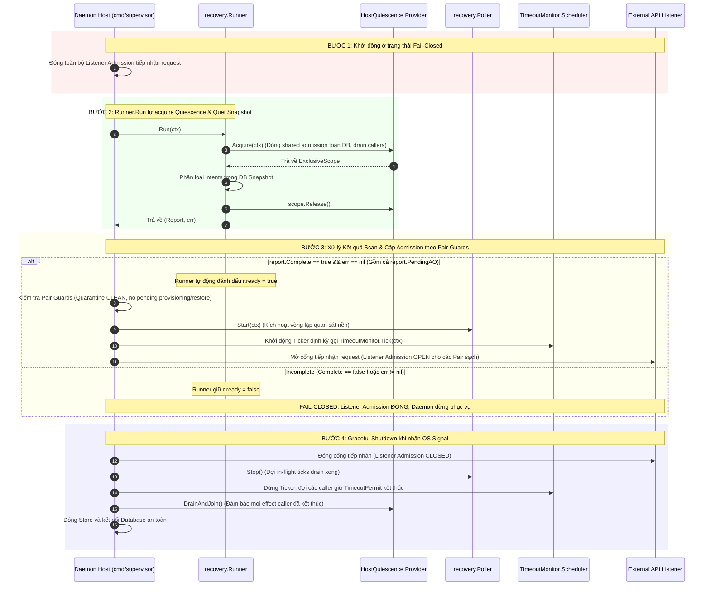

# Kế hoạch Phân định và Xử lý Dependency Host Quiescence Integration

> **Authority**: External Supervisor Governance Directive
> **Active Gate**: `TASK_P03_003D_HANDOFF_VERIFICATION`
> **Phạm vi tài liệu**: Kế hoạch kiến trúc và quản trị cho các dependency runtime còn thiếu sau khi merge TASK-P03-003D
> **Status**: REVISED_FOR_SUPERVISOR_REVIEW (Revision 2)

---

## 1. Ranh giới Phase & Phân tích Roadmap / Module Provenance

Qua các subtask 3A, 3B, 3C, 3D của Task TASK-P03-003, toàn bộ phần code thư viện nội bộ phục vụ giao tiếp với Agent Orchestrator (AO), quản lý session lifecycle, stop coordinator, execution budget và recovery runner đã được hoàn tất và nghiệm thu độc lập trong thư viện Go (`internal/ao`, `internal/dispatch`, `internal/stop`, `internal/recovery`, `internal/store`).

Tuy nhiên, đối chiếu với `docs/17_ROADMAP.md` và `docs/22_MODULE_PROVENANCE.md`:
1. **Ranh giới Phase P03**: Task contract 3D chỉ giới hạn phạm vi code trong thư viện. Nhưng mục tiêu tổng thể của Phase P03 trên Roadmap (`docs/17_ROADMAP.md`) có Exit Gate: *"Automated session creation, dispatch, observation reconciliation, raw workspace file read, and teardown pass without P04 EvidenceCollector dependencies"*. Do đó, **chưa tuyên bố toàn bộ Phase P03 hoàn tất**. Subtasks 3A–3D đã hoàn thành phạm vi thư viện, nhưng việc nối với runtime thật để đạt exit gate P03 vẫn còn phụ thuộc vào Host Integration.
2. **Ranh giới Phase P04**: P04 sở hữu độc quyền Evidence & Review Engine (`EvidenceCollector`, `ReviewBundleBuilder`, policy validator, kiểm chứng Git diff). **P04 hoàn toàn không sở hữu daemon bootstrap, server entrypoint, hay host quiescence**.
3. **Phân bổ Subtask `TASK-P03-004` Thuộc Phase P03**:
   - Theo định hướng chỉ đạo của External Supervisor, dự án chọn phương án phân bổ subtask `TASK-P03-004 Host Quiescence & Daemon Bootstrap Integration` nằm trong Phase P03 để hoàn tất exit gate của P03 trước khi bước sang P04.
   - Hồ sơ Change Governance gồm Proposal `docs/proposals/PROPOSAL-P03-005-host-quiescence-and-daemon-bootstrap-integration.md` và Draft ADR `docs/adr/DRAFT-ADR-017-host-quiescence-and-daemon-lifecycle-architecture.md` đã được khởi tạo để External Supervisor phê duyệt trước khi ban hành Task Contract.
   - **Quy tắc bất biến**: Không tự ý chỉnh sửa `docs/17_ROADMAP.md` hoặc các accepted ADR khi chưa có quyết định phê duyệt chính thức.

---

## 2. Căn chỉnh Kế hoạch theo API Code Thực tế Đã Tồn Tại

Kế hoạch host integration tuân thủ nghiêm ngặt các interface và phương thức đã hiện thực trong codebase:

### 2.1. `Runner.Run(ctx)` và Cơ chế Tự Acquire Quiescence
- **Chữ ký hàm hiện có**: `func (r *Runner) Run(ctx context.Context) (report Report, err error)` (tại `internal/recovery/scanner.go`).
- **Cơ chế hoạt động**: `Runner.Run` **tự động gọi** `r.Host.Acquire(ctx)` để nhận `ExclusiveScope`, và giải phóng qua `defer scope.Release()`.
- **Nguyên tắc tích hợp**: Host entrypoint chỉ đóng vai trò inject provider struct vào `Runner.Host`. **Host entrypoint tuyệt đối không gọi `Host.Acquire()` lần hai** trước khi gọi `Run(ctx)`.
- **Phạm vi Quiescence**: Interface `HostQuiescence.Acquire(context.Context) (ExclusiveScope, error)` có phạm vi là **toàn bộ database và shared effect admission chung**, không chỉ giới hạn ở một Pair cụ thể.

### 2.2. Nhất thể hóa Ba Interface vào Cùng Một Trusted Host Authority
Cùng một trusted host boundary phải đồng thời hiện thực và đảm bảo tính nhất quán giữa 3 interface:
1. `recovery.HostQuiescence`: `Acquire(ctx context.Context) (ExclusiveScope, error)` — đóng admission chung, drain/join toàn bộ callers trước đó trên toàn bộ DB, cấp exclusive scope cho startup scan.
2. `recovery.LegacyMaintenanceHost`: `AcquireMaintenance(ctx context.Context, pairID string, purpose string) (ExclusiveScope, error)` — cấp quyền maintenance độc quyền cho historical budget binding hoặc manual live stop.
3. `stop.TimeoutAdmission`: `AcquireEffect(ctx context.Context, pairID string, purpose string) (TimeoutPermit, error)` — tham số thứ ba là `purpose string` (ví dụ `"TIMEOUT_MONITOR"` như được gọi tại `internal/stop/coordinator.go:60`).
- **Yêu cầu bắt buộc**: Việc đóng admission, drain/join, cấp exclusive ownership và release permit của cả 3 interface trên phải tuân thủ **cùng một authority** duy nhất tại trusted host boundary.

### 2.3. Hiện trạng API của `TimeoutMonitor` và Kế hoạch Scheduling
- **Hiện trạng mã nguồn**: `TimeoutMonitor` (tại `internal/recovery/timeout_monitor.go`) **chỉ có duy nhất phương thức `func (m *TimeoutMonitor) Tick(ctx context.Context) error`**.
- Code hiện tại **chưa có vòng lặp `Start()` hay `Stop()`**.
- **Kế hoạch Host Scheduling**: Host daemon sẽ chịu trách nhiệm thiết lập cơ chế lập lịch bên ngoài (ví dụ một `time.Ticker` trong goroutine của host) để định kỳ kích hoạt `m.Tick(ctx)` sau khi startup scan đã hoàn tất (`Runner.ready == true`). Không mô tả API chưa tồn tại là đã có trong thư viện.

### 2.4. Vòng đời của `Poller`
- `Poller` (tại `internal/recovery/poller.go`) đã có sẵn `PollOnce(ctx)`, `Start(ctx)` (chạy vòng lặp quan sát nền), và `Stop()` (đặt cờ shutdown, drain ticks đang chạy).
- `Poller.Start(ctx)` gắn liền với `Runner` và chỉ được phép chạy khi `Runner.ready == true` và không có `Run()` hoặc `LegacyMaintenance` nào đang active.

---

## 3. Thiết kế Exclusivity Phù hợp Windows & Xử lý Wire Effect Mơ hồ

### 3.1. Phân biệt Wire Effect Mới vs. Outcome Đã phát Chưa biết
Cần phân biệt rõ ràng hai khái niệm trực giao:
1. **"Caller cũ không thể phát effect MỚI sau khi quiescence được xác nhận"**:
   - Được bảo đảm chắc chắn khi tiến trình mới đã kiểm soát exclusivity, thu hồi permit và xác nhận tiến trình cũ đã thoát ở mức OS kernel. Sau mốc này, không có thêm bất kỳ request nào được gửi tới AO từ caller cũ.
2. **"Effect ĐÃ PHÁT có outcome chưa biết (In-flight Ambiguous Outcome)"**:
   - Các HTTP request (`/kill`, `/send`, `/restore`) đã được gửi ra dây mạng trước thời điểm quiescence có thể đã đến AO, đang xử lý trên AO, hoặc thất lạc trên mạng.
   - **Việc terminate process hoặc đóng local socket hoàn toàn KHÔNG chứng minh AO chưa nhận effect**.
   - **Nguyên tắc Xử lý**: Mọi intent mơ hồ (`STOP_REQUESTED`, `SEND_REQUESTED`, `RESTORE_REQUESTED`) phải được duy trì **fail-closed**, không bao giờ được replay mù quáng. Scanner và poller phải đối soát (reconcile) qua fresh GET / observation, hoặc nếu target đã terminated / generation mismatch thì ghi nhận governed logical resolution audit (`STOP_OPERATION_RESOLVED`), hoặc giữ nguyên quarantine và escalate cho human reconciliation.

### 3.2. Thiết kế Exclusivity Phù hợp Nền tảng Windows
1. **Không dùng POSIX Primitives & Khóa Trực tiếp SQLite**:
   - Trên Windows, không có POSIX `flock` hay `SIGKILL`.
   - Không đặt khóa file trực tiếp trên database file của SQLite (`.db`), vì tính chất mandatory locking của Windows sẽ gây xung đột trực tiếp với internal pager locking của SQLite (`SQLITE_BUSY` hoặc access denied).
2. **Cơ chế Khóa Sidecar & Windows Named Mutex**:
   - Exclusivity trên mỗi database được định danh bằng canonical path của file database.
   - Sử dụng sidecar lock file (ví dụ `<db_path>.supervisor.lock`) mở với quyền truy cập độc quyền không chia sẻ (`syscall.FILE_SHARE_READ = 0` hoặc `LockFileEx`), kết hợp với Windows Named Mutex theo định dạng `Global\AISupervisor_<SHA256(canonical_db_path)>`.
3. **Vòng đời Owner & Cạnh tranh Hai Process**:
   - Khi Process B khởi động: Mở mutex/sidecar lock. Nếu Process A đang nắm giữ, Process B gửi yêu cầu bàn giao qua local IPC (Named Pipe hoặc tín hiệu sidecar).
   - Process A nhận yêu cầu: Đóng admission, drain/join toàn bộ in-flight effect callers, giải phóng lock và thoát.
   - Xử lý tiến trình cũ không hợp tác: Nếu quá thời hạn chờ an toàn, Process B mở handle Process A qua `OpenProcess(PROCESS_TERMINATE, ...)` và gọi `TerminateProcess`.
   - **Bằng chứng đã thoát**: Process B dùng `WaitForSingleObject` trên process handle để xác nhận kernel Windows đã hoàn tất việc giải phóng Process A và đóng toàn bộ network socket descriptors.
   - **Ràng buộc Fail-Closed**: Nếu chưa chứng minh được Process A đã thoát hoàn toàn và lock chưa được acquire độc quyền -> **TUYỆT ĐỐI KHÔNG CẤP `ExclusiveScope`**. `Runner.Run(ctx)` phải dừng ngay và không mở cổng phục vụ.

### 3.3. Phép thử Bác bỏ Giả định (Falsification Test)
- *Giả định cần kiểm chứng*: "Khi tiến trình mới nhận `ExclusiveScope` từ `Host.Acquire(ctx)`, tuyệt đối không còn bất kỳ caller cũ nào có thể phát effect mới tới AO".
- *Thiết kế phép thử*:
  1. Chạy Tiến trình 1, cố gắng thực hiện một thao tác gửi `/kill` nhưng bị hoãn (pause/stall) trước khi dispatch.
  2. Khởi động Tiến trình 2 trỏ vào cùng DB và yêu cầu acquire quiescence.
  3. *Điều kiện Bác bỏ*: Nếu Tiến trình 2 hoàn tất `Acquire` và phân loại intent trong khi Tiến trình 1 vẫn có thể tiếp tục và emit thành công effect mới tới Mock AO -> **GIẢ ĐỊNH BỊ BÁC BỎ (TEST FAILED)**.
  4. *Tiêu chí Chấp thuận*: Tiến trình 2 bắt buộc phải block chờ Tiến trình 1 drain xong, hoặc Tiến trình 1 bị terminate và kernel đóng toàn bộ handles trước khi `Acquire` trả về thành công.

### 3.4. Xử lý Failure, Cancellation, Restart và Giới hạn Rollback
1. **Failure / Cancellation trong lúc Acquire**: Nếu việc acquire quiescence bị lỗi hoặc context bị hủy, trả lỗi ngay lập tức, `Runner.Run` hủy bỏ, admission tiếp tục đóng fail-closed.
2. **Crash trong lúc `Run()`**: Bất kỳ crash nào trong `Run()` sẽ khiến transaction Store chưa commit tự động rollback; `STARTUP_RECOVERY_SWEEP_STARTED` đã ghi sẽ đánh dấu sweep chưa hoàn thành; lần restart tiếp theo sẽ quét lại snapshot.
3. **Giới hạn Rollback**: Rollback của database không thể thu hồi wire call đã phát ra ngoài AO (vì AO không hỗ trợ 2-Phase Commit). Vì vậy, sự phân định `STOP_CALL_SUCCEEDED` (đã proven wire call) vs `STOP_REQUESTED` (chưa proven effect) phải được bảo vệ nghiêm ngặt.

---

## 4. Sơ đồ Quy trình Khởi động (Startup-Before-Serve & Graceful Drain)

---

## 5. Định nghĩa Bằng chứng Runtime & Tiêu chuẩn Phê duyệt

### 5.1. Định nghĩa Bằng chứng Runtime Thực tế
Bằng chứng runtime phải được thu thập từ binary daemon thực thi (`cmd/supervisor`), không chấp nhận fake integration harness:
1. **Startup-before-serve Proof**: Log thực tế chứng minh `Runner.Run(ctx)` được gọi trước lệnh bind socket của API listener, và socket chỉ mở khi `report.Complete == true`. Nếu scan lỗi, tiến trình thoát non-zero và socket không bao giờ được mở.
2. **Shutdown Drain Proof**: Log thực tế chứng minh khi nhận signal, listener đóng trước, poller drain xong, timeout permit được release đầy đủ trước khi kết nối DB đóng.
3. **Verified Operator Principal Proof**: Bằng chứng danh tính operator được xác thực từ trusted boundary thật (OS user identity, mTLS client cert, hoặc secure auth token). Chuỗi tĩnh `"test-operator"` trong harness không được chấp nhận.
4. **P03 Exit Gate Proof**: Vòng đời session dispatch -> observation reconciliation -> teardown chạy thành công tự động trên binary daemon mà không cần P04.

### 5.2. Invariants Bất biến
- `AUTOMATIC_RESTORE = DISABLED`: Giữ nguyên disable fail-closed.
- 8 Operational policies tiếp tục giữ nguyên ở trạng thái **`UNSET`**, không tự ý đặt giá trị mặc định.
- Tuyệt đối không gọi AO thật trong test tự động.
