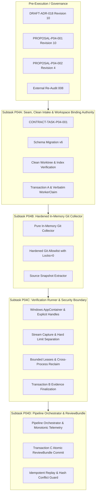

# PLAN-P04: Evidence & Review Engine Implementation & Governance Plan

> **Plan ID**: `PLAN-P04-EVIDENCE-REVIEW`
> **Revision**: 10
> **Status**: DRAFT (`REVISION_10_REQUIRED` / Remediated to Revision 10)
> **Date**: 2026-09-26
> **Audited Baseline**: `6dbd7e26d59e22171271921b86c01bd6f215e59a`
> **Active Gate**: `P04_PRECONTRACT_ARCHITECTURE_REMEDIATION_9`
> **Author**: AI Engineering Supervisor Architecture Team
> **Governing ADR**: `docs/adr/DRAFT-ADR-018-evidence-review-and-verification-isolation.md` (Revision 10)
> **Related Proposals**: `docs/proposals/PROPOSAL-P04-001-evidence-review-engine-boundaries.md` (Revision 10), `docs/proposals/PROPOSAL-P04-002-review-bundle-latency-semantics.md` (Revision 4)
> **External Audit Tracking**: Remediates Findings `P04-ARCH-R9-001` through `P04-ARCH-R9-006` (`docs/audits/P04_PRECONTRACT_ARCHITECTURE_EXTERNAL_REAUDIT_008.md`).

---

## 1. Overview and Phasing Strategy

Phase P04 implements the **Evidence & Review Engine**, providing independent, tamper-proof verification of AI worker outputs under canonical architecture (`docs/04_ARCHITECTURE.md` Section 7) and requirements (`docs/02_REQUIREMENTS.md`).

### 1.1. Execution Flowchart & Subtask Dependency Graph

### 1.2. Key Architectural Invariants
1. **Verbatim WorkerClaim Preservation & Schema Mapping (P04-ARCH-R9-001)**:
   - Worker reported head SHA is stored verbatim (`LENGTH BETWEEN 7 AND 40`).
   - `actual_head_sha` belongs strictly to Evidence, never in `worker_claims`.
   - Explicit mapping: WorkerReport -> canonical WorkerClaim object -> ReviewBundle `worker_claims`.
   - Go schema validation and RFC 8785 JCS canonicalization before insertion.
2. **Crash-Safe Non-Deadlocking Latency Semantics (P04-ARCH-R9-002)**:
   - Four timestamp concepts: pre-commit write timestamp, WAL commit completion, monotonic in-process duration, durable wall-clock diagnostic.
   - Elimination of `CHECK <= 3000` persistence blocker.
   - Persist `nfr008_met` (0/1) and `latency_measurement_status`. SLA miss is diagnostic; task advances to `REVIEWING`.
3. **Stream Capture & Hard Safety Limit Separation (P04-ARCH-R9-003)**:
   - Separate capture limit (10 MB disk) from hard safety limit (50 MB termination).
   - Track `stream_state` ('COMPLETE_EOF', 'TRUNCATED_AT_CAPTURE_LIMIT', 'HARD_LIMIT_TERMINATED', 'TIMEOUT_ABORTED').
   - If terminated before EOF, `full_stream_sha256 = NULL`, `is_truncated = 1`.
4. **Clean Worktree & Index Guarantee (P04-ARCH-R9-004)**:
   - Intake fails closed if staged, unstaged, or untracked changes exist (`DIRTY_WORKTREE_DETECTED`).
   - Git allowlist includes `git status --porcelain=v1 -z --untracked-files=all` and `git diff-index --quiet HEAD --` under `GIT_OPTIONAL_LOCKS=0`.
5. **Bounded Lease Authority & Crash Recovery (P04-ARCH-R9-005)**:
   - Same-daemon: handle registry join. Daemon restart: P03 host lock exclusivity + `KILL_ON_JOB_CLOSE`. Unproven owners fail closed.
   - Checked 64-bit TTL arithmetic; max 20 requests; max 600s aggregate budget.
6. **TaskState Replay & Conflict State Matrix (P04-ARCH-R9-006)**:
   - State matrix: compile failure retains `EVIDENCE_READY`; idempotent replay retains `REVIEWING`; hash conflict retains `REVIEWING` with `REVIEW_BUNDLE_COMPILATION_REJECTED` (`BUNDLE_HASH_CONFLICT`) audit failure; orphaned bundle triggers invariant violation.

---

## 2. Decoupling of Historical Proof Track & Runtime Validation

Phase P04 strictly maintains the two-track validation discipline:
1. **Automated CI / Test Suite Track**:
   - Pure in-memory unit and integration tests verifying schema migrations, DDL constraints, state transitions, JCS serialization, and error branches.
   - Executes across all development environments and automated test runners.
2. **Real Windows OS Security Boundary Track**:
   - Integration tests executing actual `CreateProcessW` calls with `STARTUPINFOEXW`, `PROC_THREAD_ATTRIBUTE_HANDLE_LIST`, `PROC_THREAD_ATTRIBUTE_JOB_LIST`, and AppContainer SIDs on physical Windows hosts.
   - Validates that DACLs deny unauthorized file access, network traffic is blocked, and processes cannot break out of Job Objects.

---

## 3. Work Breakdown Structure (Subtasks P04A – P04D)

### 3.1. Subtask P04A: Dispatch Seam, Clean Intake & Workspace Binding Authority
- **Objective**: Implement workspace binding creation prior to dispatch and Transaction A report intake upon worker completion.
- **Scope**:
  - Implement Schema Migration v6 (`attempt_workspace_bindings`, `worker_claims`).
  - Implement pre-intake cleanliness probe: invoke `git status --porcelain=v1 -z --untracked-files=all` and `git diff-index --quiet HEAD --` with `GIT_OPTIONAL_LOCKS=0`.
  - Abort immediately with `DIRTY_WORKTREE_DETECTED` if any staged, unstaged, or untracked changes exist.
  - Implement `WorkerReport` schema validation via Go JSON schema engine.
  - Implement RFC 8785 JCS canonicalization.
  - Store verbatim `reported_head_sha` (`CHECK (LENGTH BETWEEN 7 AND 40)`).
  - Update `attempt_workspace_bindings` to `RETAINED_FOR_VERIFICATION`.
  - Atomically transition `tasks.state`: `RUNNING -> REPORT_READY`.
- **Target Schema**: Migration v6.

### 3.2. Subtask P04B: Hardened Git Evidence Collector (Pure In-Memory)
- **Objective**: Implement in-memory Git evidence collection and immutable source snapshot extraction.
- **Scope**:
  - Enforce hardened Git allowlist with `GIT_OPTIONAL_LOCKS=0`.
  - Implement tree walk snapshot extraction using `git ls-tree -rz --full-tree` and `git cat-file --batch`.
  - Apply read-only ACLs to snapshot directory (`GENERIC_READ | GENERIC_EXECUTE`).
  - Resolve linked worktree index paths via `git rev-parse --git-path index`.
  - Collect `actual_base_sha`, `actual_head_sha`, `actual_changed_files`, and `diff_stat`.
- **Dependencies**: Subtask P04A.

### 3.3. Subtask P04C: Verification Runner & Security Boundary (Pure In-Memory)
- **Objective**: Execute verification test commands inside isolated Windows AppContainers and finalize verification evidence.
- **Scope**:
  - Implement Windows process creation with `bInheritHandles = TRUE`, explicit handle attribute lists (`PROC_THREAD_ATTRIBUTE_HANDLE_LIST`), and atomic Job Object assignment (`PROC_THREAD_ATTRIBUTE_JOB_LIST`).
  - Enforce bounded TTL arithmetic: reject contracts with > 20 requests or > 600s aggregate budget.
  - Implement stream capture with separation between capture limit (10 MB) and hard safety limit (50 MB).
  - Record `stream_state` and set `full_stream_sha256 = NULL` when terminated before EOF.
  - Execute Transaction B: commit `evidence_sets`, commit `review_artifacts`, release verification lease, transition `tasks.state`: `REPORT_READY -> EVIDENCE_READY`.
- **Target Schema**: Migration v9.
- **Dependencies**: Subtask P04B.

### 3.4. Subtask P04D: Pipeline Orchestrator, Artifact Store & ReviewBundle
- **Objective**: Synthesize RFC 8785 JCS canonical ReviewBundle, compute bundle hash, enforce non-deadlocking latency diagnostics, and commit Transaction C.
- **Scope**:
  - Read `evidence_sets` and `review_artifacts` from SQLite.
  - Synthesize canonical `ReviewBundle` JSON payload.
  - Compute SHA-256 bundle hash.
  - Record `evidence_committed_at_epoch_ms`, `bundle_committed_at_epoch_ms`, `compilation_latency_ms`, `latency_measurement_status`, and `nfr008_met`.
  - Implement TaskState replay and conflict state matrix:
    * Compile failure: Transaction C rolls back, task remains `EVIDENCE_READY`, emits `REVIEW_BUNDLE_COMPILATION_REJECTED`.
    * Idempotent replay: Returns existing bundle, task remains `REVIEWING`.
    * Hash conflict: Tampering conflict, task remains `REVIEWING`, Transaction C rolls back, emits `REVIEW_BUNDLE_COMPILATION_REJECTED` (`BUNDLE_HASH_CONFLICT`), escalates to human supervisor.
  - Execute Transaction C atomically: insert `review_bundles`, insert proposed audit event `REVIEW_BUNDLE_GENERATED`, transition `tasks.state`: `EVIDENCE_READY -> REVIEWING`.
- **Dependencies**: Subtask P04C.

---

## 4. Crash Consistency & Replay Matrix

| Failure Point | State Before Crash | Recovery Action on Restart | Resulting State |
| :--- | :--- | :--- | :--- |
| Crash during worker execution | `RUNNING` | P03 host recovery detects unconfirmed worker; lease expired | `BLOCKED` / `FAILED` |
| Dirty worktree at report intake | `RUNNING` | Transaction A aborted; `DIRTY_WORKTREE_DETECTED` logged | `RUNNING` (or `FAILED`) |
| Crash after Transaction A | `REPORT_READY` | Lease reclaim: daemon restart recovery via host lock & `KILL_ON_JOB_CLOSE` | `REPORT_READY` (Reclaimable) |
| Verification process exceeds 50 MB hard limit | `REPORT_READY` | Process terminated; `stream_state = 'HARD_LIMIT_TERMINATED'`, `full_stream_sha256 = NULL` | `REPORT_READY` -> `EVIDENCE_READY` |
| Crash after Transaction B | `EVIDENCE_READY` | Orchestrator synthesizes ReviewBundle; records `latency_measurement_status = 'RECOVERED_AFTER_RESTART'`, `nfr008_met = 0` | `REVIEWING` (No deadlock) |
| Transaction C compilation delay > 3.0s | `EVIDENCE_READY` | Transaction C commits with `nfr008_met = 0`, logs diagnostic SLA finding | `REVIEWING` (No deadlock) |
| ReviewBundle replay with identical hash | `REVIEWING` | Idempotent return of existing ReviewBundle | `REVIEWING` (Preserved) |
| ReviewBundle replay with conflicting hash | `REVIEWING` | Integrity conflict logged; Transaction C aborted; human escalation | `REVIEWING` (Preserved) |

---

## 5. Requirement Reconciliation Matrix

| Requirement | Canonical Spec Source | Reconciliation Status in Phase P04 |
| :--- | :--- | :--- |
| **FR-008** | `docs/02_REQUIREMENTS.md` | Fully satisfied via independent in-memory Git and verification collectors. |
| **NFR-008** | `docs/02_REQUIREMENTS.md` | Formally reconciled via PROPOSAL-P04-002 Revision 4 into two-interval latency semantics with crash-safe non-deadlocking persistence. Canonical update pending approval. |
| **P04 Schema v6** | `docs/adr/DRAFT-ADR-018` | Introduces `attempt_workspace_bindings` and `worker_claims` (verbatim 7-40 hex SHA). |
| **P04 Schema v9** | `docs/adr/DRAFT-ADR-018` | Introduces `verification_leases`, `evidence_sets`, `review_artifacts`, and `review_bundles` with stream states and non-deadlocking latency metrics. |
