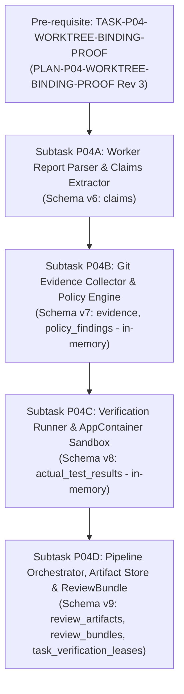

# PLAN: Phase P04 — Evidence & Review Engine Execution Plan

- **Plan ID:** `PLAN-P04-EVIDENCE-REVIEW`
- **Revision:** 5 (Remediation of External Re-Audit 003)
- **Status:** `PLANNING_PENDING_EXTERNAL_AUDIT`
- **Target Phase:** Phase P04 — Evidence & Review Engine
- **Governing Proposal:** [`docs/proposals/PROPOSAL-P04-001-evidence-review-engine-boundaries.md`](../proposals/PROPOSAL-P04-001-evidence-review-engine-boundaries.md) (Revision 5)
- **Governing Architecture:** [`docs/adr/DRAFT-ADR-018-evidence-review-and-verification-isolation.md`](../adr/DRAFT-ADR-018-evidence-review-and-verification-isolation.md) (Revision 5)
- **Pre-requisite Proof Plan:** [`docs/plans/PLAN-P04-WORKTREE-BINDING-PROOF.md`](PLAN-P04-WORKTREE-BINDING-PROOF.md) (Revision 3)
- **Pre-requisite Draft Contract:** [`docs/tasks/DRAFT_TASK_CONTRACT_P04_WORKTREE_BINDING_PROOF.md`](../tasks/DRAFT_TASK_CONTRACT_P04_WORKTREE_BINDING_PROOF.md) (`NOT_RELEASED`, Model A Draft Lineage, Rev 1 draft)
- **Audit References:**
  - [`docs/audits/P04_PRECONTRACT_ARCHITECTURE_EXTERNAL_REAUDIT_003.md`](../audits/P04_PRECONTRACT_ARCHITECTURE_EXTERNAL_REAUDIT_003.md) (`REVISION_4_REQUIRED`)
  - [`docs/audits/P04_PRECONTRACT_ARCHITECTURE_EXTERNAL_AUDIT_001_ERRATUM_003.md`](../audits/P04_PRECONTRACT_ARCHITECTURE_EXTERNAL_AUDIT_001_ERRATUM_003.md) (`FORMALLY_RECORDED`)
  - [`docs/audits/P04_PRECONTRACT_ARCHITECTURE_EXTERNAL_REAUDIT_002.md`](../audits/P04_PRECONTRACT_ARCHITECTURE_EXTERNAL_REAUDIT_002.md) (`REVISION_3_REQUIRED`)
  - [`docs/audits/P04_PRECONTRACT_ARCHITECTURE_EXTERNAL_AUDIT_001_ERRATUM_002.md`](../audits/P04_PRECONTRACT_ARCHITECTURE_EXTERNAL_AUDIT_001_ERRATUM_002.md) (`SUPERSEDED_BY_ERRATUM_003`)
  - [`docs/audits/P04_PRECONTRACT_ARCHITECTURE_EXTERNAL_REAUDIT_001.md`](../audits/P04_PRECONTRACT_ARCHITECTURE_EXTERNAL_REAUDIT_001.md) (`REVISION_2_REQUIRED`)
  - [`docs/audits/P04_PRECONTRACT_ARCHITECTURE_EXTERNAL_AUDIT_001.md`](../audits/P04_PRECONTRACT_ARCHITECTURE_EXTERNAL_AUDIT_001.md) (`REVISION_1_REQUIRED`)
- **Author:** AI Engineering Supervisor Control Plane Team
- **Governance Authority:** [`docs/24_CHANGE_GOVERNANCE.md`](../24_CHANGE_GOVERNANCE.md)
- **Active Gate:** `P04_PRECONTRACT_ARCHITECTURE_REMEDIATION_4`

---

## 1. Overview and Phasing Strategy

Phase P04 implements the Evidence & Review Engine, translating untrusted worker reports and workspace changes into authoritative, inspectable `ReviewBundle` artifacts for supervisor evaluation.

Execution is strictly phased into a pre-requisite proof task followed by four sequential subtasks (P04A..P04D):



---

## 2. Pre-requisite: Bounded Worktree Authority Proof

- **Task ID:** `TASK-P04-WORKTREE-BINDING-PROOF`
- **Plan Reference:** [`docs/plans/PLAN-P04-WORKTREE-BINDING-PROOF.md`](PLAN-P04-WORKTREE-BINDING-PROOF.md) (Revision 3)
- **Contract Reference:** [`docs/tasks/DRAFT_TASK_CONTRACT_P04_WORKTREE_BINDING_PROOF.md`](../tasks/DRAFT_TASK_CONTRACT_P04_WORKTREE_BINDING_PROOF.md) (`NOT_RELEASED`, Model A Draft Lineage, Rev 1 draft)
- **Objectives:**
  1. Inspect `backend/internal/adapters/workspace/gitworktree/workspace.go` at pinned AO commit `15e9ea971f1711ec8b50e157d6eb300db6cbe0d6` in canonical repository `Untrivial-ai/agent-orchestrator` with verified official permalinks and single line citations (rectified in Erratum 003).
  2. Execute isolated disposable runtime proof with dual worker sessions capturing server-generated session IDs (`resp.Session.ID`).
  3. Verify deterministic worktree path preservation across restart and restore using official wire contracts:
     - Session kill strictly via `POST /api/v1/sessions/{id}/kill` (HTTP 200, valid `wireKillSessionResponse`);
     - Bounded polling `GET /api/v1/sessions/{id}` until canonical terminal state (`isTerminated=true`);
     - Disposable daemon restart;
     - Restore strictly via `POST /api/v1/sessions/{id}/restore` (HTTP 200, matching session identity & `restoreMode`).
  4. Execute missing-directory negative probe: kill Session 2, confirm terminal state, delete disposable worktree directory under verified proof root, call restore, characterize recreate (lines 1069–1111) vs error.
  5. Enforce OS handle-based, component-boundary containment (`SUPERVISOR_STATE_ROOT` handle, volume serial, `FILE_ID_INFO`, `filepath.Rel` component-boundary check, non-existent child nearest ancestor handle, re-validation before cleanup, `.supervisor-owner-marker.json` with random run ID and ownership nonce).
  6. Formally determine worktree authority (Determination A, B, or C).

---

## 3. Subtask Decomposition (P04A through P04D)

### 3.1. Subtask P04A: Worker Report Parser & Claims Extractor
- **Goal:** Parse `<worktree>/worker-report.json`, enforce schema validation against `docs/schemas/worker-report.schema.json`, verify attempt identity, and extract `WorkerClaim` entities.
- **Components:** `internal/evidence/report_parser.go`, unit test suite.
- **Migration:** Schema v6 (`claims`).

### 3.2. Subtask P04B: Git Evidence Collector & Policy Engine (Model 1: In-Memory)
- **Goal:** Collect independent Git diffs, evaluate `DESCENDANT_OR_EQUAL_POLICY` and `MERGE_COMMITS_FORBIDDEN`, check TaskContract scope compliance (`allowed_scope` vs `forbidden_scope`).
- **Atomicity Invariant:** Pure in-memory execution; performs **zero SQLite writes**. Returns `GitEvidenceResult` and `PolicyEvaluationResult`.
- **Components:** `internal/evidence/git_collector.go`, `policy_engine.go`.
- **Migration:** Schema v7 (`evidence`, `policy_findings`).

### 3.3. Subtask P04C: Verification Runner & Isolation Sandbox (Model 1: In-Memory)
- **Goal:** Execute verification commands specified in the TaskContract using typed profiles in `VerificationPolicyCatalog`.
- **Isolation Architecture:**
  * Absolute attempt sandbox root: `<SUPERVISOR_STATE_ROOT>\\sandboxes\\<attempt_id>\\`.
  * Pre-operation containment verification using OS handle comparison and component-boundary checks ensuring paths are outside all Git worktrees, primary repository, AO live database, and recovery directory.
  * Windows non-interactive Window Station + Desktop isolation (`CreateWindowStationW` + `CreateDesktopW`).
  * Read-only audited worktree; toolchain write variables (`TEMP`, `TMP`, `GOCACHE`, `GOPATH`) redirected into the external sandbox.
  * Disposable source snapshot for modifying tests.
  * Pinned AO inert harness requirement (`DESIGN_BLOCKER_P04_INERT_AO_HARNESS = OPEN`).
- **Atomicity Invariant:** Pure in-memory execution; performs **zero SQLite writes**. Returns `TestExecutionResult`.
- **Components:** `internal/evidence/verifier.go`, `sandbox_windows.go`.
- **Migration:** Schema v8 (`actual_test_results`).

### 3.4. Subtask P04D: Pipeline Orchestrator, Durable Artifact Store & ReviewBundle
- **Goal:** Orchestrate the end-to-end evidence collection pipeline, persist durable content-addressed artifacts, execute single atomic CAS transaction, and assemble `ReviewBundle`.
- **Pre-Command Reservation Lease (Durable Monotonic Fencing):**
  * Acquires lease in `task_verification_leases` (Schema v9) with an incremented `fencing_token`.
  * Row is **never deleted** on release; state transitions between `ACTIVE` and `RELEASED`, preventing ABA token reset.
  * Timestamps recorded as numeric Unix epoch milliseconds (`expires_at_epoch_ms INTEGER`).
  * Lease acquisition verifies: `tasks.state = 'REPORT_READY'`, `current_attempt` matching `task_attempts.attempt_number`, valid lineage, attempt not superseded.
  * Losers are denied execution; zero external commands executed.
- **Durable Artifact Store (Immutable & Coordinated GC):**
  * Canonical path: `<SUPERVISOR_STATE_ROOT>\\artifacts\\<captured_sha256>`.
  * Table `review_artifacts` references `task_attempts(attempt_id)` with `ON DELETE RESTRICT` (NO `CASCADE`).
  * SQLite triggers prevent `UPDATE` and `DELETE` on `review_artifacts` rows.
  * Retrieval re-hashes stored bytes and verifies `captured_sha256`.
  * Coordinated GC protocol: exclusive lease, DB transaction reference check, atomic rename to `.quarantine/`, 24h grace period, writer synchronization.
- **Single Final Atomic SQLite CAS Transaction:**
  * Opens single SQLite transaction:
    1. Verifies lease fencing token is valid, active, and unexpired;
    2. Inserts `evidence`, `policy_findings`, `actual_test_results`, `review_artifacts`, `review_bundles`, `task_audit_events`;
    3. Updates `task_verification_leases` state to `RELEASED`;
    4. Executes CAS update on `tasks.state`:
       ```sql
       UPDATE tasks
       SET state = 'EVIDENCE_READY',
           updated_at = ?
       WHERE task_id = ?
         AND state = 'REPORT_READY'
         AND current_attempt = ?;
       ```
  * Note: `task_attempts` has no status column; the state transition belongs strictly to `tasks.state`.
- **ReviewBundle Deterministic Hashing:** Formalized under **RFC 8785 (JCS)**.
- **Components:** `internal/evidence/orchestrator.go`, `artifact_store.go`, `bundle_builder.go`.
- **Migration:** Schema v9 (`review_artifacts`, `review_bundles`, `task_verification_leases`).

---

## 4. Crash Consistency Matrix

| Boundary | Staging Path | Canonical Store | SQLite State | Startup / Recovery Action |
|---|---|---|---|---|
| **1. Before write** | None | None | Clean | Attempt failed cleanly |
| **2. During write / pre-fsync** | Incomplete `.staging/<uuid>` | None | Clean | Coordinated GC removes stale staging file after grace period |
| **3. Post-fsync / pre-rename** | Complete `.staging/<uuid>` | None | Clean | Coordinated GC removes stale staging file after grace period |
| **4. Post-rename / pre-DB** | None | `<captured_sha256>` | Clean | Orphan file; Coordinated GC renames to quarantine after 24h grace period |
| **5. During DB transaction** | None | `<captured_sha256>` | WAL uncommitted | WAL rolls back; orphan file handled by coordinated GC |

---

## 5. Requirement Reconciliation Matrix

| Requirement | Source Document | Architecture Mapping | Status |
|---|---|---|---|
| `REQ-EVID-001` (Worker Report Schema) | `docs/02_REQUIREMENTS.md` | Subtask P04A (`report_parser.go`) | Planned (Schema v6) |
| `REQ-EVID-002` (Independent Git Diffs) | `docs/02_REQUIREMENTS.md` | Subtask P04B (`git_collector.go`) | Planned (Schema v7) |
| `REQ-EVID-003` (Policy Evaluation) | `docs/02_REQUIREMENTS.md` | Subtask P04B (`policy_engine.go`) | Planned (Schema v7) |
| `REQ-EVID-004` (Verification Runner Sandbox) | `docs/02_REQUIREMENTS.md` | Subtask P04C (`verifier.go`, `sandbox_windows.go`) | Planned (Schema v8) |
| `REQ-EVID-005` (Content-Addressed Store) | `docs/02_REQUIREMENTS.md` | Subtask P04D (`artifact_store.go`) | Planned (Schema v9) |
| `REQ-EVID-006` (Durable Monotonic Lease Fencing) | ADR-018 Rev 5 / Re-Audit 003 | Subtask P04D (`orchestrator.go`) | Planned (Schema v9) |
| `REQ-EVID-007` (ReviewBundle Hash RFC 8785) | ADR-018 Rev 5 / Re-Audit 003 | Subtask P04D (`bundle_builder.go`) | Planned (Schema v9) |

---

## 6. Governance Tracking

- **PROPOSAL-P04-001:** Revision 5 submitted (`REVISION_4_REQUIRED`)
- **DRAFT-ADR-018:** Revision 5 submitted (`REVISION_4_REQUIRED`)
- **PLAN-P04-EVIDENCE-REVIEW:** Revision 5 submitted (`REVISION_4_REQUIRED`)
- **PLAN-P04-WORKTREE-BINDING-PROOF:** Revision 3 submitted (`REVISION_2_REQUIRED`)
- **DRAFT_TASK_CONTRACT_P04_WORKTREE_BINDING_PROOF:** Model A Draft Lineage, Rev 1 draft (`NOT_RELEASED`)
- **Active Gate:** `P04_PRECONTRACT_ARCHITECTURE_REMEDIATION_4`
