# PLAN-P04: Evidence & Review Engine Implementation & Governance Plan

> **Plan ID**: `PLAN-P04-EVIDENCE-REVIEW`
> **Revision**: 12
> **Status**: DRAFT (`REVISION_12_REQUIRED` / Remediated to Revision 12)
> **Date**: 2026-09-26
> **Audited Baseline**: `6e1993da150031a9465901a7019c71257de44312`
> **Active Gate**: `P04_PRECONTRACT_ARCHITECTURE_REMEDIATION_11`
> **Author**: AI Engineering Supervisor Architecture Team
> **Governing ADR**: `docs/adr/DRAFT-ADR-018-evidence-review-and-verification-isolation.md` (Revision 12)
> **Related Proposals**: `docs/proposals/PROPOSAL-P04-001-evidence-review-engine-boundaries.md` (Revision 12), `docs/proposals/PROPOSAL-P04-002-review-bundle-latency-semantics.md` (Revision 6)
> **External Audit Tracking**: Remediates Findings `P04-ARCH-R11-001` through `P04-ARCH-R11-004` (`docs/audits/P04_PRECONTRACT_ARCHITECTURE_EXTERNAL_REAUDIT_010.md`).

---

## 1. Overview and Phasing Strategy

Phase P04 implements the **Evidence & Review Engine**, providing independent, tamper-proof verification of AI worker outputs under canonical architecture (`docs/04_ARCHITECTURE.md` Section 7) and requirements (`docs/02_REQUIREMENTS.md`).

### 1.1. Execution Flowchart & Subtask Dependency Graph

```mermaid
flowchart TD
    subgraph PreExecution [Pre-Execution / Governance]
        ADR18[DRAFT-ADR-018 Revision 12]
        PROP1[PROPOSAL-P04-001 Revision 12]
        PROP2[PROPOSAL-P04-002 Revision 6]
        Audit010[External Re-Audit 010]
    end

    subgraph P04A [Subtask P04A: Intake & Workspace Validation]
        T1[Schema Migration v6]
        T2[Verbatim Claim Mapping]
        T3[Clean Worktree & Index Check]
        T4[Transaction A: RUNNING -> REPORT_READY]
        T5[Dirty Worktree Rollback & Isolated Diagnostic Audit]
    end

    subgraph P04B [Subtask P04B: Hardened Git Collector]
        T6[Git Read-Only Command Allowlist]
        T7[Immutable Commit Snapshot Provisioning]
        T8[Pure In-Memory GitEvidence Output - ZERO DB Writes]
    end

    subgraph P04C [Subtask P04C: Isolated Test Runner]
        T9[Windows AppContainer Process Isolation]
        T10[Handle Whitelisting & Network Denial]
        T11[Pure In-Memory TestEvidence Output - ZERO DB Writes]
    end

    subgraph P04D [Subtask P04D: Pipeline Orchestrator & CAS Persistence]
        T12[Schema Migration v9: Leases, Sets, Artifacts, Bundles]
        T13[Append-Only Lease History & Partial Unique Index]
        T14[Transaction B: REPORT_READY -> EVIDENCE_READY]
        T15[ReviewBundle Assembly Diagnostic & RFC 8785 Canonicalization]
        T16[Transaction C: EVIDENCE_READY -> REVIEWING]
        T17[Post-Commit In-Process Monotonic Telemetry]
    end

    PreExecution --> P04A
    P04A --> P04B
    P04B --> P04C
    P04C --> P04D
```

---

## 2. Subtask Breakdown & Implementation Scope

### 2.1. Subtask P04A: Report Intake, Workspace Verification & Schema v6
- **Persistence Ownership**: Schema Migration v6 (`attempt_workspace_bindings` and `worker_claims`).
- **Scope**:
  1. Validate worker report JSON against `docs/schemas/worker-report.schema.json`.
  2. Map `reported_head_sha` verbatim (accepts 7-40 hex characters).
  3. Validate physical workspace handle (`FileIdInfo` volume serial and file ID).
  4. Validate clean index and working tree via `git rev-parse --absolute-git-dir` and `git status --porcelain=v1 --untracked-files=all`.
  5. Commit Transaction A (`RUNNING -> REPORT_READY`), binding workspace and persisting `WorkerClaim`.
  6. **Dirty Worktree Rollback**: On dirty worktree, Transaction A rolls back completely and task state remains `RUNNING`. Diagnostic audit event `EVIDENCE_COLLECTION_FAILED` is appended in a separate diagnostic transaction after rollback using an idempotency key (`audit:<attempt_id>:DIRTY_WORKTREE_DETECTED`).

### 2.2. Subtask P04B: Hardened Read-Only Git Evidence Collector
- **Persistence Ownership**: Pure in-memory collector with **ZERO SQLite writes**.
- **Scope**:
  1. Execute strictly read-only Git commands from hardened allowlist (`git rev-parse`, `git ls-tree`, `git cat-file`, `git diff`, `git log`, `git merge-base`).
  2. Provision read-only snapshot `<SUPERVISOR_STATE_ROOT>/snapshots/<attempt_id>/` from verified HEAD commit.
  3. Extract changed files list, exact byte diffs, commit ancestry, and scope containment against `allowed_scope`.
  4. Return in-memory `GitEvidence` entity.

### 2.3. Subtask P04C: Isolated Verification Runner & AppContainer Boundary
- **Persistence Ownership**: Pure in-memory execution engine with **ZERO SQLite writes**.
- **Scope**:
  1. Spawn verification commands strictly inside isolated Windows AppContainers.
  2. Restrict process handle inheritance to explicit stdin/stdout/stderr pipes; enforce network isolation (`NoNetwork`).
  3. Stream stdout and stderr with capture limit (10 MB) and hard safety limit (50 MB) using bounded overflow reader (`hard + 1` bytes).
  4. Compute exit codes, stream states (`COMPLETE_EOF`, `TRUNCATED_AT_CAPTURE_LIMIT`, `HARD_LIMIT_TERMINATED`, `TIMEOUT_ABORTED`), and artifact hashes.
  5. Return in-memory `TestEvidence` and artifact payloads.

### 2.4. Subtask P04D: Pipeline Orchestrator, Append-Only Leases & CAS Persistence
- **Persistence Ownership**: **SOLE SQLite persistence authority** for Schema Migration v9 (`task_verification_leases`, `evidence_sets`, `review_artifacts`, `review_bundles`).
- **Scope**:
  1. Manage append-only verification leases: `lease_id PRIMARY KEY`, partial unique index ensuring single active lease, CAS terminal transitions, and atomic reclaim.
  2. Transaction B (`REPORT_READY -> EVIDENCE_READY`): Commit `evidence_sets` and `review_artifacts`, mark active lease `COMPLETED`, persist pre-commit application timestamp `evidence_finalized_at_epoch_ms`.
  3. Stage and flush content-addressed artifacts to `artifacts/<first-two-hex>/<captured_sha256>` with exact path equality.
  4. Synthesize ReviewBundle payload, perform RFC 8785 JCS canonicalization, compute bundle hash, and mark pre-commit timestamp `bundle_assembled_at_epoch_ms`.
  5. Compute ReviewBundle assembly diagnostic: `compilation_latency_ms = bundle_assembled_at_epoch_ms - evidence_finalized_at_epoch_ms`.
  6. Transaction C (`EVIDENCE_READY -> REVIEWING`): Atomically insert `review_bundles` with `nfr008_compliance_status = 'UNVERIFIED'`, insert proposed audit event `REVIEW_BUNDLE_GENERATED` (without `commit_duration_ms`), and advance task state to `REVIEWING`.
  7. Post-commit telemetry: Compute in-process monotonic `commit_duration_ms` after commit returns, purely as best-effort in-process telemetry.
  8. Invariant mismatch handling: Preserve current TaskState; close admission; require human supervisor reconciliation (`HUMAN_SUPERVISOR_RECONCILIATION_REQUIRED`).

---

## 3. Crash, Replay & Concurrent Lease Reclaim Matrix

| Scenario | Trigger / Event | Preconditions | Database Action | Outcome & Invariants |
| :--- | :--- | :--- | :--- | :--- |
| **Normal Acquisition** | Report validated | Attempt in `REPORT_READY` | `INSERT INTO task_verification_leases (..., state='ACTIVE', token=1)` | Success. Single active lease guaranteed by partial unique index. |
| **Concurrent Acquisition Race** | Duplicate worker run | Another worker attempts lease | `INSERT INTO task_verification_leases (..., state='ACTIVE')` | **Rejected**. Unique index conflict on `idx_leases_single_active_attempt`. |
| **Normal Completion** | Verification done | Active lease, before TTL | `UPDATE ... SET state='COMPLETED', released_at=? WHERE state='ACTIVE' AND worker_id=?` | Success. Lease terminal `COMPLETED`. Next stage unlocked. |
| **Lease Expiration** | Hang / Timeout | Wall clock exceeds `expires_at` | `UPDATE ... SET state='EXPIRED', released_at=? WHERE state='ACTIVE'` | Success. Lease marked `EXPIRED`. Active lease slot vacated. |
| **Atomic Reclaim** | Reclaimer runs | Predecessor `EXPIRED`, worker dead | Tx: `UPDATE ... SET state='RECLAIMED'` then `INSERT ... state='ACTIVE', token=token+1, pred=old_id` | Success. Predecessor becomes `RECLAIMED`; new lease becomes `ACTIVE`. |
| **Concurrent Reclaim Race** | Multiple reclaimers | Predecessor `EXPIRED` | Both attempt `UPDATE ... SET state='RECLAIMED' WHERE state='EXPIRED'` | First commits; second sees 0 rows affected and aborts without duplicate. |
| **Late Stalled Worker Write**| Worker wakes up | Old token, lease reclaimed | `UPDATE ... WHERE lease_id=? AND state='ACTIVE' AND token=old_token` | **Zero rows updated**. Stalled worker detects CAS failure and aborts. |
| **Crash & Restart** | Daemon restarts | Crash during `ACTIVE` lease | Recovery scan detects expired lease or dead worker PID | Scanner marks `EXPIRED`. Allows subsequent clean atomic reclaim. |

---

## 4. Stream Limits & State Precedence Matrix

### 4.1. Limit Invariants
- `capture_limit_bytes`: 10 MB (10,485,760 bytes).
- `hard_safety_limit_bytes`: 50 MB (52,428,800 bytes).
- Invariant: `CHECK (hard_safety_limit_bytes > capture_limit_bytes)` enforced at DB layer.

### 4.2. Overflow Reader Algorithm & Precedence
- Reader reads up to at most `hard_safety_limit_bytes + 1` bytes with overflow guard.
- **Precedence 1 (Hard Limit Breach)**: If total observed bytes reaches `hard + 1`, terminate process immediately -> `HARD_LIMIT_TERMINATED` (`total = hard + 1`, `captured = capture`, `is_truncated = 1`, `full_stream_sha256 = NULL`).
- **Precedence 2 (Timeout Abort)**: If timeout expires before EOF and `total <= hard` -> `TIMEOUT_ABORTED` (`total <= hard`, `captured = MIN(total, capture)`, `is_truncated = 1`, `full_stream_sha256 = NULL`).
- **Precedence 3 (Clean EOF)**:
  * `total <= capture` -> `COMPLETE_EOF` (`captured = total`, `is_truncated = 0`, `full_stream_sha256 = captured_sha256 IS NOT NULL`).
  * `capture < total <= hard` -> `TRUNCATED_AT_CAPTURE_LIMIT` (`captured = capture`, `is_truncated = 1`, `full_stream_sha256 IS NOT NULL`).

---

## 5. ReviewBundle Latency Semantics & Traceability Matrix

| Requirement | Implementation Mechanism | Enforcement Layer | Status |
| :--- | :--- | :--- | :--- |
| **FR-008 (Independent Evidence)** | Hardened Git collector (P04B) & AppContainer test runner (P04C) | Pipeline Orchestrator | **DESIGN_ALIGNED** |
| **NFR-008 (Latency Governance)** | ReviewBundle assembly diagnostic (`compilation_latency_ms`); `nfr008_compliance_status = 'UNVERIFIED'` | SQLite CHECK Constraint | **ENFORCED** |
| **Model 1 Persistence** | P04A owns v6; P04B/C in-memory only; P04D owns v9 & CAS | Subtask Division | **ENFORCED** |
| **Append-Only Leases** | `lease_id PRIMARY KEY`, partial unique index on `ACTIVE` | SQLite Schema v9 | **ENFORCED** |
| **Stream Limits Inequality** | `CHECK (hard_safety_limit_bytes > capture_limit_bytes)` | SQLite Schema v9 | **ENFORCED** |
| **Telemetry Causality** | Monotonic `commit_duration_ms` measured post-commit only | Go In-Process Telemetry | **ENFORCED** |
| **State Preservation** | Invariant mismatch preserves TaskState; closes admission | Pipeline Orchestrator | **ENFORCED** |

---

## 6. Execution Pre-Conditions & Stop Policy

1. **Mandatory Audit Approval**: Implementation code for Subtask P04A cannot commence until External Supervisor formally approves `PROPOSAL-P04-001`, `PROPOSAL-P04-002`, and `DRAFT-ADR-018`.
2. **Task Contract Release**: A formally audited and released Task Contract `CONTRACT-TASK-P04-001` is strictly required before any Go files are authored.
3. **Execution Guardrails**:
   - `P04_CODE = HELD_PENDING_APPROVED_ARCHITECTURE_AND_TASK_CONTRACT`
   - `P05_CODE = NOT_AUTHORIZED`
   - `AUTOMATIC_RESTORE = DISABLED`
