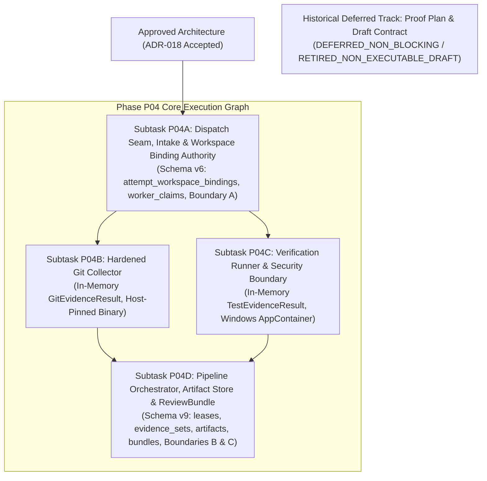

# PLAN: Phase P04 — Evidence & Review Engine Execution Plan

> **Plan ID**: `PLAN-P04-EVIDENCE-REVIEW`
> **Revision**: 8
> **Status**: `PLANNING_PENDING_EXTERNAL_AUDIT`
> **Date**: 2026-09-26
> **Audited Baseline**: `e7c57965ca8d85c0efa0b4f5b5dd409ce7387234`
> **Active Gate**: `P04_PRECONTRACT_ARCHITECTURE_REMEDIATION_7`
> **Supersedes**: `PLAN-P04-EVIDENCE-REVIEW` Revision 7
> **External Audit Tracking**: Remediates Findings `P04-ARCH-R7-001` through `P04-ARCH-R7-006` (`docs/audits/P04_PRECONTRACT_ARCHITECTURE_EXTERNAL_REAUDIT_006.md`).
> **Prerequisite Decoupling**: Unblocks Subtask P04A as the first releaseable subtask. The unexecutable proof contract is transitioned to a historical deferred non-blocking track (`RETIRED_NON_EXECUTABLE_DRAFT`). Operational binding validation is embedded directly as `WORKTREE_BINDING_RUNTIME_VALIDATION` in P04A and P04D.

---

## 1. Overview and Phasing Strategy

Phase P04 delivers the **Evidence & Review Engine**, responsible for independent verification of AI worker reports, automated collection of Git diffs and test results, tamper-proof artifact management, and synthesis of attempt-scoped `ReviewBundle` documents.

### 1.1. Execution Flowchart & Subtask Dependency Graph

### 1.2. Key Architectural Invariants
1. **P04A Unblocked**: Subtask P04A is the first releaseable task once architecture is approved.
2. **Two Decoupled Transactions for Worktree Binding**:
   - **Dispatch Binding Registration Transaction**: Materialized immediately after Agent Orchestrator prepares the physical worktree, integrated into P03 dispatch seam (`PrepareBoundDispatch` / `DISPATCH_BOUND`) before `RecordSendRequested`.
   - **Transaction A (Report Intake)**: Strictly reads and validates existing physical binding, persists `worker_claims` (Schema v6), and transitions `tasks.state`: `RUNNING -> REPORT_READY`. Transaction A never creates bindings.
3. **Inverted Relational Hierarchy**:
   - **Transaction B (Evidence Finalization)**: Persists durable `evidence_sets` and `review_artifacts(evidence_set_id)` (Schema v9), releases lease, transitions `REPORT_READY -> EVIDENCE_READY`. Evidence persistence is verified prior to state transition.
   - **Transaction C (ReviewBundle Compilation)**: Synthesizes RFC 8785 JCS canonical ReviewBundle, persists `review_bundles(evidence_set_id)` (Schema v9), records canonical `audit_events`, transitions `EVIDENCE_READY -> REVIEWING`.
4. **Authority Separation**: Subtasks P04B and P04C execute purely in memory; runtime SQLite write authority belongs exclusively to P04A (Dispatch Seam & Transaction A) and P04D (Transactions B & C).

---

## 2. Decoupling of Historical Proof Track & Runtime Validation (P04-ARCH-R7-001, R7-002)

1. **Retirement of Prerequisite Gate**: Pre-contract disposable worker runtime proof is inexecutable because upstream Agent Orchestrator (`15e9ea971f1711ec8b50e157d6eb300db6cbe0d6`, `backend/internal/domain/harness.go`) contains no inert harness in `AllHarnesses`. Modeling the proof contract as an unreleaseable prerequisite created an execution deadlock.
2. **Transition to Historical Deferred Track**:
   - `docs/plans/PLAN-P04-WORKTREE-BINDING-PROOF.md`: Preserved as `HISTORICAL_DEFERRED_NON_BLOCKING`.
   - `docs/tasks/DRAFT_TASK_CONTRACT_P04_WORKTREE_BINDING_PROOF.md`: Preserved as `RETIRED_NON_EXECUTABLE_DRAFT` (status invariant: `NOT_RELEASED`).
3. **Operational Runtime Verification**: Physical binding verification is performed during live execution via `WORKTREE_BINDING_RUNTIME_VALIDATION` inside P04A (Dispatch Seam & Intake) and P04D (Verification Orchestrator).

---

## 3. Work Breakdown Structure (Subtasks P04A – P04D)

### 3.1. Subtask P04A: Dispatch Seam, Intake & Workspace Binding Authority
- **Target Task Contract**: `TASK_CONTRACT_P04_001A`
- **Ownership**: Dispatch Binding Seam, Schema v6 Migration (`attempt_workspace_bindings`, `worker_claims`), Transaction Boundary A, OS Handle Management.
- **Deliverables**:
  1. **Dispatch Binding Registration Seam**:
     - Integrated into `internal/dispatch` and `internal/store` at `PrepareBoundDispatch` / `DISPATCH_BOUND` prior to `RecordSendRequested`.
     - Validates physical worktree handle, queries `FileIdInfo` (VolumeSerialNumber + 128-bit FileId), and records immutable `attempt_workspace_bindings`.
     - Hexadecimal normalization: `volume_serial_hex` (16 lowercase hex characters), `file_id_hex` (32 lowercase hex characters).
  2. **Schema v6 DDL**:
     - `attempt_workspace_bindings`: Primary key `attempt_id`, foreign keys to `tasks` and `task_contracts`, `session_id` and `terminal_generation` strings without foreign key coupling to mutable `worker_sessions(session_id)`. Lineage triggers ensure consistency with `task_attempts` and `dispatch_operations`. Immutable update/delete triggers.
     - `worker_claims`: Structured claim records (`CHANGED_FILES`, `TEST_RESULTS`, `IMPLEMENTATION_SUMMARY`, `UNVERIFIED_ASSUMPTION`), separating claims from raw worker report. Lineage triggers guard against cross-pairing.
  3. **Transaction Boundary A (Report Intake)**:
     - Invoked upon worker report submission.
     - Reads and verifies that `attempt_workspace_bindings` exists and matches physical handle identity.
     - Persists structured claims into `worker_claims`.
     - CAS state transition: `tasks.state`: `RUNNING -> REPORT_READY`.
  4. **OS Handle Identity Verification**:
     - Opens root directory handle with sharing flags `FILE_SHARE_READ | FILE_SHARE_WRITE` (strictly omitting `FILE_SHARE_DELETE`).
     - Revalidates identity immediately prior to CAS state transitions.
- **Traceability**: FR-008, SEC-001, SEC-005, NFR-007.

### 3.2. Subtask P04B: Hardened Git Evidence Collector (Pure In-Memory)
- **Target Task Contract**: `TASK_CONTRACT_P04_001B`
- **Ownership**: Pure in-memory Git data collection (`GitEvidenceResult`). Zero runtime SQLite writes.
- **Deliverables**:
  1. **Host-Pinned Binary Resolution**: Git binary resolved from host configuration (`SUPERVISOR_GIT_BIN`), version and SHA-256 hash verified against pinned values per NFR-007. Arbitrary `PATH` resolution prohibited.
  2. **Windows Configuration Isolation**: Dedicated trusted empty directory `<SUPERVISOR_STATE_ROOT>/trusted_empty_git/` with empty config and empty hooks directory. Strictly zero use of Unix null device path syntax.
  3. **Mandatory CLI Flags & Invocations**:
     - Every Git invocation passes `-c core.hooksPath=<trusted_empty_hooks>` and `-c core.fsmonitor=false`.
     - `--no-pager` strictly passed as CLI argument, not an environment variable (`GIT_PAGER=cat`).
  4. **Environment Sanitization**:
     - Unset: `GIT_DIR`, `GIT_WORK_TREE`, `GIT_INDEX_FILE`, object dirs.
     - Sanitize: `GIT_CONFIG_COUNT`, `GIT_CONFIG_KEY_*`, `GIT_CONFIG_VALUE_*`, `GIT_EXTERNAL_DIFF`, `GIT_ASKPASS`, `SSH_ASKPASS`, `GIT_SSH`, `GIT_SSH_COMMAND`, `GIT_PROTOCOL_FROM_USER`, `GIT_CEILING_DIRECTORIES`.
     - Explicitly set: `HOME`, `USERPROFILE`, `XDG_CONFIG_HOME`, `GIT_CONFIG_NOSYSTEM=1`, `GIT_CONFIG_GLOBAL`, `GIT_CONFIG_SYSTEM` pointing to empty config, `GIT_TERMINAL_PROMPT=0`, `GIT_OPTIONAL_LOCKS=0`.
  5. **Command Allowlist & Flags**: Only allowlisted non-mutating commands (`rev-parse`, `merge-base`, `log`, `diff`). Always pass `--no-ext-diff` and `--no-textconv`. Use literal pathspecs for file inputs.
  6. **Integrity Controls**: 10s execution timeout; 10 MB streaming byte cap terminating entire process tree immediately upon exceedance; pre/post HEAD, index, and worktree identity verification. Index hash defined strictly as SHA-256 of `.git/index`.
- **Traceability**: FR-008, FR-009, SEC-005, NFR-007.

### 3.3. Subtask P04C: Verification Runner & Security Boundary (Pure In-Memory)
- **Target Task Contract**: `TASK_CONTRACT_P04_001C`
- **Ownership**: Pure in-memory test execution (`TestEvidenceResult`). Zero runtime SQLite writes.
- **Deliverables**:
  1. **Windows AppContainer Security Boundary**: Exclusively Windows AppContainer for v1. No non-AppContainer token alternatives.
     - Profile creation via `CreateAppContainerProfile` / `DeriveAppContainerSidFromAppContainerName`.
     - Attribute list initialization: `InitializeProcThreadAttributeList`.
     - Security capabilities: Zero network and system capabilities configured in `SECURITY_CAPABILITIES`.
     - Process attribute update: `UpdateProcThreadAttribute` with `PROC_THREAD_ATTRIBUTE_SECURITY_CAPABILITIES`.
     - Process creation: `STARTUPINFOEXW` passed to `CreateProcessW` with `EXTENDED_STARTUPINFO_PRESENT`, `CREATE_SUSPENDED`, `CREATE_NO_WINDOW`, `CREATE_BREAKAWAY_FROM_JOB`.
     - Dedicated Job Object with kill-on-close, breakaway disabled, 2 GB memory cap.
     - Handle inheritance strictly disabled (`bInheritHandles = FALSE`).
     - Fail-closed mandate: no daemon token fallback.
  2. **Pinned Immutable Snapshot Protocol**:
     - Exported from verified HEAD commit via pinned Git `ls-tree -rz` and `cat-file --batch` into `<SUPERVISOR_STATE_ROOT>/snapshots/<attempt_id>/`.
     - Validates each path component; rejects traversal (`..`), junctions, reparse points, symlinks, gitlinks.
     - Immutable manifest and manifest SHA-256 hash verified before test execution.
     - Test subprocesses execute strictly against the snapshot; active worktree is never read during tests, and changes are never copied back.
  3. **Confined Sandbox Root**: Ephemeral toolchain writes (`TEMP`, `TMP`, `GOCACHE`, `GOPATH`), build outputs, and process outputs confined to `<SUPERVISOR_STATE_ROOT>/sandboxes/<attempt_id>/`.
  4. **Authority**: Executables resolved strictly from approved `VerificationPolicyCatalog` profiles with host-governed absolute paths.
- **Traceability**: SEC-001, SEC-003, OPS-003, NFR-005.

### 3.4. Subtask P04D: Pipeline Orchestrator, Artifact Store & ReviewBundle
- **Target Task Contract**: `TASK_CONTRACT_P04_001D`
- **Ownership**: Schema v9 Migration (`task_verification_leases`, `evidence_sets`, `review_artifacts`, `review_bundles`), Transaction Boundaries B & C, Content-Addressed Artifact Store, ReviewBundle Synthesis.
- **Deliverables**:
  1. **Schema v9 DDL**:
     - `task_verification_leases`: Monotonic fencing token (`> 0`), contract lineage FK, anti-cross-pairing triggers, durable epoch timestamp CHECK constraints. Atomic `BEGIN IMMEDIATE` acquire and CAS reclaim with `RowsAffected == 1`.
     - `evidence_sets`: Primary key `evidence_set_id`, unique `attempt_id`, full JSON payloads for Git evidence, test evidence, policy findings, and unverified claims. Lineage guard trigger.
     - `review_artifacts`: Foreign key referencing `evidence_sets(evidence_set_id)` (NOT `review_bundles`). Canonical path format `artifacts/<h0h1>/<full_sha256>.<ext>`, anti-traversal CHECK (`GLOB '*..*'` and `GLOB '*//*'` rejected), full byte tracking, immutable triggers.
     - `review_bundles`: Foreign key referencing `evidence_sets(evidence_set_id)`, `UNIQUE(attempt_id)`, JCS canonical JSON payload, 64 lowercase hex check, immutable triggers.
  2. **Transaction Boundary B (Evidence Finalization)**:
     - Ingests in-memory outputs from P04B and P04C.
     - Staged file writes to `.staging/<attempt_id>-<uuid>.tmp` flushed via `FlushFileBuffers`.
     - Atomic rename via `MoveFileExW` without `MOVEFILE_REPLACE_EXISTING`.
     - Destination collision: reopen handle, compare size and SHA-256 hash. Deduplicate if identical; fail closed if mismatching.
     - Persists `evidence_sets` and `review_artifacts(evidence_set_id)`. Verifies evidence persistence before state transition.
     - Releases verification lease (`task_verification_leases.state = 'RELEASED'`).
     - CAS transition: `tasks.state`: `REPORT_READY -> EVIDENCE_READY`.
  3. **Transaction Boundary C (ReviewBundle Compilation)**:
     - Synthesizes RFC 8785 JCS canonical `ReviewBundle` payload.
     - Validates against `docs/schemas/review-bundle.schema.json`.
     - Inserts into `review_bundles(evidence_set_id)`. Replay with identical hash is idempotent; differing hash fails closed.
     - Inserts into canonical `audit_events` with event type `AUDIT_EVENT_BUNDLE_GENERATED`. (Ad-hoc audit table references eliminated).
     - CAS transition: `tasks.state`: `EVIDENCE_READY -> REVIEWING`.
  4. **Latency Instrumentation**:
     - Tracking `0 <= T1 - T0 <= 3.0 seconds` per `PROPOSAL-P04-002`, where T0 is `evidence_committed_at` and T1 is Transaction C commit. Clock regression fails closed and audits.
- **Traceability**: FR-008, FR-009, FR-013, NFR-004, NFR-007, NFR-008.

---

## 4. Crash Consistency & Replay Matrix

| Crash Point | Durable State | Physical Storage State | Recovery / Replay Mechanism | Invariant Guaranteed |
| :--- | :--- | :--- | :--- | :--- |
| **Crash during Dispatch Seam** | `READY` or `DISPATCH_BOUND` | Uncommitted SQLite write; worktree exists | Dispatch transaction rolls back. Re-dispatch re-acquires physical worktree identity and commits binding. | Physical worktree identity is committed prior to `RecordSendRequested`. |
| **Crash during Transaction A** | `RUNNING` | Uncommitted SQLite write; staged report temp file | SQLite WAL rolls back. Task remains `RUNNING`. Worker re-submits report. | Zero partial SQLite records. |
| **Crash during P04B / P04C Execution** | `REPORT_READY` | In-memory buffers lost; active lease expires durably | Active lease reaches `expires_at_epoch_ms` as determined from durable row timestamps. New supervisor instance re-acquires lease with incremented `fencing_token`, re-validates binding, and re-executes collectors. | Monotonic fencing token invalidates old worker effects; zero in-memory lease assumptions. |
| **Crash during Transaction B** | `REPORT_READY` | Staged or final physical files exist without SQLite metadata | SQLite WAL rolls back. Task remains `REPORT_READY`. Orphan physical files produce zero authoritative review rows. Next lease holder re-runs and re-commits cleanly. | Physical files without SQLite metadata are inert. |
| **Crash between B and C** | `EVIDENCE_READY` | Evidence metadata, artifacts, and lease release committed | Task is durably in `EVIDENCE_READY`. ReviewBundle compiler restarts directly at Boundary C without re-running Git or tests. Unique attempt constraint ensures single authority wins. | Evidence is durable; zero duplicate test runs. |
| **Crash during Transaction C** | `EVIDENCE_READY` | In-memory bundle lost | SQLite WAL rolls back. Task remains `EVIDENCE_READY`. ReviewBundle compiler re-attempts Transaction C. Replay is idempotent. | Idempotent deterministic compilation. |

---

## 5. Requirement Reconciliation Matrix

| Requirement | Implementation Component | Verification Method | Governance Status |
| :--- | :--- | :--- | :--- |
| **FR-008** (Audit-Grade Evidence Collection) | Subtasks P04A, P04B, P04D (`attempt_workspace_bindings`, Git collector, `evidence_sets`, `review_artifacts`) | Automated unit/integration tests with Git diff assertions and handle verification | Approved at Architecture Level |
| **FR-009** (Scope Comparison & Path Validation) | Subtasks P04B, P04D (Changed-file extraction, canonical path checking, anti-traversal guards) | Contract scope comparison probes, path normalization tests | Approved at Architecture Level |
| **FR-013** / **NFR-004** (Append-Only Audit Trail) | Subtasks P04A, P04D (`audit_events` integration, immutable triggers on all tables) | Tamper resistance tests, hash chain verification | Approved at Architecture Level |
| **SEC-001** / **SEC-003** / **OPS-003** (Process Containment & Execution Isolation) | Subtask P04C (Windows AppContainer, zero network capabilities, dedicated Job Object) | Windows sandbox isolation probes, token inspection | Approved at Architecture Level |
| **SEC-005** (Workspace Boundary Enforcement) | Subtasks P04A, P04B, P04C, P04D (`FILE_ID_128` handle validation, snapshot isolation) | Worktree handle revalidation probes, anti-traversal validation | Approved at Architecture Level |
| **NFR-005** (Upstream Adapter Separation) | Subtasks P04A, P04B, P04C (Strict separation of AO session logic and independent verification) | Pure in-memory execution, mock AO harnesses | Approved at Architecture Level |
| **NFR-007** (Pinned Upstream Tool Dependencies) | Subtasks P04B, P04C (`SUPERVISOR_GIT_BIN`, toolchain pinning, catalog profiles) | SHA-256 and version pinning checks | Approved at Architecture Level |
| **NFR-008** (ReviewBundle Latency Budget) | Subtask P04D (Interval 1 contract budget derivation, Interval 2 `T1 - T0 <= 3.0 seconds`) | Latency instrumentation probes, timestamp validation | PENDING_EXTERNAL_REVIEW (`PROPOSAL-P04-002`) |
