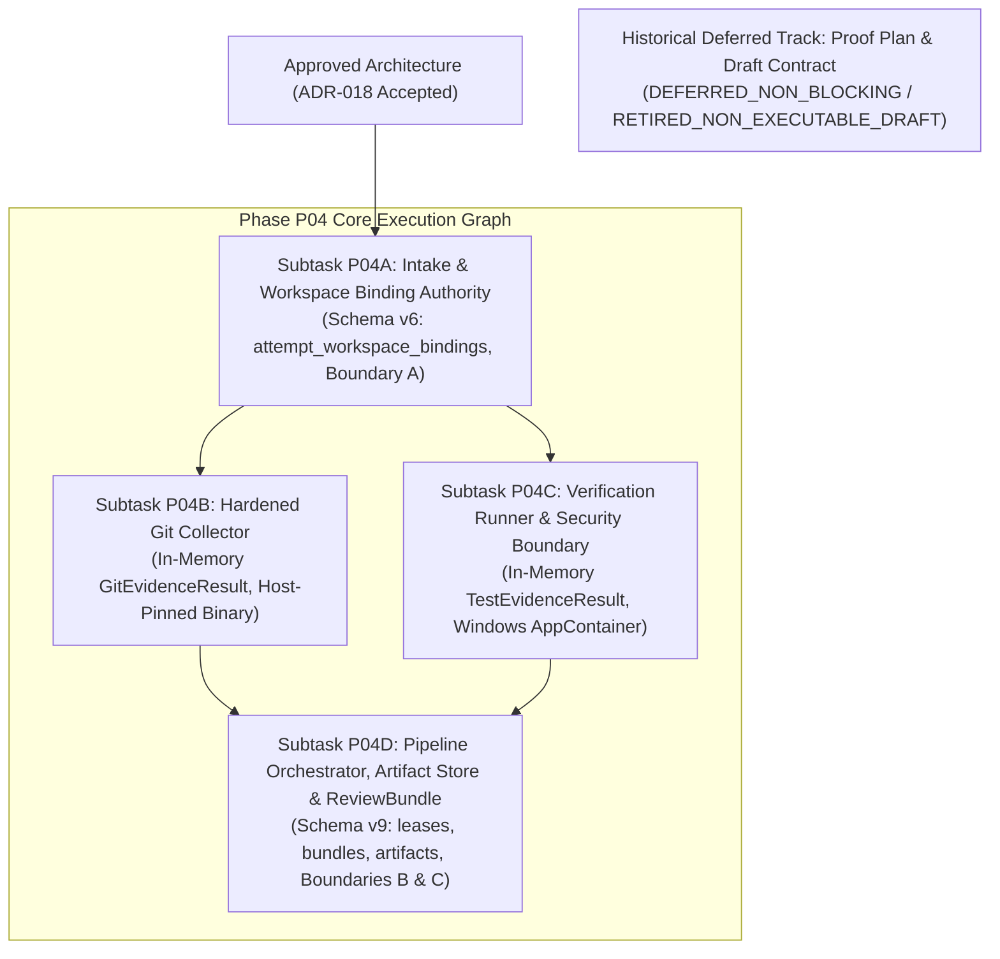

# PLAN: Phase P04 — Evidence & Review Engine Execution Plan

> **Plan ID**: `PLAN-P04-EVIDENCE-REVIEW`
> **Revision**: 7
> **Status**: `PLANNING_PENDING_EXTERNAL_AUDIT`
> **Date**: 2026-09-26
> **Audited Baseline**: `742e2e296db99c19bc7a645ca1842520b2ab23e5`
> **Active Gate**: `P04_PRECONTRACT_ARCHITECTURE_REMEDIATION_6`
> **Supersedes**: `PLAN-P04-EVIDENCE-REVIEW` Revision 6
> **External Audit Tracking**: Remediates Findings `P04-ARCH-R6-001` through `P04-ARCH-R6-006` (`docs/audits/P04_PRECONTRACT_ARCHITECTURE_EXTERNAL_REAUDIT_005.md`).
> **Prerequisite Decoupling**: Unblocks Subtask P04A as the first releaseable subtask. The unexecutable proof contract is transitioned to a historical deferred non-blocking track (`RETIRED_NON_EXECUTABLE_DRAFT`). Operational binding validation is embedded directly as `WORKTREE_BINDING_RUNTIME_VALIDATION` in P04A and P04D.

---

## 1. Overview and Phasing Strategy

Phase P04 delivers the **Evidence & Review Engine**, responsible for independent verification of AI worker reports, automated collection of Git diffs and test results, tamper-proof artifact management, and synthesis of attempt-scoped `ReviewBundle` documents.

### 1.1. Execution Flowchart & Subtask Dependency Graph


### 1.2. Key Architectural Invariants
1. **P04A Unblocked**: Subtask P04A is the first releaseable task once architecture is approved.
2. **Runtime Binding Validation**: Physical worktree binding validation is enforced during normal authorized operations via fail-closed `WORKTREE_BINDING_RUNTIME_VALIDATION` gates in P04A (intake) and P04D (orchestration).
3. **Three Durable Transaction Boundaries**:
   - **Transaction A (Report Intake)**: `RUNNING -> REPORT_READY`
   - **Transaction B (Evidence Finalization)**: `REPORT_READY -> EVIDENCE_READY`
   - **Transaction C (ReviewBundle Compilation)**: `EVIDENCE_READY -> REVIEWING`
4. **Authority Separation**: Subtasks P04B and P04C execute purely in memory; runtime SQLite write authority belongs exclusively to P04A (Transaction A) and P04D (Transactions B & C).

---

## 2. Decoupling of Historical Proof Track & Runtime Validation (P04-ARCH-R6-002)

1. **Retirement of Prerequisite Gate**: Pre-contract disposable worker runtime proof is inexecutable because upstream Agent Orchestrator (`15e9ea971f1711ec8b50e157d6eb300db6cbe0d6`, `backend/internal/domain/harness.go`) contains no inert harness in `AllHarnesses`. Modeling the proof contract as an unreleaseable prerequisite created an execution deadlock.
2. **Transition to Historical Deferred Track**:
   - `docs/plans/PLAN-P04-WORKTREE-BINDING-PROOF.md`: Updated to Revision 5 (`HISTORICAL_DEFERRED_NON_BLOCKING`).
   - `docs/tasks/DRAFT_TASK_CONTRACT_P04_WORKTREE_BINDING_PROOF.md`: Updated to `RETIRED_NON_EXECUTABLE_DRAFT` (status invariant: `NOT_RELEASED`).
3. **Operational `WORKTREE_BINDING_RUNTIME_VALIDATION`**:
   - Integrated as an automated acceptance and integration test gate inside Subtask P04A (verifying initial handle identity and registration) and Subtask P04D (verifying pre-lease handle identity and pre-CAS revalidation).
   - The term "Stage B" is strictly reserved for `TaskContractValidator` semantic validation and `STAGE_B_RUNTIME_CATALOG`.

---

## 3. Subtask Decomposition (P04A through P04D)

### 3.1. Subtask P04A: Worker Report Parser & Workspace Binding Intake
- **Target Task Contract**: `TASK_CONTRACT_P04_001A`
- **Ownership**: Schema v6 Migration (`attempt_workspace_bindings`), Report Intake (Transaction Boundary A).
- **Deliverables**:
  1. **Schema v6 DDL**:
     ```sql
     CREATE TABLE attempt_workspace_bindings (
         attempt_id TEXT PRIMARY KEY REFERENCES task_attempts(attempt_id) ON DELETE RESTRICT,
         task_id TEXT NOT NULL REFERENCES tasks(task_id) ON DELETE RESTRICT,
         contract_id TEXT NOT NULL REFERENCES task_contracts(contract_id) ON DELETE RESTRICT,
         session_id TEXT NOT NULL REFERENCES worker_sessions(session_id) ON DELETE RESTRICT,
         terminal_generation TEXT NOT NULL CHECK (LENGTH(terminal_generation) > 0),
         canonical_worktree_path TEXT NOT NULL CHECK (LENGTH(canonical_worktree_path) > 0),
         managed_root_final_path TEXT NOT NULL CHECK (LENGTH(managed_root_final_path) > 0),
         volume_serial_number TEXT NOT NULL CHECK (LENGTH(volume_serial_number) > 0),
         file_id TEXT NOT NULL CHECK (LENGTH(file_id) > 0),
         pinned_ao_commit TEXT NOT NULL CHECK (LENGTH(pinned_ao_commit) = 40 AND NOT (pinned_ao_commit GLOB '*[^0-9a-f]*')),
         bound_at TEXT NOT NULL CHECK (LENGTH(bound_at) > 0),
         FOREIGN KEY(contract_id, task_id) REFERENCES task_contracts(contract_id, task_id) ON DELETE RESTRICT
     );
     ```
  2. **Triggers**: Lineage guard trigger preventing cross-pairing across task, attempt, and contract; immutable update/delete triggers.
  3. **OS Handle Identity Verification**: Open handle with `FILE_FLAG_BACKUP_SEMANTICS`, query `FileIdInfo` (VolumeSerialNumber + 128-bit FileId), compare and bind prior to `SEND_REQUESTED`.
  4. **Transaction Boundary A**: Atomic report validation, claims persistence, immutable binding registration, and CAS state transition: `tasks.state`: `RUNNING -> REPORT_READY`.
- **Traceability**: FR-008, SEC-002, SEC-003, NFR-007.

### 3.2. Subtask P04B: Hardened Git Evidence Collector (Pure In-Memory)
- **Target Task Contract**: `TASK_CONTRACT_P04_001B`
- **Ownership**: Pure in-memory Git data collection (`GitEvidenceResult`). Zero runtime SQLite writes.
- **Deliverables**:
  1. **Host-Pinned Binary Resolution**: Git binary resolved from host configuration (`SUPERVISOR_GIT_BIN`), version and SHA-256 hash verified against pinned values per NFR-007. Arbitrary `PATH` resolution prohibited.
  2. **Windows Configuration Isolation**: Dedicated trusted empty directory `<SUPERVISOR_STATE_ROOT>/trusted_empty_git/` with empty config and empty hooks directory. Strictly zero use of Unix null device path syntax.
  3. **Environment Sanitization**: Clean environment unsetting `GIT_DIR`, `GIT_WORK_TREE`, `GIT_INDEX_FILE`, object dirs; setting `HOME`, `USERPROFILE`, `XDG_CONFIG_HOME`, `GIT_CONFIG_NOSYSTEM=1`, `GIT_CONFIG_GLOBAL`, `GIT_CONFIG_SYSTEM` to empty config, `GIT_TERMINAL_PROMPT=0`, `GIT_OPTIONAL_LOCKS=0`, `--no-pager`, `GIT_PAGER=cat`.
  4. **Command Allowlist & Flags**: Only allowlisted non-mutating commands (`rev-parse`, `merge-base`, `log`, `diff`). Always pass `--no-ext-diff` and `--no-textconv`. Use literal pathspecs for file inputs.
  5. **Integrity Invariants**: 10s execution timeout, 10 MB byte cap, process-tree termination, pre/post HEAD/index/worktree identity verification.
- **Traceability**: FR-008, NFR-007.

### 3.3. Subtask P04C: Verification Runner & Security Boundary (Pure In-Memory)
- **Target Task Contract**: `TASK_CONTRACT_P04_001C`
- **Ownership**: Pure in-memory test execution (`TestEvidenceResult`). Zero runtime SQLite writes.
- **Deliverables**:
  1. **Windows AppContainer Security Boundary**: Creation of AppContainer profile via `CreateAppContainerProfile` with empty `SECURITY_CAPABILITIES` (zero network capabilities) or restricted primary token with network denial.
  2. **DACL-Protected Immutable Snapshot**: Creation of snapshot `<SUPERVISOR_STATE_ROOT>/snapshots/<attempt_id>/` with read-only DACL for sandbox SID. Worktree is never directly touched; changes are never copied from snapshot back to worktree.
  3. **Confined Sandbox Root**: Ephemeral toolchain writes (`TEMP`, `TMP`, `GOCACHE`, `GOPATH`), build outputs, and process outputs confined to `<SUPERVISOR_STATE_ROOT>/sandboxes/<attempt_id>/`.
  4. **Job Object Containment**: Dedicated Job Object with kill-on-close, breakaway disabled, 2 GB memory cap, zero inherited handles (`bInheritHandles = FALSE`).
  5. **Supplementary UI Isolation**: Non-interactive Window Station and Desktop (`CreateWindowStationW` + `CreateDesktopW`).
  6. **Authority**: Executables resolved strictly from approved `VerificationPolicyCatalog` profiles with trusted absolute paths. Fail-closed on any boundary creation error.
- **Traceability**: FR-009, SEC-003, NFR-005.

### 3.4. Subtask P04D: Pipeline Orchestrator, Artifact Store & ReviewBundle
- **Target Task Contract**: `TASK_CONTRACT_P04_001D`
- **Ownership**: Schema v9 Migration (`task_verification_leases`, `review_bundles`, `review_artifacts`), Transaction Boundaries B & C, Content-Addressed Artifact Store, ReviewBundle Synthesis.
- **Deliverables**:
  1. **Schema v9 DDL**:
     - `task_verification_leases`: Monotonic fencing token (`> 0`), contract lineage FK, anti-cross-pairing triggers, timestamp CHECK constraints.
     - `review_bundles`: JCS canonical JSON payload, 64 lowercase hex check (`GLOB '*[^0-9a-f]*'`), immutable triggers.
     - `review_artifacts`: Full retrieval metadata (`artifact_type`, `media_type`, `encoding`, `canonical_relative_path`, `captured_sha256`, `full_stream_sha256`, byte counts, `is_truncated`), 64 lowercase hex checks, immutable triggers.
  2. **Transaction Boundary B (Evidence Finalization)**:
     - Ingests in-memory outputs from P04B and P04C.
     - Staging and final directory volume containment verification.
     - File flush + atomic rename via `MoveFileExW(MOVEFILE_REPLACE_EXISTING | MOVEFILE_WRITE_THROUGH)`.
     - Reopen final file by handle, verify volume identity, size, and SHA-256 hash before inserting SQLite metadata.
     - Collision handling: re-hash and compare size; mismatch fails closed and quarantines.
     - Release lease (`task_verification_leases.state = 'RELEASED'`).
     - CAS transition: `tasks.state`: `REPORT_READY -> EVIDENCE_READY`.
  3. **Transaction Boundary C (ReviewBundle Compilation)**:
     - Synthesis of RFC 8785 JCS canonical `ReviewBundle` payload.
     - Validation against `docs/schemas/review-bundle.schema.json`.
     - Insertion into `review_bundles`.
     - Insertion into `task_audit_events`.
     - CAS transition: `tasks.state`: `EVIDENCE_READY -> REVIEWING`.
  4. **Latency Instrumentation**: Tracking $T_0 	o T_1 \le 3.0	ext{ seconds}$ per `PROPOSAL-P04-002`.
- **Traceability**: FR-008, FR-009, NFR-007, NFR-008.

---

## 4. Crash Consistency & Replay Matrix

| Crash Point | Durable State | Physical Storage State | Recovery / Replay Mechanism | Invariant Guaranteed |
| :--- | :--- | :--- | :--- | :--- |
| **Crash during Transaction A** | `RUNNING` | Uncommitted SQLite write; staged report temp file | SQLite WAL rolls back. Task remains `RUNNING`. Worker re-submits report. | Zero partial SQLite records. |
| **Crash during P04B / P04C Execution** | `REPORT_READY` | In-memory buffers lost; active lease expires in memory | Active lease reaches `expires_at_epoch_ms`. New supervisor instance re-acquires lease with incremented `fencing_token`, re-validates binding, and re-executes collectors. | Monotonic fencing token invalidates old worker effects. |
| **Crash during Transaction B** | `REPORT_READY` | Staged or final physical files exist without SQLite metadata | SQLite WAL rolls back. Task remains `REPORT_READY`. Orphan physical files produce zero authoritative review rows. Next lease holder re-runs and re-commits cleanly. | Physical files without SQLite metadata are inert. |
| **Crash between B and C** | `EVIDENCE_READY` | Evidence metadata, artifacts, and lease release committed | Task is durably in `EVIDENCE_READY`. ReviewBundle compiler restarts directly at Boundary C without re-running Git or tests. | Evidence is durable; zero duplicate test runs. |
| **Crash during Transaction C** | `EVIDENCE_READY` | In-memory bundle lost | SQLite WAL rolls back. Task remains `EVIDENCE_READY`. ReviewBundle compiler re-attempts Transaction C. | Idempotent deterministic compilation. |

---

## 5. Requirement Reconciliation Matrix

| Requirement | Implementation Component | Verification Method | Governance Status |
| :--- | :--- | :--- | :--- |
| **FR-008 (Git-Verified Diffs)** | Subtask P04B (Hardened In-Memory Git Collector) | Unit tests with malicious `.git/config`, hooks, and large diffs | Approved canonical architecture. |
| **FR-009 (Independent Verification)** | Subtask P04C (Windows AppContainer Runner) | Windows AppContainer isolation and Job Object termination tests | Approved canonical architecture. |
| **NFR-005 (Resource Isolation)** | Subtask P04C (Job Object & AppContainer) | Memory limit, timeout, and process-tree termination tests | Approved canonical architecture. |
| **NFR-007 (Audit Trail)** | Subtasks P04A, P04D (Schema v6 & Schema v9) | SQLite WAL immutable trigger and SHA-256 GLOB tests | Approved canonical architecture. |
| **NFR-008 (ReviewBundle Latency)** | Subtask P04D (ReviewBundle Synthesis) | Integration benchmark on 10,000-file repository ($T_1 - T_0 \le 3	ext{s}$) | Governed by `PROPOSAL-P04-002` (`PENDING_EXTERNAL_REVIEW`). |

---

## 6. Governance Tracking

```
PROPOSAL_P04_001 = REVISION_6_REQUIRED (Remediated to Revision 7)
PROPOSAL_P04_002 = PENDING_EXTERNAL_REVIEW
ADR_018 = DRAFT_PENDING_EXTERNAL_APPROVAL (Revision 7)
PLAN_P04_EVIDENCE_REVIEW = PLANNING_PENDING_EXTERNAL_AUDIT (Revision 7)
ACTIVE_GATE = P04_PRECONTRACT_ARCHITECTURE_REMEDIATION_6
P04_TASK_CONTRACT = NOT_RELEASED
P04_CODE = HELD_PENDING_APPROVED_ARCHITECTURE_AND_TASK_CONTRACT
P05_CODE = NOT_AUTHORIZED
AUTOMATIC_RESTORE = DISABLED
LIVE_AO_INTEGRATION = UNVERIFIED_EVIDENCE_TRACK
VERIFIED_OPERATOR_PRINCIPAL = OPEN_FAIL_CLOSED_DEPENDENCY
```
