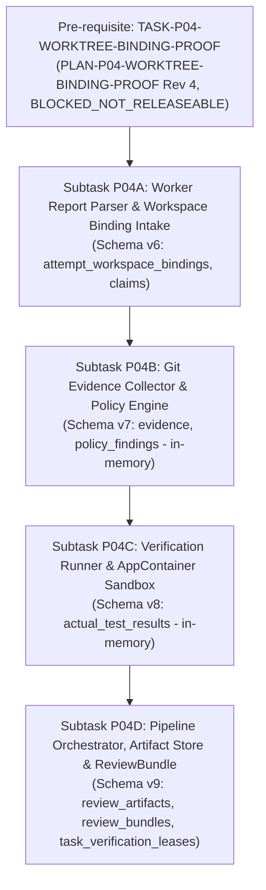

# PLAN: Phase P04 — Evidence & Review Engine Execution Plan

- **Plan ID:** `PLAN-P04-EVIDENCE-REVIEW`
- **Revision:** 6 (Remediation of External Re-Audit 004)
- **Status:** `PLANNING_PENDING_EXTERNAL_AUDIT`
- **Target Phase:** Phase P04 — Evidence & Review Engine
- **Governing Proposal:** [`docs/proposals/PROPOSAL-P04-001-evidence-review-engine-boundaries.md`](../proposals/PROPOSAL-P04-001-evidence-review-engine-boundaries.md) (Revision 6)
- **Governing Architecture:** [`docs/adr/DRAFT-ADR-018-evidence-review-and-verification-isolation.md`](../adr/DRAFT-ADR-018-evidence-review-and-verification-isolation.md) (Revision 6)
- **Pre-requisite Proof Plan:** [`docs/plans/PLAN-P04-WORKTREE-BINDING-PROOF.md`](PLAN-P04-WORKTREE-BINDING-PROOF.md) (Revision 4)
- **Pre-requisite Draft Contract:** [`docs/tasks/DRAFT_TASK_CONTRACT_P04_WORKTREE_BINDING_PROOF.md`](../tasks/DRAFT_TASK_CONTRACT_P04_WORKTREE_BINDING_PROOF.md) (`BLOCKED_NOT_RELEASEABLE`, Model A Draft Lineage, status invariant: `NOT_RELEASED`)
- **Audit References:**
  - [`docs/audits/P04_PRECONTRACT_ARCHITECTURE_EXTERNAL_REAUDIT_004.md`](../audits/P04_PRECONTRACT_ARCHITECTURE_EXTERNAL_REAUDIT_004.md) (`REVISION_5_REQUIRED`)
  - [`docs/audits/P04_PRECONTRACT_ARCHITECTURE_EXTERNAL_REAUDIT_003.md`](../audits/P04_PRECONTRACT_ARCHITECTURE_EXTERNAL_REAUDIT_003.md) (`REVISION_4_REQUIRED`)
  - [`docs/audits/P04_PRECONTRACT_ARCHITECTURE_EXTERNAL_AUDIT_001_ERRATUM_003.md`](../audits/P04_PRECONTRACT_ARCHITECTURE_EXTERNAL_AUDIT_001_ERRATUM_003.md) (`FORMALLY_RECORDED`)
  - [`docs/audits/P04_PRECONTRACT_ARCHITECTURE_EXTERNAL_REAUDIT_002.md`](../audits/P04_PRECONTRACT_ARCHITECTURE_EXTERNAL_REAUDIT_002.md) (`REVISION_3_REQUIRED`)
  - [`docs/audits/P04_PRECONTRACT_ARCHITECTURE_EXTERNAL_AUDIT_001_ERRATUM_002.md`](../audits/P04_PRECONTRACT_ARCHITECTURE_EXTERNAL_AUDIT_001_ERRATUM_002.md) (`SUPERSEDED_BY_ERRATUM_003`)
  - [`docs/audits/P04_PRECONTRACT_ARCHITECTURE_EXTERNAL_REAUDIT_001.md`](../audits/P04_PRECONTRACT_ARCHITECTURE_EXTERNAL_REAUDIT_001.md) (`REVISION_2_REQUIRED`)
  - [`docs/audits/P04_PRECONTRACT_ARCHITECTURE_EXTERNAL_AUDIT_001.md`](../audits/P04_PRECONTRACT_ARCHITECTURE_EXTERNAL_AUDIT_001.md) (`REVISION_1_REQUIRED`)
- **Author:** AI Engineering Supervisor Control Plane Team
- **Governance Authority:** [`docs/24_CHANGE_GOVERNANCE.md`](../24_CHANGE_GOVERNANCE.md)
- **Active Gate:** `P04_PRECONTRACT_ARCHITECTURE_REMEDIATION_5`

---

## 1. Overview and Phasing Strategy

Phase P04 implements the Evidence & Review Engine, translating untrusted worker reports and workspace changes into authoritative, inspectable `ReviewBundle` artifacts for supervisor evaluation.

Execution is strictly phased into a pre-requisite proof task followed by four sequential subtasks (P04A..P04D):



---

## 2. Pre-requisite: Bounded Worktree Authority Proof

- **Task ID:** `TASK-P04-WORKTREE-BINDING-PROOF`
- **Plan Reference:** [`docs/plans/PLAN-P04-WORKTREE-BINDING-PROOF.md`](PLAN-P04-WORKTREE-BINDING-PROOF.md) (Revision 4)
- **Contract Reference:** [`docs/tasks/DRAFT_TASK_CONTRACT_P04_WORKTREE_BINDING_PROOF.md`](../tasks/DRAFT_TASK_CONTRACT_P04_WORKTREE_BINDING_PROOF.md) (`BLOCKED_NOT_RELEASEABLE`, Model A Draft Lineage, status invariant: `NOT_RELEASED`)
- **Status & Directives (Finding P04-ARCH-R5-001):**
  1. Pinned AO commit `15e9ea971f1711ec8b50e157d6eb300db6cbe0d6` (`backend/internal/domain/harness.go`) contains only live agent CLI harnesses (`agy`, `codex`, `claude-code`, etc.). There is no user-selectable inert harness.
  2. `POST /api/v1/sessions` requires a non-empty `harness` parameter; payloads omitting `harness` fail upstream validation.
  3. Running live agent CLIs in disposable test environments is forbidden because it triggers LLM model token generation.
  4. **Architectural Decision**: Disposable AO worker-session runtime testing is **NOT** a pre-contract release gate. Track 1 static pinned-source inspection is retained as design evidence. Runtime physical worktree binding transitions into fail-closed **Stage B validation** executed on authorized sessions during normal operation. `LIVE_AO_INTEGRATION` remains `UNVERIFIED_EVIDENCE_TRACK`.
  5. The draft proof contract is marked `BLOCKED_NOT_RELEASEABLE` (status remains `NOT_RELEASED`). No candidate is created.

---

## 3. Subtask Decomposition (P04A through P04D)

### 3.1. Subtask P04A: Worker Report Parser & Workspace Binding Intake
- **Goal:** Parse `<worktree>/worker-report.json`, enforce schema validation against `docs/schemas/worker-report.schema.json`, verify attempt identity, register immutable `attempt_workspace_bindings`, and extract `WorkerClaim` entities.
- **Components:** `internal/evidence/report_parser.go`, `internal/store/attempt_bindings.go`, unit test suite.
- **Migration:** Schema v6 (`attempt_workspace_bindings`, `claims`).
- **Table Schema: `attempt_workspace_bindings`**:
  ```sql
  CREATE TABLE attempt_workspace_bindings (
      attempt_id TEXT PRIMARY KEY REFERENCES task_attempts(attempt_id) ON DELETE RESTRICT,
      task_id TEXT NOT NULL,
      contract_id TEXT NOT NULL,
      session_id TEXT NOT NULL,
      terminal_generation INTEGER NOT NULL,
      canonical_worktree_path TEXT NOT NULL,
      managed_root_final_path TEXT NOT NULL,
      volume_serial_number TEXT NOT NULL,
      file_id TEXT NOT NULL,
      pinned_ao_commit TEXT NOT NULL,
      bound_at TEXT NOT NULL,
      FOREIGN KEY (task_id) REFERENCES tasks(task_id) ON DELETE RESTRICT
  );

  CREATE TRIGGER attempt_workspace_bindings_no_update
  BEFORE UPDATE ON attempt_workspace_bindings
  BEGIN
      SELECT RAISE(FAIL, 'attempt_workspace_bindings is immutable and cannot be updated');
  END;

  CREATE TRIGGER attempt_workspace_bindings_no_delete
  BEFORE DELETE ON attempt_workspace_bindings
  BEGIN
      SELECT RAISE(FAIL, 'attempt_workspace_bindings is immutable and cannot be deleted');
  END;
  ```

### 3.2. Subtask P04B: Git Evidence Collector & Policy Engine (Model 1: In-Memory)
- **Goal:** Collect independent Git diffs, evaluate `DESCENDANT_OR_EQUAL_POLICY` and `MERGE_COMMITS_FORBIDDEN`, check TaskContract scope compliance (`allowed_scope` vs `forbidden_scope`).
- **Atomicity Invariant:** Pure in-memory execution; performs **zero SQLite writes**. Returns `GitEvidenceResult` and `PolicyEvaluationResult`.
- **Components:** `internal/evidence/git_collector.go`, `policy_engine.go`.
- **Migration:** Schema v7 (`evidence`, `policy_findings`).

### 3.3. Subtask P04C: Verification Runner & Isolation Sandbox (Model 1: In-Memory)
- **Goal:** Execute verification commands specified in the TaskContract using typed profiles in `VerificationPolicyCatalog`.
- **Isolation Architecture:**
  * Absolute attempt sandbox root: `<SUPERVISOR_STATE_ROOT>\\sandboxes\\<attempt_id>\\`.
  * Pre-operation containment verification using OS handle comparison and component-boundary checks ensuring paths are outside all Git worktrees, primary repository, AO live database, and recovery directory.
  * Windows non-interactive Window Station + Desktop isolation (`CreateWindowStationW` + `CreateDesktopW`).
  * Read-only audited worktree; toolchain write variables (`TEMP`, `TMP`, `GOCACHE`, `GOPATH`) redirected into the external sandbox.
  * Disposable source snapshot for modifying tests.
- **Atomicity Invariant:** Pure in-memory execution; performs **zero SQLite writes**. Returns `TestExecutionResult`.
- **Components:** `internal/evidence/verifier.go`, `sandbox_windows.go`.
- **Migration:** Schema v8 (`actual_test_results`).

### 3.4. Subtask P04D: Pipeline Orchestrator, Durable Artifact Store & ReviewBundle
- **Goal:** Orchestrate the end-to-end evidence collection pipeline, persist content-addressed artifacts, execute single atomic CAS transaction, and assemble `ReviewBundle`.
- **Pre-Command Reservation Lease (Atomic `BEGIN IMMEDIATE` Fencing):**
  * Acquires lease in `task_verification_leases` (Schema v9) with an incremented `fencing_token`.
  * Invariant: Row is **never deleted** on release; state transitions between `ACTIVE` and `RELEASED`, preventing ABA token reset.
  * Validity rule: `expires_at_epoch_ms > now_ms`; equality is expired.
  * Acquisition inside `BEGIN IMMEDIATE` verifies: `tasks.state = 'REPORT_READY'`, matching `current_attempt`, `task_attempts` exists, matching `attempt_workspace_bindings` exists, and prior lease is `RELEASED` or expired.
  * Losers are denied execution; zero external commands executed.
- **Durable Artifact Store (Append-Only with Physical GC Deferred):**
  * Canonical path: `<SUPERVISOR_STATE_ROOT>\\artifacts\\<captured_sha256>`.
  * Initial delivery is strictly append-only; physical garbage collection is DEFERRED to a future proposal/ADR.
  * Crashes before SQLite commit leave orphan files in storage, but create zero authoritative review records.
  * Table `review_artifacts` references `task_attempts(attempt_id)` with `ON DELETE RESTRICT` (NO `CASCADE`):
    ```sql
    CREATE TABLE review_artifacts (
        artifact_id TEXT PRIMARY KEY,
        bundle_id TEXT NOT NULL REFERENCES review_bundles(bundle_id) ON DELETE RESTRICT,
        attempt_id TEXT NOT NULL REFERENCES task_attempts(attempt_id) ON DELETE RESTRICT,
        artifact_type TEXT NOT NULL,
        captured_sha256 TEXT NOT NULL CHECK(LENGTH(captured_sha256) = 64),
        full_stream_sha256 TEXT NOT NULL CHECK(LENGTH(full_stream_sha256) = 64),
        original_bytes INTEGER NOT NULL CHECK(original_bytes >= 0),
        captured_bytes INTEGER NOT NULL CHECK(captured_bytes >= 0 AND captured_bytes <= original_bytes),
        is_truncated INTEGER NOT NULL CHECK(is_truncated IN (0, 1) AND ((is_truncated = 1 AND captured_bytes < original_bytes) OR (is_truncated = 0 AND captured_bytes = original_bytes))),
        created_at TEXT NOT NULL
    );
    ```
  * SQLite triggers prevent `UPDATE` and `DELETE` on `review_artifacts` rows.
  * Retrieval re-hashes stored bytes and verifies `captured_sha256`.
- **Single Final Atomic SQLite CAS Transaction:**
  * Opens single SQLite transaction:
    1. Releases lease in `task_verification_leases` asserting matching token, worker, attempt, and `expires_at_epoch_ms > now_ms`;
    2. Verifies `attempt_workspace_bindings` remains valid;
    3. Inserts `evidence`, `policy_findings`, `actual_test_results`, `review_artifacts`, `review_bundles`, `task_audit_events`;
    4. Executes CAS update on `tasks.state`:
       ```sql
       UPDATE tasks
       SET state = 'EVIDENCE_READY',
           updated_at = ?
       WHERE task_id = ?
         AND state = 'REPORT_READY'
         AND current_attempt = ?;
       ```
    5. Asserts `rows_affected == 1`; if 0, rolls back entire transaction.
- **ReviewBundle Deterministic Hashing:** Formalized under **RFC 8785 (JCS)**.
- **Components:** `internal/evidence/orchestrator.go`, `artifact_store.go`, `bundle_builder.go`.
- **Migration:** Schema v9 (`review_artifacts`, `review_bundles`, `task_verification_leases`).

---

## 4. Crash Consistency Matrix

| Boundary | Staging Path | Canonical Store | SQLite State | Startup / Recovery Action |
|---|---|---|---|---|
| **1. Before write** | None | None | Clean | Attempt failed cleanly |
| **2. During write / pre-fsync** | Incomplete `.staging/<attempt_id>-<uuid>.tmp` | None | Clean | Incomplete staging file ignored; produces zero DB rows |
| **3. Post-fsync / pre-rename** | Complete `.staging/<attempt_id>-<uuid>.tmp` | None | Clean | Complete staging file ignored; produces zero DB rows |
| **4. Post-rename / pre-DB** | None | `<captured_sha256>` | Clean | Orphan content-addressed file; produces zero DB rows (GC deferred) |
| **5. During DB transaction** | None | `<captured_sha256>` | WAL uncommitted | WAL rolls back; orphan file produces zero DB rows (GC deferred) |

---

## 5. Requirement Reconciliation Matrix

| Requirement | Source Document | Architecture Mapping | Status |
|---|---|---|---|
| `REQ-EVID-001` (Worker Report Schema) | `docs/02_REQUIREMENTS.md` | Subtask P04A (`report_parser.go`) | Planned (Schema v6) |
| `REQ-EVID-002` (Independent Git Diffs) | `docs/02_REQUIREMENTS.md` | Subtask P04B (`git_collector.go`) | Planned (Schema v7) |
| `REQ-EVID-003` (Policy Evaluation) | `docs/02_REQUIREMENTS.md` | Subtask P04B (`policy_engine.go`) | Planned (Schema v7) |
| `REQ-EVID-004` (Verification Runner Sandbox) | `docs/02_REQUIREMENTS.md` | Subtask P04C (`verifier.go`, `sandbox_windows.go`) | Planned (Schema v8) |
| `REQ-EVID-005` (Content-Addressed Store) | `docs/02_REQUIREMENTS.md` | Subtask P04D (`artifact_store.go`) | Planned (Schema v9) |
| `REQ-EVID-006` (Durable Monotonic Lease Fencing) | ADR-018 Rev 6 / Re-Audit 004 | Subtask P04D (`orchestrator.go`) | Planned (Schema v9) |
| `REQ-EVID-007` (ReviewBundle Hash RFC 8785) | ADR-018 Rev 6 / Re-Audit 004 | Subtask P04D (`bundle_builder.go`) | Planned (Schema v9) |
| `NFR-008` (ReviewBundle Generation < 3s) | `docs/02_REQUIREMENTS.md` | Subtask P04D (`bundle_builder.go`) | Planned (Repo <= 10,000 files; compilation strictly separated from external verification commands) |

---

## 6. Governance Tracking

- **PROPOSAL-P04-001:** Revision 6 submitted (`PENDING_EXTERNAL_REVIEW`)
- **DRAFT-ADR-018:** Revision 6 submitted (`DRAFT_PENDING_EXTERNAL_APPROVAL`)
- **PLAN-P04-EVIDENCE-REVIEW:** Revision 6 submitted (`PLANNING_PENDING_EXTERNAL_AUDIT`)
- **PLAN-P04-WORKTREE-BINDING-PROOF:** Revision 4 submitted (`PROPOSED_REVISED_NON_RUNTIME`)
- **DRAFT_TASK_CONTRACT_P04_WORKTREE_BINDING_PROOF:** `BLOCKED_NOT_RELEASEABLE` (Model A Draft Lineage, status invariant: `NOT_RELEASED`)
- **Active Gate:** `P04_PRECONTRACT_ARCHITECTURE_REMEDIATION_5`
