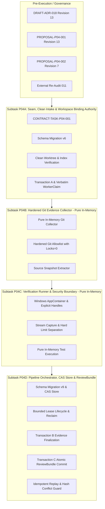

# PLAN-P04: Evidence & Review Engine Implementation & Governance Plan

> **Plan ID**: `PLAN-P04-EVIDENCE-REVIEW`
> **Revision**: 13
> **Status**: DRAFT (`REVISION_12_REQUIRED` / Remediated to Revision 13 — `PLANNING_PENDING_EXTERNAL_AUDIT`)
> **Date**: 2026-09-26
> **Audited Baseline**: `b5a1d8ef0c38e52ed71370a1e0dfa17e0d3e5f2d`
> **Preservation Baseline Commit**: `6e1993da150031a9465901a7019c71257de44312` (Revision 11)
> **Active Gate**: `P04_PRECONTRACT_ARCHITECTURE_REMEDIATION_12`
> **Author**: AI Engineering Supervisor Architecture Team
> **Governing ADR**: `docs/adr/DRAFT-ADR-018-evidence-review-and-verification-isolation.md` (Revision 13)
> **Related Proposals**: `docs/proposals/PROPOSAL-P04-001-evidence-review-engine-boundaries.md` (Revision 13), `docs/proposals/PROPOSAL-P04-002-review-bundle-latency-semantics.md` (Revision 7)
> **External Audit Tracking**: Remediates Findings `P04-ARCH-R12-001` through `P04-ARCH-R12-004` (`docs/audits/P04_PRECONTRACT_ARCHITECTURE_EXTERNAL_REAUDIT_011.md`).

---

## 1. Overview and Phasing Strategy

Phase P04 implements the **Evidence & Review Engine**, providing independent, tamper-proof verification of AI worker outputs under canonical architecture (`docs/04_ARCHITECTURE.md` Section 7) and requirements (`docs/02_REQUIREMENTS.md`).

### 1.1. Execution Flowchart & Subtask Dependency Graph

### 1.2. Key Architectural Invariants
1. **Model 1 Persistence Ownership Discipline (P04-ARCH-R10-002)**:
   - Subtask P04A owns Schema Migration v6 and Transaction A.
   - Subtasks P04B and P04C are pure in-memory collectors with ZERO SQLite writes.
   - Subtask P04D is the SOLE SQLite CAS orchestrator owning Schema Migration v9, Content-Addressed Store, leases, Transaction B, Transaction C, and audit events.
2. **Complete Lineage, Immutability & Content-Address Equality (P04-ARCH-R10-001)**:
   - All tables enforce foreign keys and lineage triggers across task, attempt, and contract.
   - Immutable delete and update triggers prevent tampering with historical records.
   - `canonical_relative_path = 'artifacts/' || substr(captured_sha256, 1, 2) || '/' || captured_sha256` is strictly verified.
3. **Mathematical Lease & Stream Bounds (P04-ARCH-R10-004)**:
   - Lease expires exactly at `acquired_at_epoch_ms + ttl_seconds * 1000`.
   - CAS trigger enforces allowed lease state transitions and fencing token increments on reclaim.
   - Stream state combinations strictly checked against capture limit (10 MB) and hard safety limit (50 MB).
4. **Crash-Safe Latency Metrics & Pre-Commit Assembly Boundary (P04-ARCH-R10-003)**:
   - Measurement boundary strictly measures ReviewBundle assembly and validation before Transaction C commit.
   - Telemetry captures commit return duration in audit event `REVIEW_BUNDLE_GENERATED`.
   - Truth table CHECK constraints eliminate SQLite persistence deadlocks.
5. **Canonical TaskState Discipline (P04-ARCH-R10-005)**:
   - Zero compound states or transitions outside `docs/06_WORKFLOW_STATE_MACHINE.md`.
   - Dirty report intake preserves `RUNNING` state.
   - Hash conflict at `REVIEWING` preserves `REVIEWING` state while locking automated approval.

---

## 2. Decoupling of Historical Proof Track & Runtime Validation

Phase P04 strictly maintains the two-track validation discipline:
1. **Automated CI / Test Suite Track**:
   - Pure in-memory unit and integration tests verifying schema migrations, DDL constraints, state transitions, JCS serialization, and error branches.
   - Executes across all development environments and automated test runners.
2. **Real Windows OS Security Boundary Track**:
   - Integration tests executing actual `CreateProcessW` calls with `STARTUPINFOEXW`, `PROC_THREAD_ATTRIBUTE_HANDLE_LIST`, `PROC_THREAD_ATTRIBUTE_JOB_LIST`, and AppContainer SIDs on physical Windows hosts.
   - Validates that DACLs deny unauthorized file access, network traffic is blocked, and processes cannot break out of Job Objects.

---

## 3. Work Breakdown Structure (Subtasks P04A – P04D)

### 3.1. Subtask P04A: Dispatch Seam, Clean Intake & Workspace Binding Authority
- **Objective**: Implement workspace binding creation prior to dispatch and Transaction A report intake upon worker completion.
- **Scope**:
  - Implement Schema Migration v6 (`attempt_workspace_bindings`, `worker_claims`).
  - Implement pre-intake cleanliness probe: invoke `git status --porcelain=v1 -z --untracked-files=all` and `git diff-index --quiet HEAD --` with `GIT_OPTIONAL_LOCKS=0`.
  - If dirty, roll back Transaction A, preserve task state `RUNNING` (no blanket transition to BLOCKED). In a separate diagnostic transaction executed after rollback: insert an ACTIVE hold into `review_integrity_holds` (`hold_reason = 'DIRTY_WORKTREE_DETECTED'`) and record audit event `EVIDENCE_COLLECTION_FAILED` with deterministic event_id (`event_id = SHA256(lineage + ":" + reason + ":" + sanitized_input_fingerprint)`).
  - Implement `WorkerReport` schema validation via Go JSON schema engine.
  - Implement RFC 8785 JCS canonicalization.
  - Store verbatim `reported_head_sha` (`CHECK (LENGTH BETWEEN 7 AND 40)`).
  - Update `attempt_workspace_bindings` to `RETAINED_FOR_VERIFICATION` via CAS.
  - Atomically transition `tasks.state`: `RUNNING -> REPORT_READY`.
- **Target Schema**: Migration v6.

### 3.2. Subtask P04B: Hardened Git Evidence Collector (Pure In-Memory)
- **Objective**: Implement in-memory Git evidence collection and immutable source snapshot extraction.
- **Scope**:
  - Enforce hardened Git allowlist with `GIT_OPTIONAL_LOCKS=0` (includes `git rev-parse --absolute-git-dir`).
  - Implement tree walk snapshot extraction using `git ls-tree -rz --full-tree` and `git cat-file --batch`.
  - Apply read-only ACLs to snapshot directory (`GENERIC_READ | GENERIC_EXECUTE`).
  - Resolve linked worktree index paths via `git rev-parse --git-path index`.
  - Collect `actual_base_sha`, `actual_head_sha`, `actual_changed_files`, and `diff_stat`.
  - **Zero SQLite Writes**: Returns `GitEvidenceResult` in memory.
- **Dependencies**: Subtask P04A.

### 3.3. Subtask P04C: Verification Runner & Security Boundary (Pure In-Memory)
- **Objective**: Execute verification test commands inside isolated Windows AppContainers.
- **Scope**:
  - Implement Windows process creation with `bInheritHandles = TRUE`, explicit handle attribute lists (`PROC_THREAD_ATTRIBUTE_HANDLE_LIST`), atomic Job Object assignment (`PROC_THREAD_ATTRIBUTE_JOB_LIST`), and `JOB_OBJECT_LIMIT_KILL_ON_JOB_CLOSE`.
  - Provide process join and termination verification for authoritative process-death proof.
  - Stream capture with separation between capture limit (10 MB) and hard safety limit (50 MB).
  - **Zero SQLite Writes**: Returns `TestEvidenceResult` and artifact streams in memory to P04D.
- **Dependencies**: Subtask P04B.

### 3.4. Subtask P04D: Pipeline Orchestrator, CAS Store & ReviewBundle
- **Objective**: Centralized CAS orchestrator for Schema Migration v9 (`task_verification_leases`, `review_integrity_holds`, `evidence_sets`, `review_artifacts`, `review_bundles`), leases, Transaction B, Transaction C, and ReviewBundle synthesis.
- **Scope**:
  - Implement Schema Migration v9 with explicit integer typing (`CHECK (typeof(col) = 'integer')`) and arithmetic overflow guards (`acquired_at <= MaxInt64 - ttl*1000`, `fencing_token <= MaxInt64`, `hard_safety <= MaxInt64 - 1`).
  - Implement Linear Lease Chain: eliminate `RECLAIMED` mutation; predecessor leases remain permanently `EXPIRED`; each lease row references immutable predecessor via `predecessor_lease_id TEXT NULL UNIQUE`; token monotonicity (`token = pred.token + 1`); single active lease partial index.
  - Enforce authoritative process-death proof requirement for lease reclaim (joined Job Object/process handle within daemon or host exclusivity + kill-on-close across restart).
  - Implement durable integrity holds: Schema v9 `review_integrity_holds` table, fail-closed pipeline checks, startup recovery loading, diagnostic transaction recording after rollback, and deterministic `audit_events.event_id` idempotency mapping.
  - Content-Addressed Store staging, deduplication, and atomic write-through to `artifacts/<first-two-hex>/<captured_sha256>`.
  - Execute Transaction B: exact CAS `(lease_id, worker_id, fencing_token, state='ACTIVE')`, commit `evidence_sets` and `review_artifacts`, release lease, transition `tasks.state`: `REPORT_READY -> EVIDENCE_READY`.
  - Synthesize RFC 8785 JCS canonical `ReviewBundle` JSON payload; compute SHA-256 bundle hash.
  - Record pre-commit assembly latency metrics (`compilation_latency_ms = bundle_assembled_at_epoch_ms - evidence_finalized_at_epoch_ms`) as assembly diagnostic interval, with `nfr008_compliance_status = 'UNVERIFIED'`.
  - Implement canonical replay/conflict matrix:
    * Compile failure: Transaction C rolls back, task remains `EVIDENCE_READY`, emits `REVIEW_BUNDLE_COMPILATION_REJECTED`.
    * Idempotent replay: Returns existing bundle, task remains `REVIEWING`.
    * Hash conflict: Tampering conflict, task remains `REVIEWING`, Transaction C rolls back, emits `REVIEW_BUNDLE_COMPILATION_REJECTED` (`BUNDLE_HASH_CONFLICT`), locks automated approval.
  - Execute Transaction C atomically: insert `review_bundles`, insert proposed audit event `REVIEW_BUNDLE_GENERATED` (*without* `commit_duration_ms`), transition `tasks.state`: `EVIDENCE_READY -> REVIEWING`. Capture post-commit duration telemetry purely as best-effort in-process monotonic measurement.
- **Dependencies**: Subtask P04C.

---

## 4. Crash Consistency & Replay Matrix

| Failure Point | State Before Crash | Recovery Action on Restart | Canonical Resulting State |
| :--- | :--- | :--- | :--- |
| Crash during worker execution | `RUNNING` | P03 host recovery detects unconfirmed worker; lease expired | `FAILED` |
| Dirty worktree at report intake | `RUNNING` | Transaction A rolls back; `DIRTY_WORKTREE_DETECTED` logged | `RUNNING` (Preserved) |
| Crash after Transaction A | `REPORT_READY` | P04D linear lease reclaim: verified process-death proof (host exclusivity + `KILL_ON_JOB_CLOSE`) allocates successor lease (`token = pred + 1`) | `REPORT_READY` (Reclaimable via linear successor) |
| Verification process exceeds hard limit | `REPORT_READY` | Process terminated; `stream_state = 'HARD_LIMIT_TERMINATED'`, `full_stream_sha256 = NULL` | `REPORT_READY` -> `EVIDENCE_READY` (Via Tx B) |
| Crash after Transaction B | `EVIDENCE_READY` | P04D orchestrator synthesizes ReviewBundle; records `latency_measurement_status = 'RECOVERED_AFTER_RESTART'`, `nfr008_compliance_status = 'UNVERIFIED'` | `REVIEWING` (No deadlock) |
| Transaction C compilation delay > 3.0s | `EVIDENCE_READY` | Transaction C commits with assembly diagnostic, logs diagnostic finding | `REVIEWING` (No deadlock) |
| ReviewBundle replay with identical hash | `REVIEWING` | Idempotent return of existing ReviewBundle | `REVIEWING` (Preserved) |
| ReviewBundle replay with conflicting hash | `REVIEWING` | Integrity conflict logged; Transaction C aborted; approval locked | `REVIEWING` (Preserved; human resolution required) |

---

## 5. Requirement Reconciliation Matrix

| Requirement | Canonical Spec Source | Reconciliation Status in Phase P04 |
| :--- | :--- | :--- |
| **FR-008** | `docs/02_REQUIREMENTS.md` | Fully satisfied via independent in-memory Git and verification collectors. |
| **NFR-008** | `docs/02_REQUIREMENTS.md` | Formally reconciled via PROPOSAL-P04-002 Revision 7 into assembly diagnostic latency semantics with crash-safe non-deadlocking persistence and UNVERIFIED compliance status. Canonical update pending approval. |
| **P04 Schema v6** | `docs/adr/DRAFT-ADR-018` | Owned by Subtask P04A; introduces `attempt_workspace_bindings` and `worker_claims` (verbatim 7-40 hex SHA, integer typing). |
| **P04 Schema v9** | `docs/adr/DRAFT-ADR-018` | Owned by Subtask P04D; introduces `task_verification_leases` (linear lease chain), `review_integrity_holds` (durable holds), `evidence_sets`, `review_artifacts`, and `review_bundles` with integer typing and overflow guards. |
