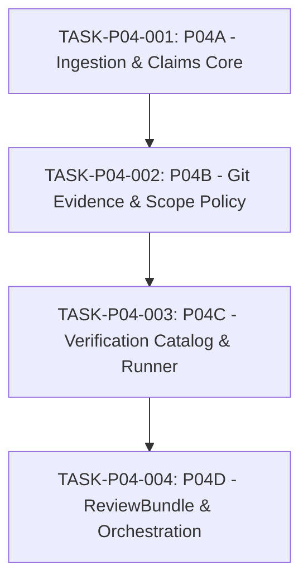

# PLAN-P04-EVIDENCE-REVIEW: Phase P04 Evidence & Review Engine Implementation and Governance Decomposition Plan

- **Plan ID:** `PLAN-P04-EVIDENCE-REVIEW`
- **Revision:** 2 (Remediation of External Audit 001)
- **Target Phase:** Phase P04 — Evidence & Review Engine
- **Status:** `PLANNING_PENDING_EXTERNAL_AUDIT`
- **Audit Reference:** [`docs/audits/P04_PRECONTRACT_ARCHITECTURE_EXTERNAL_AUDIT_001.md`](../audits/P04_PRECONTRACT_ARCHITECTURE_EXTERNAL_AUDIT_001.md)
- **Governance Baseline:** `08cc9c3e4f24404cc57a5c949d556959b710c38a`
- **Authority:** Engineering Execution Plan under [`docs/24_CHANGE_GOVERNANCE.md`](../24_CHANGE_GOVERNANCE.md)
- **Decision Precedence:** Level 5 (Approved Roadmap) / Level 6 (Task Contract Precursor)
- **Governing Proposal:** [`PROPOSAL-P04-001`](../proposals/PROPOSAL-P04-001-evidence-review-engine-boundaries.md)
- **Governing Architecture:** [`DRAFT-ADR-018`](../adr/DRAFT-ADR-018-evidence-review-and-verification-isolation.md)
- **Source Provenance:** [`docs/sources/SOURCE_REGISTRY.md`](../sources/SOURCE_REGISTRY.md), [`docs/sources/REUSE_MATRIX.md`](../sources/REUSE_MATRIX.md), [`docs/22_MODULE_PROVENANCE.md`](../22_MODULE_PROVENANCE.md)
- **Active Gate:** `P04_PRECONTRACT_ARCHITECTURE_REMEDIATION`

---

## 1. Executive Summary & Governance Baseline

Phase P03 established the upstream Agent Orchestrator integration and host bootstrap exclusivity (`HOST_QUIESCENCE_INTEGRATION = IMPLEMENTED_AT_LIBRARY_AND_DAEMON_SCOPE`).

Phase P04 implements the **Evidence & Review Engine**:
1. Ingesting, parsing, and validating attempt-scoped `worker-report.json` artifacts from AO sessions without trusting worker content (`internal/ao/client.go`).
2. Collecting authoritative Git evidence directly from the assigned worktree using a read-only, non-mutating Git adapter with strict descendant ancestry verification and TOCTOU protection.
3. Evaluating TaskContract `allowed_scope` and `forbidden_scope` compliance using a deterministic `PolicyEngine`.
4. Executing discrete verification test profiles using an isolated, zero-secret `VerificationRunner` (Layer A command containment + Layer B Windows AppContainer execution isolation with read-only source tree protection).
5. Synthesizing Contract, Claims, Git Evidence (bounded patch), Test Results (bounded logs), and Policy Findings into a unified, inspectable, schema-validated `ReviewBundle`.

Pursuant to [`docs/24_CHANGE_GOVERNANCE.md`](../24_CHANGE_GOVERNANCE.md) and External Supervisor directive, **Phase P04 is not yet released for code implementation**. This document establishes the formal pre-contract architectural decomposition, subtask dependency graph, blast radius containment, and acceptance criteria.

---

## 2. Phased Scope Decomposition Plan

A monolithic implementation of Phase P04 would span schema migrations, external process invocation, Git repository manipulation, OS sandboxing, and workflow orchestration, creating excessive blast radius.

P04 is decomposed into **four strictly sequential subtasks**:

### 2.1. Subtask P04A: WorkerReport Ingestion, Schema Validation & Claim Persistence
- **Objective:** Ingest attempt-scoped `worker-report.json`, enforce schema validation against `worker-report.schema.json`, extract unverified `WorkerClaim` entities, handle `REC-007`/`REC-008` failures, and atomically transition `RUNNING -> REPORT_READY`.
- **Target Deliverables:**
  - `internal/report/parser.go`: Bounded JSON parser and schema validator.
  - `internal/report/ingest.go`: Ingestion coordinator calling `AOAdapter.GetWorkspaceFile` (`internal/ao/client.go`).
  - SQLite Schema v6 Migration: Tables `worker_claims` and `attempt_workspace_bindings`.
  - Dispatch seam coordination: `internal/dispatch/**` and Store dispatch APIs for workspace binding.
  - Complete CAS atomic transaction: `RUNNING -> REPORT_READY` with `task_attempts.ended_at` and audit event (`affected_rows == 1`).
  - Failure handlers: `REC-007` (`REPORT_MISSING`) and `REC-008` (`REPORT_INVALID`, `REPORT_IDENTITY_MISMATCH`) with failure_reason in audit details (not a table column).
- **Proposed `allowed_scope`:**
  - `internal/domain/entities.go`
  - `internal/report/**`
  - `internal/dispatch/**`
  - `internal/ao/client.go`
  - `internal/store/migrations.go`
  - `internal/store/report_store.go`
  - `test/unit/report_test.go`
- **Exit Gate:** Valid reports parse and persist claims atomically; malformed or missing reports cleanly trigger `REC-007`/`REC-008` transition to `FAILED`; CAS failure rolls back cleanly without duplicate claims; zero Git or test runner dependencies.

---

### 2.2. Subtask P04B: Git EvidenceCollector & PolicyEngine
- **Objective:** Implement the read-only, non-mutating Git evidence adapter and the deterministic `PolicyEngine` scope evaluator.
- **Target Deliverables:**
  - `internal/git/evidence_adapter.go`: Read-only trusted absolute `git.exe` executor with explicit CLI overrides (`--no-ext-diff --no-textconv --ignore-submodules=none`), sanitized environment (`LC_ALL=C`, stripped askpass), commit object verification, direct HEAD extraction, strict descendant verification (`git merge-base --is-ancestor`), TOCTOU pre/post HEAD recheck, machine-readable manifest parsing, and raw binary diff hashing.
  - `internal/policy/engine.go`: Deterministic scope evaluator enforcing `forbidden_scope PRECEDENCE > allowed_scope`, Windows case-insensitivity, slash normalization, and special path handling (renames, deletes, submodules, symlinks).
  - SQLite Schema v7 Migration: Tables `evidence` and `policy_findings`.
- **Proposed `allowed_scope`:**
  - `internal/git/**`
  - `internal/policy/**`
  - `internal/store/evidence_store.go`
  - `test/unit/git_evidence_test.go`
  - `test/unit/policy_engine_test.go`
- **Exit Gate:** Mathematically verifies actual Git commit diffs; detects out-of-scope and forbidden file modifications; detects uncommitted worktree pollution; flags ancestry divergence fail-closed; detects concurrent worktree mutations.

---

### 2.3. Subtask P04C: VerificationPolicyCatalog & Isolated VerificationRunner
- **Objective:** Implement the production verification catalog loader and the Layer B execution isolation runner for Windows.
- **Target Deliverables:**
  - `internal/verification/catalog_loader.go`: Host verification profile configuration loader and trusted executable registry with SHA-256 binary validation.
  - `internal/verification/runner_windows.go`: Windows AppContainer execution isolation runner paired with Windows Job Object process-tree containment.
  - Worktree Read-Only Mount & Disposable Snapshot: Enforces read-only worktree access; transparently uses disposable copy if test requires write permissions.
  - Child Desktop Isolation: Allocates dedicated window station and desktop (`CreateDesktopW`).
  - Environment stripper: Guarantees zero host secrets, redirected attempt-local `TEMP`/`TMP`, and default-deny network access.
  - Stream capper: Enforces hard stdout/stderr byte ceilings and output hashing (SHA-256).
  - SQLite Schema v8 Migration: Table `actual_test_results`.
- **Proposed `allowed_scope`:**
  - `internal/verification/**`
  - `internal/store/verification_store.go`
  - `test/unit/verification_runner_test.go`
- **Exit Gate:** Safely executes test profiles inside AppContainer sandbox; passes 5-vector falsification matrix; enforces process-tree termination on timeout/cancel; captures exit codes and output hashes; zero host secret leakage; zero worktree mutation.

---

### 2.4. Subtask P04D: ReviewBundleBuilder & End-to-End Workflow Orchestration
- **Objective:** Assemble all evidence into the synthesized `ReviewBundle`, validate 100% against `review-bundle.schema.json`, manage atomic state progressions (`REPORT_READY -> EVIDENCE_READY -> REVIEWING`), and prove end-to-end integration.
- **Target Deliverables:**
  - `internal/review/builder.go`: ReviewBundle compiler assembling Contract, Claims, Git Evidence (bounded patch), Test Results (bounded logs), Policy Findings, and Review Focus hints.
  - `internal/review/validator.go`: JSON schema validator against reconciled `review-bundle.schema.json`.
  - Non-circular bundle hashing: Computes `bundle_hash` excluding the hash field itself.
  - Local artifact service: Implements bounded local artifact reader for Phase P05 without exposing raw filesystem.
  - SQLite Schema v9 Migration: Table `review_bundles`.
  - Orchestrator: Managing atomic multi-step pipeline and audit logging across short SQLite transactions.
  - `test/integration/p04_review_engine_test.go`: End-to-end integration test harness covering all 13 proposed P04 recovery scenarios.
- **Proposed `allowed_scope`:**
  - `internal/review/**`
  - `internal/workflow/**`
  - `internal/store/review_store.go`
  - `test/integration/p04_review_engine_test.go`
- **Exit Gate:** ReviewBundles contain reviewable bounded diffs and logs, validating 100% against JSON schema; atomic transactions guarantee zero partial evidence state; full end-to-end integration harness passes with zero race conditions (`go test -race -count=1 ./...`).

---

## 3. Blast Radius and Scope Guardrails

1. **Sequential Execution**: Subtasks must proceed strictly in order (P04A -> P04B -> P04C -> P04D). No concurrent code development across subtasks.
2. **Parent Plan Limitation**: This plan is an architectural blueprint. It does **NOT** release or authorize writing code for any subtask. Each subtask requires an approved Task Contract (`TASK_CONTRACT_P04_00xA`).
3. **No Go Code in Current Gate**: In the current `P04_PRECONTRACT_ARCHITECTURE_REMEDIATION` gate, zero production or test Go code, zero migrations, and zero schema edits may be performed.
4. **Upstream Immutability**: Neither Agent Orchestrator nor Antigravity CLI source code may be modified.

---

## 4. Worktree Binding Resolution Strategy

Pursuant to `PROPOSAL-P04-001` §3 and `DRAFT-ADR-018` Decision 1:
- Pinned AO (`v0.13.0`) does not expose `worktree_path` via its public REST session model.
- Decision 1 is **CONDITIONAL / UNRESOLVED** pending a bounded upstream runtime proof.
- If physical worktree cannot be verified as a clean Git worktree before dispatch, the system halts fail-closed (`FAIL_CLOSED`).
- Evidence collection compares worktree identity against `attempt_workspace_bindings` and validates repository identity before extracting diffs.

---

## 5. Verification Isolation Architecture & Platform Strategy

Pursuant to `DRAFT-ADR-018` Decision 3:
- Rejects relying solely on Windows Job Object for Layer B.
- Implements **Windows AppContainer Isolation** as primary Layer B mechanism, paired with Job Object process-tree tracking.
- Restricted Token is secondary fallback only with explicit WFP/firewall network deny rules.
- Audited worktree is strictly READ-ONLY; tests requiring write permissions execute in a disposable copy / snapshot directory.
- Child desktop / window station isolation (`CreateDesktopW`) prevents GUI window message injection.
- Zero-secret environment and attempt-local temporary directories.
- 5-vector Falsification Matrix enforced.
- Operational timeouts and buffer limits remain `VALUE = UNSET` or host-injected.

---

## 6. Reviewable Evidence & Schema Reconciliation Strategy (S1..S10)

Pursuant to `PROPOSAL-P04-001` §6:
- **S1**: Standardize `actual_git_evidence` schema with `diff_stat`, `git_diff_hash`, and inspectable `bounded_git_patch`.
- **S2**: Remove obsolete `full_diff_url`.
- **S3**: Formalize `actual_test_evidence` schema with `all_passed` and `test_results` (containing bounded logs).
- **S4**: Formalize `worker_claims` schema matching `WorkerClaim`.
- **S5**: Apply `additionalProperties: false` to all nested schema objects.
- **S6**: Define explicit string/array length bounds.
- **S7**: Align Go domain entities in `internal/domain/entities.go` (implement `ReviewBundle`).
- **S8**: Update valid example JSON.
- **S9**: Formalize non-circular serialization for `bundle_hash`.
- **S10**: Define P05 bounded artifact retrieval service without opening raw filesystem access.

---

## 7. Requirement Clarification: NFR-008 Performance SLA

As established in `PROPOSAL-P04-001` §11, the 3-second SLA in `NFR-008` conflicts with long-running verification suites (e.g. `go test -race ./...`).
- We formally propose amending NFR-008 into two distinct milestones:
  1. *Milestone 1 (Verification Duration)*: Bounded by `TaskContract.verification_requests[].timeout_seconds`.
  2. *Milestone 2 (Bundle Compilation SLA)*: From durable `EVIDENCE_READY` to ReviewBundle validated and persistent in `REVIEWING` must be **<= 3.0 seconds** on repositories up to 10,000 files.
- Final determination awaits External Supervisor audit (`REQUIREMENT_CLARIFICATION_REQUIRED`).

---

## 8. Phase P04 Overall Exit Gate

Phase P04 is declared complete when:
1. `EvidenceCollector` mathematically matches actual Git commit diffs on test repositories using strict descendant verification and TOCTOU protection.
2. `PolicyEngine` detects 100% of out-of-scope and forbidden file modifications.
3. `VerificationRunner` safely executes verification profiles within isolated AppContainer boundary without secret leakage, network egress, or worktree mutation.
4. Compiled `ReviewBundle` provides reviewable bounded diffs/logs and validates 100% against reconciled `review-bundle.schema.json`.
5. Full integration test harness covering all 13 proposed P04 recovery scenarios passes cleanly under `go test -race -count=1 ./...`.
6. Formal External Supervisor Exit Audit approves Phase P04.

---

## 9. Governance Tracking & Directives

- `DESIGN_BLOCKER_P04_WORKTREE_BINDING = OPEN`
- `DESIGN_BLOCKER_P04_GIT_EVIDENCE_AUTHORITY = OPEN`
- `DESIGN_BLOCKER_P04_VERIFICATION_ISOLATION = OPEN`
- `DESIGN_BLOCKER_P04_REVIEW_SCHEMA_RECONCILIATION = OPEN`
- `DESIGN_BLOCKER_P04_EVIDENCE_ATOMICITY = OPEN`
- `P04_TASK_CONTRACT = NOT_RELEASED`
- `P04_CODE = HELD_PENDING_APPROVED_ARCHITECTURE_AND_TASK_CONTRACT`
- `ACTIVE_GATE = P04_PRECONTRACT_ARCHITECTURE_REMEDIATION`
- `AUTOMATIC_RESTORE = DISABLED`
- `LIVE_AO_INTEGRATION = UNVERIFIED_EVIDENCE_TRACK`
- `VERIFIED_OPERATOR_PRINCIPAL = OPEN_FAIL_CLOSED_DEPENDENCY`
- `STAGE_B_RUNTIME_CATALOG = DEFERRED_TO_P04_RUNTIME_INTEGRATION`
