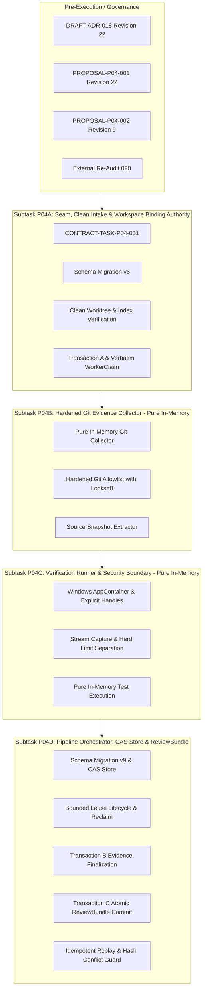

# PLAN-P04: Evidence & Review Engine Implementation & Governance Plan

> **Plan ID**: `PLAN-P04-EVIDENCE-REVIEW`
> **Revision**: 22
> **Status**: `PLANNING_PENDING_EXTERNAL_AUDIT (REVISION 22)`
> **Date**: 2026-09-27
> **Audited Baseline**: `64ff30a9d228303cd3da92e006cbe3e8a7e216b4`
> **Active Gate**: `P04_PRECONTRACT_ARCHITECTURE_REMEDIATION_21`
> **Deciders**: AI Engineering Supervisor Architecture Council, External Supervisor
> **Related Architecture**: `docs/04_ARCHITECTURE.md` (Section 7), `docs/05_DOMAIN_MODEL.md`, `docs/10_REVIEW_BUNDLE.md`
> **Related Requirements**: `docs/02_REQUIREMENTS.md` (FR-008, NFR-008 via PROPOSAL-P04-002 Revision 9)
> **Supersedes**: `PLAN-P04-EVIDENCE-REVIEW` Revision 21
> **External Audit Tracking**: Remediates Findings `P04-ARCH-R21-001`, `P04-ARCH-R21-002`, and `P04-ARCH-R21-003` (`docs/audits/P04_PRECONTRACT_ARCHITECTURE_EXTERNAL_REAUDIT_020.md`).

---

## 1. Overview and Phasing Strategy

Phase P04 implements the **Evidence & Review Engine**, providing independent, tamper-proof verification of AI worker outputs under canonical architecture (`docs/04_ARCHITECTURE.md` Section 7) and requirements (`docs/02_REQUIREMENTS.md`).

### 1.1. Execution Flowchart & Subtask Dependency Graph

```mermaid
flowchart TD
    subgraph PreExecution [Pre-Execution / Governance]
        ADR18[DRAFT-ADR-018 Revision 22]
        PROP1[PROPOSAL-P04-001 Revision 22]
        PROP2[PROPOSAL-P04-002 Revision 9]
        Audit020[External Re-Audit 020]
    end

    subgraph P04A [Subtask P04A: Seam, Clean Intake & Workspace Binding Authority]
        P04A_Contract[CONTRACT-TASK-P04-001]
        P04A_Mig[Schema Migration v6]
        P04A_Clean[Clean Worktree & Index Verification]
        P04A_Intake[Transaction A & Verbatim WorkerClaim]
    end

    subgraph P04B [Subtask P04B: Hardened Git Evidence Collector - Pure In-Memory]
        P04B_Collector[Pure In-Memory Git Collector]
        P04B_Allowlist[Hardened Git Allowlist with Locks=0]
        P04B_Snapshot[Source Snapshot Extractor]
    end

    subgraph P04C [Subtask P04C: Verification Runner & Security Boundary - Pure In-Memory]
        P04C_Sandbox[Windows AppContainer & Explicit Handles]
        P04C_Stream[Stream Capture & Hard Limit Separation]
        P04C_Execution[Pure In-Memory Test Execution]
    end

    subgraph P04D [Subtask P04D: Pipeline Orchestrator, CAS Store & ReviewBundle]
        P04D_Mig[Schema Migration v9 & CAS Store]
        P04D_Lease[Bounded Lease Lifecycle & Reclaim]
        P04D_TxB[Transaction B Evidence Finalization]
        P04D_TxC[Transaction C Atomic ReviewBundle Commit]
        P04D_Replay[Idempotent Replay & Hash Conflict Guard]
    end

    PreExecution --> P04A
    P04A --> P04B
    P04B --> P04C
    P04C --> P04D
```

### 1.2. Key Architectural Invariants
1. **Model 1 Persistence Ownership Discipline (P04-ARCH-R10-002, P04-ARCH-R16-001, P04-ARCH-R19-001, P04-ARCH-R20-001, P04-ARCH-R20-002)**:
   - Subtask P04A is the sole persistence owner of Schema Migration v6 (`attempt_workspace_bindings`, `worker_claims`, `review_integrity_holds`), the controlled extension of the `PrepareBoundDispatch` store seam (combining bound dispatch allocation with workspace binding creation into a single atomic transaction), Transaction A, and intake/pre-send diagnostic transactions.
   - Host/coordinator boundary owns `WorkspaceBindingAuthority` and `WorkspaceBindingLease`, managing physical Win32 directory handles (`FILE_READ_ATTRIBUTES | FILE_FLAG_BACKUP_SEMANTICS`, omitting `FILE_SHARE_DELETE`) and 128-bit `FileIdInfo` capture. Store receives only immutable snapshots (`WorkspaceBindingSnapshot`) and executes database lineage/CAS checks; Store never accesses Win32 handles or directory paths directly and never claims to prove live lease authority. A single coordinator effect gate (`Coordinator.Dispatch` in `internal/dispatch/coordinator.go`) owns the AO `DispatchTaskContract` boundary, holding the live lease across the entire sequence.
   - Subtasks P04B and P04C are pure in-memory collectors with ZERO SQLite writes, ZERO audit event appends, and ZERO hold mutations.
   - Subtask P04D is the sole persistence owner of Schema Migration v9 (`task_verification_leases`, `evidence_sets`, `review_artifacts`, `review_bundles`), Content-Addressed Store, leases, Transaction B, Transaction C, and hold resolution orchestration (reusing Schema v6 `review_integrity_holds` without duplicate DDL).
   - Audit events are appended exclusively by their authoritative transaction owner to guarantee database atomicity; no two subtasks share ownership of a single transaction.
2. **Complete Lineage, Immutability & Content-Address Equality (P04-ARCH-R10-001)**:
   - All tables enforce foreign keys and lineage triggers across task, attempt, and contract.
   - Immutable delete and update triggers prevent tampering with historical records.
   - `canonical_relative_path = 'artifacts/' || substr(captured_sha256, 1, 2) || '/' || captured_sha256` is strictly verified.
3. **Mathematical Lease & Stream Bounds (P04-ARCH-R10-004)**:
   - Lease expires exactly at `acquired_at_epoch_ms + ttl_seconds * 1000`.
   - CAS trigger enforces allowed lease state transitions and fencing token increments on reclaim.
   - Stream state combinations strictly checked against capture limit (10 MB) and hard safety limit (50 MB).
4. **Crash-Safe Latency Metrics & Pre-Commit Assembly Boundary (P04-ARCH-R10-003, P04-ARCH-R18-001, P04-ARCH-R18-002)**:
   - Measurement boundary strictly measures ReviewBundle assembly and validation before Transaction C commit.
   - Telemetry captures commit return duration via post-commit in-process monotonic measurement after `tx.Commit()` returns; it is strictly excluded from `REVIEW_BUNDLE_GENERATED` audit events, database tables, and the audit chain.
   - Truth table CHECK constraints and decoupled provenance eliminate SQLite persistence deadlocks.
5. **Canonical TaskState & Pre-Send Lifecycle Discipline (P04-ARCH-R10-005, P04-ARCH-R20-001, P04-ARCH-R20-002)**:
   - Zero compound states or transitions outside `docs/06_WORKFLOW_STATE_MACHINE.md`.
   - Dirty report intake preserves `RUNNING` state.
   - Pre-send binding rejection strictly preserves `DISPATCHED` task state, `DISPATCH_BOUND` operation stage, and leaves `task_attempts` open pending governed operator resolution; `/send` is forbidden.
   - Pre-send diagnostic transaction atomically: (1) appends `REVIEW_INTEGRITY_CONFLICT` (Variant B: `conflict_source = 'WORKSPACE_BINDING_GUARD'`, `conflict_type = 'LINEAGE_MISMATCH'`, `attempted_reason = '<literal>'`, `colliding_event_id` strictly absent), (2) inserts `ACTIVE` hold into `review_integrity_holds` (`hold_reason = 'INVARIANT_MISMATCH'`), and (3) CAS invalidates `attempt_workspace_bindings` to `INVALIDATED` if active.
   - Hash conflict at `REVIEWING` preserves `REVIEWING` state while locking automated approval.

---

## 2. Decoupling of Historical Proof Track & Runtime Validation

Phase P04 strictly maintains the two-track validation discipline:
1. **Automated CI / Test Suite Track**:
   - Pure in-memory unit and integration tests verifying schema migrations, DDL constraints, state transitions, JCS serialization, and error branches.
   - Executes across all development environments and automated test runners.
2. **Real Windows OS Security Boundary Track**:
   - Integration tests executing actual `CreateProcessW` calls with `STARTUPINFOEXW`, `PROC_THREAD_ATTRIBUTE_HANDLE_LIST`, `PROC_THREAD_ATTRIBUTE_JOB_LIST`, and AppContainer SIDs on physical Windows hosts.
   - Host-managed `WorkspaceBindingAuthority` tests validating anti-rename sharing flags (`FILE_SHARE_READ | FILE_SHARE_WRITE`, omitting `FILE_SHARE_DELETE`) and 128-bit `FileIdInfo` query on NTFS/ReFS filesystems.

---

## 3. Work Breakdown Structure (Subtasks P04A – P04D)

### 3.1. Subtask P04A: Dispatch Seam, Clean Intake & Workspace Binding Authority (P04-ARCH-R16-001, P04-ARCH-R19-001, P04-ARCH-R20-001, P04-ARCH-R20-002)
- **Objective**: Implement host-boundary `WorkspaceBindingAuthority`, unified Bound Dispatch + Workspace Binding Transaction owning the controlled extension of the `PrepareBoundDispatch` store seam, pre-send binding revalidation in `RecordSendRequested`, pre-send atomic diagnostic transaction on binding failure, and Transaction A report intake upon worker completion.
- **Scope**:
  - Implement host-boundary `WorkspaceBindingAuthority` and `WorkspaceBindingLease`:
    * `Acquire(ctx, candidate) -> (WorkspaceBindingLease, error)`
    * Opens worktree root and linked gitdir using Win32 `CreateFileW` with `FILE_READ_ATTRIBUTES` and `FILE_FLAG_BACKUP_SEMANTICS`.
    * Share mode strictly sets `FILE_SHARE_READ | FILE_SHARE_WRITE` and **omits `FILE_SHARE_DELETE`** to block directory rename, deletion, or root replacement during the effect window.
    * Queries canonical final path via `GetFinalPathNameByHandleW` and 128-bit `FILE_ID_INFO` via `GetFileInformationByHandleEx(FileIdInfo)`. Fails closed if filesystem/API does not provide reliable identity.
    * Returns immutable `WorkspaceBindingSnapshot`. Capability is valid strictly within process lifetime (zero persisted authority tokens).
    * `Revalidate() error`: verifies held handles remain valid, path has not changed, and file identity matches immutable snapshot.
    * `Close() error`: idempotent cleanup closing both handles; always called in `defer`.
  - Single Coordinator Effect Gate & Handle Lifetime Across Dispatch (P04-ARCH-R21-001):
    * Exclusively owned by `Coordinator.Dispatch` in `internal/dispatch/coordinator.go` managing AO `DispatchTaskContract`.
    * Single continuous call frame holding `WorkspaceBindingLease` in exact 9-step sequence:
      1. `authority.Acquire(ctx, candidate)` -> live `lease` (Win32 handles open).
      2. Extract immutable `WorkspaceBindingSnapshot`.
      3. Commit `store.PrepareBoundDispatch` with snapshot.
      4. Observe fresh `GetWorkerStatus` from AO client.
      5. Revalidate live lease: `lease.Revalidate()`.
      6. Commit `store.RecordSendRequested` with pure DB guards.
      7. Call AO `/send` while lease remains open.
      8. Commit confirmed or containment transition.
      9. Close lease in `defer`.
    * Zero public paths accept snapshot only to invoke `/send`.
    * Store layer checks DB rows only and never claims to prove live lease capability.
    * Daemon restart recovery acquires fresh lease; persisted tokens or DB rows never grant effect authority.
  - Daemon Restart Recovery:
    * Recovery scanner reopens worktree root and linked gitdir from durable canonical paths using `WorkspaceBindingAuthority`.
    * Compares exact `VolumeSerialNumber` and `FileIdInfo` against persisted `attempt_workspace_bindings` row.
    * Resumes pre-send recovery only upon exact match. Persisted database row or prior handle token is never accepted as physical proof.
  - Implement Schema Migration v6: `attempt_workspace_bindings` (with lineage trigger requiring `dispatch_operations.stage = 'DISPATCH_BOUND'`), `worker_claims`, AND `review_integrity_holds` (including triggers and partial unique active index).
  - Implement controlled extension of Store dispatch seam `PrepareBoundDispatch`:
    * Pre-transaction OS handle acquisition via `WorkspaceBindingAuthority.Acquire`. Fails closed on handle or identity failure (no attempt created).
    * Single atomic SQLite transaction executing in exact sequence:
      1. Guard verification (Task `READY`, latest frozen contract, Pair active lane & quarantine/provisioning clean)
      2. TaskAttempt allocation (`task_attempts`) with immutable session/generation snapshot
      3. Dispatch operation creation (`dispatch_operations` with `stage = 'DISPATCH_BOUND'`)
      4. Workspace binding creation (`attempt_workspace_bindings` with `binding_state = 'ACTIVE'`)
      5. Append audit `TASK_DISPATCH_BOUND`
      6. Append audit `WORKSPACE_BINDING_CREATED`
      7. CAS update `tasks` (`READY -> DISPATCHED`) and increment `current_attempt`
      8. Commit single transaction.
    * Rollback atomicity guarantee: any failure prior to commit rolls back the entire transaction; zero orphaned attempts, operations, bindings, or audits; task remains in `READY` state.
  - Implement Full Enumeration of 14 Guards in `RecordSendRequested`:
    1. `dispatch_operations.stage = 'DISPATCH_BOUND'`
    2. `dispatch_operations.resolution_state IS NULL`
    3. `task_attempts.recovery_disposition IS NULL`
    4. `tasks.state = 'DISPATCHED'`
    5. Exact current open attempt (`ended_at IS NULL`)
    6. Exact task/contract/Pair/session/generation lineage match across task, attempt, and dispatch operation
    7. Current `WorkerSession` identity matches and `quarantine_state = 'CLEAN'`
    8. Current `TaskAttempt` `quarantine_state = 'CLEAN'`
    9. Exact P03 Restore Guard: `NOT EXISTS (SELECT 1 FROM pair_restore_operations WHERE pair_id = ? AND resolution_state <> 'RESTORE_RESOLVED')`
    10. Exact P03 Provisioning Guard: `NOT EXISTS (SELECT 1 FROM pair_provisioning_operations WHERE pair_id = ? AND stage IN ('PROVISION_REQUESTED','PROVISION_FAILED'))`
    11. Fresh AO observation is idle or waiting_input (not terminated)
    12. Exactly one `attempt_workspace_bindings` row with `binding_state = 'ACTIVE'` for attempt
    13. Live `WorkspaceBindingLease.Revalidate()` PASS (exact path, handle, VolumeSerialNumber, FileIdInfo match)
    14. Zero `ACTIVE` holds in `review_integrity_holds` for attempt
  - Standardized Attempted Reason Literals:
    * `WORKSPACE_BINDING_MISSING`
    * `WORKSPACE_BINDING_LINEAGE_MISMATCH`
    * `WORKSPACE_BINDING_NOT_ACTIVE`
    * `WORKSPACE_BINDING_PHYSICAL_IDENTITY_MISMATCH`
  - Pre-Send Failure Semantics & Atomic Diagnostic Transaction:
    * When binding guard fails: `/send` is strictly forbidden, Task remains `DISPATCHED`, operation remains `DISPATCH_BOUND`, attempt remains open.
    * Separate atomic diagnostic transaction (Variant B: `WORKSPACE_BINDING_GUARD`): (1) appends `REVIEW_INTEGRITY_CONFLICT` (`conflict_source = 'WORKSPACE_BINDING_GUARD'`, `dispatch_operation_id = '<op_id>'`, `attempted_reason = '<literal>'`, `conflict_type = 'LINEAGE_MISMATCH'`, `colliding_event_id` strictly absent, actor `ai-supervisor-daemon`, role `SUPERVISOR`), (2) inserts `ACTIVE` hold into `review_integrity_holds` (`hold_reason = 'INVARIANT_MISMATCH'`), and (3) CAS invalidates binding (`binding_state = 'INVALIDATED'`, `released_at_epoch_ms = now`) if active row exists. Pipeline conflicts in P04D must never CAS mutate workspace bindings.
    * Failure of diagnostic transaction maintains fail-closed send rejection; zero fallback to dispatch.
  - Governed Terminal Resolution Rules:
    * Recreating or backfilling bindings for existing `DISPATCH_BOUND` attempt is forbidden.
    * Resolving hold does not restore send permission.
    * Verified operator must terminalize attempt via `DISPATCHED -> FAILED` with `recovery_disposition = 'WORKSPACE_BINDING_INTEGRITY_FAILURE'`; only then may the integrity hold be resolved.
    * Retry requires allocating a brand-new `TaskAttempt` and a new workspace binding. Fails closed without `VERIFIED_OPERATOR_PRINCIPAL`.
  - Falsification Tests Planned for P04A:
    * Worktree root rename/deletion between validation and SEND_REQUESTED rejected by OS (sharing violation `ERROR_SHARING_VIOLATION`).
    * Directory substitution probes via junctions, symlinks, subst, or rename fail physical identity verification (`FileIdInfo` mismatch; NTFS directory hardlinks are unsupported).
    * Daemon restart invalidates in-memory lease capability; reacquire and reopen required.
    * Reacquire with identical VolumeSerialNumber and FileIdInfo passes; differing identity fails closed.
    * Fake snapshot without live lease cannot obtain `/send` authorization (call count to AO remains zero).
    * Lease close or revalidation failure strictly forbids `SEND_REQUESTED` and `/send`.
    * Lease cleanup idempotent on success, failure, cancellation, and panic defer.
    * Diagnostic transaction rollback leaves zero orphan audit events or partial holds.
  - Implement pre-intake cleanliness probe: invoke `git status --porcelain=v1 -z --untracked-files=all` and `git diff-index --quiet HEAD --` with `GIT_OPTIONAL_LOCKS=0`.
  - If dirty, roll back Transaction A, preserve task state `RUNNING` (strictly zero blanket transitions to `BLOCKED`). In a separate diagnostic transaction executed after rollback: (1) derives non-self-referencing `hold_id = 'hold-' + SHA256(RFC8785_JCS(hold_identity_descriptor))` using `kind='review_integrity_hold'`, `hold_reason='DIRTY_WORKTREE_DETECTED'`, and `occurrence_number`; (2) derives `rejection_event_id = SHA256(RFC8785_JCS(rejection_event_identity_descriptor))` including pre-computed `hold_id`; (3) appends rejection audit event `EVIDENCE_COLLECTION_FAILED` to `audit_events` first (`actor = 'ai-supervisor-daemon'`, `details_json.actor_role = 'SUPERVISOR'`); (4) inserts an ACTIVE hold row into `review_integrity_holds` (`hold_reason = 'DIRTY_WORKTREE_DETECTED'`) in the same diagnostic transaction. If any step fails, the entire diagnostic transaction rolls back atomically.
  - Implement shared hold creation primitives and Descriptors A and B.
  - Implement behavior tests for dirty intake, replay, occurrence increment, and rollback atomicity.
  - Implement `WorkerReport` schema validation via Go JSON schema engine.
  - Implement RFC 8785 JCS canonicalization.
  - Store verbatim `reported_head_sha` (`CHECK (LENGTH BETWEEN 7 AND 40)`).
  - Update `attempt_workspace_bindings` to `RETAINED_FOR_VERIFICATION` via CAS.
  - Atomically transition `tasks.state`: `RUNNING -> REPORT_READY`.
  - **Admission Guard**: Completing Subtask P04A does NOT open runtime admission for Phase P04. The sequence P04A -> P04B -> P04C -> P04D is strictly preserved.
- **Target Schema**: Migration v6 (Owned by Subtask P04A).

### 3.2. Subtask P04B: Hardened Git Evidence Collector (Pure In-Memory)
- **Objective**: Implement in-memory Git evidence collection and immutable source snapshot extraction.
- **Scope**:
  - Enforce hardened Git allowlist with `GIT_OPTIONAL_LOCKS=0` (includes `git rev-parse --absolute-git-dir`).
  - Implement tree walk snapshot extraction using `git ls-tree -rz --full-tree` and `git cat-file --batch`.
  - Apply read-only ACLs to snapshot directory (`GENERIC_READ | GENERIC_EXECUTE`).
  - Resolve linked worktree index paths via `git rev-parse --git-path index`.
  - Collect `actual_base_sha`, `actual_head_sha`, `actual_changed_files`, and `diff_stat`.
  - **Zero SQLite Writes**: Returns `GitEvidenceResult` in memory.
- **Dependencies**: Subtask P04A.

### 3.3. Subtask P04C: Verification Runner & Security Boundary (Pure In-Memory)
- **Objective**: Execute verification test commands inside isolated Windows AppContainers.
- **Scope**:
  - Implement Windows process creation with `bInheritHandles = TRUE`, explicit handle attribute lists (`PROC_THREAD_ATTRIBUTE_HANDLE_LIST`), atomic Job Object assignment (`PROC_THREAD_ATTRIBUTE_JOB_LIST`), and `JOB_OBJECT_LIMIT_KILL_ON_JOB_CLOSE`.
  - Provide process join and termination verification for authoritative process-death proof.
  - Stream capture with separation between capture limit (10 MB) and hard safety limit (50 MB).
  - **Zero SQLite Writes**: Returns `TestEvidenceResult` and artifact streams in memory to P04D.
- **Dependencies**: Subtask P04B.

### 3.4. Subtask P04D: Pipeline Orchestrator, CAS Store & ReviewBundle (P04-ARCH-R16-001)
- **Objective**: Centralized CAS orchestrator for Schema Migration v9 (`task_verification_leases`, `evidence_sets`, `review_artifacts`, `review_bundles`), leases, Transaction B, Transaction C, ReviewBundle synthesis, and hold resolution orchestration.
- **Scope**:
  - Implement Schema Migration v9 with explicit integer typing (`CHECK (typeof(col) = 'integer')`) and arithmetic overflow guards (`acquired_at <= MaxInt64 - ttl*1000`, `fencing_token <= MaxInt64`, `hard_safety <= MaxInt64 - 1`). Schema v9 upgrades from Schema v6 and reuses `review_integrity_holds` without duplicate DDL.
  - Implement Linear Lease Chain: eliminate `RECLAIMED` mutation; predecessor leases remain permanently `EXPIRED`; each lease row references immutable predecessor via `predecessor_lease_id TEXT NULL UNIQUE`; token monotonicity (`token = pred.token + 1`); single active lease partial index.
  - Enforce authoritative process-death proof requirement for lease reclaim (joined Job Object/process handle within daemon or host exclusivity + kill-on-close across restart).
  - Implement durable integrity hold orchestration reusing Schema v6 `review_integrity_holds` table with `diagnostic_fingerprint` (64-char lowercase hex SHA-256), `occurrence_number INTEGER NOT NULL CHECK (typeof(occurrence_number) = 'integer' AND occurrence_number > 0)`, `UNIQUE(attempt_id, hold_reason, diagnostic_fingerprint, occurrence_number)`, foreign key audit references (`rejection_audit_event_id UNIQUE REFERENCES audit_events(event_id) ON DELETE RESTRICT`, `resolution_audit_event_id UNIQUE REFERENCES audit_events(event_id) ON DELETE RESTRICT`), non-empty/non-whitespace principal check (`LENGTH(TRIM(resolved_by_principal)) > 0`), partial unique index `idx_review_integrity_holds_active_dedup` on `(attempt_id, hold_reason, diagnostic_fingerprint) WHERE hold_state = 'ACTIVE'`, two-step non-self-referencing descriptor derivation (Descriptor A for `hold_id`, Descriptor B for `rejection_event_id`), atomic creation transaction (audit first, then hold), atomic resolution transaction with deterministic `resolution_event_id` (Descriptor C), CAS `affected_rows == 1`, lost response idempotent retry, zero orphan audit events on lost CAS races, recurrence lifecycle (after resolution, re-observation creates occurrence N+1 with distinct audit event, admission remains closed), fail-closed runtime constraint on `VERIFIED_OPERATOR_PRINCIPAL`, pipeline fail-closed on `EXISTS` any active hold, and startup recovery loading active holds before opening admission.
  - Content-Addressed Store staging, deduplication, and atomic write-through to `artifacts/<first-two-hex>/<captured_sha256>`.
  - Execute Transaction B: exact CAS `(lease_id, worker_id, fencing_token, state='ACTIVE')`, commit `evidence_sets` and `review_artifacts`, release lease, transition `tasks.state`: `REPORT_READY -> EVIDENCE_READY`.
  - Synthesize RFC 8785 JCS canonical `ReviewBundle` JSON payload; compute SHA-256 bundle hash.
  - Record pre-commit assembly latency metrics (`compilation_latency_ms = bundle_assembled_at_epoch_ms - evidence_finalized_at_epoch_ms`) as assembly diagnostic interval, with structural provenance `latency_measurement_status` (`'MEASURED_IN_PROCESS'` vs `'RECOVERED_AFTER_RESTART'` per 2x2 matrix) and `nfr008_compliance_status = 'UNVERIFIED'`.
  - Implement canonical replay/conflict matrix:
    * Compile failure: Transaction C rolls back, task remains `EVIDENCE_READY`, emits `REVIEW_BUNDLE_COMPILATION_REJECTED`.
    * Idempotent replay: Returns existing bundle, task remains `REVIEWING`.
    * Hash conflict: Tampering conflict, task remains `REVIEWING`, Transaction C rolls back, emits `REVIEW_BUNDLE_COMPILATION_REJECTED` (`BUNDLE_HASH_CONFLICT`), locks automated approval.
    * Invariant violation: Transaction C rolls back, current task state is strictly preserved (strictly zero transitions to `BLOCKED`), in a separate diagnostic transaction appends rejection audit event `REVIEW_BUNDLE_COMPILATION_REJECTED` (`INVARIANT_MISMATCH`) first (`actor = 'ai-supervisor-daemon'`, `details_json.actor_role = 'SUPERVISOR'`), then inserts an ACTIVE hold into `review_integrity_holds` (`hold_reason = 'INVARIANT_MISMATCH'`), closes admission and approval, requires authenticated human operator reconciliation. Replay comparison on UNIQUE `event_id` conflict validates sanitized canonical fields (`event_type`, `pair_id`, `task_id`, `contract_id`, `attempt_id`, `actor`, `details_json`), explicitly ignoring `sequence`, `timestamp`, `prev_hash`, `event_hash`.
  - Execute Transaction C atomically: insert `review_bundles`, insert proposed audit event `REVIEW_BUNDLE_GENERATED` (*without* `commit_duration_ms`), transition `tasks.state`: `EVIDENCE_READY -> REVIEWING`. Capture post-commit duration telemetry purely as best-effort in-process monotonic measurement outside the database and audit chain.
- **Dependencies**: Subtask P04C.

---

## 4. Crash Consistency & Replay Matrix

| Failure Point | State Before Crash | Recovery Action on Restart | Canonical Resulting State |
| :--- | :--- | :--- | :--- |
| Crash before commit of Bound Dispatch Tx | `READY` | Entire transaction rolls back; task remains `READY`; zero orphan records | `READY` (Preserved) |
| Crash after commit of Bound Dispatch Tx | `DISPATCHED` | `DISPATCH_BOUND` operation and `ACTIVE` binding coexist; recovery reacquires handles, matches VolumeSerialNumber/FileIdInfo before proceeding | `DISPATCHED` (Recoverable) |
| Guard rejection before diagnostic commit | `DISPATCHED` | Pre-send guard fails; diagnostic transaction has not executed; task remains `DISPATCHED`; retry/next attempt re-evaluates guard | `DISPATCHED` (Send Blocked) |
| Diagnostic transaction rollback | `DISPATCHED` | Diagnostic transaction encounters SQLite error; rolls back atomically; zero partial holds/audits; send remains strictly blocked | `DISPATCHED` (Send Blocked) |
| Lost diagnostic response | `DISPATCHED` | Caller re-evaluates; detects existing ACTIVE hold and INVALIDATED binding via deterministic fingerprint; returns idempotent success | `DISPATCHED` (Hold ACTIVE; Send Blocked) |
| Concurrent diagnostic callers | `DISPATCHED` | First caller appends audit, inserts hold, CAS invalidates binding. Second caller encounters duplicate key or active hold; reads back matching diagnostic state | `DISPATCHED` (Hold ACTIVE; Single Hold Record) |
| Binding invalidation CAS lost race | `DISPATCHED` | Invalidation CAS detects binding already `INVALIDATED`; proceeds safely without error | `DISPATCHED` (Binding INVALIDATED) |
| Operator resolution before attempt terminalization | `DISPATCHED` | Attempt is still `DISPATCHED`; resolution guard rejects resolution attempt until task is terminalized (`DISPATCHED -> FAILED`) | `DISPATCHED` (Resolution Rejected; Hold ACTIVE) |
| Retry after governed failure | `FAILED` | Retry creates a brand-new `TaskAttempt` and a new workspace binding; historical failed attempt and invalidated binding are never reused | New Attempt in `READY`/`DISPATCHED` |
| Missing / mismatched / `INVALIDATED` binding (Variant B) | `DISPATCHED` | `RecordSendRequested` fail-closed guard forbids send; atomic diagnostic transaction records `REVIEW_INTEGRITY_CONFLICT` (`conflict_source = 'WORKSPACE_BINDING_GUARD'`), `ACTIVE` hold, CAS invalidates binding to `INVALIDATED` | `DISPATCHED` (Hold ACTIVE; Binding INVALIDATED; Send Blocked) |
| Audit event collision (Variant A) | Any | Unique event_id collision with semantic mismatch; atomic diagnostic transaction records `REVIEW_INTEGRITY_CONFLICT` (`conflict_source = 'AUDIT_EVENT_ID_COLLISION'`), `ACTIVE` hold; strictly zero binding mutation | Current State Preserved (Hold ACTIVE; Binding Unchanged) |
| Replay with identical binding | `DISPATCHED` | Idempotent readback comparison succeeds without state mutation | Current State Preserved |
| Replay with mismatched identity or lineage | `DISPATCHED` | Integrity guard rejects replay; fails closed | Integrity Conflict |
| Crash during worker execution | `RUNNING` | P03 host recovery detects unconfirmed worker; lease expired | `FAILED` |
| Dirty worktree at report intake | `RUNNING` | Transaction A rolls back; task state preserved; ACTIVE hold inserted in diagnostic Tx | `RUNNING` (Preserved; Admission Closed) |
| Invariant corruption during compilation | Any non-`REVIEWING` | Transaction C rolls back; task state preserved; ACTIVE hold inserted in diagnostic Tx | Current State Preserved (Admission Closed; Human Reconciliation Required) |
| Crash after Transaction A | `REPORT_READY` | P04D linear lease reclaim: verified process-death proof (host exclusivity + `KILL_ON_JOB_CLOSE`) allocates successor lease (`token = pred + 1`) | `REPORT_READY` (Reclaimable via linear successor) |
| Verification process exceeds hard limit | `REPORT_READY` | Process terminated; `stream_state = 'HARD_LIMIT_TERMINATED'`, `full_stream_sha256 = NULL` | `REPORT_READY` -> `EVIDENCE_READY` (Via Tx B) |
| Crash after Transaction B | `EVIDENCE_READY` | P04D orchestrator synthesizes ReviewBundle; records `latency_measurement_status = 'RECOVERED_AFTER_RESTART'`, `nfr008_compliance_status = 'UNVERIFIED'` | `REVIEWING` (No deadlock) |
| Transaction C compilation delay > 3.0s | `EVIDENCE_READY` | Transaction C commits with assembly diagnostic, logs diagnostic finding, retains structural provenance | `REVIEWING` (No deadlock) |
| ReviewBundle replay with identical hash | `REVIEWING` | Idempotent return of existing ReviewBundle | `REVIEWING` (Preserved) |
| ReviewBundle replay with conflicting hash | `REVIEWING` | Integrity conflict logged; Transaction C aborted; approval locked | `REVIEWING` (Preserved; human resolution required) |

---

## 5. Requirement Reconciliation Matrix

| Requirement | Canonical Spec Source | Reconciliation Status in Phase P04 |
| :--- | :--- | :--- |
| **FR-008** | `docs/02_REQUIREMENTS.md` | Fully satisfied via independent in-memory Git and verification collectors. |
| **NFR-008** | `docs/02_REQUIREMENTS.md` | Formally reconciled via PROPOSAL-P04-002 Revision 9 into assembly diagnostic latency semantics with crash-safe non-deadlocking persistence, UNVERIFIED compliance status, and RFC 8785 JCS domain-separated event descriptors. Canonical update pending approval. |
| **P04 Schema v6** | `docs/adr/DRAFT-ADR-018` | Owned by Subtask P04A; introduces `attempt_workspace_bindings`, `worker_claims`, and `review_integrity_holds` (verbatim 7-40 hex SHA, multi-diagnostic holds with occurrence lifecycle, non-self-referencing hold derivation, audit FKs, principal trimming, integer typing). |
| **P04 Schema v9** | `docs/adr/DRAFT-ADR-018` | Owned by Subtask P04D; introduces `task_verification_leases` (linear lease chain), `evidence_sets`, `review_artifacts`, and `review_bundles` with integer typing and overflow guards; upgrades from Schema v6 without recreating `review_integrity_holds`. |
| **Contract Sequencing** | `docs/plans/PLAN-P04-EVIDENCE-REVIEW` | Enforces P04A -> P04B -> P04C -> P04D; P04A implements independently; P04 runtime admission remains closed until P04D startup recovery. |
