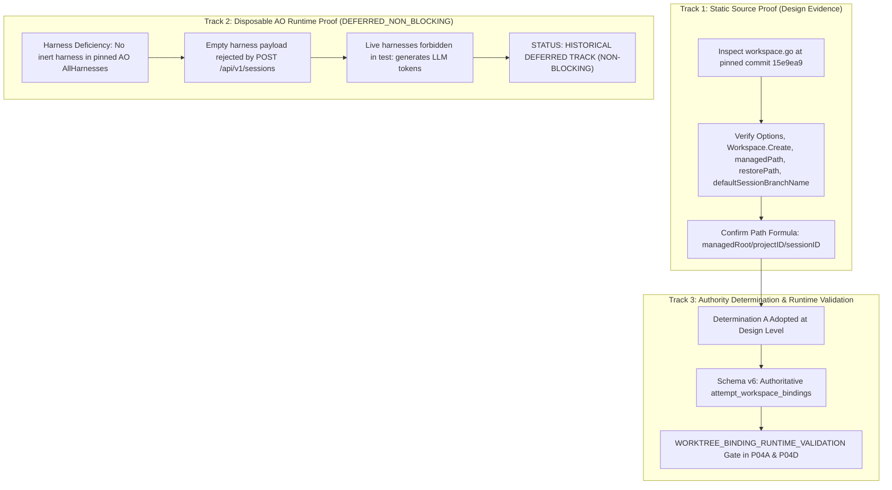

# PLAN: P04 Worktree Authority & Binding Empirical Proof

- **Plan ID:** `PLAN-P04-WORKTREE-BINDING-PROOF`
- **Revision:** 5
- **Status:** `HISTORICAL_DEFERRED_NON_BLOCKING`
- **Target Task:** `TASK-P04-WORKTREE-BINDING-PROOF` (Retired Non-Executable Draft)
- **Governing Proposal:** [`docs/proposals/PROPOSAL-P04-001-evidence-review-engine-boundaries.md`](../proposals/PROPOSAL-P04-001-evidence-review-engine-boundaries.md) (Revision 7)
- **Governing Architecture:** [`docs/adr/DRAFT-ADR-018-evidence-review-and-verification-isolation.md`](../adr/DRAFT-ADR-018-evidence-review-and-verification-isolation.md) (Revision 7)
- **Associated Contract:** [`docs/tasks/DRAFT_TASK_CONTRACT_P04_WORKTREE_BINDING_PROOF.md`](../tasks/DRAFT_TASK_CONTRACT_P04_WORKTREE_BINDING_PROOF.md) (`RETIRED_NON_EXECUTABLE_DRAFT`, status invariant: `NOT_RELEASED`)
- **Audit References:**
  - [`docs/audits/P04_PRECONTRACT_ARCHITECTURE_EXTERNAL_REAUDIT_005.md`](../audits/P04_PRECONTRACT_ARCHITECTURE_EXTERNAL_REAUDIT_005.md) (`REVISION_6_REQUIRED`)
  - [`docs/audits/P04_PRECONTRACT_ARCHITECTURE_EXTERNAL_REAUDIT_004.md`](../audits/P04_PRECONTRACT_ARCHITECTURE_EXTERNAL_REAUDIT_004.md) (`REVISION_5_REQUIRED`)
  - [`docs/audits/P04_PRECONTRACT_ARCHITECTURE_EXTERNAL_AUDIT_001_ERRATUM_003.md`](../audits/P04_PRECONTRACT_ARCHITECTURE_EXTERNAL_AUDIT_001_ERRATUM_003.md) (`FORMALLY_RECORDED`)
- **Date:** 2026-09-26

---

## 1. Problem Statement & Proof Objectives

In [`docs/audits/P04_PRECONTRACT_ARCHITECTURE_EXTERNAL_AUDIT_001.md`](../audits/P04_PRECONTRACT_ARCHITECTURE_EXTERNAL_AUDIT_001.md) through [`P04_PRECONTRACT_ARCHITECTURE_EXTERNAL_REAUDIT_005.md`](../audits/P04_PRECONTRACT_ARCHITECTURE_EXTERNAL_REAUDIT_005.md), the External Supervisor established the following definitive determinations:

1. **Static Authority Established**: Track 1 static source inspection of pinned AO commit `15e9ea971f1711ec8b50e157d6eb300db6cbe0d6` in canonical repository `Untrivial-ai/agent-orchestrator` conclusively proves the path formula `<managedRoot>/<projectID>/<sessionID>`, restore recreation logic, and default branch conventions (`ao/<sessionID>`).
2. **Disposable Runtime Proof Inexecutable (P04-ARCH-R5-001)**:
   - Pinned upstream AO defines only live agent CLI harnesses (`agy`, `codex`, `claude-code`, etc.). There is no user-selectable inert mock harness in `AllHarnesses`.
   - Test harness constant `HarnessFake="fake"` exists only in internal upstream unit tests and is rejected by public API validation.
   - `POST /api/v1/sessions` and the Supervisor's `CreateWorkerSession` require a non-empty `harness` parameter; payloads omitting `harness` fail upstream validation.
   - Running live agent CLIs in disposable test environments is forbidden because it triggers external LLM model token generation.
3. **Decoupling from Core Execution Graph (P04-ARCH-R6-002)**:
   - Disposable AO worker-session runtime testing is **NOT** a pre-contract release gate and does **NOT** block Subtask P04A.
   - This plan is preserved as a historical deferred non-blocking evidence track.
   - Operational worktree binding validation is transitioned into fail-closed **`WORKTREE_BINDING_RUNTIME_VALIDATION`** executed on authorized sessions during normal operation within Subtasks P04A and P04D.
   - The term "Stage B" is strictly reserved for `TaskContractValidator` semantic validation and `STAGE_B_RUNTIME_CATALOG`.
4. **Associated Contract Status**: `DRAFT_TASK_CONTRACT_P04_WORKTREE_BINDING_PROOF` is marked **`RETIRED_NON_EXECUTABLE_DRAFT`** (status invariant: `NOT_RELEASED`). No candidate is created.

---

## 2. Multi-Track Architecture Overview



---

## 3. Track 1 — Static Pinned Source Proof

### 3.1. Authoritative Upstream File & Pinned Commit
- **Authoritative Upstream Repository:** [`Untrivial-ai/agent-orchestrator`](https://github.com/Untrivial-ai/agent-orchestrator) ([`docs/sources/SOURCE_REGISTRY.md`](../sources/SOURCE_REGISTRY.md))
- **Pinned Commit:** `15e9ea971f1711ec8b50e157d6eb300db6cbe0d6` (v0.13.0)
- **Authoritative Target File:** `backend/internal/adapters/workspace/gitworktree/workspace.go`

### 3.2. Single Authoritative Line Citations & Official Permalinks
1. **Options Constructor & Defaults**:
   [`workspace.go#L64-L73`](https://github.com/Untrivial-ai/agent-orchestrator/blob/15e9ea971f1711ec8b50e157d6eb300db6cbe0d6/backend/internal/adapters/workspace/gitworktree/workspace.go#L64-L73)
   - Confirms `DefaultOptions()` sets `ManagedRoot: "workspace-managed"` as a relative path under the daemon working directory.
2. **`Workspace.Create` Implementation**:
   [`workspace.go#L230-L262`](https://github.com/Untrivial-ai/agent-orchestrator/blob/15e9ea971f1711ec8b50e157d6eb300db6cbe0d6/backend/internal/adapters/workspace/gitworktree/workspace.go#L230-L262)
   - Confirms signature `Create(ctx context.Context, project ports.Project, cfg ports.WorkspaceConfig) (string, error)`.
   - Computes managed path via `w.managedPath(cfg.SessionID, project.ID)`.
3. **`Workspace.Restore` Implementation**:
   [`workspace.go#L1045-L1112`](https://github.com/Untrivial-ai/agent-orchestrator/blob/15e9ea971f1711ec8b50e157d6eb300db6cbe0d6/backend/internal/adapters/workspace/gitworktree/workspace.go#L1045-L1112)
   - Recreate logic: Lines 1069–1111 characterize recreation of missing worktrees; lines 1113–1140 belong to `existingWorktree` handling.
4. **Path Resolution Helpers**:
   - `managedPath`: [`workspace.go#L1754-L1762`](https://github.com/Untrivial-ai/agent-orchestrator/blob/15e9ea971f1711ec8b50e157d6eb300db6cbe0d6/backend/internal/adapters/workspace/gitworktree/workspace.go#L1754-L1762)
   - `restorePath`: [`workspace.go#L1764-L1768`](https://github.com/Untrivial-ai/agent-orchestrator/blob/15e9ea971f1711ec8b50e157d6eb300db6cbe0d6/backend/internal/adapters/workspace/gitworktree/workspace.go#L1764-L1768)
   - `defaultSessionBranchName`: [`workspace.go#L1783-L1785`](https://github.com/Untrivial-ai/agent-orchestrator/blob/15e9ea971f1711ec8b50e157d6eb300db6cbe0d6/backend/internal/adapters/workspace/gitworktree/workspace.go#L1783-L1785)
   - Proves worktree directory is computed as `filepath.Join(w.opts.ManagedRoot, projectID, sessionID)` and branch name is `fmt.Sprintf("ao/%s", sessionID)`.

---

## 4. Track 2 — Disposable AO Runtime Proof (DEFERRED_NON_BLOCKING)

### 4.1. Defect Analysis (P04-ARCH-R5-001)
1. **Harness Absence**: Pinned AO `backend/internal/domain/harness.go` defines supported harnesses as live agent CLIs (`agy`, `codex`, `claude-code`, etc.). No inert mock harness exists in `AllHarnesses`.
2. **Wire Validation Rejection**: `POST /api/v1/sessions` requires a non-empty `harness` parameter. Payloads omitting `harness` fail upstream validation.
3. **Prohibition of Live Harnesses**: Invoking live agent CLIs in disposable test environments is forbidden because it triggers external LLM model token generation.
4. **Conclusion**: Disposable runtime testing cannot execute without a dedicated upstream inert test seam. Track 2 is formally **DEFERRED** as a non-blocking historical evidence track.

### 4.2. Containment Specification (Retained for WORKTREE_BINDING_RUNTIME_VALIDATION)
The containment and verification mechanics designed for Track 2 are retained as the authoritative specification for **`WORKTREE_BINDING_RUNTIME_VALIDATION`** during normal operation:
1. **OS Handle Containment**: Open `SUPERVISOR_STATE_ROOT` by handle (`GetFinalPathNameByHandleW`, `FILE_ID_INFO`, volume serial).
2. **Component-Boundary Checks**: Traversal via `filepath.Rel`. Prohibit raw string prefix matching.
3. **Physical Identity Verification**: Match volume serial number and 128-bit FileId against `attempt_workspace_bindings`.

---

## 5. Track 3 — Supervisor Authority Determination

### Determination A: Adopted at Design Level with WORKTREE_BINDING_RUNTIME_VALIDATION
The Supervisor adopts **Determination A**: Upstream AO possesses physical worktree authority. The Supervisor Control Plane registers durable, immutable attempt-level workspace bindings upon session materialization and enforces physical identity verification across the entire evidence lifecycle.

#### Authoritative Schema: `attempt_workspace_bindings` (Schema v6)
```sql
CREATE TABLE attempt_workspace_bindings (
    attempt_id TEXT PRIMARY KEY REFERENCES task_attempts(attempt_id) ON DELETE RESTRICT,
    task_id TEXT NOT NULL REFERENCES tasks(task_id) ON DELETE RESTRICT,
    contract_id TEXT NOT NULL REFERENCES task_contracts(contract_id) ON DELETE RESTRICT,
    session_id TEXT NOT NULL REFERENCES worker_sessions(session_id) ON DELETE RESTRICT,
    terminal_generation TEXT NOT NULL CHECK (LENGTH(terminal_generation) > 0),
    canonical_worktree_path TEXT NOT NULL CHECK (LENGTH(canonical_worktree_path) > 0),
    managed_root_final_path TEXT NOT NULL CHECK (LENGTH(managed_root_final_path) > 0),
    volume_serial_number TEXT NOT NULL CHECK (LENGTH(volume_serial_number) > 0),
    file_id TEXT NOT NULL CHECK (LENGTH(file_id) > 0),
    pinned_ao_commit TEXT NOT NULL CHECK (LENGTH(pinned_ao_commit) = 40 AND NOT (pinned_ao_commit GLOB '*[^0-9a-f]*')),
    bound_at TEXT NOT NULL CHECK (LENGTH(bound_at) > 0),
    FOREIGN KEY(contract_id, task_id) REFERENCES task_contracts(contract_id, task_id) ON DELETE RESTRICT
);

CREATE TRIGGER trg_attempt_workspace_bindings_lineage_guard
BEFORE INSERT ON attempt_workspace_bindings
FOR EACH ROW
BEGIN
    SELECT RAISE(ABORT, 'lineage mismatch: attempt_id does not match task_id or contract_id in task_attempts')
    WHERE NOT EXISTS (
        SELECT 1 FROM task_attempts a
        WHERE a.attempt_id = NEW.attempt_id
          AND a.task_id = NEW.task_id
          AND a.contract_id = NEW.contract_id
    );
END;

CREATE TRIGGER trg_attempt_workspace_bindings_no_update
BEFORE UPDATE ON attempt_workspace_bindings
BEGIN
    SELECT RAISE(ABORT, 'attempt_workspace_bindings is immutable and cannot be updated');
END;

CREATE TRIGGER trg_attempt_workspace_bindings_no_delete
BEFORE DELETE ON attempt_workspace_bindings
BEGIN
    SELECT RAISE(ABORT, 'attempt_workspace_bindings is immutable and cannot be deleted');
END;
```

---

## 6. Deliverables & Acceptance

1. **Design Deliverable**: Track 1 static inspection report incorporated as verified design evidence.
2. **Schema Deliverable**: Authoritative `attempt_workspace_bindings` (Schema v6) owned by Subtask P04A.
3. **Runtime Deliverable**: `WORKTREE_BINDING_RUNTIME_VALIDATION` fail-closed operational checks integrated into Subtasks P04A and P04D.
4. **Historical Status**: `PLAN-P04-WORKTREE-BINDING-PROOF` is preserved in `HISTORICAL_DEFERRED_NON_BLOCKING` status; Subtask P04A is unblocked.
