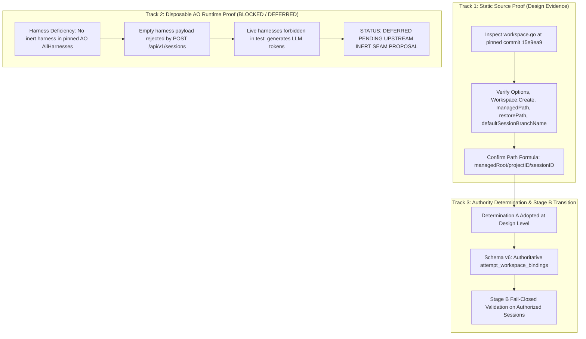

# PLAN: P04 Worktree Authority & Binding Empirical Proof

- **Plan ID:** `PLAN-P04-WORKTREE-BINDING-PROOF`
- **Revision:** 4
- **Status:** `PROPOSED_REVISED_NON_RUNTIME`
- **Target Task:** `TASK-P04-WORKTREE-BINDING-PROOF`
- **Governing Proposal:** [`docs/proposals/PROPOSAL-P04-001-evidence-review-engine-boundaries.md`](../proposals/PROPOSAL-P04-001-evidence-review-engine-boundaries.md) (Revision 6)
- **Governing Architecture:** [`docs/adr/DRAFT-ADR-018-evidence-review-and-verification-isolation.md`](../adr/DRAFT-ADR-018-evidence-review-and-verification-isolation.md) (Revision 6)
- **Associated Contract:** [`docs/tasks/DRAFT_TASK_CONTRACT_P04_WORKTREE_BINDING_PROOF.md`](../tasks/DRAFT_TASK_CONTRACT_P04_WORKTREE_BINDING_PROOF.md) (`BLOCKED_NOT_RELEASEABLE`, Model A Draft Lineage, status invariant: `NOT_RELEASED`)
- **Audit References:**
  - [`docs/audits/P04_PRECONTRACT_ARCHITECTURE_EXTERNAL_REAUDIT_004.md`](../audits/P04_PRECONTRACT_ARCHITECTURE_EXTERNAL_REAUDIT_004.md) (`REVISION_5_REQUIRED`)
  - [`docs/audits/P04_PRECONTRACT_ARCHITECTURE_EXTERNAL_REAUDIT_003.md`](../audits/P04_PRECONTRACT_ARCHITECTURE_EXTERNAL_REAUDIT_003.md) (`REVISION_4_REQUIRED`)
  - [`docs/audits/P04_PRECONTRACT_ARCHITECTURE_EXTERNAL_AUDIT_001_ERRATUM_003.md`](../audits/P04_PRECONTRACT_ARCHITECTURE_EXTERNAL_AUDIT_001_ERRATUM_003.md) (`FORMALLY_RECORDED`)
- **Date:** 2026-09-26

---

## 1. Problem Statement & Proof Objectives

In [`docs/audits/P04_PRECONTRACT_ARCHITECTURE_EXTERNAL_AUDIT_001.md`](../audits/P04_PRECONTRACT_ARCHITECTURE_EXTERNAL_AUDIT_001.md) through [`P04_PRECONTRACT_ARCHITECTURE_EXTERNAL_REAUDIT_004.md`](../audits/P04_PRECONTRACT_ARCHITECTURE_EXTERNAL_REAUDIT_004.md), the External Supervisor established that while static code inspection indicates worktree path formula `<managedRoot>/<projectID>/<sessionID>` and branch `ao/<sessionID>`, empirical proof of physical worktree binding has critical prerequisites:

1. **Static Authority Established**: Track 1 static source inspection of pinned AO commit `15e9ea971f1711ec8b50e157d6eb300db6cbe0d6` in canonical repository `Untrivial-ai/agent-orchestrator` conclusively proves the path formula, restore recreation logic, and default branch conventions.
2. **Disposable Runtime Proof Inexecutable (P04-ARCH-R5-001)**:
   - Pinned upstream AO defines only live agent CLI harnesses (`agy`, `codex`, `claude-code`, etc.). There is no user-selectable inert harness.
   - Test harness constant `HarnessFake="fake"` exists only in internal upstream unit tests and is rejected by public API validation.
   - `POST /api/v1/sessions` and the Supervisor's `CreateWorkerSession` require a non-empty `harness` parameter; payloads omitting `harness` fail upstream validation.
   - Running live agent CLIs in disposable test environments is forbidden because it triggers LLM model token generation.
3. **Architectural Transition**: Disposable AO worker-session runtime testing is **NOT** a pre-contract release gate. Track 1 static pinned-source inspection is retained as design evidence. Runtime physical worktree binding transitions into fail-closed **Stage B validation** executed on authorized sessions during normal operation.
4. **Associated Contract Status**: `DRAFT_TASK_CONTRACT_P04_WORKTREE_BINDING_PROOF` is marked **`BLOCKED_NOT_RELEASEABLE`** (status remains `NOT_RELEASED`). No candidate is created.

---

## 2. Multi-Track Architecture Overview

---

## 3. Track 1 — Static Pinned Source Proof

### 3.1. Authoritative Upstream File & Pinned Commit
- **Authoritative Upstream Repository:** [`Untrivial-ai/agent-orchestrator`](https://github.com/Untrivial-ai/agent-orchestrator) ([`docs/sources/SOURCE_REGISTRY.md`](../sources/SOURCE_REGISTRY.md))
- **Pinned Commit:** `15e9ea971f1711ec8b50e157d6eb300db6cbe0d6` (v0.13.0)
- **Authoritative Target File:** `backend/internal/adapters/workspace/gitworktree/workspace.go`

### 3.2. Single Authoritative Line Citations & Official Permalinks
1. **Options Constructor & Defaults**:
   [`workspace.go#L64-L73`](https://github.com/Untrivial-ai/agent-orchestrator/blob/15e9ea971f1711ec8b50e157d6eb300db6cbe0d6/backend/internal/adapters/workspace/gitworktree/workspace.go#L64-L73)
   - Confirms `DefaultOptions()` sets `ManagedRoot: "workspace-managed"` as a relative path under the daemon working directory.
2. **`Workspace.Create` Implementation**:
   [`workspace.go#L230-L262`](https://github.com/Untrivial-ai/agent-orchestrator/blob/15e9ea971f1711ec8b50e157d6eb300db6cbe0d6/backend/internal/adapters/workspace/gitworktree/workspace.go#L230-L262)
   - Confirms signature `Create(ctx context.Context, project ports.Project, cfg ports.WorkspaceConfig) (string, error)`.
   - Computes managed path via `w.managedPath(cfg.SessionID, project.ID)`.
3. **`Workspace.Restore` Implementation**:
   [`workspace.go#L1045-L1112`](https://github.com/Untrivial-ai/agent-orchestrator/blob/15e9ea971f1711ec8b50e157d6eb300db6cbe0d6/backend/internal/adapters/workspace/gitworktree/workspace.go#L1045-L1112)
   - Recreate logic: Lines 1069–1111 characterize recreation of missing worktrees; lines 1113–1140 belong to `existingWorktree` handling.
4. **Path Resolution Helpers**:
   - `managedPath`: [`workspace.go#L1754-L1762`](https://github.com/Untrivial-ai/agent-orchestrator/blob/15e9ea971f1711ec8b50e157d6eb300db6cbe0d6/backend/internal/adapters/workspace/gitworktree/workspace.go#L1754-L1762)
   - `restorePath`: [`workspace.go#L1764-L1768`](https://github.com/Untrivial-ai/agent-orchestrator/blob/15e9ea971f1711ec8b50e157d6eb300db6cbe0d6/backend/internal/adapters/workspace/gitworktree/workspace.go#L1764-L1768)
   - `defaultSessionBranchName`: [`workspace.go#L1783-L1785`](https://github.com/Untrivial-ai/agent-orchestrator/blob/15e9ea971f1711ec8b50e157d6eb300db6cbe0d6/backend/internal/adapters/workspace/gitworktree/workspace.go#L1783-L1785)
   - Proves worktree directory is computed as `filepath.Join(w.opts.ManagedRoot, projectID, sessionID)` and branch name is `fmt.Sprintf("ao/%s", sessionID)`.

---

## 4. Track 2 — Disposable AO Runtime Proof (BLOCKED / DEFERRED)

### 4.1. Defect Analysis (P04-ARCH-R5-001)
1. **Harness Absence**: Pinned AO `backend/internal/domain/harness.go` defines supported harnesses as live agent CLIs (`agy`, `codex`, `claude-code`, etc.). No inert mock harness exists in `AllHarnesses`.
2. **Wire Validation Rejection**: `POST /api/v1/sessions` requires a non-empty `harness` parameter. Payloads omitting `harness` fail upstream validation.
3. **Prohibition of Live Harnesses**: Invoking live agent CLIs in disposable test environments is forbidden because it triggers external LLM model token generation.
4. **Conclusion**: Disposable runtime testing cannot execute without a dedicated upstream inert test seam. Track 2 is formally **DEFERRED**.

### 4.2. Containment Specification (Retained for Stage B Validation)
The containment and verification mechanics designed for Track 2 are retained as the authoritative specification for **Stage B validation** during normal operation:
1. **OS Handle Containment**: Open `SUPERVISOR_STATE_ROOT` by handle (`GetFinalPathNameByHandleW`, `FILE_ID_INFO`, volume serial).
2. **Component-Boundary Checks**: Traversal via `filepath.Rel`. Prohibit raw string prefix matching.
3. **Physical Identity Verification**: Match volume serial number and 128-bit FileId against `attempt_workspace_bindings`.

---

## 5. Track 3 — Supervisor Authority Determination

### Determination A: Adopted at Design Level with Stage B Validation
- Static code inspection conclusively establishes deterministic path allocation formula `<managedRoot>/<projectID>/<sessionID>`.
- To bridge the runtime gap without inexecutable disposable proofs:
  1. **Schema v6**: The Supervisor introduces authoritative table `attempt_workspace_bindings` immutably recording VolumeSerialNumber and FileId.
  2. **Stage B Validation**: During authorized session execution, the Supervisor validates physical worktree binding directly via OS handle queries.
  3. **Fail-Closed Leases**: If the physical binding does not match `attempt_workspace_bindings`, the P04 evidence lease acquisition fails closed.

---

## 6. Deliverables & Acceptance

1. **Design Reconciliation**: Completed in `PROPOSAL-P04-001` (Rev 6), `DRAFT-ADR-018` (Rev 6), and `PLAN-P04-EVIDENCE-REVIEW` (Rev 6).
2. **Contract Status**: `DRAFT_TASK_CONTRACT_P04_WORKTREE_BINDING_PROOF` is marked `BLOCKED_NOT_RELEASEABLE` (status remains `NOT_RELEASED`).
3. **Runtime Proof**: Deferred to Stage B validation during normal authorized session operations.
