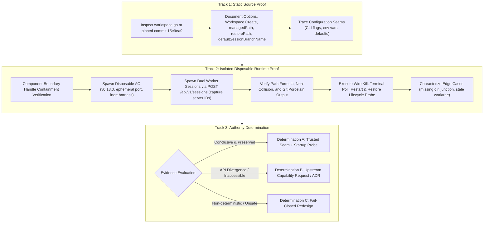

# PLAN: P04 Worktree Authority & Binding Empirical Proof

- **Plan ID:** `PLAN-P04-WORKTREE-BINDING-PROOF`
- **Revision:** 3
- **Status:** `PROPOSED (Pending External Supervisor Audit)`
- **Target Task:** `TASK-P04-WORKTREE-BINDING-PROOF`
- **Governing Proposal:** [`docs/proposals/PROPOSAL-P04-001-evidence-review-engine-boundaries.md`](../proposals/PROPOSAL-P04-001-evidence-review-engine-boundaries.md) (Revision 5)
- **Governing Architecture:** [`docs/adr/DRAFT-ADR-018-evidence-review-and-verification-isolation.md`](../adr/DRAFT-ADR-018-evidence-review-and-verification-isolation.md) (Revision 5)
- **Associated Contract:** [`docs/tasks/DRAFT_TASK_CONTRACT_P04_WORKTREE_BINDING_PROOF.md`](../tasks/DRAFT_TASK_CONTRACT_P04_WORKTREE_BINDING_PROOF.md) (`NOT_RELEASED`, Model A Draft Lineage)
- **Date:** 2026-09-26

---

## 1. Problem Statement & Proof Objectives

In [`docs/audits/P04_PRECONTRACT_ARCHITECTURE_EXTERNAL_AUDIT_001.md`](../audits/P04_PRECONTRACT_ARCHITECTURE_EXTERNAL_AUDIT_001.md) (Finding `P04-ARCH-R1-001`) and re-audits [`P04_PRECONTRACT_ARCHITECTURE_EXTERNAL_REAUDIT_001.md`](../audits/P04_PRECONTRACT_ARCHITECTURE_EXTERNAL_REAUDIT_001.md), [`P04_PRECONTRACT_ARCHITECTURE_EXTERNAL_REAUDIT_002.md`](../audits/P04_PRECONTRACT_ARCHITECTURE_EXTERNAL_REAUDIT_002.md), and [`P04_PRECONTRACT_ARCHITECTURE_EXTERNAL_REAUDIT_003.md`](../audits/P04_PRECONTRACT_ARCHITECTURE_EXTERNAL_REAUDIT_003.md) (Findings `P04-ARCH-R2-001`, `P04-ARCH-R3-001..004`, `P04-ARCH-R4-001..003`), the External Supervisor established that while static code inspection indicates worktree path formula `<managedRoot>/<projectID>/<sessionID>` and branch `ao/<sessionID>`, the Supervisor Control Plane currently lacks empirical proof that:
1. It has authority to read or configure `managedRoot` across arbitrary host environments;
2. AO and Supervisor share the exact same physical filesystem namespace;
3. Session path allocation is strictly non-colliding and invariant across daemon restarts and session restores;
4. Path canonicalization, junction/symlink aliasing, component-boundary containment, and missing-directory edge cases are robustly characterized;
5. All operations occur strictly within an absolute, host-injected state root without touching user repositories, user databases, or recovery artifacts.

This plan specifies a 3-track empirical proof to resolve `DESIGN_BLOCKER_P04_WORKTREE_BINDING` and establish whether Determination A (trusted configuration seam), Determination B (upstream PR / new ADR), or Determination C (fail-closed redesign) must be adopted.

---

## 2. Multi-Track Architecture Overview



---

## 3. Track 1 — Static Pinned Source Proof

### 3.1. Authoritative Upstream File & Pinned Commit
- **Authoritative Upstream Repository:** `Untrivial-ai/agent-orchestrator` ([`docs/sources/SOURCE_REGISTRY.md`](../sources/SOURCE_REGISTRY.md))
- **Pinned Commit:** `15e9ea971f1711ec8b50e157d6eb300db6cbe0d6` (v0.13.0)
- **Authoritative File:** `backend/internal/adapters/workspace/gitworktree/workspace.go`

### 3.2. Single Authoritative Line Citations & Official Permalinks

1. **`Options` Struct:**
   - **Range:** Lines 64–73
   - **Official Permalink:** [`https://github.com/Untrivial-ai/agent-orchestrator/blob/15e9ea971f1711ec8b50e157d6eb300db6cbe0d6/backend/internal/adapters/workspace/gitworktree/workspace.go#L64-L73`](https://github.com/Untrivial-ai/agent-orchestrator/blob/15e9ea971f1711ec8b50e157d6eb300db6cbe0d6/backend/internal/adapters/workspace/gitworktree/workspace.go#L64-L73)
   ```go
   type Options struct {
       Binary       string
       ManagedRoot  string
       RepoResolver RepoResolver
       Logger       *slog.Logger
   }
   ```
   Specifies the base filesystem directory hosting managed worktrees.

2. **`Workspace.Create`:**
   - **Range:** Lines 230–262 (invokes `w.managedPath(cfg)` at line 243)
   - **Official Permalink:** [`https://github.com/Untrivial-ai/agent-orchestrator/blob/15e9ea971f1711ec8b50e157d6eb300db6cbe0d6/backend/internal/adapters/workspace/gitworktree/workspace.go#L230-L262`](https://github.com/Untrivial-ai/agent-orchestrator/blob/15e9ea971f1711ec8b50e157d6eb300db6cbe0d6/backend/internal/adapters/workspace/gitworktree/workspace.go#L230-L262)
   ```go
   func (w *Workspace) Create(ctx context.Context, cfg ports.WorkspaceConfig) (ports.WorkspaceInfo, error) {
       // ...
       path, err := w.managedPath(cfg)
       // ...
   }
   ```
   Provisions worktree directory via `managedPath(cfg)` and issues `git worktree add`.

3. **`Workspace.Restore`:**
   - **Range:** Lines 1045–1112 (invokes `w.restorePath(cfg)` at line 1055; worktree recreate logic at lines 1069–1111)
   - **Official Permalink:** [`https://github.com/Untrivial-ai/agent-orchestrator/blob/15e9ea971f1711ec8b50e157d6eb300db6cbe0d6/backend/internal/adapters/workspace/gitworktree/workspace.go#L1045-L1112`](https://github.com/Untrivial-ai/agent-orchestrator/blob/15e9ea971f1711ec8b50e157d6eb300db6cbe0d6/backend/internal/adapters/workspace/gitworktree/workspace.go#L1045-L1112)
   ```go
   func (w *Workspace) Restore(ctx context.Context, cfg ports.WorkspaceConfig) (ports.WorkspaceInfo, error) {
       // ...
       path, err := w.restorePath(cfg)
       // ...
   }
   ```
   Validates worktree at `restorePath(cfg)`. If missing or stale, lines 1069–1111 recreate the worktree at that path.

4. **`Workspace.managedPath`:**
   - **Range:** Lines 1754–1762
   - **Signature:** `func (w *Workspace) managedPath(cfg ports.WorkspaceConfig) (string, error)`
   - **Official Permalink:** [`https://github.com/Untrivial-ai/agent-orchestrator/blob/15e9ea971f1711ec8b50e157d6eb300db6cbe0d6/backend/internal/adapters/workspace/gitworktree/workspace.go#L1754-L1762`](https://github.com/Untrivial-ai/agent-orchestrator/blob/15e9ea971f1711ec8b50e157d6eb300db6cbe0d6/backend/internal/adapters/workspace/gitworktree/workspace.go#L1754-L1762)
   ```go
   func (w *Workspace) managedPath(cfg ports.WorkspaceConfig) (string, error) {
       var path string
       if cfg.Kind == domain.KindOrchestrator {
           prefix := resolvedSessionPrefix(cfg)
           path = filepath.Join(w.managedRoot, string(cfg.ProjectID), "orchestrator", prefix+"-orchestrator")
       } else {
           path = filepath.Join(w.managedRoot, string(cfg.ProjectID), string(cfg.SessionID))
       }
       return w.validateManagedPath(path)
   }
   ```
   Deterministic path formula: `filepath.Join(managedRoot, projectID, sessionID)`. Notice parameter is `ports.WorkspaceConfig` and return type is `(string, error)`.

5. **`Workspace.restorePath`:**
   - **Range:** Lines 1764–1768
   - **Signature:** `func (w *Workspace) restorePath(cfg ports.WorkspaceConfig) (string, error)`
   - **Official Permalink:** [`https://github.com/Untrivial-ai/agent-orchestrator/blob/15e9ea971f1711ec8b50e157d6eb300db6cbe0d6/backend/internal/adapters/workspace/gitworktree/workspace.go#L1764-L1768`](https://github.com/Untrivial-ai/agent-orchestrator/blob/15e9ea971f1711ec8b50e157d6eb300db6cbe0d6/backend/internal/adapters/workspace/gitworktree/workspace.go#L1764-L1768)
   ```go
   func (w *Workspace) restorePath(cfg ports.WorkspaceConfig) (string, error) {
       if cfg.Path != "" {
           return w.validateManagedPath(cfg.Path)
       }
       return w.managedPath(cfg)
   }
   ```

6. **`defaultSessionBranchName`:**
   - **Range:** Lines 1783–1785
   - **Signature:** `func defaultSessionBranchName(id domain.SessionID) string`
   - **Official Permalink:** [`https://github.com/Untrivial-ai/agent-orchestrator/blob/15e9ea971f1711ec8b50e157d6eb300db6cbe0d6/backend/internal/adapters/workspace/gitworktree/workspace.go#L1783-L1785`](https://github.com/Untrivial-ai/agent-orchestrator/blob/15e9ea971f1711ec8b50e157d6eb300db6cbe0d6/backend/internal/adapters/workspace/gitworktree/workspace.go#L1783-L1785)
   ```go
   func defaultSessionBranchName(id domain.SessionID) string {
       return "ao/" + string(id)
   }
   ```
   Deterministic branch formula: `"ao/" + sessionID`.

---

## 4. Track 2 — Isolated Disposable Runtime Proof

### 4.1. Absolute State Root Hierarchy & Component-Boundary Containment
1. **Root Hierarchy:**
   - Base Root: `<SUPERVISOR_STATE_ROOT>\proof\p04-worktree-binding\<proof_run_id>\`
   - Disposable DB: `<SUPERVISOR_STATE_ROOT>\proof\p04-worktree-binding\<proof_run_id>\ao_proof.db`
   - Disposable Managed Root: `<SUPERVISOR_STATE_ROOT>\proof\p04-worktree-binding\<proof_run_id>\worktrees`
   - Disposable Test Repo: `<SUPERVISOR_STATE_ROOT>\proof\p04-worktree-binding\<proof_run_id>\repo`
2. **Handle-Based Component-Boundary Pre-Create Check:**
   - `SUPERVISOR_STATE_ROOT` must exist and be an absolute path.
   - Open root via OS handle (`os.Open` / Windows `CreateFileW`); obtain normalized physical path via `GetFinalPathNameByHandleW`, `VolumeSerialNumber`, and `FILE_ID_INFO`.
   - For non-existent child targets, traverse up to the nearest existing ancestor and open its handle.
   - Component-boundary validation: compute `rel, err := filepath.Rel(rootPhysicalPath, targetPhysicalPath)`. Reject if `err != nil`, or `rel == ".."`, or `strings.HasPrefix(rel, ".."+string(filepath.Separator))`. String prefix matching (`strings.HasPrefix`) is strictly forbidden.
   - Reject volume mismatch and unexpected reparse points.
   - Assert strictly outside all Git worktrees, outside primary repository (`D:\TU_CODE\ai-supervisor`), outside live AO databases (`~/.agent-orchestrator/...`), and outside recovery folder (`D:\TU_CODE\ai-supervisor-user-wip-recovery\P03-EXIT-R2-001`).
3. **Safe Cleanup Protocol with Ownership Nonce:**
   - Root initialization writes `.supervisor-owner-marker.json` containing random `proof_run_id`, expected root physical identity, and cryptographic ownership nonce.
   - Pre-cleanup revalidation: open target handle immediately before deletion; verify final physical path remains inside run root and marker nonce matches.
   - Target must differ from state root and proof parent root.
   - Any mismatch or TOCTOU anomaly fails closed: abort cleanup, log diagnostic, leave target untouched.
4. **Falsification Test Matrix:**
   - Test 1 (Sibling Prefix): `<root>-attacker` vs `<root>` must fail containment.
   - Test 2 (Junction Swap): Directory swapped with junction to outside directory must be rejected.
   - Test 3 (Non-Existent Child): Non-existent deep child must resolve nearest ancestor handle correctly.
   - Test 4 (Case Alias): Case-insensitive NTFS path variation must resolve to identical physical `FILE_ID_INFO`.
   - Test 5 (Different Volume): Target on different drive letter must be rejected.
   - Test 6 (Marker Replacement): Marker with mismatched nonce must abort cleanup.

### 4.2. Pinned AO Daemon Provenance & Inert Harness Guardrail
- **AO Binary Provenance:**
  * Version: `v0.13.0`
  * Pinned Commit: `15e9ea971f1711ec8b50e157d6eb300db6cbe0d6`
  * Upstream: `Untrivial-ai/agent-orchestrator`
  * Port: Ephemeral loopback `127.0.0.1:0`.
  * Process Management: Supervised child process in Windows Job Object.
- **Inert Harness Requirement & Open Blocker:**
  * Inspection of `backend/internal/domain/harness.go` confirms supported harnesses are live agent CLIs (`agy`, `codex`, `claude-code`, etc.); no inert mock harness exists in the upstream codebase.
  * **Critical Invariant:** `DESIGN_BLOCKER_P04_INERT_AO_HARNESS = OPEN`. Zero LLM tokens, zero credentials, and zero prompts may be issued. Proof contract cannot be released until an inert harness or upstream test seam is formally approved via Change Governance.

### 4.3. Test Matrix and Verification Procedures

#### Step 1: Initial Setup
1. Initialize clean disposable Git repo at `<SUPERVISOR_STATE_ROOT>\...\repo` with initial commit on `main`.
2. Launch disposable `ao-daemon` on ephemeral port, configured with disposable DB and disposable managed root.

#### Step 2: Dual Session Provisioning (Server-Generated Session IDs & Non-Collision)
1. Register test project `proj-proof-01` pointing to the test repo.
2. Issue `POST /api/v1/sessions` for Session 1 with body `{"projectId": "proj-proof-01", "kind": "worker"}`.
   - Record HTTP 201 response.
   - Capture server-generated `session_1_id = resp.Session.ID`.
   - Compute expected path: `filepath.Join(disposableManagedRoot, "proj-proof-01", session_1_id)`.
   - Compute expected branch: `"ao/" + session_1_id`.
   - Verify directory exists on disk and is a valid Git worktree.
3. Issue `POST /api/v1/sessions` for Session 2 on the same project:
   - Record HTTP 201 response.
   - Capture server-generated `session_2_id = resp.Session.ID`.
   - Compute expected path: `filepath.Join(disposableManagedRoot, "proj-proof-01", session_2_id)`.
   - Compute expected branch: `"ao/" + session_2_id`.
   - Verify directory exists on disk and is a valid Git worktree.
4. **Collision Check:** Assert that `session_1_id != session_2_id`, paths are distinct, branches are distinct, and worktrees do not collide.

#### Step 3: Git & Filesystem Cross-Verification
Execute `git worktree list --porcelain -z` inside test repo and verify:
1. Entry for Session 1: matches computed path, branch `refs/heads/ao/<session_1_id>`, and commit SHA.
2. Entry for Session 2: matches computed path, branch `refs/heads/ao/<session_2_id>`, and commit SHA.
3. Inspect `.git` file inside each worktree: confirm `gitdir:` points to valid worktree gitdir.
4. Verify physical file identity (ReFS/NTFS 128-bit `FileIdInfo` or volume serial + file index) proving direct physical directory resolution without intervening junctions or symlinks.

#### Step 4: Wire Kill, Terminal Poll, Restart & Restore Lifecycle Probe
1. **Kill Session 1:** Issue `POST /api/v1/sessions/{session_1_id}/kill`.
   - Must return HTTP 200 OK with `wireKillSessionResponse{OK: true, SessionID: session_1_id}`.
2. **Terminal Observation Polling:**
   - Poll `GET /api/v1/sessions/{session_1_id}` with 10-second timeout until observing `isTerminated=true` / canonical terminal state.
3. **Daemon Restart:** Terminate disposable AO process; restart with identical DB and managed root on ephemeral port.
4. **Restore Session 1:** Issue `POST /api/v1/sessions/{session_1_id}/restore`.
   - Must return strictly HTTP 200 OK (never 201).
   - Validate `wireRestoreSessionResponse`: `OK=true`, valid `restoreMode` (`native`, `saved_prompt`, or `fresh`), matching top-level `SessionID`, and matching nested `Session.ID`.
   - Verify physical worktree path is preserved identically.
   *(Note: Supervisor `AUTOMATIC_RESTORE` remains strictly `DISABLED`; this is an isolated proof probe).*

#### Step 5: Negative & Edge Case Probes (Characterization Without False Stops)
1. **Missing Directory Probe:**
   - Kill Session 2 via `POST /api/v1/sessions/{session_2_id}/kill`.
   - Bounded polling confirms terminal state.
   - Verify Session 2 directory is strictly inside proof root.
   - Manually delete Session 2 directory.
   - Issue `POST /api/v1/sessions/{session_2_id}/restore`.
   - **Characterize Observed Behavior:** Note that pinned AO `Workspace.Restore` (lines 1069–1111) contains recreate logic. Characterize whether AO recreates the worktree or returns an error. This is an expected probe outcome, NOT an infrastructure failure, and must NOT trigger a stop condition.
   - Calling restore on an active session is strictly forbidden.
2. **Junction / Symlink Alias Probe:**
   - Test junction creation pointing to the worktree path.
   - If Windows permissions lack `SeCreateSymbolicLinkPrivilege`, record `UNVERIFIED_CAPABILITY` or `BLOCKED` (never `PASS`).
   - If privileges exist, verify that `filepath.EvalSymlinks` canonicalizes the junction to the target.
3. **Stale Worktree Probe:**
   - Executed strictly on a terminated disposable session and disposable repository.
   - Prune worktree via `git worktree prune`.
   - Characterize AO response on subsequent session queries.

#### Step 6: Evidence Capture
- Record all commands, exit codes, sanitized stdout/stderr, and artifact SHA-256 hashes into proof log.

---

## 5. Track 3 — Supervisor Authority Determination

The proof report must conclude with exactly one determination:

### Determination A: Trusted Host Configuration Seam + Startup Validation Probe
- **Conditions for Selection:**
  1. Track 2 conclusively proves that AO always constructs paths using `<managedRoot>/<projectID>/<sessionID>` and branches using `ao/<sessionID>`.
  2. Track 1 and Track 2 confirm that AO and Supervisor share the exact same physical host filesystem namespace.
  3. A reliable host configuration seam (e.g. `AO_MANAGED_ROOT` environment variable or shared host config) exists and can be authoritatively read by Supervisor.
  4. A host startup probe validates at daemon initialization that the configured `AO_MANAGED_ROOT` is accessible, matches AO's root, and contains zero unexpected junctions.
- **Architectural Result:** Supervisor can authoritatively compute `worktree_path` prior to dispatch, binding it into `attempt_workspace_bindings`.

### Determination B: Upstream Capability Request / New ADR Required
- **Conditions for Selection:**
  1. Public REST API of AO is insufficient to guarantee deterministic path binding across different host environments.
  2. AO configuration is inaccessible to Supervisor, or path virtualization (WSL/containers) causes divergence.
- **Architectural Result:** Upstream PR to Agent Orchestrator to expose `worktree_path` in `GET /api/v1/sessions/{id}` or a new ADR.

### Determination C: Infeasible / Redesign Required
- **Conditions for Selection:**
  1. Path allocation is non-deterministic or subject to unresolvable race conditions.
- **Architectural Result:** Fail-closed guardrails engage. Worktree binding model must be redesigned before Phase P04 proceeds.

> **CRITICAL RULE:** Determination A **CANNOT** be selected unless both Track 1 (static source) and Track 2 (runtime proof) provide conclusive, reproducible evidence of physical filesystem identity and deterministic configuration provenance.

---

## 6. Deliverables & Acceptance

1. `docs/proofs/P04_WORKTREE_BINDING_PROOF_REPORT.md` containing:
   - Full command logs, exit codes, sanitized paths, and artifact SHA-256 hashes.
   - Dual-session non-collision evidence with server-generated session IDs.
   - Wire kill, terminal poll, restart, and restore verification evidence.
   - Falsification test results and characterization of edge cases.
   - Formal conclusion (Determination A, B, or C).
2. Report will be submitted to External Supervisor for formal evaluation.
