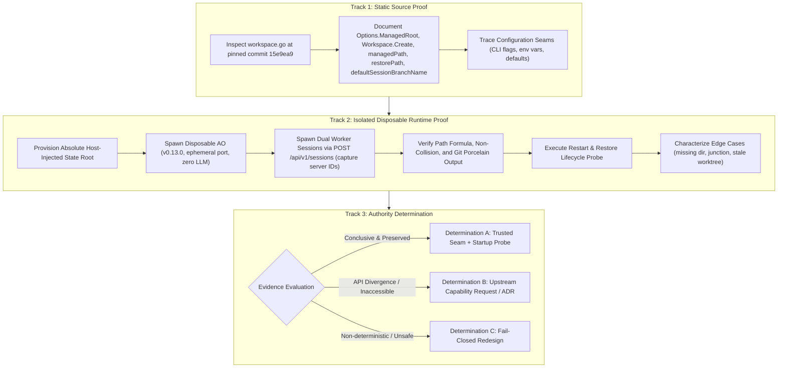

# PLAN: P04 Worktree Authority & Binding Empirical Proof

- **Plan ID:** `PLAN-P04-WORKTREE-BINDING-PROOF`
- **Revision:** 2
- **Status:** `PROPOSED (Pending External Supervisor Audit)`
- **Target Task:** `TASK-P04-WORKTREE-BINDING-PROOF`
- **Governing Proposal:** [`docs/proposals/PROPOSAL-P04-001-evidence-review-engine-boundaries.md`](../proposals/PROPOSAL-P04-001-evidence-review-engine-boundaries.md) (Revision 4)
- **Governing Architecture:** [`docs/adr/DRAFT-ADR-018-evidence-review-and-verification-isolation.md`](../adr/DRAFT-ADR-018-evidence-review-and-verification-isolation.md) (Revision 4)
- **Associated Contract:** [`docs/tasks/DRAFT_TASK_CONTRACT_P04_WORKTREE_BINDING_PROOF.md`](../tasks/DRAFT_TASK_CONTRACT_P04_WORKTREE_BINDING_PROOF.md) (`NOT_RELEASED`, Revision 2)
- **Date:** 2026-09-26

---

## 1. Problem Statement & Proof Objectives

In [`docs/audits/P04_PRECONTRACT_ARCHITECTURE_EXTERNAL_AUDIT_001.md`](../audits/P04_PRECONTRACT_ARCHITECTURE_EXTERNAL_AUDIT_001.md) (Finding `P04-ARCH-R1-001`) and re-audits [`P04_PRECONTRACT_ARCHITECTURE_EXTERNAL_REAUDIT_001.md`](../audits/P04_PRECONTRACT_ARCHITECTURE_EXTERNAL_REAUDIT_001.md) and [`P04_PRECONTRACT_ARCHITECTURE_EXTERNAL_REAUDIT_002.md`](../audits/P04_PRECONTRACT_ARCHITECTURE_EXTERNAL_REAUDIT_002.md) (Findings `P04-ARCH-R2-001`, `P04-ARCH-R3-001..004`), the External Supervisor established that while static code inspection indicates worktree path formula `<managedRoot>/<projectID>/<sessionID>` and branch `ao/<sessionID>`, the Supervisor Control Plane currently lacks empirical proof that:
1. It has authority to read or configure `managedRoot` across arbitrary host environments;
2. AO and Supervisor share the exact same physical filesystem namespace;
3. Session path allocation is strictly non-colliding and invariant across daemon restarts and session restores;
4. Path canonicalization, junction/symlink aliasing, and missing-directory edge cases are robustly characterized;
5. All operations occur strictly within an absolute, host-injected state root without touching user repositories, user databases, or recovery artifacts.

This plan specifies a 3-track empirical proof to resolve `DESIGN_BLOCKER_P04_WORKTREE_BINDING` and establish whether Determination A (trusted configuration seam), Determination B (upstream PR / new ADR), or Determination C (fail-closed redesign) must be adopted.

---

## 2. Multi-Track Architecture Overview

The empirical proof is partitioned into three sequential tracks:



---

## 3. Track 1 — Static Pinned Source Proof

### 3.1. Authoritative Upstream File & Pinned Commit
- **Upstream Repository:** Agent Orchestrator (`github.com/trungqwe/agent-orchestrator`)
- **Pinned Commit:** `15e9ea971f1711ec8b50e157d6eb300db6cbe0d6` (v0.13.0)
- **Authoritative File:** `backend/internal/adapters/workspace/gitworktree/workspace.go`

### 3.2. Concrete Symbol & Line Citations

1. **`Options` Struct and `ManagedRoot`**:
   - **Supervisor Range:** Lines 64–73; `ManagedRoot` at line 68 (raw blob lines 71–80; `ManagedRoot` at line 75).
   - **Permalink:** [`backend/internal/adapters/workspace/gitworktree/workspace.go#L71-L80`](https://github.com/trungqwe/agent-orchestrator/blob/15e9ea971f1711ec8b50e157d6eb300db6cbe0d6/backend/internal/adapters/workspace/gitworktree/workspace.go#L71-L80)
   ```go
   type Options struct {
       Binary       string
       ManagedRoot  string
       RepoResolver RepoResolver
       Logger       *slog.Logger
   }
   ```
   Specifies the base filesystem directory hosting managed worktrees.

2. **`Workspace.Create`**:
   - **Supervisor Range:** Lines 230–262; invokes `w.managedPath(cfg)` at line 243 (raw blob lines 246–266; call at line 257).
   - **Permalink:** [`backend/internal/adapters/workspace/gitworktree/workspace.go#L246-L266`](https://github.com/trungqwe/agent-orchestrator/blob/15e9ea971f1711ec8b50e157d6eb300db6cbe0d6/backend/internal/adapters/workspace/gitworktree/workspace.go#L246-L266)
   ```go
   func (w *Workspace) Create(ctx context.Context, cfg ports.WorkspaceConfig) (ports.WorkspaceInfo, error) {
       // ...
       path, err := w.managedPath(cfg)
       // ...
   }
   ```
   Provisions the worktree directory via `managedPath(cfg)` and issues `git worktree add`.

3. **`Workspace.Restore`**:
   - **Supervisor Range:** Lines 1045–1112; invokes `w.restorePath(cfg)` at line 1055 (raw blob lines 1097–1140; call at line 1105).
   - **Permalink:** [`backend/internal/adapters/workspace/gitworktree/workspace.go#L1097-L1140`](https://github.com/trungqwe/agent-orchestrator/blob/15e9ea971f1711ec8b50e157d6eb300db6cbe0d6/backend/internal/adapters/workspace/gitworktree/workspace.go#L1097-L1140)
   ```go
   func (w *Workspace) Restore(ctx context.Context, cfg ports.WorkspaceConfig) (ports.WorkspaceInfo, error) {
       // ...
       path, err := w.restorePath(cfg)
       // ...
   }
   ```
   Validates existing worktree at `restorePath(cfg)`. If missing, lines 1113–1140 recreate the worktree at that path.

4. **`Workspace.managedPath`**:
   - **Supervisor Range:** Lines 1754–1762 (raw blob lines 1837–1846).
   - **Permalink:** [`backend/internal/adapters/workspace/gitworktree/workspace.go#L1837-L1846`](https://github.com/trungqwe/agent-orchestrator/blob/15e9ea971f1711ec8b50e157d6eb300db6cbe0d6/backend/internal/adapters/workspace/gitworktree/workspace.go#L1837-L1846)
   ```go
   func (w *Workspace) managedPath(cfg ports.WorkspaceConfig) (string, error) {
       var path string
       if cfg.Kind == domain.KindOrchestrator {
           prefix := resolvedSessionPrefix(cfg)
           path = filepath.Join(w.managedRoot, string(cfg.ProjectID), "orchestrator", prefix+"-orchestrator")
       } else {
           path = filepath.Join(w.managedRoot, string(cfg.ProjectID), string(cfg.SessionID))
       }
       return w.validateManagedPath(path)
   }
   ```
   Deterministic path formula: `filepath.Join(managedRoot, projectID, sessionID)`. Notice parameter is `ports.WorkspaceConfig` and return type is `(string, error)`.

5. **`Workspace.restorePath`**:
   - **Supervisor Range:** Lines 1764–1768 (raw blob lines 1848–1853).
   - **Permalink:** [`backend/internal/adapters/workspace/gitworktree/workspace.go#L1848-L1853`](https://github.com/trungqwe/agent-orchestrator/blob/15e9ea971f1711ec8b50e157d6eb300db6cbe0d6/backend/internal/adapters/workspace/gitworktree/workspace.go#L1848-L1853)
   ```go
   func (w *Workspace) restorePath(cfg ports.WorkspaceConfig) (string, error) {
       if cfg.Path != "" {
           return w.validateManagedPath(cfg.Path)
       }
       return w.managedPath(cfg)
   }
   ```

6. **`defaultSessionBranchName`**:
   - **Supervisor Range:** Lines 1783–1785 (raw blob lines 1868–1870).
   - **Permalink:** [`backend/internal/adapters/workspace/gitworktree/workspace.go#L1868-L1870`](https://github.com/trungqwe/agent-orchestrator/blob/15e9ea971f1711ec8b50e157d6eb300db6cbe0d6/backend/internal/adapters/workspace/gitworktree/workspace.go#L1868-L1870)
   ```go
   func defaultSessionBranchName(id domain.SessionID) string {
       return "ao/" + string(id)
   }
   ```
   Deterministic branch formula: `"ao/" + sessionID`.

### 3.3. Configuration Seam Tracing
Trace how `Options.ManagedRoot` is injected during AO binary startup:
- CLI flag `--workspace-dir` or `--managed-root`;
- Environment variable `AO_WORKSPACE_DIR` or `AO_MANAGED_ROOT`;
- Host configuration file `config.json` / `settings.json`;
- Determine whether public REST routes expose this path or if Supervisor must read host configuration directly.

---

## 4. Track 2 — Isolated Disposable Runtime Proof

### 4.1. Absolute Host-Injected State Root & Physical Containment Guardrails
To prevent cross-worktree pollution or accidental deletion:
1. **Absolute State Root Architecture:**
   - Root: `<SUPERVISOR_STATE_ROOT>\proof\p04-worktree-binding\<proof_run_id>\`
   - Disposable DB: `<SUPERVISOR_STATE_ROOT>\proof\p04-worktree-binding\<proof_run_id>\ao_proof.db`
   - Disposable Managed Root: `<SUPERVISOR_STATE_ROOT>\proof\p04-worktree-binding\<proof_run_id>\worktrees`
   - Disposable Test Repo: `<SUPERVISOR_STATE_ROOT>\proof\p04-worktree-binding\<proof_run_id>\repo`
2. **Pre-Operation Containment Verification:**
   Before any directory creation, file write, or deletion:
   - Canonicalize path using `filepath.Clean` and `filepath.EvalSymlinks`.
   - Assert physical containment: resolved absolute path must be prefixed by `<SUPERVISOR_STATE_ROOT>\proof\p04-worktree-binding\<proof_run_id>`.
   - Assert strictly outside all Git worktrees.
   - Assert strictly outside user repository (`D:\TU_CODE\ai-supervisor`).
   - Assert strictly outside AO live database (`~/.agent-orchestrator/...` or `D:\TU_CODE\agent-orchestrator`).
   - Assert strictly outside user WIP recovery directory (`D:\TU_CODE\ai-supervisor-user-wip-recovery\P03-EXIT-R2-001`).
3. **Safe Cleanup & Ownership Marker:**
   - Write `.supervisor-owner-marker.json` at root initialization containing `proof_run_id`, timestamp, and host PID.
   - Recursive cleanup permitted ONLY after:
     * Canonical containment check passes;
     * Marker exists and ownership matches `proof_run_id`.
   - If physical containment or identity cannot be proven, cleanup must abort and leave target untouched.

### 4.2. Inert AO Harness Provenance & Zero-LLM Assurance
- **AO Binary Provenance:**
  * Version: `v0.13.0`
  * Pinned Commit: `15e9ea971f1711ec8b50e157d6eb300db6cbe0d6`
  * Build Mechanism: Built from pinned source or validated pre-built binary matching verified SHA-256.
  * Ephemeral Port: Bound dynamically to loopback `127.0.0.1:0`.
  * Process Ownership: Spawned as supervised child process managed under Windows Job Object for guaranteed termination.
- **Inert Harness Requirement:**
  * AO harness must be configured in inert test mode (`mock-inert` or test runner).
  * Strictly zero API keys, zero LLM model calls, zero external network egress, and zero coding prompts.
  * **Blocker Guardrail:** If an inert test mode cannot be proven for AO daemon, record `DESIGN_BLOCKER_P04_INERT_AO_HARNESS = OPEN`; the proof must NOT run against a live LLM-connected daemon, and claiming "zero LLM calls" merely from not sending prompts is explicitly forbidden.

### 4.3. Test Matrix and Verification Procedures

#### Step 1: Initial Setup
1. Initialize a clean disposable Git repository at `<SUPERVISOR_STATE_ROOT>\...\repo` with an initial commit on `main`.
2. Launch disposable `ao-daemon` on ephemeral port, configured with disposable DB and disposable managed root.

#### Step 2: Dual Session Provisioning (Server-Generated Session IDs & Non-Collision)
1. Register test project `proj-proof-01` pointing to the test repo.
2. Issue `POST /api/v1/sessions` for Session 1 with body `{"projectId": "proj-proof-01", "kind": "worker", "harness": "mock-inert"}`.
   - Record HTTP 201 response.
   - Capture server-generated `session_1_id = resp.Session.ID`.
   - Compute expected path: `filepath.Join(disposableManagedRoot, "proj-proof-01", session_1_id)`.
   - Compute expected branch: `"ao/" + session_1_id`.
   - Verify directory exists on disk and is a valid Git worktree.
3. Issue `POST /api/v1/sessions` for Session 2 on the same project:
   - Record HTTP 201 response.
   - Capture server-generated `session_2_id = resp.Session.ID`.
   - Compute expected path: `filepath.Join(disposableManagedRoot, "proj-proof-01", session_2_id)`.
   - Compute expected branch: `"ao/" + session_2_id`.
   - Verify directory exists on disk and is a valid Git worktree.
4. **Collision Check:** Assert that `session_1_id != session_2_id`, paths are distinct, branches are distinct, and worktrees do not collide.

#### Step 3: Git & Filesystem Cross-Verification
Execute `git worktree list --porcelain -z` inside the test repo and verify:
1. Entry for Session 1: matches computed path, branch `refs/heads/ao/<session_1_id>`, and commit SHA.
2. Entry for Session 2: matches computed path, branch `refs/heads/ao/<session_2_id>`, and commit SHA.
3. Inspect `.git` file inside each worktree: confirm `gitdir:` points to valid worktree gitdir.
4. Verify physical file identity (ReFS/NTFS 128-bit `FileIdInfo` or volume serial + file index) proving direct physical directory resolution without intervening junctions or symlinks.

#### Step 4: Daemon Restart & Session Restore State Machine
1. Transition Session 1 to terminal state using supported lifecycle (`DELETE /api/v1/sessions/{session_1_id}` or kill).
2. Observe and record evidence of terminal state.
3. Terminate the disposable AO process.
4. Restart disposable AO with identical DB and managed root on an ephemeral port.
5. Issue `POST /api/v1/sessions/{session_1_id}/restore` directly in proof isolation.
   *(Note: Supervisor `AUTOMATIC_RESTORE` remains strictly `DISABLED`; this is an isolated proof probe).*
6. Verify:
   - Does restore return HTTP 200/201?
   - Is physical worktree path preserved identically?
   - Does `git worktree list` report identical path and branch?

#### Step 5: Negative & Edge Case Probes (Characterization Without False Stops)
1. **Missing Directory Probe:**
   - Manually delete Session 2 directory.
   - Issue `POST /api/v1/sessions/{session_2_id}/restore`.
   - **Characterize Observed Behavior:** Note that pinned AO `Workspace.Restore` (lines 1113–1140) may recreate the worktree at the identical path. Characterize whether AO recreates the worktree or returns an error. This is an expected probe outcome, NOT an infrastructure failure, and must NOT trigger a stop condition.
2. **Junction / Symlink Alias Probe:**
   - Test junction creation pointing to the worktree path.
   - If Windows permissions lack `SeCreateSymbolicLinkPrivilege`, record `UNVERIFIED_CAPABILITY` or `BLOCKED` (do NOT report `PASS`).
   - If privileges exist, verify that `filepath.EvalSymlinks` canonicalizes the junction to the target.
3. **Stale Worktree Probe:**
   - Prune worktree via `git worktree prune`.
   - Characterize AO response on subsequent session queries.

#### Step 6: Evidence Capture
- Record all commands, exit codes, sanitized stdout/stderr, and artifact SHA-256 hashes into proof log.

---

## 5. Track 3 — Supervisor Authority Determination

The proof report must conclude with exactly one determination:

### Determination A: Trusted Host Configuration Seam + Startup Validation Probe
- **Conditions for Selection:**
  1. Track 2 conclusively proves that AO always constructs paths using `<managedRoot>/<projectID>/<sessionID>` and branches using `ao/<sessionID>`.
  2. Track 1 and Track 2 confirm that AO and Supervisor share the exact same physical host filesystem namespace.
  3. A reliable host configuration seam (e.g. `AO_MANAGED_ROOT` environment variable or shared host config) exists and can be authoritatively read by Supervisor.
  4. A host startup probe validates at daemon initialization that the configured `AO_MANAGED_ROOT` is accessible, matches AO's root, and contains zero unexpected junctions.
- **Architectural Result:** Supervisor can authoritatively compute `worktree_path` prior to dispatch, binding it into `attempt_workspace_bindings`.

### Determination B: Upstream Capability Request / New ADR Required
- **Conditions for Selection:**
  1. Public REST API of AO is insufficient to guarantee deterministic path binding across different host environments.
  2. AO configuration is inaccessible to Supervisor, or path virtualization (WSL/containers) causes divergence.
- **Architectural Result:** Upstream PR to Agent Orchestrator to expose `worktree_path` in `GET /api/v1/sessions/{id}` or a new ADR.

### Determination C: Infeasible / Redesign Required
- **Conditions for Selection:**
  1. Path allocation is non-deterministic or subject to unresolvable race conditions.
- **Architectural Result:** Fail-closed guardrails engage. Worktree binding model must be redesigned before Phase P04 proceeds.

> **CRITICAL RULE:** Determination A **CANNOT** be selected unless both Track 1 (static source) and Track 2 (runtime proof) provide conclusive, reproducible evidence of physical filesystem identity and deterministic configuration provenance.

---

## 6. Deliverables & Acceptance

1. `docs/proofs/P04_WORKTREE_BINDING_PROOF_REPORT.md` containing:
   - Full command logs, exit codes, sanitized paths, and artifact SHA-256 hashes.
   - Dual-session non-collision evidence with server-generated session IDs.
   - Restart and restore verification evidence.
   - Characterization of edge cases.
   - Formal conclusion (Determination A, B, or C).
2. Report will be submitted to External Supervisor for formal evaluation.
