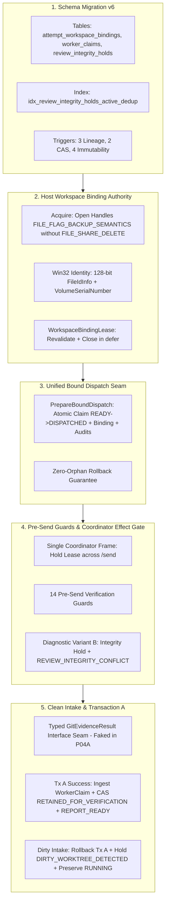

# PLAN-P04A: Workspace Binding Authority, Schema Migration v6, Seam Extension & Report Intake

> **Plan ID**: `PLAN-P04A-WORKSPACE-BINDING-AND-CLAIMS`
> **Task ID**: `TASK-P04-001`
> **Status**: `DRAFT_PLANNING` (Not Released — Pre-Contract Engineering Plan)
> **Author**: AI Engineering Supervisor Worker (under External Supervisor direction)
> **Date**: 2026-09-27
> **Base SHA**: `db6b654f03a7ce3c8e6ae2cd180f2cb7236bf7c2` (Canonical Reconciliation Merge Commit)
> **Active Gate**: `TASK_P04A_CONTRACT_PLANNING`
> **Audited Baseline Reference**: `80b997c89d57280286c63599c1c539161b31b5eb`
> **Audit Record**: [`docs/audits/P04_TASK_001_CONTRACT_PLANNING_EXTERNAL_AUDIT_001.md`](../audits/P04_TASK_001_CONTRACT_PLANNING_EXTERNAL_AUDIT_001.md) (`REVISION_REQUIRED`)
> **Related Architecture**:
> - [`ADR-018`](../adr/ADR-018-evidence-review-and-verification-isolation.md) (ACCEPTED / Level 2 Canonical Specification)
> - [`PROPOSAL-P04-001`](../proposals/PROPOSAL-P04-001-evidence-review-engine-boundaries.md) (Revision 22, `EXTERNAL_APPROVED`)
> - [`PLAN-P04-EVIDENCE-REVIEW.md`](PLAN-P04-EVIDENCE-REVIEW.md) (Revision 22, `EXTERNAL_APPROVED`)
> - [`docs/04_ARCHITECTURE.md`](../04_ARCHITECTURE.md) (Section 7: Evidence & Review Engine)
> - [`docs/05_DOMAIN_MODEL.md`](../05_DOMAIN_MODEL.md) (Section 8: Review & Verification Engine Schema)
> - [`docs/06_WORKFLOW_STATE_MACHINE.md`](../06_WORKFLOW_STATE_MACHINE.md) (Section 2: Phase P04 Lifecycle Integrations)
> - [`docs/08_TASK_CONTRACT.md`](../08_TASK_CONTRACT.md) (Task Contract Specification & Scope Discipline)
> - [`docs/14_FAILURE_RECOVERY.md`](../14_FAILURE_RECOVERY.md) (Section 1: Pre-Send & Intake Diagnostic Transactions)
> - [`docs/24_CHANGE_GOVERNANCE.md`](../24_CHANGE_GOVERNANCE.md) (Decision Hierarchy & Scope Boundaries)
> - [`SOURCE_REGISTRY.md`](../sources/SOURCE_REGISTRY.md), [`REUSE_MATRIX.md`](../sources/REUSE_MATRIX.md), [`MODULE_PROVENANCE.md`](../22_MODULE_PROVENANCE.md)

---

## 1. Executive Summary & Architectural Positioning

Subtask P04A constitutes the foundational bridge between dispatch lifecycle coordination and evidence review persistence. It establishes:
1. **Schema Migration v5 -> v6**: Implements the persistent storage baseline for workspace physical bindings (`attempt_workspace_bindings`), immutable worker claims (`worker_claims`), and integrity holds (`review_integrity_holds`), enforced with strict foreign keys, lineage triggers, CAS guards, and immutability rules matching `ADR-018` verbatim.
2. **Host-Boundary Workspace Binding Authority**: Establishes OS-level directory handle anti-rename protection (omitting `FILE_SHARE_DELETE`) and queries 128-bit `FileIdInfo` physical identity on physical Windows NTFS/ReFS filesystems, preventing directory substitution attacks (junctions, symlinks, subst, rename).
3. **Controlled Extension of PrepareBoundDispatch**: Combines bound dispatch allocation, workspace binding creation, and audit recording into a single, indivisible SQLite ACID transaction with guaranteed zero-orphan rollback semantics.
4. **Single Coordinator Effect Gate Across Dispatch**: Coordinates `Coordinator.Dispatch` to acquire a live `WorkspaceBindingLease`, maintain the open handles across fresh AO status revalidation, execute pure DB pre-send checks across all 14 guards, and issue `/send` while the lease remains actively held.
5. **Pre-Send Diagnostic Variant B Transaction**: On binding guard or lease failure, isolates the failure without modifying task state (`DISPATCHED`) or dispatch stage (`DISPATCH_BOUND`), atomically recording `REVIEW_INTEGRITY_CONFLICT` (Variant B: `conflict_source = 'WORKSPACE_BINDING_GUARD'`, `colliding_event_id` strictly absent) and an `ACTIVE` hold (`INVARIANT_MISMATCH`).
6. **Report Intake & Cleanliness Ingestion (Transaction A)**: Defines the typed `GitEvidenceResult` interface seam for report intake. Canonicalizes and maps `WorkerReport` fields into `worker_claims` (`payload_json`) with verbatim `reported_head_sha`, advances task state to `REPORT_READY`, and, upon receiving a dirty worktree result, rolls back Transaction A, preserves `RUNNING`, appends `EVIDENCE_COLLECTION_FAILED`, and inserts an `ACTIVE` hold (`DIRTY_WORKTREE_DETECTED`) using canonical Descriptors A and B.

### 1.1. Strict Architectural Boundaries

- **Model 1 Persistence Ownership Discipline**: Subtask P04A is the sole persistence owner of Schema v6, the controlled extension of `PrepareBoundDispatch`, Transaction A, and intake/pre-send diagnostic transactions.
- **Pure In-Memory Collector Seams (Finding P04A-C1-002)**: Subtask P04A must NOT execute git processes, parse raw git output, or implement git collectors. P04A defines only data structures, interfaces, and test fakes for structured `GitEvidenceResult` (`test/fakes/git_evidence_fake.go`). Execution of Git commands (`git status`, `git diff-index`), allowlists, and snapshot extraction belongs strictly to Subtask P04B.
- **Zero P04B/P04C/P04D Implementation**: No Git tree-walk snapshot extractors, Windows AppContainer sandboxes, verification leases, Transaction B, Transaction C, or ReviewBundle synthesis code will be written in P04A.
- **Fail-Closed Runtime Invariants**:
  * `AUTOMATIC_RESTORE = DISABLED`.
  * `VERIFIED_OPERATOR_PRINCIPAL = OPEN_FAIL_CLOSED_DEPENDENCY`.
  * `STAGE_B_RUNTIME_CATALOG = DEFERRED_TO_P04_RUNTIME_INTEGRATION`.
  * Zero runtime admission opening; P04A completion does not enable production execution of Phase P04.

---

## 2. Technical Decomposition



---

## 3. Detailed Component Specifications

### 3.1. Canonical Schema Migration v5 -> v6 (`internal/store/migrations.go`)

Migration v6 creates 3 tables, 1 index, and 9 triggers strictly conforming to accepted `ADR-018` verbatim (Finding `P04A-C1-001`):

#### 3.1.1. Table `attempt_workspace_bindings`
```sql
CREATE TABLE attempt_workspace_bindings (
    attempt_id TEXT PRIMARY KEY REFERENCES task_attempts(attempt_id) ON DELETE RESTRICT,
    task_id TEXT NOT NULL REFERENCES tasks(task_id) ON DELETE RESTRICT,
    contract_id TEXT NOT NULL REFERENCES task_contracts(contract_id) ON DELETE RESTRICT,
    session_id TEXT NOT NULL CHECK (LENGTH(session_id) > 0),
    terminal_generation TEXT NOT NULL CHECK (LENGTH(terminal_generation) > 0),
    canonical_worktree_path TEXT NOT NULL CHECK (LENGTH(canonical_worktree_path) > 0),
    volume_serial_hex TEXT NOT NULL CHECK (
        LENGTH(volume_serial_hex) = 16 AND NOT (volume_serial_hex GLOB '*[^0-9a-f]*')
    ),
    file_id_hex TEXT NOT NULL CHECK (
        LENGTH(file_id_hex) = 32 AND NOT (file_id_hex GLOB '*[^0-9a-f]*')
    ),
    linked_gitdir_path TEXT NOT NULL CHECK (LENGTH(linked_gitdir_path) > 0),
    linked_gitdir_volume_serial_hex TEXT NOT NULL CHECK (
        LENGTH(linked_gitdir_volume_serial_hex) = 16 AND NOT (linked_gitdir_volume_serial_hex GLOB '*[^0-9a-f]*')
    ),
    linked_gitdir_file_id_hex TEXT NOT NULL CHECK (
        LENGTH(linked_gitdir_file_id_hex) = 32 AND NOT (linked_gitdir_file_id_hex GLOB '*[^0-9a-f]*')
    ),
    pinned_ao_commit TEXT NOT NULL CHECK (
        LENGTH(pinned_ao_commit) = 40 AND NOT (pinned_ao_commit GLOB '*[^0-9a-f]*')
    ),
    binding_state TEXT NOT NULL CHECK (
        binding_state IN ('ACTIVE', 'RETAINED_FOR_VERIFICATION', 'RELEASED', 'INVALIDATED')
    ),
    created_at_epoch_ms INTEGER NOT NULL CHECK (
        typeof(created_at_epoch_ms) = 'integer' AND created_at_epoch_ms > 0
    ),
    released_at_epoch_ms INTEGER NULL CHECK (
        released_at_epoch_ms IS NULL OR (
            typeof(released_at_epoch_ms) = 'integer' AND released_at_epoch_ms >= created_at_epoch_ms
        )
    ),
    FOREIGN KEY(contract_id, task_id) REFERENCES task_contracts(contract_id, task_id) ON DELETE RESTRICT,
    CHECK (
        (binding_state IN ('ACTIVE', 'RETAINED_FOR_VERIFICATION') AND released_at_epoch_ms IS NULL) OR
        (binding_state IN ('RELEASED', 'INVALIDATED') AND released_at_epoch_ms IS NOT NULL)
    )
);
```

#### 3.1.2. Table `worker_claims`
```sql
CREATE TABLE worker_claims (
    claim_id TEXT PRIMARY KEY,
    task_id TEXT NOT NULL REFERENCES tasks(task_id) ON DELETE RESTRICT,
    attempt_id TEXT NOT NULL UNIQUE REFERENCES task_attempts(attempt_id) ON DELETE RESTRICT,
    contract_id TEXT NOT NULL REFERENCES task_contracts(contract_id) ON DELETE RESTRICT,
    reported_head_sha TEXT NOT NULL CHECK (
        LENGTH(reported_head_sha) BETWEEN 7 AND 40
        AND NOT (reported_head_sha GLOB '*[^0-9a-f]*')
    ),
    payload_json TEXT NOT NULL CHECK (
        json_valid(payload_json) = 1
        AND json_type(payload_json, '$.claimed_files_changed') = 'array'
        AND json_type(payload_json, '$.tests') = 'array'
        AND json_type(payload_json, '$.textual_claims') = 'array'
    ),
    created_at_epoch_ms INTEGER NOT NULL CHECK (
        typeof(created_at_epoch_ms) = 'integer' AND created_at_epoch_ms > 0
    ),
    FOREIGN KEY(contract_id, task_id) REFERENCES task_contracts(contract_id, task_id) ON DELETE RESTRICT
);
```

#### 3.1.3. Table `review_integrity_holds`
```sql
CREATE TABLE review_integrity_holds (
    hold_id TEXT PRIMARY KEY,
    task_id TEXT NOT NULL REFERENCES tasks(task_id) ON DELETE RESTRICT,
    attempt_id TEXT NOT NULL REFERENCES task_attempts(attempt_id) ON DELETE RESTRICT,
    contract_id TEXT NOT NULL REFERENCES task_contracts(contract_id) ON DELETE RESTRICT,
    hold_reason TEXT NOT NULL CHECK (
        hold_reason IN (
            'DIRTY_WORKTREE_DETECTED',
            'BUNDLE_HASH_CONFLICT',
            'INVARIANT_MISMATCH',
            'UNVERIFIED_CLAIM_DETECTED',
            'SECURITY_POLICY_VIOLATION'
        )
    ),
    hold_state TEXT NOT NULL CHECK (hold_state IN ('ACTIVE', 'RESOLVED')),
    diagnostic_fingerprint TEXT NOT NULL CHECK (
        LENGTH(diagnostic_fingerprint) = 64 AND NOT (diagnostic_fingerprint GLOB '*[^0-9a-f]*')
    ),
    occurrence_number INTEGER NOT NULL CHECK (
        typeof(occurrence_number) = 'integer' AND occurrence_number > 0
    ),
    rejection_audit_event_id TEXT NOT NULL UNIQUE REFERENCES audit_events(event_id) ON DELETE RESTRICT,
    resolution_audit_event_id TEXT NULL UNIQUE REFERENCES audit_events(event_id) ON DELETE RESTRICT,
    resolved_by_principal TEXT NULL CHECK (
        resolved_by_principal IS NULL OR LENGTH(TRIM(resolved_by_principal)) > 0
    ),
    created_at_epoch_ms INTEGER NOT NULL CHECK (
        typeof(created_at_epoch_ms) = 'integer' AND created_at_epoch_ms > 0
    ),
    resolved_at_epoch_ms INTEGER NULL CHECK (
        resolved_at_epoch_ms IS NULL OR (
            typeof(resolved_at_epoch_ms) = 'integer' AND resolved_at_epoch_ms >= created_at_epoch_ms
        )
    ),
    FOREIGN KEY(contract_id, task_id) REFERENCES task_contracts(contract_id, task_id) ON DELETE RESTRICT,
    UNIQUE(attempt_id, hold_reason, diagnostic_fingerprint, occurrence_number),
    CHECK (
        (hold_state = 'ACTIVE' AND resolved_at_epoch_ms IS NULL AND resolution_audit_event_id IS NULL AND resolved_by_principal IS NULL) OR
        (hold_state = 'RESOLVED' AND resolved_at_epoch_ms IS NOT NULL AND resolution_audit_event_id IS NOT NULL AND resolved_by_principal IS NOT NULL AND LENGTH(TRIM(resolved_by_principal)) > 0)
    )
);
```

#### 3.1.4. Canonical Partial Unique Index
```sql
CREATE UNIQUE INDEX idx_review_integrity_holds_active_dedup
ON review_integrity_holds(attempt_id, hold_reason, diagnostic_fingerprint) WHERE hold_state = 'ACTIVE';
```

#### 3.1.5. Canonical Lineage Triggers
```sql
CREATE TRIGGER trg_attempt_workspace_bindings_lineage_guard
BEFORE INSERT ON attempt_workspace_bindings
FOR EACH ROW
BEGIN
    SELECT RAISE(ABORT, 'lineage mismatch: attempt_id does not match task_id, contract_id in task_attempts or session in dispatch_operations with stage DISPATCH_BOUND')
    WHERE NOT EXISTS (
        SELECT 1 FROM task_attempts a
        JOIN dispatch_operations d ON d.attempt_id = a.attempt_id
        WHERE a.attempt_id = NEW.attempt_id
          AND a.task_id = NEW.task_id
          AND a.contract_id = NEW.contract_id
          AND d.session_id = NEW.session_id
          AND d.terminal_generation = NEW.terminal_generation
          AND d.stage = 'DISPATCH_BOUND'
    );
END;

CREATE TRIGGER trg_worker_claims_lineage_guard
BEFORE INSERT ON worker_claims
FOR EACH ROW
BEGIN
    SELECT RAISE(ABORT, 'lineage mismatch: attempt_id does not match task_id or contract_id in task_attempts')
    WHERE NOT EXISTS (
        SELECT 1 FROM task_attempts a
        WHERE a.attempt_id = NEW.attempt_id
          AND a.task_id = NEW.task_id
          AND a.contract_id = NEW.contract_id
    );
END;

CREATE TRIGGER trg_review_integrity_holds_lineage_guard
BEFORE INSERT ON review_integrity_holds
FOR EACH ROW
BEGIN
    SELECT RAISE(ABORT, 'lineage mismatch: attempt_id does not match task_id or contract_id in task_attempts')
    WHERE NOT EXISTS (
        SELECT 1 FROM task_attempts a
        WHERE a.attempt_id = NEW.attempt_id
          AND a.task_id = NEW.task_id
          AND a.contract_id = NEW.contract_id
    );
END;
```

#### 3.1.6. Canonical CAS Triggers
```sql
CREATE TRIGGER trg_attempt_workspace_bindings_cas_guard
BEFORE UPDATE ON attempt_workspace_bindings
FOR EACH ROW
BEGIN
    SELECT RAISE(ABORT, 'immutable column modified in attempt_workspace_bindings')
    WHERE NEW.attempt_id != OLD.attempt_id
       OR NEW.task_id != OLD.task_id
       OR NEW.contract_id != OLD.contract_id
       OR NEW.session_id != OLD.session_id
       OR NEW.terminal_generation != OLD.terminal_generation
       OR NEW.canonical_worktree_path != OLD.canonical_worktree_path
       OR NEW.volume_serial_hex != OLD.volume_serial_hex
       OR NEW.file_id_hex != OLD.file_id_hex
       OR NEW.linked_gitdir_path != OLD.linked_gitdir_path
       OR NEW.linked_gitdir_volume_serial_hex != OLD.linked_gitdir_volume_serial_hex
       OR NEW.linked_gitdir_file_id_hex != OLD.linked_gitdir_file_id_hex
       OR NEW.pinned_ao_commit != OLD.pinned_ao_commit
       OR NEW.created_at_epoch_ms != OLD.created_at_epoch_ms;

    SELECT RAISE(ABORT, 'illegal state transition in attempt_workspace_bindings')
    WHERE NOT (
        (OLD.binding_state = 'ACTIVE' AND NEW.binding_state IN ('RETAINED_FOR_VERIFICATION', 'RELEASED', 'INVALIDATED')) OR
        (OLD.binding_state = 'RETAINED_FOR_VERIFICATION' AND NEW.binding_state IN ('RELEASED', 'INVALIDATED'))
    );
END;

CREATE TRIGGER trg_review_integrity_holds_cas_guard
BEFORE UPDATE ON review_integrity_holds
FOR EACH ROW
BEGIN
    SELECT RAISE(ABORT, 'immutable column modified in review_integrity_holds')
    WHERE NEW.hold_id != OLD.hold_id
       OR NEW.task_id != OLD.task_id
       OR NEW.attempt_id != OLD.attempt_id
       OR NEW.contract_id != OLD.contract_id
       OR NEW.hold_reason != OLD.hold_reason
       OR NEW.diagnostic_fingerprint != OLD.diagnostic_fingerprint
       OR NEW.occurrence_number != OLD.occurrence_number
       OR NEW.rejection_audit_event_id != OLD.rejection_audit_event_id
       OR NEW.created_at_epoch_ms != OLD.created_at_epoch_ms;

    SELECT RAISE(ABORT, 'illegal hold state transition: ACTIVE only transitions to RESOLVED')
    WHERE NOT (OLD.hold_state = 'ACTIVE' AND NEW.hold_state = 'RESOLVED');
END;
```

#### 3.1.7. Canonical Immutability Triggers
```sql
CREATE TRIGGER trg_attempt_workspace_bindings_no_delete
BEFORE DELETE ON attempt_workspace_bindings
BEGIN
    SELECT RAISE(ABORT, 'attempt_workspace_bindings is immutable');
END;

CREATE TRIGGER trg_worker_claims_no_update
BEFORE UPDATE ON worker_claims
BEGIN
    SELECT RAISE(ABORT, 'worker_claims is immutable');
END;

CREATE TRIGGER trg_worker_claims_no_delete
BEFORE DELETE ON worker_claims
BEGIN
    SELECT RAISE(ABORT, 'worker_claims is immutable');
END;

CREATE TRIGGER trg_review_integrity_holds_no_delete
BEFORE DELETE ON review_integrity_holds
BEGIN
    SELECT RAISE(ABORT, 'review_integrity_holds is immutable');
END;
```

#### 3.1.8. Migration v5 Testing Preservation Constraint (Finding P04A-R2-001)
`internal/store/migrations_v5_test.go` asserts schema properties including `user_version` against `CurrentSchemaVersion`. When `CurrentSchemaVersion` advances from 5 to 6 in Subtask P04A:
- `migrations_v5_test.go` is included in `allowed_scope` strictly to preserve v5 upgrade and rollback test coverage without regression.
- Modifications to `migrations_v5_test.go` are strictly restricted to accommodating `CurrentSchemaVersion = 6` (e.g. testing intermediate migration state up to v5).
- Zero weakening of v5 fixtures, v5 rollback tests, or historical migration verification is permitted.

---

### 3.2. Host Workspace Binding Authority (`internal/host/`)

#### 3.2.1. Physical Identity & Handle Lifetime
- Implements `WorkspaceBindingAuthority` and `WorkspaceBindingLease` in `internal/host/workspace_binding_authority.go` and Windows platform primitives in `workspace_binding_authority_windows.go`.
- `Acquire(ctx, candidate) -> (WorkspaceBindingLease, error)`:
  * Opens worktree root handle and linked `.git` directory handle using Windows `CreateFileW`.
  * Access mask: `FILE_READ_ATTRIBUTES`.
  * Flags: `FILE_FLAG_BACKUP_SEMANTICS` (required to open directories on Windows).
  * Sharing mode: `FILE_SHARE_READ | FILE_SHARE_WRITE`. **Strictly omits `FILE_SHARE_DELETE`**, preventing rename, deletion, or root replacement by any process while the handle is open.
  * Queries canonical device path via `GetFinalPathNameByHandleW(VOLUME_NAME_DOS)`.
  * Queries 128-bit physical file identity via `GetFileInformationByHandleEx(FileIdInfo)` (`FILE_ID_INFO` containing 128-bit `FileId` and 32-bit `VolumeSerialNumber`).
  * Fails closed if filesystem/API does not support `FileIdInfo` (e.g. non-NTFS/ReFS).
- Returns immutable `WorkspaceBindingSnapshot`:
  * `CanonicalWorktreePath`, `VolumeSerialHex`, `FileIDHex`
  * `LinkedGitDirPath`, `LinkedGitDirVolumeSerialHex`, `LinkedGitDirFileIDHex`
- `Revalidate() error`:
  * Validates held OS handles remain valid and queryable.
  * Verifies current path has not changed and physical 128-bit identity matches the snapshot exactly.
- `Close() error`:
  * Closes both directory handles idempotently. Guaranteed execution via `defer lease.Close()`.

---

### 3.3. Controlled Extension of PrepareBoundDispatch (`internal/store/dispatch.go`)

- Extends `PrepareBoundDispatch` to accept `WorkspaceBindingSnapshot` in addition to `DispatchBinding`.
- Single atomic SQLite transaction executes in exact sequential order:
  1. Precondition guards verification (Task `READY`, latest frozen contract, Pair active-lane clean, zero unresolved quarantine/restore).
  2. Allocates `TaskAttempt` (`task_attempts`) with immutable session snapshot (`session_id`, `terminal_generation`).
  3. Inserts `dispatch_operations` with `stage = 'DISPATCH_BOUND'`.
  4. Inserts `attempt_workspace_bindings` with `binding_state = 'ACTIVE'`.
  5. Appends audit event `TASK_DISPATCH_BOUND`.
  6. Appends audit event `WORKSPACE_BINDING_CREATED`.
  7. CAS updates `tasks` (`READY -> DISPATCHED`) and increments `current_attempt`.
  8. Commits atomic transaction.
- **Rollback Guarantee**: If any step or trigger fails, the entire transaction rolls back; zero orphaned rows or audit events exist, and task remains `READY`.

---

### 3.4. 14 Pre-Send Verification Guards & Coordinator Effect Gate (`internal/dispatch/coordinator.go`, `internal/store/dispatch_transactions.go`)

In `Coordinator.Dispatch`, a single continuous function frame manages handle lifetime across the 9-step dispatch sequence:
1. `authority.Acquire(ctx, candidate)` -> live `lease` (Win32 handles open).
2. Extract immutable `WorkspaceBindingSnapshot` via `lease.Snapshot()`.
3. Commit `store.PrepareBoundDispatch` with snapshot.
4. Query fresh `GetWorkerStatus` from AO client.
5. Revalidate live lease: `lease.Revalidate()`, confirming held OS handles remain valid and physical identity matches snapshot.
6. Commit `store.RecordSendRequested(ctx, operationID, ..., verifiedSnapshot, ...)` evaluating all 14 guards in a single SQLite transaction:
   1. `dispatch_operations.stage = 'DISPATCH_BOUND'`
   2. `dispatch_operations.resolution_state IS NULL`
   3. `task_attempts.recovery_disposition IS NULL`
   4. `tasks.state = 'DISPATCHED'`
   5. Exact current open attempt (`ended_at IS NULL`)
   6. Exact task/contract/Pair/session/generation lineage match across task, attempt, and operation
   7. Current `WorkerSession` identity matches and `quarantine_state = 'CLEAN'`
   8. Current `TaskAttempt` `quarantine_state = 'CLEAN'`
   9. Restore Guard: `NOT EXISTS (SELECT 1 FROM pair_restore_operations WHERE pair_id = ? AND resolution_state <> 'RESTORE_RESOLVED')`
   10. Provisioning Guard: `NOT EXISTS (SELECT 1 FROM pair_provisioning_operations WHERE pair_id = ? AND stage IN ('PROVISION_REQUESTED','PROVISION_FAILED'))`
   11. Fresh AO observation is idle or waiting_input (not terminated)
   12. Exactly one `attempt_workspace_bindings` row with `binding_state = 'ACTIVE'`
   13. Snapshot Equality Guard (Finding P04A-R2-002): Store performs pure DB equality check between the verified `WorkspaceBindingSnapshot` passed by Coordinator and the active `attempt_workspace_bindings` row in the same transaction:
       - `canonical_worktree_path`
       - `worktree_volume_serial_hex`
       - `worktree_file_id_hex`
       - `linked_gitdir_path`
       - `linked_gitdir_volume_serial_hex`
       - `linked_gitdir_file_id_hex`
       - `pinned_ao_commit`
       - exact task/attempt/contract/Pair/session/generation lineage
   14. Zero `ACTIVE` holds in `review_integrity_holds` for attempt (`NOT EXISTS (SELECT 1 FROM review_integrity_holds WHERE attempt_id = ? AND hold_state = 'ACTIVE')`)
7. Issue AO `/send` (`DispatchTaskContract`) while lease remains open.
8. Commit confirmed or containment transition.
9. Close lease in `defer`.

#### 3.4.1. Pre-Send Diagnostic Variant B Transaction (Findings P04A-C1-003, P04A-R2-002, P04A-R2-003)
If any workspace binding guard fails (Guards 12-14 or snapshot mismatch):
- Merely having an `ACTIVE` binding row in the DB is strictly NOT sufficient; snapshot mismatch is treated as an active binding integrity failure.
- `/send` is strictly forbidden (AO send call count remains exactly 0).
- Task remains `DISPATCHED`, operation remains `DISPATCH_BOUND`, attempt remains open.
- Separate atomic diagnostic transaction (Variant B: `WORKSPACE_BINDING_GUARD`):
  1. Derives `hold_id` via Descriptor A (`kind: "review_integrity_hold"`).
  2. Derives `rejection_event_id` via Descriptor B Variant B:
     ```json
     {
       "attempt_id": "<attempt_id>",
       "attempted_reason": "<WORKSPACE_BINDING_MISSING|WORKSPACE_BINDING_LINEAGE_MISMATCH|WORKSPACE_BINDING_NOT_ACTIVE|WORKSPACE_BINDING_PHYSICAL_IDENTITY_MISMATCH>",
       "conflict_source": "WORKSPACE_BINDING_GUARD",
       "conflict_type": "LINEAGE_MISMATCH",
       "contract_id": "<contract_id>",
       "diagnostic_fingerprint": "<64_hex_hash>",
       "dispatch_operation_id": "<dispatch_operation_id>",
       "event_type": "REVIEW_INTEGRITY_CONFLICT",
       "hold_id": "<hold_id_from_descriptor_a>",
       "occurrence_number": 1,
       "pair_id": "<pair_id>",
       "sanitized_input_fingerprint": "<64_hex_hash>",
       "task_id": "<task_id>",
       "version": 2
     }
     ```
     `colliding_event_id` is strictly absent.
  3. Appends audit event `REVIEW_INTEGRITY_CONFLICT` with `actor = 'ai-supervisor-daemon'` and `details_json` containing: `conflict_source`, `dispatch_operation_id`, `attempted_reason`, `conflict_type`, `sanitized_input_fingerprint`, `diagnostic_fingerprint`, and `actor_role = 'SUPERVISOR'`.
  4. Inserts `ACTIVE` hold into `review_integrity_holds` (`hold_reason = 'INVARIANT_MISMATCH'`).
  5. CAS invalidates binding: `UPDATE attempt_workspace_bindings SET binding_state = 'INVALIDATED', released_at_epoch_ms = now WHERE attempt_id = ? AND binding_state = 'ACTIVE'`.
  6. Commits diagnostic transaction atomically.
- **Governed Terminal Resolution Sequence (Finding P04A-R2-003)**:
  * Attempt terminalization is strictly NOT performed in the scanner or coordinator diagnostic transaction.
  * Terminalization requires a separate D12 atomic terminal transition transaction executed by a verified operator:
    - `tasks`: CAS `state = 'FAILED'` where `task_id = ? AND state = 'DISPATCHED'`.
    - `task_attempts`: `ended_at = now`, `recovery_disposition = 'WORKSPACE_BINDING_INTEGRITY_FAILURE'`.
  * The system never automatically transitions the attempt to `HUMAN_REQUIRED` or terminal failure during diagnostic handling.
- **Behavior Tests**:
  * Exact snapshot PASS;
  * Stale/fake snapshot FAIL;
  * Path or worktree FileId mismatch FAIL;
  * Linked gitdir identity mismatch FAIL;
  * Pinned AO commit mismatch FAIL;
  * All failure pathways verify AO `/send` call count is exactly 0 and audit/hold/binding CAS rollback is atomic.
- All direct callers of `RecordSendRequested` must supply a valid `WorkspaceBindingSnapshot`; zero snapshot-less bypass pathways are permitted.

---

### 3.5. Report Intake, Typed Seam & Hold Lifecycle (`internal/store/report_intake_transactions.go`)

#### 3.5.1. Typed Interface Seam (Findings P04A-C1-002, P04A-R1-001)
- Subtask P04A defines only the data structures and interface for `GitEvidenceResult`:
  ```go
  type GitEvidenceResult struct {
      IsClean            bool
      UncommittedFiles   []string
      ActualHeadSHA      string
      ActualBaseSHA      string
      ChangedFiles       []string
      DiffStat           string
      DiagnosticError    string
  }
  ```
- **Zero-Trust Separation of Claim and Evidence**:
  * `ReportedHeadSHA` is strictly removed from `GitEvidenceResult`.
  * `WorkerReport.head_sha` is the SOLE authoritative source for `worker_claims.reported_head_sha` and is preserved verbatim.
  * `GitEvidenceResult` strictly conveys independent evidence collected by Subtask P04B (`ActualHeadSHA`, `ActualBaseSHA`, cleanliness, and diff details).
  * Subtask P04A strictly does NOT write `ActualHeadSHA` into `worker_claims`.
  * Behavior tests explicitly exercise cases where `reported_head_sha != actual_head_sha` to prove the two sources remain independent without mutual overwrite.
- Subtask P04A does NOT run Git commands directly. In P04A behavior tests, clean and dirty results are supplied via test fakes (`test/fakes/git_evidence_fake.go`). Real Git execution (`git status -z`, `git diff-index HEAD`, allowlist enforcement) is deferred to Subtask P04B.

#### 3.5.2. Transaction A (Successful Intake)
Executed atomically when `GitEvidenceResult.IsClean` is true:
1. Validates worker report structure against `docs/schemas/worker-report.schema.json`.
2. Executes canonical field mapping from `WorkerReport` into `worker_claims`:
   - `WorkerReport.head_sha` -> `reported_head_sha` (validated 7..40 lowercase hex, stored verbatim).
   - `WorkerReport.files_changed` -> `payload_json.claimed_files_changed` (array).
   - `WorkerReport.tests` -> `payload_json.tests` (array).
   - `WorkerReport.worker_claims` -> `payload_json.textual_claims` (array).
   - `WorkerReport.build_status` -> `payload_json.build_status` (string).
3. Normalizes and canonicalizes `payload_json` via RFC 8785 JSON Canonicalization Scheme (JCS).
4. Inserts `worker_claims` row (`claim_id`, `task_id`, `attempt_id`, `contract_id`, `reported_head_sha`, `payload_json`, `created_at_epoch_ms`).
5. CAS updates `attempt_workspace_bindings`: `ACTIVE` -> `RETAINED_FOR_VERIFICATION`.
6. CAS updates `tasks.state`: `RUNNING` -> `REPORT_READY`.
7. Commits transaction. (Note: zero unapproved audit event literals; all audit event literals must exist in accepted ADRs).

#### 3.5.3. Dirty Intake Diagnostic Transaction & Hold Replay (Finding P04A-C1-003)
If `GitEvidenceResult.IsClean` is false:
1. Transaction A is rolled back immediately; zero worker claims are persisted; task state strictly remains `RUNNING`.
2. Atomic hold creation algorithm:
   a. Check if an `ACTIVE` hold already exists with `(attempt_id, hold_reason, diagnostic_fingerprint)`. If yes: exact replay returns existing row without duplicate insertion.
   b. If no `ACTIVE` hold exists: compute `occurrence_number = COALESCE(MAX(occurrence_number), 0) + 1` for that diagnostic tuple.
   c. Derive `hold_id` via Descriptor A:
      ```json
      {
        "attempt_id": "<attempt_id>",
        "contract_id": "<contract_id>",
        "diagnostic_fingerprint": "<64_hex_hash>",
        "hold_reason": "DIRTY_WORKTREE_DETECTED",
        "kind": "review_integrity_hold",
        "occurrence_number": 1,
        "pair_id": "<pair_id>",
        "task_id": "<task_id>",
        "version": 1
      }
      ```
      `hold_id = "hold-" + SHA256(RFC8785_JCS(hold_identity_descriptor))`
   d. Derive `rejection_event_id` via Descriptor B:
      ```json
      {
        "attempt_id": "<attempt_id>",
        "contract_id": "<contract_id>",
        "diagnostic_fingerprint": "<64_hex_hash>",
        "event_type": "EVIDENCE_COLLECTION_FAILED",
        "hold_id": "<hold_id_from_descriptor_a>",
        "occurrence_number": 1,
        "pair_id": "<pair_id>",
        "reason": "DIRTY_WORKTREE_DETECTED",
        "sanitized_input_fingerprint": "<64_hex_hash>",
        "task_id": "<task_id>",
        "version": 1
      }
      ```
      `rejection_event_id = SHA256(RFC8785_JCS(rejection_event_identity_descriptor))`
   e. Appends audit event `EVIDENCE_COLLECTION_FAILED` to `audit_events` first (`actor = 'ai-supervisor-daemon'`, `details_json.actor_role = 'SUPERVISOR'`).
   f. Inserts `ACTIVE` hold row into `review_integrity_holds` (`hold_reason = 'DIRTY_WORKTREE_DETECTED'`).
   g. Commits diagnostic transaction.
3. Task state strictly remains `RUNNING`, allowing worker or supervisor recovery without premature terminal failure.
4. **Recurrence Semantics**: If an occurrence is resolved and the dirty diagnostic is subsequently re-observed on the same attempt, a new occurrence (N+1) is recorded with a new distinct rejection audit event and a new `ACTIVE` hold.

---

### 3.6. Caller Impact Matrix, Scope Closure & Daemon Restart Recovery (Findings P04A-R1-003, P04A-R2-001, P04A-R2-003)

#### 3.6.1. Comprehensive Caller Impact Matrix
To guarantee that no API pathway or caller can allocate an attempt or issue `/send` without an active, verified workspace binding, every direct caller of `PrepareBoundDispatch`, `RecordSendRequested`, and `dispatch.Coordinator` construction identified via static repository analysis is explicitly cataloged, reconciled, and bounded within `allowed_scope`:

| Function / Seam | Affected File | Caller Role / Impact | Remediation & Scope Allocation |
|---|---|---|---|
| `PrepareBoundDispatch` | `internal/store/dispatch.go` | Seam Definition | Extends transaction to accept `WorkspaceBindingSnapshot` and insert `attempt_workspace_bindings` (ACTIVE) atomically. (Directly in `allowed_scope`). |
| `PrepareBoundDispatch` | `internal/dispatch/coordinator.go` | Coordinator Effect Gate | Calls `PrepareBoundDispatch` with live lease snapshot during 9-step dispatch sequence. (Directly in `allowed_scope`). |
| `PrepareBoundDispatch` | `internal/dispatch/coordinator_test.go` | Dispatch Tests | Exercises atomic dispatch + workspace binding creation and rollback pathways. (Directly in `allowed_scope`). |
| `PrepareBoundDispatch` | `internal/store/session_lifecycle_test.go` | Store Lifecycle Tests | Test helper `setupBoundAttempt` and test cases updated to pass valid `WorkspaceBindingSnapshot`. (Directly in `allowed_scope`). |
| `PrepareBoundDispatch` | `internal/store/session_lifecycle_remediation_test.go` | Remediation Tests | Updated to pass valid test workspace binding snapshot. (Directly in `allowed_scope`). |
| `PrepareBoundDispatch` | `internal/store/atomic_transitions_test.go` | Atomic Tests | Updated to pass valid test workspace binding snapshot. (Directly in `allowed_scope`). |
| `PrepareBoundDispatch` | `internal/store/dispatch_test.go` | Dispatch Seam Tests | Asserts legacy unbound dispatch rejection and exercises bound dispatch. (Directly in `allowed_scope`). |
| `PrepareBoundDispatch` | `internal/recovery/scanner_test.go` | Recovery Test Helper | `seedBoundExecution` helper updated to supply valid test workspace binding snapshot. (Directly in `allowed_scope`). |
| `RecordSendRequested` | `internal/store/dispatch_transactions.go` | Seam Definition | Enforces 14 pre-send guards including Guard 12 (active binding) and Guard 13 (snapshot equality). (Directly in `allowed_scope`). |
| `RecordSendRequested` | `internal/dispatch/coordinator.go` | Coordinator Pre-Send | Passes verified `WorkspaceBindingSnapshot` to Store after live lease revalidation. (Directly in `allowed_scope`). |
| `RecordSendRequested` | `internal/store/dispatch_transactions_test.go` | Transaction Tests | Exercises Guard 12 and Guard 13 snapshot equality validation and rejection. (Directly in `allowed_scope`). |
| `RecordSendRequested` | `internal/store/session_lifecycle_test.go` | Store Lifecycle Tests | Updated to pass valid test workspace binding snapshot. (Directly in `allowed_scope`). |
| `RecordSendRequested` | `internal/store/stop_transactions_test.go` | Stop Invariant Tests | Updated to pass valid test workspace binding snapshot matching attempt binding. (Directly in `allowed_scope`). |
| `RecordSendRequested` | `internal/store/restore_transactions_test.go` | Restore Tests | Updated to pass valid test workspace binding snapshot matching attempt binding. (Directly in `allowed_scope`). |
| `RecordSendRequested` | `internal/store/recovery_transactions_test.go` | Recovery Store Tests | Updated to pass valid test workspace binding snapshot matching attempt binding. (Directly in `allowed_scope`). |
| `RecordSendRequested` | `internal/store/session_lifecycle_test.go` | Store Lifecycle Tests | Updated to pass valid test workspace binding snapshot matching attempt binding. (Directly in `allowed_scope`). |
| `RecordSendRequested` | `internal/recovery/scanner_test.go` | Recovery Scanner Tests | Updated to pass valid test workspace binding snapshot matching attempt binding. (Directly in `allowed_scope`). |
| `RecordSendRequested` | `internal/recovery/timeout_monitor_test.go` | Timeout Monitor Tests | Updated to pass valid test workspace binding snapshot matching attempt binding. (Directly in `allowed_scope`). |
| `RecordSendRequested` | `internal/recovery/poller_test.go` | Poller Tests | Updated to pass valid test workspace binding snapshot matching attempt binding. (Directly in `allowed_scope`). |
| `RecordSendRequested` | `internal/recovery/integration_test.go` | Recovery Integration Tests | Updated to pass valid test workspace binding snapshot matching attempt binding. (Directly in `allowed_scope`). |
| `RecordSendRequested` | `internal/recovery/scanner.go` | Recovery Scanner | Evaluates in-flight executions, passing fresh acquired snapshot; fail-closed on mismatch. (Directly in `allowed_scope`). |
| `Coordinator` Construction | `internal/dispatch/coordinator.go` | Struct Definition | Injects `WorkspaceBindingAuthority` domain interface. (Directly in `allowed_scope`). |
| `Coordinator` Construction | `internal/dispatch/coordinator_test.go` | Unit Tests | Injects mock/fake `WorkspaceBindingAuthority`. (Directly in `allowed_scope`). |
| `Coordinator` Construction | `test/integration/ao_harness_test.go` | Full Harness Test | Injects test `WorkspaceBindingAuthority`. (Directly in `allowed_scope`). |

#### 3.6.2. Elimination of Unprotected Dispatch Pathways
- All legacy and unbound dispatch entrypoints (`PrepareDispatch`, unbound `CreateDispatchOperation`) are strictly disabled.
- Zero public APIs permit allocating a `TaskAttempt` or transitioning a task to `DISPATCHED` without committing an `ACTIVE` `attempt_workspace_bindings` row.
- Any attempt to invoke `RecordSendRequested` without an existing active binding or with a mismatched snapshot is rejected by pure DB guards (`ErrQuarantinedExecution` or binding mismatch).

#### 3.6.3. Daemon Restart Recovery (`internal/recovery/scanner.go`) (Finding P04A-R2-003)
- **Capability Invalidation**: Daemon restart completely invalidates all in-memory capability leases; all previous OS handles are closed by the operating system on process exit.
- **Startup Recovery Acquisition Sequence**:
  1. The recovery scanner reads the durable canonical paths, volume serial, and file IDs from the database (`attempt_workspace_bindings` where `binding_state = 'ACTIVE'`).
  2. The scanner constructs a `WorkspaceBindingCandidate` containing the canonical worktree root and linked gitdir paths.
  3. The scanner invokes `authority.Acquire(ctx, candidate)` to open fresh directory handles and acquire a new `WorkspaceBindingLease`.
  4. The scanner extracts `lease.Snapshot()` and compares the physical identity (`VolumeSerialNumber`, `FileIdInfo`) against the durable `attempt_workspace_bindings` record.
  5. A prior in-memory handle token or a standalone database row alone grants zero effect authority.
- **Physical Identity Matching Semantics**:
  * **Identical Identity**: `Acquire` succeeds and physical identity matches the durable binding row; pre-send recovery evaluation proceeds.
  * **Identity Mismatch or Failure**: If directory substitution occurred (e.g. junction swap, directory rename, directory deletion, or volume serial mismatch), the scanner strictly fails closed:
    - Zero `/send` calls are permitted (AO call count remains exactly 0).
    - Executes diagnostic Variant B transaction: appends `REVIEW_INTEGRITY_CONFLICT` (`attempted_reason = 'WORKSPACE_BINDING_PHYSICAL_IDENTITY_MISMATCH'`), inserts `ACTIVE` hold `INVARIANT_MISMATCH`, and CAS transitions binding `ACTIVE -> INVALIDATED`.
    - Task state remains `DISPATCHED`, operation remains `DISPATCH_BOUND`, attempt remains open.
    - Terminalization is strictly deferred to a separate D12 transaction performed by a verified operator (`DISPATCHED -> FAILED`, `recovery_disposition = 'WORKSPACE_BINDING_INTEGRITY_FAILURE'`).
    - The recovery scanner strictly never terminalizes the attempt in the diagnostic transaction and never automatically transitions to `HUMAN_REQUIRED`.
- **Behavior Tests in `internal/recovery/scanner_test.go`**:
  * Test daemon restart capability invalidation.
  * Test exact acquire PASS when physical directory is unchanged.
  * Test directory substitution / identity mismatch FAIL resulting in fail-closed zero effect, `INVALIDATED` binding, open attempt, and task remaining `DISPATCHED`.

#### 3.6.4. Narrow Domain Authority Interface
To prevent circular package dependencies (`internal/host` -> `internal/recovery` -> `internal/host`), the authority contract is defined in `internal/domain/workspace_binding.go`:
```go
type WorkspaceBindingAuthority interface {
    Acquire(ctx context.Context, candidate WorkspaceBindingCandidate) (WorkspaceBindingLease, error)
}

type WorkspaceBindingLease interface {
    Snapshot() WorkspaceBindingSnapshot
    Revalidate() error
    Close() error
}
```
Both `internal/dispatch` and `internal/recovery` consume this narrow interface from `internal/domain`, while `internal/host` implements it.

---

## 4. Verification Policy & Host Catalog Specification (Findings P04A-C1-004, P04A-R1-002)

`worker_profile: "antigravity-standard"` is restricted strictly to worker harness execution.
All verification requests must declare `profile_id: "go-test-p04-001"`.

### 4.1. Proposed Catalog Metadata: `go-test-p04-001`
Outside the immutable JSON contract, the Supervisor host environment defines the declarative profile policy:
```json
{
  "profile_id": "go-test-p04-001",
  "cwd_policy": "worktree_root",
  "max_timeout_seconds": 300,
  "parameter_schema": {
    "type": "object",
    "required": ["package", "flags"],
    "additionalProperties": false,
    "properties": {
      "package": {
        "type": "string",
        "enum": [
          "./...",
          "./internal/domain/...",
          "./internal/host/...",
          "./internal/store/...",
          "./internal/dispatch/...",
          "./internal/recovery/..."
        ]
      },
      "flags": {
        "type": "array",
        "items": {
          "type": "string"
        },
        "const": ["-v", "-race", "-count=1"]
      }
    }
  }
}
```

### 4.2. Mandatory Negative Probes
The implementation must pass validation through `TaskContractValidator.ValidateRaw` and must reject all 6 negative probes:
1. `Unknown Profile`: `profile_id = "unknown-profile"` -> REJECTED (`profile not found in policy catalog`).
2. `Timeout Exceeded`: `timeout_seconds = 301` (> 300) -> REJECTED (`requested timeout exceeds profile maximum`).
3. `Flag Injection`: `flags` containing `-exec` or unauthorized arguments -> REJECTED (`const constraint violation`).
4. `Package Outside Enum`: `package = "./cmd/..."` -> REJECTED (`enum constraint violation`).
5. `Cwd Traversal Escape`: `cwd = "../escape"` -> REJECTED (`cwd escapes worktree root`).
6. `Extra Parameters`: declaring `"command": "..."` or additional properties -> REJECTED (`additionalProperties constraint violation`).

---

## 5. Scope Boundaries & File Allocations (Findings P04A-R1-003, P04A-R2-001)

### 5.1. Explicit Allowed Scope (39 Files)
- `internal/domain/workspace_binding.go`
- `internal/domain/workspace_binding_test.go`
- `internal/domain/worker_claim.go`
- `internal/domain/worker_claim_test.go`
- `internal/domain/review_hold.go`
- `internal/domain/review_hold_test.go`
- `internal/domain/audit_events.go`
- `internal/domain/entities.go`
- `internal/host/authority.go`
- `internal/host/workspace_binding_authority.go`
- `internal/host/workspace_binding_authority_windows.go`
- `internal/host/workspace_binding_authority_test.go`
- `internal/store/migrations.go`
- `internal/store/migrations_v5_test.go`
- `internal/store/migrations_v6_test.go`
- `internal/store/models.go`
- `internal/store/dispatch.go`
- `internal/store/dispatch_transactions.go`
- `internal/store/dispatch_transactions_test.go`
- `internal/store/recovery_transactions_test.go`
- `internal/store/restore_transactions_test.go`
- `internal/store/stop_transactions_test.go`
- `internal/store/workspace_binding_store.go`
- `internal/store/workspace_binding_test.go`
- `internal/store/report_intake_transactions.go`
- `internal/store/report_intake_test.go`
- `internal/store/session_lifecycle_test.go`
- `internal/store/session_lifecycle_remediation_test.go`
- `internal/store/atomic_transitions_test.go`
- `internal/store/dispatch_test.go`
- `internal/dispatch/coordinator.go`
- `internal/dispatch/coordinator_test.go`
- `internal/recovery/scanner.go`
- `internal/recovery/scanner_test.go`
- `internal/recovery/integration_test.go`
- `internal/recovery/poller_test.go`
- `internal/recovery/timeout_monitor_test.go`
- `test/fakes/git_evidence_fake.go`
- `test/integration/ao_harness_test.go`

### 5.2. Explicit Forbidden Scope (No Blanket Wildcards, Zero Overlap)
- `cmd/supervisor/**` (Host daemon bootstrap & entrypoint admission control deferred)
- `internal/ao/**` (Live AO client communication)
- `internal/recovery/poller.go` (Poller production daemon lifecycle isolated from P04A)
- `internal/recovery/timeout_monitor.go` (Timeout monitor production daemon lifecycle isolated from P04A)
- `internal/stop/**` (Quiescence stop coordinator)
- `docs/adr/**` (Accepted ADRs are immutable)
- `docs/audits/**` (Audit records are immutable)
- `docs/plans/PLAN-P04-CANONICAL-RECONCILIATION-ADR-018.md`
- Any implementation of Subtasks P04B (Git collector, tree walk, snapshot extractor), P04C (AppContainer sandbox, stream capture), or P04D (CAS store, verification leases, Tx B/C, ReviewBundle synthesis).
