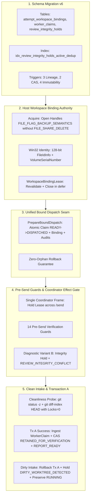

# PLAN-P04A: Workspace Binding Authority, Schema Migration v6, Seam Extension & Report Intake

> **Plan ID**: `PLAN-P04A-WORKSPACE-BINDING-AND-CLAIMS`
> **Task ID**: `TASK-P04-001`
> **Status**: `DRAFT_PLANNING` (Not Released — Pre-Contract Engineering Plan)
> **Author**: AI Engineering Supervisor Worker (under External Supervisor direction)
> **Date**: 2026-09-27
> **Base SHA**: `db6b654f03a7ce3c8e6ae2cd180f2cb7236bf7c2` (Canonical Reconciliation Merge Commit)
> **Active Gate**: `TASK_P04A_CONTRACT_PLANNING`
> **Related Architecture**:
> - [`ADR-018`](../adr/ADR-018-evidence-review-and-verification-isolation.md) (ACCEPTED / Level 2 Canonical Specification)
> - [`PROPOSAL-P04-001`](../proposals/PROPOSAL-P04-001-evidence-review-engine-boundaries.md) (Revision 22, `EXTERNAL_APPROVED`)
> - [`PLAN-P04-EVIDENCE-REVIEW.md`](PLAN-P04-EVIDENCE-REVIEW.md) (Revision 22, `EXTERNAL_APPROVED`)
> - [`docs/04_ARCHITECTURE.md`](../04_ARCHITECTURE.md) (Section 7: Evidence & Review Engine)
> - [`docs/05_DOMAIN_MODEL.md`](../05_DOMAIN_MODEL.md) (Section 8: Review & Verification Engine Schema)
> - [`docs/06_WORKFLOW_STATE_MACHINE.md`](../06_WORKFLOW_STATE_MACHINE.md) (Section 2: Phase P04 Lifecycle Integrations)
> - [`docs/08_TASK_CONTRACT.md`](../08_TASK_CONTRACT.md) (Task Contract Specification & Scope Discipline)
> - [`docs/14_FAILURE_RECOVERY.md`](../14_FAILURE_RECOVERY.md) (Section 1: Pre-Send & Intake Diagnostic Transactions)
> - [`docs/24_CHANGE_GOVERNANCE.md`](../24_CHANGE_GOVERNANCE.md) (Decision Hierarchy & Scope Boundaries)
> - [`SOURCE_REGISTRY.md`](../sources/SOURCE_REGISTRY.md), [`REUSE_MATRIX.md`](../sources/REUSE_MATRIX.md), [`MODULE_PROVENANCE.md`](../22_MODULE_PROVENANCE.md)

---

## 1. Executive Summary & Architectural Positioning

Subtask P04A constitutes the foundational bridge between dispatch lifecycle coordination and evidence review persistence. It establishes:
1. **Schema Migration v5 -> v6**: Implements the persistent storage baseline for workspace physical bindings (`attempt_workspace_bindings`), immutable worker claims (`worker_claims`), and integrity holds (`review_integrity_holds`), enforced with strict foreign keys, lineage triggers, CAS guards, and immutability rules.
2. **Host-Boundary Workspace Binding Authority**: Establishes OS-level directory handle anti-rename protection (omitting `FILE_SHARE_DELETE`) and queries 128-bit `FileIdInfo` physical identity on physical Windows NTFS/ReFS filesystems, preventing directory substitution attacks (junctions, symlinks, rename).
3. **Controlled Extension of PrepareBoundDispatch**: Combines bound dispatch allocation, workspace binding creation, and audit recording into a single, indivisible SQLite ACID transaction with guaranteed zero-orphan rollback semantics.
4. **Single Coordinator Effect Gate Across Dispatch**: Coordinates `Coordinator.Dispatch` to acquire a live `WorkspaceBindingLease`, maintain the open handles across fresh AO status revalidation, execute pure DB pre-send checks across all 14 guards, and issue `/send` while the lease remains actively held.
5. **Pre-Send Diagnostic Variant B Transaction**: On binding guard or lease failure, isolates the failure without modifying task state (`DISPATCHED`) or dispatch stage (`DISPATCH_BOUND`), atomically recording `REVIEW_INTEGRITY_CONFLICT` and an `ACTIVE` hold (`INVARIANT_MISMATCH`).
6. **Report Intake & Cleanliness Probe (Transaction A)**: Validates worktree cleanliness via pure read-only Git probes (`GIT_OPTIONAL_LOCKS=0`), ingests verbatim worker reports into `worker_claims`, advances task state to `REPORT_READY`, and, upon dirty worktree discovery, rolls back Transaction A, preserves `RUNNING`, appends `EVIDENCE_COLLECTION_FAILED`, and inserts an `ACTIVE` hold (`DIRTY_WORKTREE_DETECTED`).

### 1.1. Strict Architectural Boundaries

- **Model 1 Persistence Ownership**: Subtask P04A is the sole persistence owner of Schema v6, the controlled extension of `PrepareBoundDispatch`, Transaction A, and intake/pre-send diagnostic transactions.
- **Pure In-Memory Collector Seams**: Subtask P04B (Git collector) is NOT implemented in P04A. P04A defines only the data structures, interfaces, and test fakes for structured `GitEvidenceResult`.
- **Zero P04B/P04C/P04D Implementation**: No Git tree-walk snapshot extractors, Windows AppContainer sandboxes, verification leases, Transaction B, Transaction C, or ReviewBundle synthesis code will be written in P04A.
- **Fail-Closed Runtime Invariants**:
  * `AUTOMATIC_RESTORE = DISABLED`.
  * `VERIFIED_OPERATOR_PRINCIPAL = OPEN_FAIL_CLOSED_DEPENDENCY`.
  * `STAGE_B_RUNTIME_CATALOG = DEFERRED_TO_P04_RUNTIME_INTEGRATION`.
  * Zero runtime admission opening; P04A completion does not enable production execution of Phase P04.

---

## 2. Technical Decomposition



---

## 3. Detailed Component Specifications

### 3.1. Schema Migration v5 -> v6 (`internal/store/migrations.go`)

Migration v6 creates 3 tables, 1 index, and 9 triggers strictly conforming to accepted ADR-018:

#### 3.1.1. Table `attempt_workspace_bindings`
```sql
CREATE TABLE attempt_workspace_bindings (
    binding_id TEXT PRIMARY KEY,
    task_id TEXT NOT NULL,
    attempt_id TEXT NOT NULL,
    contract_id TEXT NOT NULL,
    canonical_worktree_path TEXT NOT NULL,
    volume_serial_hex TEXT NOT NULL,
    file_id_hex TEXT NOT NULL,
    linked_gitdir_path TEXT NOT NULL,
    linked_gitdir_volume_serial_hex TEXT NOT NULL,
    linked_gitdir_file_id_hex TEXT NOT NULL,
    binding_state TEXT NOT NULL CHECK (binding_state IN ('ACTIVE', 'RETAINED_FOR_VERIFICATION', 'RELEASED', 'INVALIDATED')),
    bound_at_epoch_ms INTEGER NOT NULL,
    released_at_epoch_ms INTEGER,
    FOREIGN KEY (task_id) REFERENCES tasks(task_id) ON DELETE RESTRICT,
    FOREIGN KEY (attempt_id) REFERENCES task_attempts(attempt_id) ON DELETE RESTRICT,
    FOREIGN KEY (contract_id) REFERENCES task_contracts(contract_id) ON DELETE RESTRICT
);
```

#### 3.1.2. Table `worker_claims`
```sql
CREATE TABLE worker_claims (
    claim_id TEXT PRIMARY KEY,
    task_id TEXT NOT NULL,
    attempt_id TEXT NOT NULL,
    contract_id TEXT NOT NULL,
    reported_head_sha TEXT NOT NULL CHECK (length(reported_head_sha) BETWEEN 7 AND 40),
    claim_payload_json TEXT NOT NULL,
    claimed_at_epoch_ms INTEGER NOT NULL,
    FOREIGN KEY (task_id) REFERENCES tasks(task_id) ON DELETE RESTRICT,
    FOREIGN KEY (attempt_id) REFERENCES task_attempts(attempt_id) ON DELETE RESTRICT,
    FOREIGN KEY (contract_id) REFERENCES task_contracts(contract_id) ON DELETE RESTRICT
);
```

#### 3.1.3. Table `review_integrity_holds`
```sql
CREATE TABLE review_integrity_holds (
    hold_id TEXT PRIMARY KEY,
    task_id TEXT NOT NULL,
    attempt_id TEXT NOT NULL,
    contract_id TEXT NOT NULL,
    hold_reason TEXT NOT NULL CHECK (hold_reason IN ('DIRTY_WORKTREE_DETECTED', 'INVARIANT_MISMATCH', 'EVIDENCE_COMPROMISED')),
    status TEXT NOT NULL CHECK (status IN ('ACTIVE', 'RESOLVED')),
    created_at_epoch_ms INTEGER NOT NULL,
    resolved_at_epoch_ms INTEGER,
    resolution_note TEXT,
    resolved_by_principal TEXT,
    FOREIGN KEY (task_id) REFERENCES tasks(task_id) ON DELETE RESTRICT,
    FOREIGN KEY (attempt_id) REFERENCES task_attempts(attempt_id) ON DELETE RESTRICT,
    FOREIGN KEY (contract_id) REFERENCES task_contracts(contract_id) ON DELETE RESTRICT
);
```

#### 3.1.4. Partial Unique Index
```sql
CREATE UNIQUE INDEX idx_review_integrity_holds_active_dedup
ON review_integrity_holds (attempt_id, hold_reason)
WHERE status = 'ACTIVE';
```

#### 3.1.5. Lineage Triggers
- `trg_attempt_workspace_bindings_lineage_guard`: Requires matching `(task_id, contract_id)` in `task_attempts` and requires `dispatch_operations.stage = 'DISPATCH_BOUND'`.
- `trg_worker_claims_lineage_guard`: Requires matching `(task_id, contract_id)` in `task_attempts`.
- `trg_review_integrity_holds_lineage_guard`: Requires matching `(task_id, contract_id)` in `task_attempts`.

#### 3.1.6. CAS Triggers
- `trg_attempt_workspace_bindings_cas_guard`: Enforces valid state transitions:
  * `ACTIVE` -> `RETAINED_FOR_VERIFICATION`
  * `ACTIVE` -> `RELEASED`
  * `ACTIVE` -> `INVALIDATED`
  * `RETAINED_FOR_VERIFICATION` -> `RELEASED`
  * `RETAINED_FOR_VERIFICATION` -> `INVALIDATED`
  Rejects all backwards transitions or terminal modifications.
- `trg_review_integrity_holds_cas_guard`: Enforces that `status` transitions strictly from `ACTIVE` to `RESOLVED` and requires `resolved_at_epoch_ms` and `resolved_by_principal` to be non-null.

#### 3.1.7. Immutability Triggers
- `trg_attempt_workspace_bindings_no_delete`: `BEFORE DELETE RAISE(ABORT, 'immutable attempt_workspace_bindings: delete forbidden')`.
- `trg_worker_claims_no_update`: `BEFORE UPDATE RAISE(ABORT, 'immutable worker_claims: update forbidden')`.
- `trg_worker_claims_no_delete`: `BEFORE DELETE RAISE(ABORT, 'immutable worker_claims: delete forbidden')`.
- `trg_review_integrity_holds_no_delete`: `BEFORE DELETE RAISE(ABORT, 'immutable review_integrity_holds: delete forbidden')`.

---

### 3.2. Host Workspace Binding Authority (`internal/host/`)

#### 3.2.1. Physical Identity & Handle Lifetime
- Implements `WorkspaceBindingAuthority` and `WorkspaceBindingLease` in `internal/host/workspace_binding_authority.go` and Windows platform primitives in `workspace_binding_authority_windows.go`.
- `Acquire(ctx, candidate) -> (WorkspaceBindingLease, error)`:
  * Opens worktree root handle and linked `.git` directory handle using Windows `CreateFileW`.
  * Access mask: `FILE_READ_ATTRIBUTES`.
  * Flags: `FILE_FLAG_BACKUP_SEMANTICS` (required to open directories on Windows).
  * Sharing mode: `FILE_SHARE_READ | FILE_SHARE_WRITE`. **Strictly omits `FILE_SHARE_DELETE`**, preventing rename, deletion, or root replacement by any process while the handle is open.
  * Queries canonical device path via `GetFinalPathNameByHandleW(VOLUME_NAME_DOS)`.
  * Queries 128-bit physical file identity via `GetFileInformationByHandleEx(FileIdInfo)` (`FILE_ID_INFO` containing 128-bit `FileId` and 32-bit `VolumeSerialNumber`).
  * Fails closed if filesystem/API does not support `FileIdInfo` (e.g. non-NTFS/ReFS).
- Returns immutable `WorkspaceBindingSnapshot`:
  * `CanonicalWorktreePath`, `VolumeSerialHex`, `FileIDHex`
  * `LinkedGitDirPath`, `LinkedGitDirVolumeSerialHex`, `LinkedGitDirFileIDHex`
- `Revalidate() error`:
  * Validates held OS handles remain valid and queryable.
  * Verifies current path has not changed and physical 128-bit identity matches the snapshot exactly.
- `Close() error`:
  * Closes both directory handles idempotently. Guaranteed execution via `defer lease.Close()`.

---

### 3.3. Controlled Extension of PrepareBoundDispatch (`internal/store/dispatch.go`)

- Extends `PrepareBoundDispatch` to accept `WorkspaceBindingSnapshot` in addition to `DispatchBinding`.
- Single atomic SQLite transaction executes in exact sequential order:
  1. Precondition guards verification (Task `READY`, latest frozen contract, Pair active-lane clean, zero unresolved quarantine/restore).
  2. Allocates `TaskAttempt` (`task_attempts`) with immutable session snapshot (`session_id`, `terminal_generation`).
  3. Inserts `dispatch_operations` with `stage = 'DISPATCH_BOUND'`.
  4. Inserts `attempt_workspace_bindings` with `binding_state = 'ACTIVE'`.
  5. Appends audit event `TASK_DISPATCH_BOUND`.
  6. Appends audit event `WORKSPACE_BINDING_CREATED`.
  7. CAS updates `tasks` (`READY -> DISPATCHED`) and increments `current_attempt`.
  8. Commits atomic transaction.
- **Rollback Guarantee**: If any step or trigger fails, the entire transaction rolls back; zero orphaned rows or audit events exist, and task remains `READY`.

---

### 3.4. 14 Pre-Send Verification Guards & Coordinator Effect Gate (`internal/dispatch/coordinator.go`)

In `Coordinator.Dispatch`, a single continuous function frame manages handle lifetime across the 9-step dispatch sequence:
1. `authority.Acquire(ctx, candidate)` -> live `lease` (Win32 handles open).
2. Extract immutable `WorkspaceBindingSnapshot`.
3. Commit `store.PrepareBoundDispatch` with snapshot.
4. Query fresh `GetWorkerStatus` from AO client.
5. Revalidate live lease: `lease.Revalidate()`.
6. Commit `store.RecordSendRequested` evaluating all 14 guards:
   1. `dispatch_operations.stage = 'DISPATCH_BOUND'`
   2. `dispatch_operations.resolution_state IS NULL`
   3. `task_attempts.recovery_disposition IS NULL`
   4. `tasks.state = 'DISPATCHED'`
   5. Exact current open attempt (`ended_at IS NULL`)
   6. Exact task/contract/Pair/session/generation lineage match across task, attempt, and operation
   7. Current `WorkerSession` identity matches and `quarantine_state = 'CLEAN'`
   8. Current `TaskAttempt` `quarantine_state = 'CLEAN'`
   9. Restore Guard: `NOT EXISTS (SELECT 1 FROM pair_restore_operations WHERE pair_id = ? AND resolution_state <> 'RESTORE_RESOLVED')`
   10. Provisioning Guard: `NOT EXISTS (SELECT 1 FROM pair_provisioning_operations WHERE pair_id = ? AND stage IN ('PROVISION_REQUESTED','PROVISION_FAILED'))`
   11. Fresh AO observation is idle or waiting_input (not terminated)
   12. Exactly one `attempt_workspace_bindings` row with `binding_state = 'ACTIVE'`
   13. Live `WorkspaceBindingLease.Revalidate()` PASS
   14. Zero `ACTIVE` holds in `review_integrity_holds` for attempt
7. Issue AO `/send` (`DispatchTaskContract`) while lease remains open.
8. Commit confirmed or containment transition.
9. Close lease in `defer`.

#### 3.4.1. Pre-Send Diagnostic Variant B Transaction
If any workspace binding guard fails:
- `/send` is strictly forbidden.
- Task remains `DISPATCHED`, operation remains `DISPATCH_BOUND`, attempt remains open.
- Separate atomic diagnostic transaction:
  1. Appends audit `REVIEW_INTEGRITY_CONFLICT`:
     * `conflict_source = 'WORKSPACE_BINDING_GUARD'`
     * `dispatch_operation_id = '<op_id>'`
     * `attempted_reason = 'WORKSPACE_BINDING_MISSING' | 'WORKSPACE_BINDING_LINEAGE_MISMATCH' | 'WORKSPACE_BINDING_NOT_ACTIVE' | 'WORKSPACE_BINDING_PHYSICAL_IDENTITY_MISMATCH'`
     * `conflict_type = 'LINEAGE_MISMATCH'`
     * `colliding_event_id` is strictly absent
     * `actor = 'ai-supervisor-daemon'`, `role = 'SUPERVISOR'`
  2. Inserts `ACTIVE` hold into `review_integrity_holds` (`hold_reason = 'INVARIANT_MISMATCH'`).
  3. CAS invalidates binding: `UPDATE attempt_workspace_bindings SET binding_state = 'INVALIDATED', released_at_epoch_ms = now WHERE attempt_id = ? AND binding_state = 'ACTIVE'`.
- Attempt terminalization requires separate governed operator action (`DISPATCHED -> FAILED`, `recovery_disposition = 'WORKSPACE_BINDING_INTEGRITY_FAILURE'`).

---

### 3.5. Report Intake & Cleanliness Probe (`internal/store/report_intake_transactions.go`)

#### 3.5.1. Cleanliness Verification
- Before ingesting completion report, worker worktree is inspected via read-only Git probes with `GIT_OPTIONAL_LOCKS=0`:
  * `git status --porcelain=v1 -z --untracked-files=all`
  * `git diff-index --quiet HEAD --`
- If uncommitted changes, untracked files, or staged modifications are detected, intake fails.

#### 3.5.2. Transaction A (Successful Intake)
Executed atomically when worktree is clean:
1. Validates worker report structure against `worker-report.schema.json`.
2. Normalizes JSON payload via RFC 8785 JSON Canonicalization Scheme (JCS).
3. Inserts verbatim `worker_claims` row (`reported_head_sha` validated to 7..40 hex characters).
4. CAS updates `attempt_workspace_bindings`: `ACTIVE` -> `RETAINED_FOR_VERIFICATION`.
5. CAS updates `tasks.state`: `RUNNING` -> `REPORT_READY`.
6. Appends audit event `WORKER_REPORT_INGESTED`.
7. Commits transaction.

#### 3.5.3. Dirty Intake Diagnostic Transaction
If the cleanliness probe reveals a dirty worktree or index:
1. Transaction A is rolled back immediately; zero worker claims are persisted; task state remains `RUNNING`.
2. In a separate diagnostic transaction:
   * Derives deterministic, non-self-referencing `hold_id` via Descriptor A:
     `hold_id = 'hold-' + SHA256(RFC8785_JCS({"kind": "review_integrity_hold", "task_id": ..., "attempt_id": ..., "contract_id": ..., "hold_reason": "DIRTY_WORKTREE_DETECTED", "occurrence_number": 1}))`
   * Derives `rejection_event_id` via Descriptor B:
     `rejection_event_id = SHA256(RFC8785_JCS({"kind": "audit_event", "event_type": "EVIDENCE_COLLECTION_FAILED", "task_id": ..., "attempt_id": ..., "hold_id": hold_id}))`
   * Appends audit event `EVIDENCE_COLLECTION_FAILED` to `audit_events`.
   * Inserts `ACTIVE` hold into `review_integrity_holds` (`hold_reason = 'DIRTY_WORKTREE_DETECTED'`).
   * Commits diagnostic transaction.
3. Task state strictly remains `RUNNING`, allowing worker or supervisor recovery without premature terminal failure.

---

## 4. Test Strategy & Acceptance Matrix

| Test Suite / Probe | Verification Target | Expected Behavior |
|---|---|---|
| **TestMigrationV6_Fresh** | Fresh database migration | Schema v6 applies cleanly; tables, index, triggers created. |
| **TestMigrationV6_Historical** | Migration from v5 to v6 | Upgrades from Schema v5 preserving existing data. |
| **TestMigrationV6_Rollback** | Migration rollback on error | Transaction rollback leaves zero Schema v6 artifacts. |
| **TestTriggers_Lineage** | Foreign key & lineage guards | Rejects inserts with mismatched task, attempt, or contract IDs. |
| **TestTriggers_CAS** | State transition validation | Rejects illegal binding and hold transitions. |
| **TestTriggers_Immutability** | Delete & update guards | ABORTs deletes on all 3 tables and updates on `worker_claims`. |
| **TestWBA_AntiRename** | Win32 handle sharing flags | Attempted directory rename/delete while lease held fails with `ERROR_SHARING_VIOLATION`. |
| **TestWBA_SubstitutionProbes** | Junctions, symlinks, rename | Directory substitution detected via 128-bit `FileIdInfo` mismatch. |
| **TestPrepareBoundDispatch_Atomic** | Unified bound dispatch seam | Atomically creates attempt, operation, binding, audits, and transitions `READY -> DISPATCHED`. Rollback leaves zero rows. |
| **TestCoordinator_14Guards** | All 14 pre-send guards | Each guard condition tested independently; invalid state halts `/send`. |
| **TestCoordinator_DiagnosticVariantB** | Pre-send binding rejection | Emits `REVIEW_INTEGRITY_CONFLICT`, inserts hold `INVARIANT_MISMATCH`, invalidates binding, preserves `DISPATCHED`. |
| **TestIntake_CleanSuccess** | Transaction A completion | Valid report creates `worker_claims`, advances to `REPORT_READY`. |
| **TestIntake_DirtyWorktree** | Dirty intake detection | Rolls back Tx A, preserves `RUNNING`, appends `EVIDENCE_COLLECTION_FAILED`, inserts hold `DIRTY_WORKTREE_DETECTED`. |
| **TestRace_FullSuite** | Concurrency & race detector | `go test -race -count=1 ./...` exits with code 0. |

---

## 5. Scope Boundaries & File Allocations

### 5.1. Explicit Allowed Scope
- `internal/domain/workspace_binding.go`
- `internal/domain/workspace_binding_test.go`
- `internal/domain/worker_claim.go`
- `internal/domain/worker_claim_test.go`
- `internal/domain/review_hold.go`
- `internal/domain/review_hold_test.go`
- `internal/domain/audit_events.go`
- `internal/domain/entities.go`
- `internal/host/authority.go`
- `internal/host/workspace_binding_authority.go`
- `internal/host/workspace_binding_authority_windows.go`
- `internal/host/workspace_binding_authority_test.go`
- `internal/store/migrations.go`
- `internal/store/migrations_v6_test.go`
- `internal/store/models.go`
- `internal/store/dispatch.go`
- `internal/store/dispatch_transactions.go`
- `internal/store/dispatch_transactions_test.go`
- `internal/store/workspace_binding_store.go`
- `internal/store/workspace_binding_test.go`
- `internal/store/report_intake_transactions.go`
- `internal/store/report_intake_test.go`
- `internal/dispatch/coordinator.go`
- `internal/dispatch/coordinator_test.go`
- `test/fakes/git_evidence_fake.go`

### 5.2. Explicit Forbidden Scope
- `cmd/supervisor/**` (Host daemon bootstrap & entrypoint admission control deferred)
- `internal/ao/**` (Live AO client communication)
- `internal/recovery/**` (Session lifecycle recovery core)
- `internal/stop/**` (Quiescence stop coordinator)
- `docs/adr/**` (Accepted ADRs are immutable)
- `docs/audits/**` (Audit records are immutable)
- `docs/plans/PLAN-P04-CANONICAL-RECONCILIATION-ADR-018.md`
- Any implementation of Subtasks P04B (Git collector, tree walk, snapshot extractor), P04C (AppContainer sandbox, stream capture), or P04D (CAS store, verification leases, Tx B/C, ReviewBundle synthesis).
