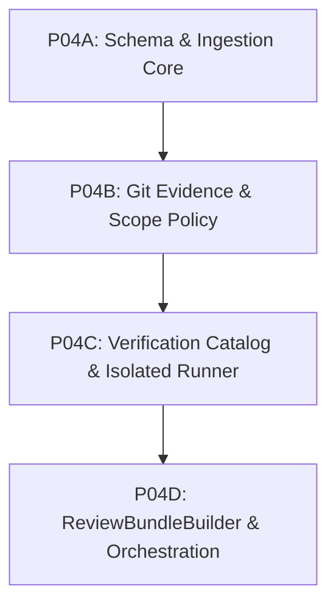

# PROPOSAL-P04-001: Evidence & Review Engine Architecture, Execution Isolation, and ReviewBundle Reconciliation

- **Proposal ID:** `PROPOSAL-P04-001`
- **Target Phase:** Phase P04 — Evidence & Review Engine
- **Status:** `PENDING_EXTERNAL_REVIEW`
- **Author:** AI Engineering Supervisor Control Plane Team
- **Governance Authority:** [`docs/24_CHANGE_GOVERNANCE.md`](../24_CHANGE_GOVERNANCE.md)
- **Decision Precedence:** Level 3 (Canonical Architecture) / Level 2 (ADR Required)
- **Related ADRs:** [`ADR-006`](../adr/ADR-006-evidence-first-review.md), [`ADR-011`](../adr/ADR-011-worker-report-handoff-and-agy-invocation-boundary.md), [`ADR-012`](../adr/ADR-012-task-contract-revision-and-attempt-binding.md), [`ADR-013`](../adr/ADR-013-trusted-verification-command-spec.md), [`DRAFT-ADR-018`](../adr/DRAFT-ADR-018-evidence-review-and-verification-isolation.md)
- **Primary Traceability:** FR-007, FR-008, FR-009, FR-010, SEC-003, NFR-004, NFR-008, REC-007, REC-008

---

## 1. Executive Summary & Context

Phase P03 established the foundational integration between the Supervisor Control Plane and the upstream Agent Orchestrator (AO REST daemon API `v0.13.0`), achieving clean session provisioning, task dispatch saga, observation reconciliation, raw bounded workspace artifact transport (`GetWorkspaceFile`), and exclusive daemon host bootstrap.

Pursuant to the formal governance boundaries frozen across Phase P01, P02, and P03:
1. **Zero-Trust Boundary**: AO session idleness (`AO_IDLE != REPORT_READY`) and worker execution output represent unverified worker hypotheses (`WORKER_CLAIMS`), not objective truth.
2. **P04 Ownership**: Phase P04 owns the exclusive domain authority to parse `worker-report.json`, enforce schema validation, extract `WorkerClaim` entities, collect independent Git evidence, evaluate TaskContract scope compliance via `PolicyEngine`, execute profile-constrained verification commands via `VerificationRunner`, persist immutable evidence rows, and assemble the synthesized `ReviewBundle` for ChatGPT supervisor review.
3. **Pre-Contract Seams**: Prior to drafting and releasing any formal Task Contract for Phase P04, four critical architectural seams must be evaluated and approved:
   - `DESIGN_BLOCKER_P04_WORKTREE_BINDING`: Establishing an authoritative, immutable binding between `TaskAttempt` and physical local workspace worktree.
   - `DESIGN_BLOCKER_P04_GIT_EVIDENCE_AUTHORITY`: Enforcing read-only, non-mutating, sanitized Git diff collection with precise revision ancestry semantics.
   - `DESIGN_BLOCKER_P04_VERIFICATION_ISOLATION`: Implementing two-layer verification command execution separating Layer A (command authority) from Layer B (untrusted code execution isolation) on Windows hosts.
   - `DESIGN_BLOCKER_P04_REVIEW_SCHEMA_RECONCILIATION`: Reconciling structural drift across specification markdown, JSON schemas, valid examples, and domain entity types.

This proposal provides the architectural analysis, gap matrix, technology trade-offs, state-machine transaction flows, persistence schemas, and subtask decomposition plan required for External Supervisor decision.

---

## 2. Current-State Gap Matrix

| Deliverable / Component | Canonical Requirement | Code Seam Hiện Có (Baseline P03) | Phần Còn Thiếu Cần Xây Dựng (P04) | Owner Subtask | Dependencies |
| :--- | :--- | :--- | :--- | :--- | :--- |
| **WorkerReport Ingestion** | FR-007, ADR-011, `docs/09_WORKER_REPORT.md` | `AOAdapter.GetWorkspaceFile` (`internal/adapter/ao/session.go`), `CanonicalExpectedReportPath` (`internal/store/report_path.go`) | Ingestion orchestrator, JSON schema parser/validator against `worker-report.schema.json`, identity reconciliation (`task_id`, `attempt_id`), size/content bounding. | P04A | AOAdapter, SQLite store |
| **WorkerClaim Creation** | FR-007, ADR-011, `docs/05_DOMAIN_MODEL.md` | `domain.WorkerClaim` entity definition (`internal/domain/entities.go`) | Entity conversion, field normalization, unverified claims extraction, SQLite persistence (`worker_claims` table). | P04A | WorkerReport parser |
| **EvidenceCollector** | FR-008, ADR-011, `docs/04_ARCHITECTURE.md`, `docs/22_MODULE_PROVENANCE.md` | `domain.Evidence` entity definition (`internal/domain/entities.go`) | Evidence coordinator orchestrating Git inspection, scope policy checking, and verification runner execution into atomic evidence bundle. | P04B / P04D | Git adapter, PolicyEngine, VerificationRunner |
| **Git Evidence Adapter** | FR-008, ADR-013 §4.4, `docs/22_MODULE_PROVENANCE.md` | Pure unit/harness mocks in `test/integration/ao_harness_test.go` | Read-only trusted absolute `git.exe` executor, environment sanitization, commit object verification, direct HEAD query, ancestry check, dirty worktree check, diff byte hasher. | P04B | Host Git binary, Worktree binding |
| **PolicyEngine** | FR-008, ADR-013, `docs/08_TASK_CONTRACT.md` | Pre-dispatch lexical path validator `ValidateCwdContainment` (`internal/contract/path_policy.go`) | Post-execution diff policy evaluator: matching git changed paths against `allowed_scope` and `forbidden_scope`, canonical glob matching, Windows case-insensitivity, scope precedence. | P04B | Git changed files list |
| **VerificationPolicyCatalog Runtime Loader** | ADR-013 §2, `docs/08_TASK_CONTRACT.md` | Pure domain interface `domain.VerificationPolicyCatalog` & `domain.VerificationProfilePolicy` (`internal/domain/verification_policy.go`) | Production host configuration file loader, trusted executable registry, parameter schema validator, timeout ceiling enforcer, capability mapping. | P04C | Host filesystem/config |
| **VerificationRunner** | FR-008, ADR-013 §2-4, `docs/07_SECURITY_MODEL.md` | None in production (P03 harness avoided executing external commands) | Concrete execution runner implementing Layer A command containment and Layer B isolation (AppContainer/Restricted Token + Job Object on Windows), zero-secret env, isolated TEMP/TMP, stdout/stderr caps, output hashing. | P04C | Windows OS APIs, Toolchain binaries |
| **Evidence Persistence** | FR-008, ADR-012, `docs/14_FAILURE_RECOVERY.md` | Schema v1-v5 (`internal/store/migrations.go`) without evidence tables | Schema v6: tables `worker_claims`, `evidence`, `actual_test_results`, `policy_findings`, `review_bundles`, lineage constraints, triggers, atomic transaction wrapper. | P04A, P04B, P04D | SQLite store |
| **ReviewBundleBuilder** | FR-009, FR-010, ADR-006, `docs/10_REVIEW_BUNDLE.md` | None in production (`internal/domain/entities.go` lacks `ReviewBundle` struct) | Bundle compiler correlating Contract, Claims, Git Evidence, Test Evidence, Policy Findings, generating review focus hints, validating schema against `review-bundle.schema.json`. | P04D | Evidence persistence, Schema validator |
| **State Transitions & Audit** | FR-007, FR-008, FR-009, `docs/06_WORKFLOW_STATE_MACHINE.md` | Pure state machine definition in `internal/workflow/state_machine.go` (`RUNNING -> REPORT_READY -> EVIDENCE_READY -> REVIEWING`) | Orchestrated transactional store methods executing atomic state updates with audit log appending and CAS checks. | P04A, P04B, P04D | SQLite store, Audit logger |

---

## 3. DESIGN_BLOCKER_P04_WORKTREE_BINDING

### 3.1. Problem Statement
Phase P04 requires collecting Git diffs, verifying repository state, and executing verification commands against the **exact local worktree** where the worker performed its attempt. However:
1. `TaskAttempt` in current schema v1-v5 does not record `worktree_path` or filesystem identity.
2. `WorkerSession.worktree_path` is a nullable column in schema v3 (`internal/store/migrations.go`).
3. Pinned AO (`v0.13.0`) does not expose `worktree_path` via its public session REST API (`GET /api/v1/sessions/{sessionId}`).
4. `Project.RootPath` denotes repository root, but does not prove whether AO created an isolated sub-worktree, branch directory, or session checkout.

### 3.2. Evaluation of Architectural Options

#### Phương án 1: Host-Owned Immutable `AttemptWorkspaceBinding` Persisted Before Dispatch
- **Mechanism:** Prior to issuing `POST /api/v1/sessions/{id}/send`, the Supervisor host resolves the exact canonical local worktree path, validates physical directory and Git repository root identity, and persists an immutable `attempt_workspace_bindings` record bound to `attempt_id`.
- **Provenance:** Authoritatively stamped by Supervisor Core at dispatch binding; lineage tied directly to `task_attempts.attempt_id`.
- **Crash/Restart Behavior:** Survives restarts cleanly; on recovery, Supervisor retrieves the persisted canonical path without re-querying AO or guessing.
- **Alias / Symlink / Junction Handling:** Canonicalized strictly via `filepath.EvalSymlinks` and Windows `GetFinalPathNameByHandleW` prior to database insertion.
- **TOCTOU:** Minimized: Path is validated and volume serial + file index or unique repository genesis commit is recorded. If repository identity changes at collection time, collection aborts fail-closed.
- **Replay:** Deterministic: Historical attempts permanently point to the exact worktree where execution occurred.
- **Schema Impact:** New table `attempt_workspace_bindings (attempt_id PK REFERENCES task_attempts, canonical_worktree_path TEXT NOT NULL, git_dir TEXT NOT NULL, bound_at TEXT NOT NULL)`.
- **Falsification Test:** Injecting a simulated dispatch with a symlink to another drive or non-existent worktree fails validation before dispatch. Pointing evidence collector to another directory triggers identity mismatch.

#### Phương án 2: `Project.RootPath` Used Only After Physical Git Repository / Worktree Identity Verification
- **Mechanism:** Assume worker operates in `Project.RootPath`, but before running Git commands, execute physical runtime verification (`git rev-parse --show-toplevel`, `git rev-parse --git-dir`, commit matching).
- **Provenance:** Derived from static `projects.root_path` table.
- **Crash/Restart Behavior:** Trivially re-read from `projects`.
- **Alias / Symlink / Junction Handling:** Evaluated at collection time.
- **TOCTOU:** High vulnerability: If multiple workers or concurrent attempts share `Project.RootPath`, Git HEAD changes during execution, corrupting diff collection. Multi-worktree setups cannot be disambiguated.
- **Replay:** Fails: If `Project.RootPath` advances to future commits, historical attempts cannot verify their original isolated workspace.
- **Schema Impact:** Zero schema change.
- **Falsification Test:** Dispatching two concurrent attempts to the same `Project.RootPath` causes cross-attempt diff contamination.

#### Phương án 3: Host Worktree Registry Mapping Exact Attempt/Session/Generation to Local Path
- **Mechanism:** A centralized host daemon service (`HostWorktreeRegistry`) manages workspace paths for all active sessions. Maps `(session_id, terminal_generation, attempt_id) -> canonical_worktree_path`.
- **Provenance:** Maintained in memory with backing SQLite storage.
- **Crash/Restart Behavior:** Reconstructed on daemon startup from database and active session state.
- **Alias / Symlink / Junction Handling:** Centralized canonical path normalization.
- **TOCTOU:** Protected by the daemon's single-instance machine exclusivity lock (ADR-017).
- **Replay:** Requires querying historical registry records.
- **Schema Impact:** Requires updating `worker_sessions.worktree_path` to `NOT NULL` or introducing `host_worktree_mappings`.
- **Falsification Test:** Terminating session and unregistering worktree prevents any late evidence collector from accessing invalid workspace.

### 3.3. Recommendation
**Khuyến nghị Phương án 1 kết hợp Phương án 3:**
Adopt an immutable `AttemptWorkspaceBinding` table persisted at dispatch time (Phương án 1), verified against the Host Worktree Registry (Phương án 3). If `worktree_path` cannot be authoritatively resolved and verified as a valid Git worktree prior to dispatch, dispatch MUST be refused (`FAIL_CLOSED`).
*Lưu ý: Không implement trong lượt này; giữ DESIGN_BLOCKER_P04_WORKTREE_BINDING = OPEN.*

---

## 4. DESIGN_BLOCKER_P04_GIT_EVIDENCE_AUTHORITY

### 4.1. Strict Read-Only Authority & Isolation
The Git evidence collector must operate as a deterministic, tamper-proof audit probe:
1. **Trusted Absolute Executable**: The binary `git.exe` must be located at a trusted absolute path validated at Supervisor startup. Never resolve `git` via mutable `PATH` or worker-controlled `cwd`.
2. **Fixed Internal Commands**: Command invocations are hardcoded internal routines. The collector strictly rejects command strings or arguments from TaskContract, worker reports, or ChatGPT tools.
3. **Absolute Prohibition on Mutating Commands**: Commands such as `git checkout`, `git reset`, `git clean`, `git stash`, `git commit`, `git merge`, `git rebase`, `git pull`, `git push`, `git tag` are strictly forbidden in P04.
4. **Environment Sanitization**: Child process environment must strip:
   - `GIT_DIR`, `GIT_WORK_TREE`, `GIT_INDEX_FILE`, `GIT_OBJECT_DIRECTORY`, `GIT_ALTERNATE_OBJECT_DIRECTORIES`.
   - `HOME`, `USERPROFILE`, `XDG_CONFIG_HOME` (prevent reading malicious user configs).
   - Set `GIT_CONFIG_NOSYSTEM=1`.
5. **Config Hardening Flags**: Every git command must execute with inline config overrides:
   `-c core.hooksPath=/dev/null -c diff.external= -c core.fsmonitor=false -c diff.textconv=false -c core.askPass= -c credential.helper=`
6. **Object & Repository Verification**:
   - Verify `base_sha` exists as a valid commit object: `git cat-file -e <base_sha>^{commit}`.
   - Read actual HEAD directly from worktree: `git rev-parse HEAD`.
   - Verify `head_sha` exists as a valid commit object: `git cat-file -e <actual_head_sha>^{commit}`.
   - Reconcile `actual_head_sha` against `WorkerReport.head_sha`. Discrepancies are recorded as `UNVERIFIED_CLAIM` or `HEAD_MISMATCH`.

### 4.2. Revision Ancestry Semantics: `base..head` vs `base...head`
Choosing between two-dot and three-dot diff notation is a fundamental architectural decision:
- **Two-Dot Notation (`base..head` / `git diff base head`)**:
  - *Semantics*: Compares the tree of commit `base` directly with the tree of commit `head`.
  - *Behavior*: Produces the exact net diff required to turn `base` into `head`.
  - *Failure Mode*: If upstream commits were merged into `base` after the worker branched, or if `base` and `head` have diverged, `base..head` includes the inverted diff of all intermediary base commits, misattributing upstream changes to the worker.
- **Three-Dot Notation (`base...head`)**:
  - *Semantics*: Compares `head` with the `merge-base` (common ancestor) of `base` and `head`.
  - *Behavior*: Shows only the changes made on the worker's branch since it diverged from `base`.
  - *Failure Mode*: If `base` and `head` have no common ancestor (disconnected histories), `git diff base...head` fails with a fatal error. Furthermore, if the worker merged upstream into their branch, `merge-base` advances, potentially hiding changes.
- **Authoritative Ancestry Policy**:
  The Supervisor enforces **Strict Linear Descendant Policy**:
  1. Execute `git merge-base --is-ancestor <base_sha> <actual_head_sha>`.
  2. If `base_sha` is an ancestor of `actual_head_sha`, then `base..head` and `base...head` are mathematically identical. The diff is clean, linear, and uncontaminated.
  3. If `base_sha` is **NOT** an ancestor of `actual_head_sha`:
     - The attempt has diverged, rebased incorrectly, or swapped branches.
     - Flag `ANCESTRY_DIVERGENCE_ERROR`.
     - The collector halts and transitions to `FAILED` or records policy violation; it does NOT guess which diff representation to use.

### 4.3. Worktree Cleanliness & File Change Extraction
- **Dirty Worktree Detection**: Run `git status --porcelain=v1 -z -uall`.
  - Tracked modifications (` M`), staged files (`M `), or untracked files (`??`) outside `.supervisor/` indicate uncommitted worktree pollution.
  - If dirty files exist, they must be recorded in evidence. Depending on project policy, uncommitted changes trigger `UNCOMMITTED_CHANGES_VIOLATION`.
- **NUL-Delimited Path Parsing**: All git commands listing paths (`git diff -z --raw`, `git status -z`) must use `-z` (NUL delimiter `\0`) to prevent quote escaping and handle special characters/spaces safely.
- **Canonical Diff Byte Hash**: Compute SHA-256 over raw binary diff output (`git diff --binary --no-color base head`) to produce an immutable `git_diff_hash`.

---

## 5. DESIGN_BLOCKER_P04_VERIFICATION_ISOLATION

### 5.1. Separation of Security Layers
Pursuant to [`ADR-013`](../adr/ADR-013-trusted-verification-command-spec.md):
- **Layer A (Command Authority Containment)**: Prevents shell injection and arbitrary executable execution by requiring declarative `verification_requests` bound to host-defined `VerificationProfilePolicy` definitions.
- **Layer B (Untrusted Code Execution Isolation)**: Solves the threat where safe commands (`go test`, `npm test`) execute untrusted repository code written by an AI worker:
  ```
  SAFE_PROFILE != TRUSTED_CODE
  ```

### 5.2. Evaluation of Windows Execution Isolation Mechanisms

| Isolation Mechanism | Filesystem Sandboxing | Network Isolation | Secret / Token Stripping | Process-Tree Cleanup | Startup Overhead | Verdict for Layer B |
| :--- | :--- | :--- | :--- | :--- | :--- | :--- |
| **Subprocess Only (Naked exec)** | NONE | NONE | NONE (Inherits all) | Poor (Orphan risk) | < 5 ms | **REJECTED**: Extreme vulnerability |
| **Windows Job Object Only** | NONE | NONE | NONE | EXCELLENT (`JOB_OBJECT_LIMIT_KILL_ON_JOB_CLOSE`) | < 5 ms | **REJECTED FOR LAYER B ALONE**: ADR-013 explicitly notes Job Object lacks fs/net/secret sandbox |
| **Restricted Token (Safer/LUA)** | MODERATE (Restricted SID, Low Integrity) | POOR (Shares host network stack) | GOOD (Strips privileges, admin SIDs) | Moderate | < 20 ms | **PARTIAL**: Requires external firewalling |
| **Windows AppContainer** | EXCELLENT (Capability-based; only explicit worktree ACL) | EXCELLENT (Default deny all inbound/outbound) | EXCELLENT (Anonymous sandboxed SID) | GOOD (Paired with Job Object) | < 50 ms | **RECOMMENDED FOR WINDOWS**: Native, fast, robust fs & net isolation |
| **Windows Sandbox / MicroVM / Containers** | COMPLETE | COMPLETE | COMPLETE | COMPLETE | 15–30 sec | **REJECTED FOR TEST RUNS**: Violates NFR-008 (< 3s SLA) and high host requirements |

### 5.3. Isolation Invariants & Operational Policy Values
1. **Rejection of Job Object Alone**: A Windows Job Object MUST NOT be claimed as full Layer B isolation. It must be paired with security token/AppContainer sandboxing.
2. **Environment Stripping**: The execution environment must contain **zero host secrets**. Prohibit `OPENAI_API_KEY`, `ANTHROPIC_API_KEY`, `GITHUB_TOKEN`, AO credentials, tunnel tokens. Provide only bare OS minimums (`SYSTEMROOT`, `COMSPEC`, `WINDIR`) and toolchain home (`GOROOT`).
3. **Isolated Temporary Directories**: Redirect `TEMP` and `TMP` to an attempt-local folder: `.supervisor/tmp/<attempt_id>/`, securely wiped post-execution.
4. **Output Buffering Ceilings**: stdout and stderr streams are strictly capped (e.g. 1 MB). Overflow triggers truncation flag `OUTPUT_EXCEEDED_LIMIT`.
5. **Fail-Closed on Isolation Absence**: If the host platform lacks the configured Layer B capability, the runner MUST fail-closed (`ISOLATION_CAPABILITY_UNAVAILABLE`), rather than silently executing unprotected.
6. **Operational Limits**: Operational limits (e.g. `DEFAULT_VERIFICATION_TIMEOUT`, `MAX_OUTPUT_BYTES`) remain `VALUE = UNSET` or host-injected until formal approval.

---

## 6. WorkerReport Ingestion & Atomic State Flow

### 6.1. Ingestion Protocol
1. **Raw Bounded Transport**: The Supervisor calls `AOAdapter.GetWorkspaceFile(sessionID, expectedReportPath)`. Transport enforces a maximum byte ceiling (e.g. 1 MB) and bounded HTTP timeout.
2. **JSON Schema Validation**: Parse payload and validate 100% against `worker-report.schema.json`.
3. **Identity Verification**: Verify:
   - `report.task_id == attempt.task_id`
   - `report.attempt_id == attempt.attempt_id`
   - Lineage matches active `task_contracts.contract_id`.
4. **Worker Fields as Claims**: All worker content (`commands_run`, `tests`, `build_status`, `worker_claims`) is captured strictly as `domain.WorkerClaim` telemetry.

### 6.2. Atomic State Transition (`RUNNING -> REPORT_READY`)
When a valid report is ingested, the Supervisor must atomically execute inside a single SQLite transaction:
```sql
BEGIN IMMEDIATE TRANSACTION;
-- 1. Store raw report and attempt end time
UPDATE task_attempts
SET ended_at = :ended_at,
    worker_report_raw = :worker_report_raw
WHERE attempt_id = :attempt_id AND ended_at IS NULL;

-- 2. Insert WorkerClaim
INSERT INTO worker_claims (claim_id, attempt_id, reported_head_sha, claimed_files_changed_json, tests_json, created_at)
VALUES (:claim_id, :attempt_id, :head_sha, :files_json, :tests_json, :now);

-- 3. Transition Task state
UPDATE tasks
SET state = 'REPORT_READY', updated_at = :now
WHERE task_id = :task_id AND state = 'RUNNING';

-- 4. Append audit event
INSERT INTO audit_events (...);
COMMIT;
```

### 6.3. Failure Protocols (REC-007 / REC-008)
- If the report file is missing after bounded poll: Trigger `REC-007`. Mark attempt `ended_at = now`, transition `TaskState = FAILED`, `failure_reason = REPORT_MISSING`. Zero promotion to `REPORT_READY`.
- If the report is non-JSON or violates schema: Trigger `REC-008`. Transition `TaskState = FAILED`, `failure_reason = REPORT_INVALID`.
- If identifiers mismatch: Trigger `REC-008`. Transition `TaskState = FAILED`, `failure_reason = REPORT_IDENTITY_MISMATCH`.
- In all failure cases, **no normal ReviewBundle is generated**.

---

## 7. Evidence Persistence & Transaction Boundaries

### 7.1. Proposed Schema (Design Level — No DDL Applied)

```sql
-- 1. Self-reported worker claims
CREATE TABLE worker_claims (
    claim_id TEXT PRIMARY KEY,
    attempt_id TEXT NOT NULL UNIQUE REFERENCES task_attempts(attempt_id) ON DELETE RESTRICT,
    reported_head_sha TEXT NOT NULL,
    claimed_files_changed_json TEXT NOT NULL,
    tests_json TEXT,
    created_at TEXT NOT NULL
);

-- 2. Authoritative Git and scope evidence
CREATE TABLE evidence (
    evidence_id TEXT PRIMARY KEY,
    attempt_id TEXT NOT NULL UNIQUE REFERENCES task_attempts(attempt_id) ON DELETE RESTRICT,
    actual_base_sha TEXT NOT NULL,
    actual_head_sha TEXT NOT NULL,
    actual_files_changed_json TEXT NOT NULL,
    git_diff_hash TEXT NOT NULL,
    diff_stat TEXT NOT NULL,
    scope_verified INTEGER NOT NULL CHECK (scope_verified IN (0, 1)),
    collected_at TEXT NOT NULL
);

-- 3. Verified test execution results from VerificationRunner
CREATE TABLE actual_test_results (
    result_id TEXT PRIMARY KEY,
    attempt_id TEXT NOT NULL REFERENCES task_attempts(attempt_id) ON DELETE RESTRICT,
    request_id TEXT NOT NULL,
    profile_id TEXT NOT NULL,
    exit_code INTEGER NOT NULL,
    passed INTEGER NOT NULL CHECK (passed IN (0, 1)),
    stdout_hash TEXT NOT NULL,
    stderr_hash TEXT NOT NULL,
    duration_ms INTEGER NOT NULL,
    executed_at TEXT NOT NULL,
    UNIQUE(attempt_id, request_id)
);

-- 4. Scope and contract policy findings
CREATE TABLE policy_findings (
    finding_id TEXT PRIMARY KEY,
    attempt_id TEXT NOT NULL REFERENCES task_attempts(attempt_id) ON DELETE RESTRICT,
    rule_id TEXT NOT NULL,
    passed INTEGER NOT NULL CHECK (passed IN (0, 1)),
    severity TEXT NOT NULL CHECK (severity IN ('INFO', 'WARNING', 'ERROR', 'BLOCKING')),
    details TEXT NOT NULL,
    created_at TEXT NOT NULL
);

-- 5. Final compiled ReviewBundle metadata
CREATE TABLE review_bundles (
    bundle_id TEXT PRIMARY KEY,
    task_id TEXT NOT NULL REFERENCES tasks(task_id) ON DELETE RESTRICT,
    attempt_id TEXT NOT NULL UNIQUE REFERENCES task_attempts(attempt_id) ON DELETE RESTRICT,
    contract_id TEXT NOT NULL REFERENCES task_contracts(contract_id) ON DELETE RESTRICT,
    bundle_hash TEXT NOT NULL,
    payload_json TEXT NOT NULL,
    generated_at TEXT NOT NULL
);
```

### 7.2. Transaction Boundaries
- **Transaction 1 (`REPORT_READY -> EVIDENCE_READY`)**:
  - Requires: Git diff evidence collected, PolicyEngine findings computed, and ALL mandatory `verification_requests` executed.
  - Commits atomically: `evidence`, `actual_test_results`, `policy_findings`, and `tasks.state = 'EVIDENCE_READY'`.
  - Partial evidence commits are strictly forbidden. If any verification runner fails catastrophically or crashes, transaction rolls back.
- **Transaction 2 (`EVIDENCE_READY -> REVIEWING`)**:
  - Requires: `ReviewBundleBuilder` compiles payload, validates 100% against `review-bundle.schema.json`.
  - Commits atomically: `review_bundles`, `tasks.state = 'REVIEWING'`, and audit log.

---

## 8. ReviewBundle Canonical Reconciliation

### 8.1. Current Drift Analysis Matrix

| Field / Concept | `docs/10_REVIEW_BUNDLE.md` | `docs/schemas/review-bundle.schema.json` | `review-bundle.valid.json` | `internal/domain/entities.go` | Nature of Drift & Proposed Resolution |
| :--- | :--- | :--- | :--- | :--- | :--- |
| **`diff_summary` vs `diff_stat`** | Mermaid specifies `diff_summary: DiffSummary`; text specifies `diff_stat`. | Requires `diff_stat: string`. | Contains `"diff_stat": "1 file changed..."`. | `Evidence` struct lacks both fields. | **Reconcile**: Adopt `diff_stat: string` in schema and domain model. Update Mermaid in `docs/10`. |
| **`full_diff_url`** | Present in Mermaid (`+string full_diff_url`). | Missing from schema. | Missing from example. | Missing from `entities.go`. | **Reconcile**: Remove `full_diff_url` from canonical docs; local supervisor uses direct bounded diff payload. |
| **`git_diff_hash`** | Missing from field list. | Missing from schema properties. | Missing from example. | Present in `entities.go` (`GitDiffHash string`). | **Reconcile**: Add `git_diff_hash: string` to `actual_git_evidence` in schema and `docs/10` for tamper evidence. |
| **`actual_test_evidence`** | `all_passed`, `executed_commands`. | `all_passed: boolean`, `executed_commands: string[]`. | `"all_passed": true, "executed_commands": [...]"`. | `TestLogs: []ActualTestResult`. | **Reconcile**: Add structured `test_results: []ActualTestResult` inside `actual_test_evidence` alongside summary `all_passed`. |
| **`worker_claims` Structure** | Claims from `WorkerReport`. | Type `object` (unstructured). | `{"claimed_status": "...", "claims": [...]}`. | `WorkerClaim` entity struct with `ReportedHeadSHA`, `Tests`. | **Reconcile**: Define explicit schema for `worker_claims` object matching `domain.WorkerClaim`. |
| **`additionalProperties`** | Implied closed. | Top level has `additionalProperties: false`; nested objects lack it. | Compliant. | Go structs ignore unknown by default. | **Reconcile**: Enforce `additionalProperties: false` on all nested schema definitions. |
| **`ReviewBundle` Domain Entity** | Fully specified. | Fully specified. | Fully specified. | **MISSING**: Struct `ReviewBundle` does not exist in Go code. | **Reconcile**: Implement `ReviewBundle` Go struct in `internal/domain/entities.go`. |

### 8.2. Canonical Reconciliation Plan (S1..S10)
- **S1**: Standardize `actual_git_evidence` schema to require `actual_base_sha`, `actual_head_sha`, `actual_changed_files`, `diff_stat`, and `git_diff_hash`.
- **S2**: Remove obsolete `full_diff_url` from `docs/10_REVIEW_BUNDLE.md`.
- **S3**: Formalize `actual_test_evidence` schema with `all_passed: boolean`, `executed_commands: string[]`, and optional `details: []ActualTestResult`.
- **S4**: Formalize `worker_claims` schema structure to eliminate untyped `object`.
- **S5**: Add nested `additionalProperties: false` to all sub-objects in `review-bundle.schema.json`.
- **S6**: Define explicit length and count bounds for all strings and arrays in `review-bundle.schema.json`.
- **S7**: Align `internal/domain/entities.go` with reconciled schema by adding `ReviewBundle`, `ActualGitEvidence`, and updating `ActualTestEvidence`.
- **S8**: Update `docs/schemas/examples/review-bundle.valid.json` to reflect reconciled fields.
- **S9**: Formalize deterministic JSON serialization and hashing algorithm for `bundle_hash`.
- **S10**: Submit reconciled documentation diff for External Supervisor audit.

---

## 9. PolicyEngine Semantics

### 9.1. Specification
The `PolicyEngine` enforces TaskContract scope containment against actual Git changed files:
1. **Canonical Glob Grammar**: Standard Unix globbing: `*` (matches within path segment), `**` (matches across directories), `?` (single character), `[...]` (character class). No arbitrary regex or brace expansion.
2. **Slash Normalization**: All paths and patterns strictly converted to forward slash (`/`). Windows backslashes (`\`) normalized prior to evaluation.
3. **Windows Case Insensitivity**: On Windows, file paths are matched case-insensitively (`strings.EqualFold` / canonical lowercase normalization) to prevent case-variation bypasses (e.g. `File.txt` vs `file.txt`).
4. **Precedence Rule**:
   ```
   IF path matches forbidden_scope -> REJECT (FORBIDDEN)
   ELSE IF path matches allowed_scope -> ACCEPT
   ELSE -> REJECT (OUTSIDE_SCOPE)
   ```
   `forbidden_scope` **strictly takes precedence** over `allowed_scope`.
5. **Special Path Handlings**:
   - **Renamed / Copied Files**: Both source path and destination path must independently satisfy `allowed_scope` and not match `forbidden_scope`.
   - **Deleted Files**: Deleted path must satisfy `allowed_scope`.
   - **Submodules / Gitlinks**: Submodule path entries must be within `allowed_scope`.
   - **Symlinks**: The symlink path itself and its evaluated target must both be contained within `allowed_scope`.
   - **Control Plane Metadata (`.supervisor/**`)**: Excluded from worker application diff; if any commit touches `.supervisor/`, trigger fatal scope violation.
6. **Fail-Closed on Empty / Invalid**: Empty `allowed_scope` allows zero files. Invalid glob pattern fails evaluation closed immediately.

---

## 10. Verification Result Integrity

1. **Request Binding**: Every `ActualTestResult` is immutably bound to `(attempt_id, request_id, profile_id)`.
2. **Exact Request Snapshot**: The executed command line, parameters, and cwd are snapshotted from the immutable `TaskContract.VerificationRequests`.
3. **Execution Metadata**:
   - Wall-clock timestamps (`started_at`, `ended_at`, `duration_ms`).
   - Process exit code.
   - Cryptographic hashes of stdout and stderr (`SHA-256`).
   - Process tree termination status (`CLEAN_EXIT`, `TIMEOUT_KILLED`, `OUTPUT_CAPPED`).
4. **No Worker Claim Promotion**: Test results claimed in `WorkerReport.tests` are never copied or promoted into `actual_test_results`. Only commands independently executed by the Supervisor's `VerificationRunner` receive `passed = true/false`.
5. **Missing Verification Handling**: If a required verification request in `TaskContract.verification_requests` fails to execute, the attempt MUST be marked `UNVERIFIED` / `FAILED`.

---

## 11. Recovery, Concurrency, and Replay Matrix

| Scenario ID | Failure / Event Trigger | System Impact | Recovery / Resolution Mechanism | Resulting State |
| :--- | :--- | :--- | :--- | :--- |
| **REC-P04-01** | Crash after report fetch, before `REPORT_READY` transaction | Raw report lost from memory; DB unchanged at `RUNNING` | On restart, Supervisor re-reads AO session activity; if IDLE, re-fetches report via `GetWorkspaceFile` | `REPORT_READY` or `FAILED` |
| **REC-P04-02** | Crash after report persistence, before audit log commit | DB transaction rolled back | Atomic transaction ensures zero partial commit; re-ingests on next cycle | Clean retry from `RUNNING` |
| **REC-P04-03** | Git HEAD changes during evidence collection | Git diff inconsistent with worker turn | Verify HEAD against `WorkerReport.head_sha`; mismatch aborts collection | `FAILED (HEAD_MISMATCH)` |
| **REC-P04-04** | Worktree contains uncommitted/staged dirty files | Workspace polluted | `git status --porcelain=v1` detects dirty files; flags `UNCOMMITTED_DIRTY_WORKTREE` | `FAILED (DIRTY_WORKTREE)` |
| **REC-P04-05** | Base or Head commit object missing in repo | Cannot compute diff | `git cat-file -e` check fails; report missing commits | `FAILED (COMMIT_OBJECT_MISSING)` |
| **REC-P04-06** | Verification runner times out | Test exceeds `max_timeout` | Job Object forcefully terminates process tree; records `TIMEOUT_KILLED` | `FAILED (VERIFICATION_TIMEOUT)` |
| **REC-P04-07** | Verification runner stdout/stderr buffer overflow | Worker floods output stream | Stream truncated at cap; records `OUTPUT_CAPPED` flag; hash computed on capped stream | Recorded in evidence |
| **REC-P04-08** | Evidence persistence SQLite failure | Disk full or DB locked | Entire transaction rolls back; no `EVIDENCE_READY` promotion | Retry or `FAILED` |
| **REC-P04-09** | Audit log append failure | Hash chain or trigger violation | Atomic rollback of entire evidence transaction | Fail-closed |
| **REC-P04-10** | Competing collectors for the same attempt | Race condition between threads | `attempt_id UNIQUE` constraint on `evidence` table; second caller loses CAS and rereads committed row | Idempotent duplicate handled |
| **REC-P04-11** | ReviewBundle JSON schema validation failure | Bug in bundle synthesis | Bundle persistence rejected; task halts before `REVIEWING` | `FAILED (BUNDLE_SCHEMA_INVALID)` |
| **REC-P04-12** | Restart with partial rows from prior crashes | Orphaned uncommitted state | Database transactional isolation guarantees no partial rows exist | Clean state rehydration |
| **REC-P04-13** | Repeated request after `EVIDENCE_READY` / `REVIEWING` | Duplicate API call | Idempotent read: returns existing compiled `ReviewBundle` from DB | Unchanged (`REVIEWING`) |

---

## 12. Requirement Clarification: NFR-008 Review Bundle Generation Latency

### 12.1. The Conflict
- **NFR-008 Statement** (`docs/02_REQUIREMENTS.md`):
  *"The Supervisor Control Plane shall generate a Review Bundle within 3 seconds of worker completion on repos up to 10,000 files."*
- **Operational Reality**:
  Running real verification requests (e.g. `go test -race ./...`, `npm test`) frequently takes 10 to 60+ seconds, making a literal 3-second end-to-end SLA physically impossible whenever tests are required.

### 12.2. Proposed Clarification Options (For External Supervisor Decision)
- **Option A (Pure Assembly Latency SLA)**:
  Clarify that the 3-second deadline applies strictly to **pure Review Bundle assembly and JSON serialization** from `EVIDENCE_READY` to `REVIEWING`, excluding external test runner execution time.
- **Option B (Segmented End-to-End SLA)**:
  Decompose the requirement into distinct measurable segments:
  1. *Report Ingestion & Git Evidence SLA*: < 3.0 seconds (for repos up to 10,000 files).
  2. *Verification Execution SLA*: Bounded by `TaskContract.verification_requests[].timeout_seconds`.
  3. *Review Bundle Compilation SLA*: < 1.0 second.
- **Status:** Marked as **REQUIREMENT_CLARIFICATION_REQUIRED**; pending External Supervisor formal determination.

---

## 13. Phased Scope Decomposition Plan

A monolithic implementation of Phase P04 carries excessive risk and large blast radius. We propose decomposing P04 into four strictly sequential subcontracts:



1. **`P04A` — WorkerReport Ingestion, Schema Validation & Claim Persistence**:
   - Scope: `worker-report.schema.json` reconciliation, `AOAdapter.GetWorkspaceFile` integration, `worker_claims` table migration, `RUNNING -> REPORT_READY` transition, `REC-007`/`REC-008` handling.
   - Exit Gate: Ingests valid reports, rejects malformed/missing reports, transitions `REPORT_READY` with zero Git/test dependencies.
2. **`P04B` — Git EvidenceCollector & PolicyEngine**:
   - Scope: Read-only `git.exe` adapter, commit/ancestry verification, dirty file detection, NUL-delimited parsing, diff byte hashing, `PolicyEngine` glob scope evaluation, `evidence` and `policy_findings` persistence.
   - Exit Gate: Mathematically accurate diffs and scope violations detected against actual Git commits.
3. **`P04C` — VerificationPolicyCatalog & Isolated VerificationRunner**:
   - Scope: Host verification catalog loader, trusted executable registry, Layer B execution isolation harness (AppContainer/Restricted Token + Job Object), output capping, hashing, `actual_test_results` persistence.
   - Exit Gate: Safely executes test profiles inside isolated boundary; enforces timeouts and output caps; zero secret leakage.
4. **`P04D` — ReviewBundleBuilder & End-to-End Orchestration**:
   - Scope: `ReviewBundleBuilder` implementation, `review-bundle.schema.json` validation, `review_bundles` persistence, `REPORT_READY -> EVIDENCE_READY -> REVIEWING` transitions, end-to-end integration harness.
   - Exit Gate: 100% valid ReviewBundles generated; full lifecycle integration test passes with zero race conditions.

---

## 14. Blocker & Governance Tracking

- `DESIGN_BLOCKER_P04_WORKTREE_BINDING = OPEN`
- `DESIGN_BLOCKER_P04_VERIFICATION_ISOLATION = OPEN`
- `DESIGN_BLOCKER_P04_REVIEW_SCHEMA_RECONCILIATION = OPEN`
- `DESIGN_BLOCKER_P04_EVIDENCE_ATOMICITY = OPEN`
- `P04_TASK_CONTRACT = NOT_RELEASED`
- `P04_CODE = HELD_PENDING_APPROVED_ARCHITECTURE_AND_TASK_CONTRACT`
- `ACTIVE_GATE = P04_PRECONTRACT_ARCHITECTURE_AUDIT`
