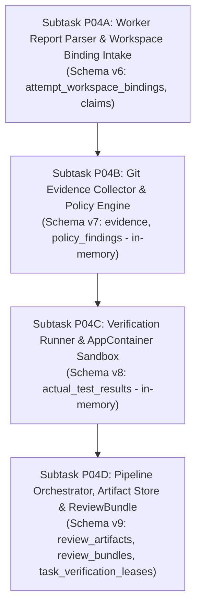

# PROPOSAL-P04-001: Evidence & Review Engine Architecture, Execution Isolation, and ReviewBundle Reconciliation

- **Proposal ID:** `PROPOSAL-P04-001`
- **Revision:** 6 (Remediation of External Re-Audit 004)
- **Target Phase:** Phase P04 — Evidence & Review Engine
- **Status:** `PENDING_EXTERNAL_REVIEW`
- **Audit References:**
  - [`docs/audits/P04_PRECONTRACT_ARCHITECTURE_EXTERNAL_REAUDIT_004.md`](../audits/P04_PRECONTRACT_ARCHITECTURE_EXTERNAL_REAUDIT_004.md) (`REVISION_5_REQUIRED`)
  - [`docs/audits/P04_PRECONTRACT_ARCHITECTURE_EXTERNAL_REAUDIT_003.md`](../audits/P04_PRECONTRACT_ARCHITECTURE_EXTERNAL_REAUDIT_003.md) (`REVISION_4_REQUIRED`)
  - [`docs/audits/P04_PRECONTRACT_ARCHITECTURE_EXTERNAL_AUDIT_001_ERRATUM_003.md`](../audits/P04_PRECONTRACT_ARCHITECTURE_EXTERNAL_AUDIT_001_ERRATUM_003.md) (`FORMALLY_RECORDED`)
  - [`docs/audits/P04_PRECONTRACT_ARCHITECTURE_EXTERNAL_REAUDIT_002.md`](../audits/P04_PRECONTRACT_ARCHITECTURE_EXTERNAL_REAUDIT_002.md) (`REVISION_3_REQUIRED`)
  - [`docs/audits/P04_PRECONTRACT_ARCHITECTURE_EXTERNAL_AUDIT_001_ERRATUM_002.md`](../audits/P04_PRECONTRACT_ARCHITECTURE_EXTERNAL_AUDIT_001_ERRATUM_002.md) (`SUPERSEDED_BY_ERRATUM_003`)
  - [`docs/audits/P04_PRECONTRACT_ARCHITECTURE_EXTERNAL_REAUDIT_001.md`](../audits/P04_PRECONTRACT_ARCHITECTURE_EXTERNAL_REAUDIT_001.md) (`REVISION_2_REQUIRED`)
  - [`docs/audits/P04_PRECONTRACT_ARCHITECTURE_EXTERNAL_AUDIT_001_ERRATUM_001.md`](../audits/P04_PRECONTRACT_ARCHITECTURE_EXTERNAL_AUDIT_001_ERRATUM_001.md) (`FORMALLY_RECORDED`)
  - [`docs/audits/P04_PRECONTRACT_ARCHITECTURE_EXTERNAL_AUDIT_001.md`](../audits/P04_PRECONTRACT_ARCHITECTURE_EXTERNAL_AUDIT_001.md) (`REVISION_1_REQUIRED`)
- **Associated Proof Plan:** [`docs/plans/PLAN-P04-WORKTREE-BINDING-PROOF.md`](../plans/PLAN-P04-WORKTREE-BINDING-PROOF.md) (Revision 4)
- **Associated Draft Proof Contract:** [`docs/tasks/DRAFT_TASK_CONTRACT_P04_WORKTREE_BINDING_PROOF.md`](../tasks/DRAFT_TASK_CONTRACT_P04_WORKTREE_BINDING_PROOF.md) (`BLOCKED_NOT_RELEASEABLE`, Model A Draft Lineage, status invariant: `NOT_RELEASED`)
- **Author:** AI Engineering Supervisor Control Plane Team
- **Governance Authority:** [`docs/24_CHANGE_GOVERNANCE.md`](../24_CHANGE_GOVERNANCE.md)
- **Decision Precedence:** Level 3 (Canonical Architecture) / Level 2 (ADR Required)
- **Related ADRs:** [`ADR-006`](../adr/ADR-006-evidence-first-review.md), [`ADR-011`](../adr/ADR-011-worker-report-handoff-and-agy-invocation-boundary.md), [`ADR-012`](../adr/ADR-012-task-contract-revision-and-attempt-binding.md), [`ADR-013`](../adr/ADR-013-trusted-verification-command-spec.md), [`DRAFT-ADR-018`](../adr/DRAFT-ADR-018-evidence-review-and-verification-isolation.md)
- **Source Provenance:** [`docs/sources/SOURCE_REGISTRY.md`](../sources/SOURCE_REGISTRY.md), [`docs/sources/REUSE_MATRIX.md`](../sources/REUSE_MATRIX.md), [`docs/22_MODULE_PROVENANCE.md`](../22_MODULE_PROVENANCE.md)
- **Primary Traceability:** FR-007, FR-008, FR-009, FR-010, SEC-002, SEC-003, NFR-004, NFR-005, NFR-007, NFR-008, REC-007, REC-008
- **Active Gate:** `P04_PRECONTRACT_ARCHITECTURE_REMEDIATION_5`

---

## 1. Executive Summary, Provenance & Reuse Boundaries

Phase P03 established the foundational integration between the Supervisor Control Plane and the upstream Agent Orchestrator (AO REST daemon API `v0.13.0`), achieving clean session provisioning, task dispatch saga, observation reconciliation, raw bounded workspace artifact transport (`GetWorkspaceFile` in `internal/ao/client.go`), and exclusive daemon host bootstrap.

Pursuant to the formal governance boundaries frozen across Phase P01, P02, and P03, and citing [`docs/sources/SOURCE_REGISTRY.md`](../sources/SOURCE_REGISTRY.md) and [`docs/sources/REUSE_MATRIX.md`](../sources/REUSE_MATRIX.md):
1. **Reuse of Upstream Capabilities**: Phase P04 strictly reuses:
   - Upstream Agent Orchestrator public workspace file reading primitive (`GetWorkspaceFile` in `internal/ao/client.go`), avoiding private database queries or terminal scraping.
   - Upstream Git worktree isolation mechanisms, strictly prohibiting building a custom, unapproved worktree manager or querying private AO SQLite databases.
   - Existing Supervisor domain entities and SQLite store seams established in Phase P02 and P03 (`internal/domain/**`, `internal/store/**`).
2. **Zero-Trust Boundary**: AO session idleness (`AO_IDLE != REPORT_READY`) and worker execution output represent unverified worker hypotheses (`WORKER_CLAIMS`), not objective truth.
3. **P04 Ownership**: Phase P04 owns the exclusive domain authority to parse `worker-report.json`, enforce schema validation, extract `WorkerClaim` entities, collect independent Git evidence, evaluate TaskContract scope compliance via `PolicyEngine`, execute profile-constrained verification commands via `VerificationRunner`, persist immutable evidence rows, and assemble the synthesized `ReviewBundle` for ChatGPT supervisor review.
4. **Disposable Proof Runtime Inexecutable (Finding P04-ARCH-R5-001)**:
   - Upstream AO pinned commit `15e9ea971f1711ec8b50e157d6eb300db6cbe0d6` (`backend/internal/domain/harness.go`) provides only live agent CLI harnesses (`agy`, `codex`, `claude-code`, etc.). There is no user-selectable inert harness.
   - The test constant `HarnessFake="fake"` exists only in internal unit tests and is rejected by upstream validation.
   - `POST /api/v1/sessions` and the Supervisor's `CreateWorkerSession` require a non-empty `harness` parameter; payloads omitting `harness` are invalid.
   - Invoking live agent CLIs in disposable test environments is forbidden because it triggers LLM model token generation.
   - **Architectural Decision**: Disposable AO worker-session runtime testing is **NOT** a pre-contract release gate. Track 1 static pinned-source inspection is retained as design evidence. Runtime physical worktree binding transitions into fail-closed **Stage B validation** executed on authorized sessions during normal operation. `LIVE_AO_INTEGRATION` remains `UNVERIFIED_EVIDENCE_TRACK`.
   - `DRAFT_TASK_CONTRACT_P04_WORKTREE_BINDING_PROOF` is marked `BLOCKED_NOT_RELEASEABLE` (status remains `NOT_RELEASED`).
5. **Pre-Contract Blockers Status**:
   - `DESIGN_BLOCKER_P04_WORKTREE_BINDING`: Resolved at pre-contract design level via `attempt_workspace_bindings` authoritative schema (Schema v6) and Stage B physical validation. Status: **`RESOLVED_AT_PRECONTRACT_DESIGN_LEVEL_PENDING_STAGE_B_PROOF`**.
   - `DESIGN_BLOCKER_P04_GIT_EVIDENCE_AUTHORITY`: Enforcing read-only, non-mutating, sanitized Git diff collection with `DESCENDANT_OR_EQUAL_POLICY`, `MERGE_COMMITS_FORBIDDEN`, and TOCTOU protection. Status: **`OPEN`**.
   - `DESIGN_BLOCKER_P04_VERIFICATION_ISOLATION`: Implementing verification command execution with Windows AppContainer isolation, component-boundary handle verification, absolute external attempt sandbox root `<SUPERVISOR_STATE_ROOT>\sandboxes\<attempt_id>\`, and read-only source tree protection. Status: **`OPEN`**.
   - `DESIGN_BLOCKER_P04_REVIEW_SCHEMA_RECONCILIATION`: Reconciling structural drift across specification markdown, JSON schemas, valid examples, and domain entity types, ensuring inspectable evidence payloads via durable content-addressed artifact store (`<SUPERVISOR_STATE_ROOT>\artifacts\<captured_sha256>`), `ON DELETE RESTRICT` immutability, append-only storage with physical GC deferred, and RFC 8785 canonical hashing. Status: **`OPEN`**.
   - `DESIGN_BLOCKER_P04_EVIDENCE_ATOMICITY`: Enforcing **Model 1 Pipeline Atomicity**: P04B/P04C are pure in-memory collectors/runners with zero intermediate SQLite writes. P04D manages durable monotonic lease fencing in `task_verification_leases` (Schema v9) with `fencing_token`, atomic `BEGIN IMMEDIATE` acquisition, and executes a single atomic SQLite CAS transaction updating `tasks.state` to `EVIDENCE_READY`. Status: **`OPEN`**.
   - `DESIGN_BLOCKER_P04_INERT_AO_HARNESS`: Pinned AO contains no user-selectable inert harness. Disposable runtime proof cannot execute without an approved upstream test seam. Status: **`OPEN`**.

---

## 2. Current-State Gap Matrix

| Architectural Area | Requirements | Current P03 Baseline State | Proposed P04 Target Architecture | Subtask Ownership | Upstream Seam |
|---|---|---|---|---|---|
| **Worktree Authority & Binding** | FR-008, SEC-002, SEC-003 | Path `<managedRoot>/<projectID>/<sessionID>` known from static source; no durable attempt-level binding schema. | Authoritative table `attempt_workspace_bindings` (Schema v6) with VolumeSerialNumber and 128-bit FileId; immutable triggers; Stage B fail-closed validation on authorized sessions. | P04A / Store | `backend/internal/adapters/workspace/gitworktree/workspace.go` |
| **Git Evidence Collection** | FR-007, SEC-003, REC-008 | Direct shell execution; risk of `git config` exploitation or branch mutation. | Hardened in-memory Git evidence collector with `-c core.hooksPath=/dev/null`, sanitized environment, pure in-memory data structures, zero intermediate DB writes. | P04B | Local Git CLI |
| **Verification Runner Isolation** | SEC-003, NFR-004, NFR-007 | No subprocess isolation in control plane; verification commands run in shared daemon context. | Non-interactive Windows Station + Desktop isolation; read-only worktree; redirected temp dirs in `<SUPERVISOR_STATE_ROOT>\sandboxes\<attempt_id>\`. | P04C | Windows Win32 API (`CreateWindowStationW`, `CreateDesktopW`) |
| **Review Schema Reconciliation** | FR-010, REC-007 | Discrepancies between markdown, schema, and structs; unbounded raw diff strings. | Strict JSON schema alignment; bounded streaming parser; content-addressed artifact store (`<captured_sha256>`); append-only storage with physical GC deferred; RFC 8785 JCS canonical hashing. | P04D | SQLite WAL + Filesystem Store |
| **Pipeline Atomicity & Fencing** | REC-008, NFR-008 | Sequential step execution risks partial writes on crash. | Model 1 pipeline atomicity: P04B/P04C pure in-memory; P04D acquires `task_verification_leases` with monotonic `fencing_token` in `BEGIN IMMEDIATE`; single final CAS transaction on `tasks.state`. | P04D | SQLite Transaction Engine |

---

## 3. Worktree Authority & Durable Attempt Binding (P04-ARCH-R5-002)

### 3.1. Authoritative Upstream Reference
The authoritative upstream repository is [`Untrivial-ai/agent-orchestrator`](https://github.com/Untrivial-ai/agent-orchestrator) pinned at commit [`15e9ea971f1711ec8b50e157d6eb300db6cbe0d6`](https://github.com/Untrivial-ai/agent-orchestrator/blob/15e9ea971f1711ec8b50e157d6eb300db6cbe0d6/backend/internal/adapters/workspace/gitworktree/workspace.go).
- Options constructor: [`workspace.go#L64-L73`](https://github.com/Untrivial-ai/agent-orchestrator/blob/15e9ea971f1711ec8b50e157d6eb300db6cbe0d6/backend/internal/adapters/workspace/gitworktree/workspace.go#L64-L73)
- `Workspace.Create`: [`workspace.go#L230-L262`](https://github.com/Untrivial-ai/agent-orchestrator/blob/15e9ea971f1711ec8b50e157d6eb300db6cbe0d6/backend/internal/adapters/workspace/gitworktree/workspace.go#L230-L262)
- `Workspace.Restore`: [`workspace.go#L1045-L1112`](https://github.com/Untrivial-ai/agent-orchestrator/blob/15e9ea971f1711ec8b50e157d6eb300db6cbe0d6/backend/internal/adapters/workspace/gitworktree/workspace.go#L1045-L1112) (recreate logic at lines 1069–1111)
- `managedPath`: [`workspace.go#L1754-L1762`](https://github.com/Untrivial-ai/agent-orchestrator/blob/15e9ea971f1711ec8b50e157d6eb300db6cbe0d6/backend/internal/adapters/workspace/gitworktree/workspace.go#L1754-L1762)
- `restorePath`: [`workspace.go#L1764-L1768`](https://github.com/Untrivial-ai/agent-orchestrator/blob/15e9ea971f1711ec8b50e157d6eb300db6cbe0d6/backend/internal/adapters/workspace/gitworktree/workspace.go#L1764-L1768)
- `defaultSessionBranchName`: [`workspace.go#L1783-L1785`](https://github.com/Untrivial-ai/agent-orchestrator/blob/15e9ea971f1711ec8b50e157d6eb300db6cbe0d6/backend/internal/adapters/workspace/gitworktree/workspace.go#L1783-L1785)

### 3.2. Authoritative Schema: `attempt_workspace_bindings` (Schema v6)
To eliminate reliance on ephemeral session observations (`worker_sessions.worktree_path`), the Supervisor establishes a durable, immutable binding table in **Schema v6** (owned by Subtask P04A intake):

```sql
CREATE TABLE attempt_workspace_bindings (
    attempt_id TEXT PRIMARY KEY REFERENCES task_attempts(attempt_id) ON DELETE RESTRICT,
    task_id TEXT NOT NULL,
    contract_id TEXT NOT NULL,
    session_id TEXT NOT NULL,
    terminal_generation INTEGER NOT NULL,
    canonical_worktree_path TEXT NOT NULL,
    managed_root_final_path TEXT NOT NULL,
    volume_serial_number TEXT NOT NULL,
    file_id TEXT NOT NULL,
    pinned_ao_commit TEXT NOT NULL,
    bound_at TEXT NOT NULL,
    FOREIGN KEY (task_id) REFERENCES tasks(task_id) ON DELETE RESTRICT
);

CREATE TRIGGER attempt_workspace_bindings_no_update
BEFORE UPDATE ON attempt_workspace_bindings
BEGIN
    SELECT RAISE(FAIL, 'attempt_workspace_bindings is immutable and cannot be updated');
END;

CREATE TRIGGER attempt_workspace_bindings_no_delete
BEFORE DELETE ON attempt_workspace_bindings
BEGIN
    SELECT RAISE(FAIL, 'attempt_workspace_bindings is immutable and cannot be deleted');
END;
```

### 3.3. Transactional Registration & Stage B Fail-Closed Invariants
1. **Single Registration Transaction**: During task dispatch handoff / worker execution intake, the Supervisor registers `attempt_workspace_bindings` in a single atomic transaction verifying:
   - `tasks.task_id = ? AND tasks.current_attempt = ?`
   - `task_attempts.attempt_id = ? AND task_attempts.contract_id = ?`
   - `worker_sessions.session_id = ? AND worker_sessions.generation = ?`
2. **Ephemeral vs Authoritative State**:
   - `worker_sessions.worktree_path` is strictly an ephemeral session observation/cache.
   - `attempt_workspace_bindings` is the sole authoritative audit evidence for physical worktree authority.
3. **Fail-Closed Lease Prerequisite**:
   - The evidence collection pipeline and lease acquisition (`task_verification_leases`) MUST verify the existence of an exact, matching `attempt_workspace_bindings` row.
   - If binding is missing, volume serial mismatches, or FileId mismatches, the lease cannot be acquired and verification fails closed.

---

## 4. Hardened In-Memory Git Collector Architecture

### 4.1. Threat Vectors in Worker Worktrees
Untrusted workers can manipulate Git repositories via malicious `.git/config`, customized hooks, reparse points, or modified HEAD references.

### 4.2. Collector Hardening Invariants
1. **Sanitized Environment**: Subprocesses run with `-c core.hooksPath=/dev/null` and explicit config overrides preventing hook execution.
2. **Commit Lineage Verification**: Enforces `DESCENDANT_OR_EQUAL_POLICY` (worker HEAD must descend from base commit) and `MERGE_COMMITS_FORBIDDEN` (no unauthorized merges).
3. **Pure In-Memory Collection**: Output is captured in memory buffers (`GitEvidenceResult`). Zero intermediate SQLite writes occur in Subtask P04B.

---

## 5. Verification Runner & Execution Isolation

### 5.1. Component-Boundary Handle Containment
Containment checks use OS file handles and component-boundary traversal (`filepath.Rel`), strictly prohibiting raw string prefix matching.

### 5.2. Windows AppContainer & Desktop Isolation
1. **Station & Desktop Isolation**: Subprocesses execute in a dedicated Window Station and Desktop (`CreateWindowStationW` + `CreateDesktopW`) preventing UI interaction.
2. **External Attempt Sandbox Root**: Toolchain temporary and cache directories (`TEMP`, `TMP`, `GOCACHE`, `GOPATH`) are redirected to an absolute, external directory:
   `<SUPERVISOR_STATE_ROOT>\sandboxes\<attempt_id>\`
3. **Read-Only Worktree**: The worker worktree is mounted read-only for verification commands. If a command modifies source files, it operates on a disposable snapshot.

---

## 6. Durable Content-Addressed Artifact Store & ReviewBundle (P04-ARCH-R5-004)

### 6.1. Append-Only Scope Reduction
To ensure rock-solid crash consistency without unverified GC machinery, Phase P04 initial implementation is strictly **append-only** with **zero physical garbage collection**:
1. Staging and canonical files are never deleted automatically by background GC in P04.
2. If a crash occurs before SQLite commit, an orphan physical file may remain in `<SUPERVISOR_STATE_ROOT>\artifacts\<captured_sha256>`, but it produces zero authoritative review evidence rows because SQLite indexes represent the sole source of truth.
3. Physical garbage collection (unreferenced orphan cleanup and quarantine) is **DEFERRED** to a dedicated future proposal and task contract.

### 6.2. Table Schema: `review_artifacts` (Schema v9)
```sql
CREATE TABLE review_artifacts (
    artifact_id TEXT PRIMARY KEY,
    bundle_id TEXT NOT NULL REFERENCES review_bundles(bundle_id) ON DELETE RESTRICT,
    attempt_id TEXT NOT NULL REFERENCES task_attempts(attempt_id) ON DELETE RESTRICT,
    artifact_type TEXT NOT NULL,
    captured_sha256 TEXT NOT NULL CHECK(LENGTH(captured_sha256) = 64),
    full_stream_sha256 TEXT NOT NULL CHECK(LENGTH(full_stream_sha256) = 64),
    original_bytes INTEGER NOT NULL CHECK(original_bytes >= 0),
    captured_bytes INTEGER NOT NULL CHECK(captured_bytes >= 0 AND captured_bytes <= original_bytes),
    is_truncated INTEGER NOT NULL CHECK(is_truncated IN (0, 1) AND ((is_truncated = 1 AND captured_bytes < original_bytes) OR (is_truncated = 0 AND captured_bytes = original_bytes))),
    created_at TEXT NOT NULL
);

CREATE TRIGGER review_artifacts_no_update
BEFORE UPDATE ON review_artifacts
BEGIN
    SELECT RAISE(FAIL, 'review_artifacts is immutable and cannot be updated');
END;

CREATE TRIGGER review_artifacts_no_delete
BEFORE DELETE ON review_artifacts
BEGIN
    SELECT RAISE(FAIL, 'review_artifacts is immutable and cannot be deleted');
END;
```

### 6.3. Content-Addressed Storage Protocol
1. Write captured stream to `.staging\<attempt_id>-<uuid>.tmp`.
2. Execute `fsync` on the temporary file.
3. Execute `fsync` on the parent directory.
4. Execute atomic rename (`MoveFileExW` with `MOVEFILE_REPLACE_EXISTING`) to `<SUPERVISOR_STATE_ROOT>\artifacts\<captured_sha256>`. If the file already exists, it is content-identical and the rename is idempotent.
5. SQLite CAS transaction commits metadata.
6. Retrieval: Stored bytes are re-hashed and compared against `captured_sha256` before returning content.

---

## 7. Pipeline Orchestration & Atomic Lease Fencing (P04-ARCH-R5-003)

### 7.1. Model 1 Pipeline Atomicity
- Subtask P04A: Parses report, validates against schema, writes `claims` (Schema v6).
- Subtask P04B: Collects Git diffs and evaluates policy; returns in-memory `GitEvidenceResult`.
- Subtask P04C: Executes verification commands; returns in-memory `TestExecutionResult`.
- Subtask P04D: Manages pre-command lease fencing, persists content-addressed artifacts, and executes a single final SQLite CAS transaction.

### 7.2. Table Schema: `task_verification_leases` (Schema v9)
```sql
CREATE TABLE task_verification_leases (
    task_id TEXT PRIMARY KEY REFERENCES tasks(task_id) ON DELETE RESTRICT,
    fencing_token INTEGER NOT NULL,
    state TEXT NOT NULL CHECK(state IN ('ACTIVE', 'RELEASED')),
    worker_id TEXT NOT NULL,
    attempt_id TEXT NOT NULL REFERENCES task_attempts(attempt_id) ON DELETE RESTRICT,
    contract_id TEXT NOT NULL,
    acquired_at_epoch_ms INTEGER NOT NULL,
    expires_at_epoch_ms INTEGER NOT NULL,
    released_at_epoch_ms INTEGER
);
```

### 7.3. Atomic Acquisition Protocol (`BEGIN IMMEDIATE`)
Acquisition executes inside a `BEGIN IMMEDIATE` transaction enforcing:
1. `tasks.state = 'REPORT_READY' AND tasks.current_attempt = :attempt_number`.
2. `task_attempts` exists and matches `task_id` and active `contract_id`.
3. Valid, matching `attempt_workspace_bindings` row exists for `:attempt_id`.
4. Prior lease condition:
   - Row does not exist: `INSERT` with `fencing_token = 1`, `state = 'ACTIVE'`.
   - Row exists: `state = 'RELEASED' OR expires_at_epoch_ms <= :now_ms`.
   - Update: `fencing_token = fencing_token + 1`, `state = 'ACTIVE'`, `worker_id = :worker_id`, `attempt_id = :attempt_id`, `acquired_at_epoch_ms = :now_ms`, `expires_at_epoch_ms = :now_ms + :ttl_ms`, `released_at_epoch_ms = NULL`.
5. Reclaim always increments `fencing_token`. Rows are **never deleted**.

### 7.4. Final Atomic SQLite CAS Transaction
In a single atomic transaction:
1. Release lease:
   ```sql
   UPDATE task_verification_leases
   SET state = 'RELEASED',
       released_at_epoch_ms = :now_ms
   WHERE task_id = :task_id
     AND state = 'ACTIVE'
     AND fencing_token = :fencing_token
     AND worker_id = :worker_id
     AND attempt_id = :attempt_id
     AND contract_id = :contract_id
     AND expires_at_epoch_ms > :now_ms;
   ```
   Assert `rows_affected == 1`; if 0, ROLLBACK immediately (lease was stolen or expired).
2. Verify `attempt_workspace_bindings` remains valid and unchanged.
3. Insert `evidence`, `policy_findings`, `actual_test_results`, `review_artifacts`, `review_bundles`, `task_audit_events`.
4. Update `tasks.state`:
   ```sql
   UPDATE tasks
   SET state = 'EVIDENCE_READY',
       updated_at = :iso_now
   WHERE task_id = :task_id
     AND state = 'REPORT_READY'
     AND current_attempt = :attempt_number;
   ```
   Assert `rows_affected == 1`; if 0, ROLLBACK immediately.

### 7.5. Concurrency & Fault Matrix

| Scenario | Condition | Behavior / Outcome |
|---|---|---|
| **Simultaneous Acquire** | Worker A & B issue `BEGIN IMMEDIATE` concurrently | Second worker blocks or receives `SQLITE_BUSY`; winner gets lease; loser sees active lease and exits cleanly. |
| **Expiry Boundary Equality** | `expires_at_epoch_ms == now_ms` | Evaluates as expired (`> now_ms` fails). Eligible for reclaim with incremented `fencing_token`. |
| **Stale Worker Resume** | Worker A stalls, lease expires, Worker B reclaims (`token=2`), Worker A resumes | Worker A's final CAS fails on `fencing_token=1` or `state != ACTIVE`; Worker A rolls back with zero state mutation. |
| **Stale Contract / Attempt** | Supervisor dispatches attempt 2 while Worker A completes attempt 1 | Final CAS fails on `current_attempt` mismatch; rolls back with zero state mutation. |
| **Missing Workspace Binding** | Task has no valid row in `attempt_workspace_bindings` | Lease acquisition fails closed immediately; zero external verification commands executed. |
| **Final CAS Failure** | Any predicate in CAS fails | Single transaction rolls back entirely; orphaned staging files left uncommitted; zero partial review rows. |

---

## 8. Worker Report Identity & Verification

Worker reports (`worker-report.json`) must strictly adhere to `docs/schemas/worker-report.schema.json`. Parsing extracts typed `WorkerClaim` entities matching the attempt's contract and physical workspace.

---

## 9. NFR-008 Performance SLA & Scope Boundaries (P04-ARCH-R5-005)

### 9.1. Canonical Requirement Citation
Citing [`docs/02_REQUIREMENTS.md`](../02_REQUIREMENTS.md):
> **NFR-008**: *"The Supervisor Control Plane shall generate a Review Bundle within 3 seconds of worker completion on repos up to 10,000 files."*

### 9.2. Benchmark Scope Separation
1. **Compilation Pipeline SLA**: The 3-second SLA applies strictly to the Supervisor Control Plane ReviewBundle compilation pipeline (diff collection, claim extraction, bundle assembly, and RFC 8785 canonical hashing).
2. **External Verification Isolation**: External verification commands (unit tests, linters, integration test suites) execute asynchronously under their own task-specified execution budgets and timeouts (`SUPERVISOR_EXECUTION_DEADLINE`). External subprocess runtime is strictly excluded from the ReviewBundle generation benchmark.

---

## 10. Phased Scope Decomposition Plan

Execution is structured into sequential subtasks:



1. **Subtask P04A**: Report parser, schema validation, `attempt_workspace_bindings` and `claims` intake (Schema v6).
2. **Subtask P04B**: In-memory Git diff collector, policy engine, zero DB writes (Schema v7).
3. **Subtask P04C**: In-memory verification runner, AppContainer sandbox, zero DB writes (Schema v8).
4. **Subtask P04D**: Pipeline orchestrator, durable monotonic lease fencing, append-only artifact store, single atomic CAS transaction, RFC 8785 hashing, ReviewBundle assembly (Schema v9).

---

## 11. Governance Tracking & Gate

- **Active Gate:** `P04_PRECONTRACT_ARCHITECTURE_REMEDIATION_5`
- **PROPOSAL-P04-001:** Revision 6 submitted (`PENDING_EXTERNAL_REVIEW`)
- **DRAFT-ADR-018:** Revision 6 submitted (`DRAFT_PENDING_EXTERNAL_APPROVAL`)
- **PLAN-P04-EVIDENCE-REVIEW:** Revision 6 submitted (`PLANNING_PENDING_EXTERNAL_AUDIT`)
- **PLAN-P04-WORKTREE-BINDING-PROOF:** Revision 4 submitted (`PROPOSED_REVISED_NON_RUNTIME`)
- **DRAFT_TASK_CONTRACT_P04_WORKTREE_BINDING_PROOF:** `BLOCKED_NOT_RELEASEABLE` (Status invariant: `NOT_RELEASED`)
- **P04_CODE:** `HELD_PENDING_APPROVED_ARCHITECTURE_AND_TASK_CONTRACT`
- **P05_CODE:** `NOT_AUTHORIZED`
