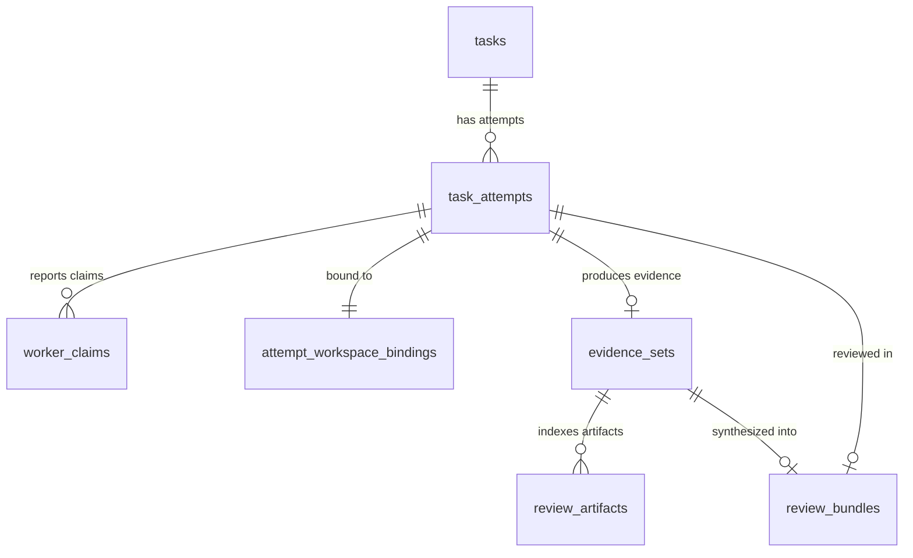
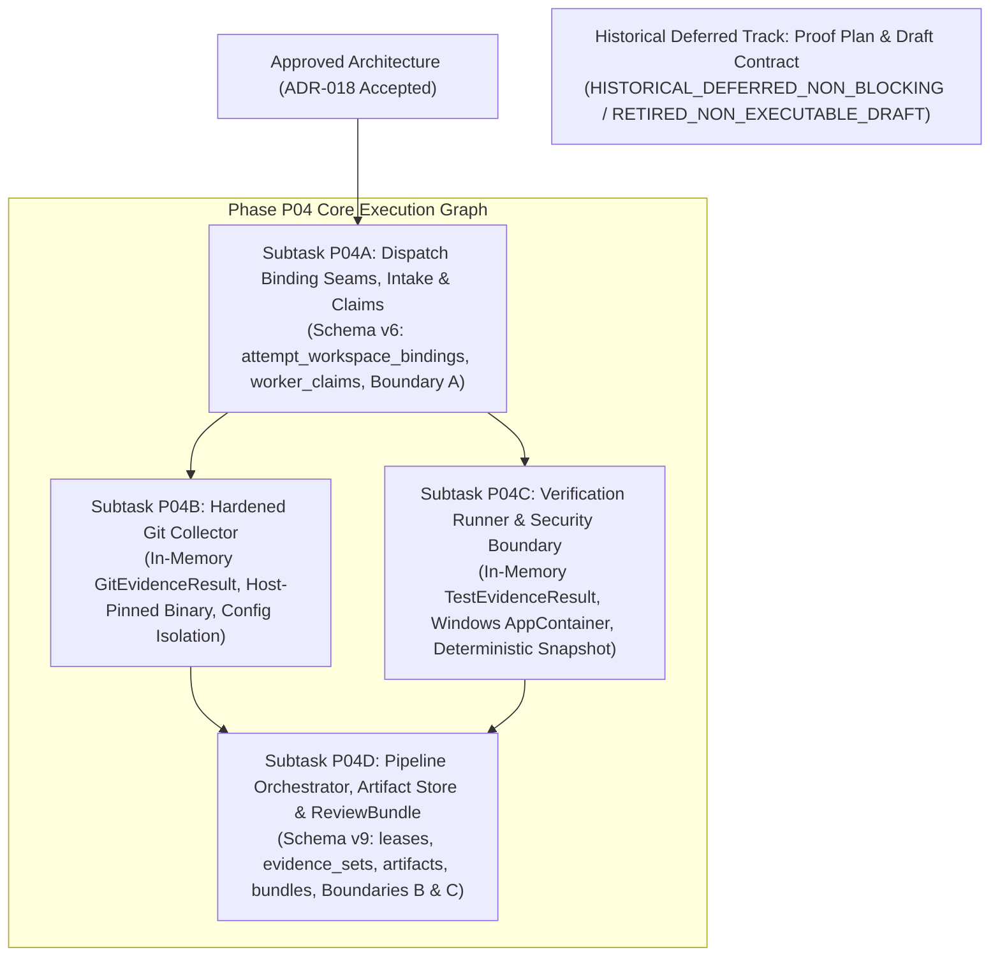

# PROPOSAL-P04-001: Evidence & Review Engine Architecture, Execution Isolation, and ReviewBundle Reconciliation

> **Proposal ID**: `PROPOSAL-P04-001`
> **Revision**: 8
> **Status**: `PENDING_EXTERNAL_REVIEW`
> **Author**: AI Engineering Supervisor Team
> **Date**: 2026-09-26
> **Audited Baseline**: `e7c57965ca8d85c0efa0b4f5b5dd409ce7387234`
> **Active Gate**: `P04_PRECONTRACT_ARCHITECTURE_REMEDIATION_7`
> **Supersedes**: `PROPOSAL-P04-001` Revision 7
> **External Audit Tracking**: Remediates Findings `P04-ARCH-R7-001` through `P04-ARCH-R7-006` (`docs/audits/P04_PRECONTRACT_ARCHITECTURE_EXTERNAL_REAUDIT_006.md`).
> **Related Documents**: `docs/proposals/PROPOSAL-P04-002-review-bundle-latency-semantics.md`, `docs/adr/DRAFT-ADR-018-evidence-review-and-verification-isolation.md`, `docs/plans/PLAN-P04-EVIDENCE-REVIEW.md`, `docs/plans/PLAN-P04-WORKTREE-BINDING-PROOF.md`, `docs/tasks/DRAFT_TASK_CONTRACT_P04_WORKTREE_BINDING_PROOF.md`

---

## 1. Executive Summary, Provenance & Reuse Boundaries

Phase P04 implements the **Evidence & Review Engine** for the AI Engineering Supervisor Control Plane. Per canonical architecture (`docs/04_ARCHITECTURE.md` Section 7) and requirements (`docs/02_REQUIREMENTS.md` FR-008, FR-009, FR-013, SEC-001, SEC-003, SEC-005, NFR-004, NFR-005, NFR-007, NFR-008, OPS-003), this subsystem independently verifies worker claims, collects tamper-proof Git diffs, executes test suites in isolated sandboxes, manages content-addressed artifacts, and compiles attempt-scoped `ReviewBundle` audit packets.

### 1.1. Upstream Authority & Reuse
- **Upstream Agent Orchestrator (AO)**: Pinned commit `15e9ea971f1711ec8b50e157d6eb300db6cbe0d6`. AO is the authoritative manager of worker sessions, process lifecycles, and worktrees.
- **Physical Worktree Authority**: AO creates, manages, and cleans up physical worktrees. The Supervisor Control Plane registers durable, immutable attempt-level workspace bindings during the dispatch materialization phase and enforces physical identity verification across the entire evidence lifecycle.
- **Re-Audit 006 Resolution**: This revision resolves all six findings from External Re-Audit 006:
  1. Separates the Dispatch Binding Registration Transaction (executed at AO materialization prior to `RecordSendRequested`) from Transaction A (Report Intake, which strictly reads and verifies existing bindings), removes the invalid session FK to mutable pair sessions, standardizes 16-hex volume and 32-hex file IDs, and notes required dispatch seams (`P04-ARCH-R7-001`).
  2. Resolves relational FK ordering by having Transaction B persist durable `evidence_sets` and `review_artifacts` referencing `evidence_set_id`, while Transaction C persists `review_bundles` referencing the same `evidence_set_id`; introduces DDL for structured `worker_claims`; enforces `UNIQUE(attempt_id)` with deterministic idempotent replay; uses canonical `audit_events`; removes `MOVEFILE_REPLACE_EXISTING` on canonical paths (`P04-ARCH-R7-002`).
  3. Commits exclusively to Windows AppContainer for v1 (eliminating all non-AppContainer token alternatives); details complete Win32 parameter structures; specifies deterministic snapshot export from verified HEAD commit via Git `ls-tree`/`cat-file`; opens root handles without `FILE_SHARE_DELETE` (`P04-ARCH-R7-003`).
  4. Hardens Git collection with `-c core.fsmonitor=false` and trusted empty hooks, treats `--no-pager` strictly as a CLI flag, sanitizes all `GIT_CONFIG_*` / credential variables, enforces streaming process-tree byte cap termination, defines index hash, and corrects all requirement traceability attributions (`P04-ARCH-R7-004`).
  5. Implements explicit atomic `BEGIN IMMEDIATE` lease acquisition/reclaim with monotonic fencing token CAS, evaluates expiration strictly from durable SQLite row timestamps, threads tokens through collectors, and atomically commits bundle compilation with canonical audit events (`P04-ARCH-R7-005`).
  6. Eradicates unapproved `verification_budget_timeout_ms` tokens and 60,000 ms defaults, grounds Interval 1 in validated contract `verification_requests[].timeout_seconds`, defines T0 as `evidence_committed_at` and T1 as bundle commit, enforces `0 <= T1 - T0 <= 3.0 seconds` with monotonic durations, uses canonical `AUDIT_EVENT_BUNDLE_GENERATED`, and eliminates all TABs and control bytes (`P04-ARCH-R7-006`).

---

## 2. Current-State Gap Matrix

| Subsystem Seam | Canonical Requirement | Revision 7 State | Revision 8 Resolution |
| :--- | :--- | :--- | :--- |
| **Worktree Registration Boundary** | SEC-002, SEC-003, P04-ARCH-R7-001 | Claimed Transaction A created binding; session FK blocked pair rotation; unstructured identity strings. | Binding registered during dispatch materialization before `RecordSendRequested`; Transaction A strictly reads; session FK removed; 16-hex volume / 32-hex FileId. |
| **Evidence Schema & FK Order** | FR-008, NFR-007, P04-ARCH-R7-002 | `review_artifacts` FK pointed forward to uncreated `review_bundles`; missing structured `worker_claims` DDL; `task_level_audit_events` referenced; `MOVEFILE_REPLACE_EXISTING` overwrite. | Transaction B persists `evidence_sets` and `review_artifacts(evidence_set_id)`; Transaction C creates `review_bundles(evidence_set_id)`; `worker_claims` DDL added; canonical `audit_events` used; overwrite prohibited. |
| **Security Boundary & Snapshot** | SEC-001, SEC-003, OPS-003, P04-ARCH-R7-003 | Ambiguous non-AppContainer token fallback; abstract Win32 setup; vague snapshot copy mechanism; "absolute safety" claim. | Exclusively Windows AppContainer for v1; full Win32 API detail; deterministic Git `ls-tree`/`cat-file` snapshot; root handle without `FILE_SHARE_DELETE`. |
| **Git Authority & Traceability** | FR-008, FR-009, NFR-005, NFR-007, P04-ARCH-R7-004 | Missing fsmonitor flag; `--no-pager` as env var; incomplete sanitization; missing streaming process kill; misattributed requirement IDs. | Added `-c core.fsmonitor=false`; `--no-pager` CLI flag; full `GIT_CONFIG_*` sanitization; streaming byte cap process kill; corrected traceability mapping. |
| **Lease & Pipeline Atomicity** | FR-008, NFR-007, P04-ARCH-R7-005 | Loose acquire/reclaim description; unthreaded tokens; "transient memory expiration" terminology; missing bundle uniqueness. | Atomic `BEGIN IMMEDIATE` CAS with token increment; durable row timestamp expiration; threaded tokens; `UNIQUE(attempt_id)` idempotent replay. |
| **NFR-008 Measurement Semantics** | NFR-008, P04-ARCH-R7-006 | Unapproved `verification_budget_timeout_ms` token; ungrounded 60s default; TAB characters and corrupted control bytes. | Derived strictly from contract `verification_requests[].timeout_seconds`; T0 = `evidence_committed_at`; `0 <= T1 - T0 <= 3.0 seconds`; zero TABs / clean plain text. |

---

## 3. Worktree Authority, Dispatch Registration & Identity (P04-ARCH-R7-001)

### 3.1. Two-Transaction Lifecycle Separation
Physical worktree authority is decoupled into two separate transactions across distinct phases:

1. **Dispatch Binding Registration Transaction (Dispatch Seam)**:
   - Executes during task dispatch after upstream AO confirms worktree materialization.
   - Integrates into P03 dispatch seam `PrepareBoundDispatch` / `DISPATCH_BOUND` and must commit **prior to** `RecordSendRequested`.
   - Opens the materialized worktree directory via OS handle (`FILE_FLAG_BACKUP_SEMANTICS`), without `FILE_SHARE_DELETE`, and queries `FileIdInfo` (`VolumeSerialNumber` + 128-bit `FileId`).
   - Inserts the immutable `attempt_workspace_bindings` row.
   - Future Subtask P04A scope includes necessary dispatch seams in `internal/dispatch` and `internal/store` (code implementation remains held).
2. **Transaction A: Report Intake Transaction (Completion Seam)**:
   - Executes after worker execution completes and the worker submits a `WorkerReport`.
   - **Strictly reads and verifies** that the authoritative `attempt_workspace_bindings` row exists, matches `attempt_id`, and that the OS handle identity remains intact.
   - Persists raw report in `task_attempts.worker_report_raw` and parsed claims into `worker_claims`.
   - Transitions `tasks.state`: `RUNNING -> REPORT_READY`.
   - **Creating bindings in Transaction A is strictly prohibited**.

### 3.2. Authoritative Schema: `attempt_workspace_bindings` (Schema v6)
```sql
CREATE TABLE attempt_workspace_bindings (
    attempt_id TEXT PRIMARY KEY REFERENCES task_attempts(attempt_id) ON DELETE RESTRICT,
    task_id TEXT NOT NULL REFERENCES tasks(task_id) ON DELETE RESTRICT,
    contract_id TEXT NOT NULL REFERENCES task_contracts(contract_id) ON DELETE RESTRICT,
    session_id TEXT NOT NULL CHECK (LENGTH(session_id) > 0),
    terminal_generation TEXT NOT NULL CHECK (LENGTH(terminal_generation) > 0),
    canonical_worktree_path TEXT NOT NULL CHECK (LENGTH(canonical_worktree_path) > 0),
    managed_root_final_path TEXT NOT NULL CHECK (LENGTH(managed_root_final_path) > 0),
    volume_serial_hex TEXT NOT NULL CHECK (LENGTH(volume_serial_hex) = 16 AND NOT (volume_serial_hex GLOB '*[^0-9a-f]*')),
    file_id_hex TEXT NOT NULL CHECK (LENGTH(file_id_hex) = 32 AND NOT (file_id_hex GLOB '*[^0-9a-f]*')),
    pinned_ao_commit TEXT NOT NULL CHECK (LENGTH(pinned_ao_commit) = 40 AND NOT (pinned_ao_commit GLOB '*[^0-9a-f]*')),
    bound_at TEXT NOT NULL CHECK (LENGTH(bound_at) > 0),
    FOREIGN KEY(contract_id, task_id) REFERENCES task_contracts(contract_id, task_id) ON DELETE RESTRICT
);

CREATE TRIGGER trg_attempt_workspace_bindings_lineage_guard
BEFORE INSERT ON attempt_workspace_bindings
FOR EACH ROW
BEGIN
    SELECT RAISE(ABORT, 'lineage mismatch: attempt_id does not match task_id, contract_id in task_attempts or session in dispatch_operations')
    WHERE NOT EXISTS (
        SELECT 1 FROM task_attempts a
        JOIN dispatch_operations d ON d.attempt_id = a.attempt_id
        WHERE a.attempt_id = NEW.attempt_id
          AND a.task_id = NEW.task_id
          AND a.contract_id = NEW.contract_id
          AND d.session_id = NEW.session_id
          AND d.terminal_generation = NEW.terminal_generation
    );
END;

CREATE TRIGGER trg_attempt_workspace_bindings_no_update
BEFORE UPDATE ON attempt_workspace_bindings
BEGIN
    SELECT RAISE(ABORT, 'attempt_workspace_bindings is immutable');
END;

CREATE TRIGGER trg_attempt_workspace_bindings_no_delete
BEFORE DELETE ON attempt_workspace_bindings
BEGIN
    SELECT RAISE(ABORT, 'attempt_workspace_bindings is immutable');
END;
```

### 3.3. Identity Standardization & Decoupling from Mutable Pair Session
- **No Session FK**: `session_id` does NOT reference `worker_sessions(session_id)`. `worker_sessions` tracks the current mutable lane of a pair, which may be rotated, killed, or replaced. Attempt bindings are historical audit records and must not be invalidated when a pair's active session changes.
- **Identity Hex Encodings**:
  * `volume_serial_hex`: Exactly 16 lowercase hex characters, zero-padded (representing 64-bit volume serial).
  * `file_id_hex`: Exactly 32 lowercase hex characters, encoding the 16-byte `FILE_ID_128` structure in byte order.
  * CHECK constraints strictly reject short strings, uppercase hex, and non-hex characters.
- **Root Handle Pinning**: The root handle is opened with `FILE_FLAG_BACKUP_SEMANTICS`, sharing only `FILE_SHARE_READ | FILE_SHARE_WRITE` (strictly omitting `FILE_SHARE_DELETE`), and held open throughout collection and CAS revalidation to prevent directory rename or junction swapping.

---

## 4. Hardened In-Memory Git Collector Architecture (P04-ARCH-R7-004)

### 4.1. Command Authority & Mandatory Arguments
Every invocation of the Git executable by the Supervisor Control Plane must strictly include:
- `-c core.hooksPath=<SUPERVISOR_STATE_ROOT>/trusted_empty_git/empty_hooks`
- `-c core.fsmonitor=false`
- `-c core.autocrlf=false`
- `--no-pager` (passed strictly as a CLI flag, not an environment variable)

### 4.2. Complete Environment Sanitization
The collector executes in a sanitized process environment where:
- **Inherited Variables Explicitly Cleared**: `GIT_DIR`, `GIT_WORK_TREE`, `GIT_INDEX_FILE`, `GIT_OBJECT_DIRECTORY`, `GIT_ALTERNATE_OBJECT_DIRECTORIES`, `GIT_CONFIG_COUNT`, `GIT_CONFIG_KEY_*`, `GIT_CONFIG_VALUE_*`, `GIT_EXTERNAL_DIFF`, `GIT_ASKPASS`, `SSH_ASKPASS`, `GIT_SSH`, `GIT_SSH_COMMAND`, `GIT_PROTOCOL_FROM_USER`, `GIT_CEILING_DIRECTORIES`.
- **Forced Safe Overrides**:
  * `HOME=<SUPERVISOR_STATE_ROOT>/trusted_empty_git`
  * `USERPROFILE=<SUPERVISOR_STATE_ROOT>/trusted_empty_git`
  * `XDG_CONFIG_HOME=<SUPERVISOR_STATE_ROOT>/trusted_empty_git`
  * `GIT_CONFIG_NOSYSTEM=1`
  * `GIT_CONFIG_SYSTEM=<SUPERVISOR_STATE_ROOT>/trusted_empty_git/empty.config`
  * `GIT_CONFIG_GLOBAL=<SUPERVISOR_STATE_ROOT>/trusted_empty_git/empty.config`
  * `GIT_TERMINAL_PROMPT=0`
  * `GIT_OPTIONAL_LOCKS=0`
  * `GIT_PAGER=cat`

### 4.3. Allowlist & Execution Controls
1. **Command Allowlist**: Only explicitly allowlisted non-mutating commands may execute:
   - `git rev-parse --verify <ref>`
   - `git merge-base --is-ancestor <base> <head>`
   - `git log --no-ext-diff --no-textconv --no-merges -n 50 --format=...`
   - `git diff --no-ext-diff --no-textconv --raw -z <base>..<head>`
   - `git diff --no-ext-diff --no-textconv --stat <base>..<head>`
   - `git diff --no-ext-diff --no-textconv --patch <base>..<head> -- <literal_pathspecs>`
2. **Streaming Byte Cap & Process-Tree Kill**: Standard output and standard error are monitored via streaming counters. If output exceeds the 10 MB cap, the entire process tree is terminated immediately via Job Object, and an error is returned.
3. **Repository Identity & Index Hash**: Before and after collection, the repository identity is validated:
   - HEAD commit hash matches expected;
   - Index hash (computed as the SHA-256 hash of `.git/index` under verified repository handle identity) is identical pre- and post-collection. Zero repository mutations are permitted.
4. **Requirement Traceability**: Traced to **FR-008** (Audit-Grade Evidence Collection) and **NFR-007** (Pinned Upstream Dependencies).

---

## 5. Windows AppContainer Security Boundary & Deterministic Snapshot (P04-ARCH-R7-003)

### 5.1. Exclusively Windows AppContainer for v1
To provide an airtight, kernel-enforced process and network security boundary, Phase P04 commits exclusively to **Windows AppContainer**. Dual-path implementations and non-AppContainer token fallbacks are eliminated.

### 5.2. Win32 Implementation Specification
1. **AppContainer Creation & SID Derivation**:
   - Derive or create an AppContainer profile using `CreateAppContainerProfile` or `DeriveAppContainerSidFromAppContainerName` with package name `Supervisor.Sandbox.<attempt_id>`.
2. **Filesystem DACL Assignment**:
   - **Immutable Snapshot Directory** (`<SUPERVISOR_STATE_ROOT>/snapshots/<attempt_id>/`): DACL grants `GENERIC_READ | GENERIC_EXECUTE` to the AppContainer SID.
   - **Sandbox Root** (`<SUPERVISOR_STATE_ROOT>/sandboxes/<attempt_id>/`): DACL grants `GENERIC_ALL` to the AppContainer SID. All toolchain caches (`TEMP`, `TMP`, `GOCACHE`, `GOPATH`), build outputs, and process streams are confined here.
   - The worker worktree is never granted DACL access to the AppContainer SID.
3. **Process Creation & Attribute List**:
   - `SECURITY_CAPABILITIES` initialized with `CapabilityCount = 0` and `Capabilities = NULL` (kernel-enforced network denial: no internet, no private network).
   - Attribute list initialized via `InitializeProcThreadAttributeList` with count 1.
   - Attribute list updated via `UpdateProcThreadAttribute` with `PROC_THREAD_ATTRIBUTE_SECURITY_CAPABILITIES`.
   - Process launched via `CreateProcessW` with `EXTENDED_STARTUPINFO_PRESENT` using `STARTUPINFOEXW`.
4. **Job Object Containment**:
   - Bound to dedicated Job Object with `JOB_OBJECT_LIMIT_KILL_ON_JOB_CLOSE`.
   - `JOB_OBJECT_LIMIT_SILENT_BREAKAWAY_OK` explicitly cleared (no breakaway).
   - Memory limit (2 GB) and process count limits enforced.
   - `bInheritHandles = FALSE` (zero inherited handles).
5. **Fail-Closed Principle**: If AppContainer profile creation, DACL assignment, or process launch fails, verification fails closed immediately. Falling back to daemon token execution is strictly prohibited.
6. **Supplementary UI Isolation**: Dedicated non-interactive Window Station and Desktop (`CreateWindowStationW` + `CreateDesktopW`) isolate UI window messages and clipboard access.

### 5.3. Deterministic Snapshot Protocol
1. Verification tests **never execute against the active worker worktree**.
2. At dispatch intake completion, an immutable snapshot is exported directly from the verified HEAD commit:
   - Invokes pinned Git `ls-tree -rz <head_sha>` and `cat-file --batch`;
   - Validates each path component against path traversal (`..`), junctions, symlinks, and gitlinks (all rejected in v1);
   - Writes regular files to `<SUPERVISOR_STATE_ROOT>/snapshots/<attempt_id>/`;
   - Computes an immutable manifest hash of all staged files and permissions.
3. Verification subprocesses execute strictly within this snapshot directory. Changes made during test execution remain isolated in the snapshot and sandbox; changes are **never copied back to the worker worktree**.

---

## 6. Durable Evidence Model, Artifact Store & Review Schema (P04-ARCH-R7-002)

### 6.1. Relational Hierarchy: EvidenceSets vs ReviewBundles
To ensure natural sequential transaction execution without circular or forward foreign key dependencies:
- **Transaction A** persists structured `worker_claims`.
- **Transaction B** persists durable `evidence_sets` and inserts `review_artifacts` referencing `evidence_set_id`.
- **Transaction C** persists `review_bundles` referencing the same `evidence_set_id`, emits `audit_events`, and transitions task to `REVIEWING`.



### 6.2. Table Schemas: `worker_claims`, `evidence_sets`, `review_artifacts`, `review_bundles`

#### Schema v6: `worker_claims` (Owned by Subtask P04A)
```sql
CREATE TABLE worker_claims (
    claim_id TEXT PRIMARY KEY,
    task_id TEXT NOT NULL REFERENCES tasks(task_id) ON DELETE RESTRICT,
    attempt_id TEXT NOT NULL REFERENCES task_attempts(attempt_id) ON DELETE RESTRICT,
    contract_id TEXT NOT NULL REFERENCES task_contracts(contract_id) ON DELETE RESTRICT,
    claim_type TEXT NOT NULL CHECK (claim_type IN ('CHANGED_FILES', 'TEST_RESULTS', 'IMPLEMENTATION_SUMMARY', 'UNVERIFIED_ASSUMPTION')),
    claim_payload_json TEXT NOT NULL CHECK (LENGTH(claim_payload_json) > 0),
    reported_at TEXT NOT NULL CHECK (LENGTH(reported_at) > 0),
    FOREIGN KEY(contract_id, task_id) REFERENCES task_contracts(contract_id, task_id) ON DELETE RESTRICT
);

CREATE TRIGGER trg_worker_claims_lineage_guard
BEFORE INSERT ON worker_claims
FOR EACH ROW
BEGIN
    SELECT RAISE(ABORT, 'lineage mismatch: attempt_id does not match task_id or contract_id in task_attempts')
    WHERE NOT EXISTS (
        SELECT 1 FROM task_attempts a
        WHERE a.attempt_id = NEW.attempt_id
          AND a.task_id = NEW.task_id
          AND a.contract_id = NEW.contract_id
    );
END;

CREATE TRIGGER trg_worker_claims_no_update
BEFORE UPDATE ON worker_claims
BEGIN
    SELECT RAISE(ABORT, 'worker_claims is immutable');
END;

CREATE TRIGGER trg_worker_claims_no_delete
BEFORE DELETE ON worker_claims
BEGIN
    SELECT RAISE(ABORT, 'worker_claims is immutable');
END;
```

#### Schema v9: `evidence_sets` (Owned by Subtask P04D)
```sql
CREATE TABLE evidence_sets (
    evidence_set_id TEXT PRIMARY KEY,
    task_id TEXT NOT NULL REFERENCES tasks(task_id) ON DELETE RESTRICT,
    attempt_id TEXT NOT NULL UNIQUE REFERENCES task_attempts(attempt_id) ON DELETE RESTRICT,
    contract_id TEXT NOT NULL REFERENCES task_contracts(contract_id) ON DELETE RESTRICT,
    fencing_token INTEGER NOT NULL CHECK (fencing_token > 0),
    git_evidence_json TEXT NOT NULL CHECK (LENGTH(git_evidence_json) > 0),
    test_evidence_json TEXT NOT NULL CHECK (LENGTH(test_evidence_json) > 0),
    policy_findings_json TEXT NOT NULL CHECK (LENGTH(policy_findings_json) > 0),
    unverified_claims_json TEXT NOT NULL CHECK (LENGTH(unverified_claims_json) > 0),
    collected_at TEXT NOT NULL CHECK (LENGTH(collected_at) > 0),
    FOREIGN KEY(contract_id, task_id) REFERENCES task_contracts(contract_id, task_id) ON DELETE RESTRICT
);

CREATE TRIGGER trg_evidence_sets_lineage_guard
BEFORE INSERT ON evidence_sets
FOR EACH ROW
BEGIN
    SELECT RAISE(ABORT, 'lineage mismatch: attempt_id does not match task_id or contract_id in task_attempts')
    WHERE NOT EXISTS (
        SELECT 1 FROM task_attempts a
        WHERE a.attempt_id = NEW.attempt_id
          AND a.task_id = NEW.task_id
          AND a.contract_id = NEW.contract_id
    );
END;

CREATE TRIGGER trg_evidence_sets_no_update
BEFORE UPDATE ON evidence_sets
BEGIN
    SELECT RAISE(ABORT, 'evidence_sets is immutable');
END;

CREATE TRIGGER trg_evidence_sets_no_delete
BEFORE DELETE ON evidence_sets
BEGIN
    SELECT RAISE(ABORT, 'evidence_sets is immutable');
END;
```

#### Schema v9: `review_artifacts` (Owned by Subtask P04D)
```sql
CREATE TABLE review_artifacts (
    artifact_id TEXT PRIMARY KEY,
    evidence_set_id TEXT NOT NULL REFERENCES evidence_sets(evidence_set_id) ON DELETE RESTRICT,
    task_id TEXT NOT NULL REFERENCES tasks(task_id) ON DELETE RESTRICT,
    attempt_id TEXT NOT NULL REFERENCES task_attempts(attempt_id) ON DELETE RESTRICT,
    contract_id TEXT NOT NULL REFERENCES task_contracts(contract_id) ON DELETE RESTRICT,
    artifact_type TEXT NOT NULL CHECK (LENGTH(artifact_type) > 0),
    media_type TEXT NOT NULL CHECK (LENGTH(media_type) > 0),
    encoding TEXT NOT NULL CHECK (LENGTH(encoding) > 0),
    canonical_relative_path TEXT NOT NULL CHECK (
        canonical_relative_path GLOB 'artifacts/[0-9a-f][0-9a-f]/[0-9a-f]*' AND
        canonical_relative_path NOT GLOB '*..*' AND
        canonical_relative_path NOT GLOB '*//*'
    ),
    captured_sha256 TEXT NOT NULL CHECK (LENGTH(captured_sha256) = 64 AND NOT (captured_sha256 GLOB '*[^0-9a-f]*')),
    full_stream_sha256 TEXT NOT NULL CHECK (LENGTH(full_stream_sha256) = 64 AND NOT (full_stream_sha256 GLOB '*[^0-9a-f]*')),
    original_bytes INTEGER NOT NULL CHECK (original_bytes >= 0),
    captured_bytes INTEGER NOT NULL CHECK (captured_bytes >= 0 AND captured_bytes <= original_bytes),
    is_truncated INTEGER NOT NULL CHECK (
        is_truncated IN (0, 1) AND (
            (is_truncated = 1 AND captured_bytes < original_bytes) OR
            (is_truncated = 0 AND captured_bytes = original_bytes)
        )
    ),
    created_at TEXT NOT NULL CHECK (LENGTH(created_at) > 0),
    FOREIGN KEY(contract_id, task_id) REFERENCES task_contracts(contract_id, task_id) ON DELETE RESTRICT
);

CREATE TRIGGER trg_review_artifacts_lineage_guard
BEFORE INSERT ON review_artifacts
FOR EACH ROW
BEGIN
    SELECT RAISE(ABORT, 'lineage mismatch: evidence_set_id does not match task_id, attempt_id, contract_id')
    WHERE NOT EXISTS (
        SELECT 1 FROM evidence_sets e
        WHERE e.evidence_set_id = NEW.evidence_set_id
          AND e.task_id = NEW.task_id
          AND e.attempt_id = NEW.attempt_id
          AND e.contract_id = NEW.contract_id
    );
END;

CREATE TRIGGER trg_review_artifacts_no_update
BEFORE UPDATE ON review_artifacts
BEGIN
    SELECT RAISE(ABORT, 'review_artifacts is immutable');
END;

CREATE TRIGGER trg_review_artifacts_no_delete
BEFORE DELETE ON review_artifacts
BEGIN
    SELECT RAISE(ABORT, 'review_artifacts is immutable');
END;
```

#### Schema v9: `review_bundles` (Owned by Subtask P04D)
```sql
CREATE TABLE review_bundles (
    bundle_id TEXT PRIMARY KEY,
    evidence_set_id TEXT NOT NULL UNIQUE REFERENCES evidence_sets(evidence_set_id) ON DELETE RESTRICT,
    task_id TEXT NOT NULL REFERENCES tasks(task_id) ON DELETE RESTRICT,
    attempt_id TEXT NOT NULL UNIQUE REFERENCES task_attempts(attempt_id) ON DELETE RESTRICT,
    contract_id TEXT NOT NULL REFERENCES task_contracts(contract_id) ON DELETE RESTRICT,
    bundle_payload_json TEXT NOT NULL CHECK (LENGTH(bundle_payload_json) > 0),
    bundle_hash TEXT NOT NULL CHECK (LENGTH(bundle_hash) = 64 AND NOT (bundle_hash GLOB '*[^0-9a-f]*')),
    generated_at TEXT NOT NULL CHECK (LENGTH(generated_at) > 0),
    FOREIGN KEY(contract_id, task_id) REFERENCES task_contracts(contract_id, task_id) ON DELETE RESTRICT
);

CREATE TRIGGER trg_review_bundles_lineage_guard
BEFORE INSERT ON review_bundles
FOR EACH ROW
BEGIN
    SELECT RAISE(ABORT, 'lineage mismatch: evidence_set_id does not match task_id, attempt_id, contract_id')
    WHERE NOT EXISTS (
        SELECT 1 FROM evidence_sets e
        WHERE e.evidence_set_id = NEW.evidence_set_id
          AND e.task_id = NEW.task_id
          AND e.attempt_id = NEW.attempt_id
          AND e.contract_id = NEW.contract_id
    );
END;

CREATE TRIGGER trg_review_bundles_no_update
BEFORE UPDATE ON review_bundles
BEGIN
    SELECT RAISE(ABORT, 'review_bundles is immutable');
END;

CREATE TRIGGER trg_review_bundles_no_delete
BEFORE DELETE ON review_bundles
BEGIN
    SELECT RAISE(ABORT, 'review_bundles is immutable');
END;
```

### 6.3. Content-Addressed Storage & Non-Overwriting Rename Protocol
1. Staging path: `<SUPERVISOR_STATE_ROOT>/artifacts/.staging/<attempt_id>-<uuid>.tmp` (verified same volume as final root).
2. Data is written and flushed via `FlushFileBuffers`.
3. Atomic rename via `MoveFileExW` with `MOVEFILE_WRITE_THROUGH` (strictly omitting `MOVEFILE_REPLACE_EXISTING`).
4. If canonical destination already exists:
   - Reopen existing canonical file by handle;
   - Verify file size and SHA-256 hash match;
   - If size and hash match, clean up staging file and deduplicate;
   - If size or hash differ, fail closed immediately with an integrity alert.
5. Post-rename handle verification: Reopen newly moved file, verify volume identity, size, and SHA-256 hash before inserting SQLite row.

---

## 7. Pipeline Orchestration, Three Durable Boundaries & Lease Fencing (P04-ARCH-R7-005)

### 7.1. Three Durable Transaction Boundaries
The pipeline guarantees atomicity within each discrete SQLite WAL transaction:

1. **Transaction A: Report Intake Transaction**
   - Validates worker report structure and syntax;
   - Verifies that `attempt_workspace_bindings` exists and matches;
   - Persists worker report in `task_attempts.worker_report_raw` and structured claims in `worker_claims`;
   - Atomic CAS transition: `tasks.state`: `RUNNING -> REPORT_READY`.
2. **Transaction B: Evidence Finalization Transaction**
   - Ingests in-memory outputs from P04B and P04C carrying the active `fencing_token`;
   - Persists `evidence_sets` and `review_artifacts`;
   - Atomically updates `task_verification_leases`: sets `state = 'RELEASED'`, `released_at_epoch_ms = now_ms` where `task_id = ? AND fencing_token = ? AND state = 'ACTIVE' AND expires_at_epoch_ms > now_ms`;
   - Atomic CAS transition: `tasks.state`: `REPORT_READY -> EVIDENCE_READY` asserting RowsAffected == 1.
3. **Transaction C: ReviewBundle Compilation Transaction**
   - Compiles RFC 8785 JCS canonical `ReviewBundle` payload from durable `evidence_sets`;
   - Validates payload against `docs/schemas/review-bundle.schema.json`;
   - Inserts `review_bundles` row (enforcing `UNIQUE(attempt_id)`);
   - Inserts audit event into canonical `audit_events` with `event_type = 'AUDIT_EVENT_BUNDLE_GENERATED'`;
   - Atomic CAS transition: `tasks.state`: `EVIDENCE_READY -> REVIEWING` asserting RowsAffected == 1.

### 7.2. Table Schema: `task_verification_leases` (Schema v9)
```sql
CREATE TABLE task_verification_leases (
    task_id TEXT PRIMARY KEY REFERENCES tasks(task_id) ON DELETE RESTRICT,
    fencing_token INTEGER NOT NULL CHECK (fencing_token > 0),
    state TEXT NOT NULL CHECK (state IN ('ACTIVE', 'RELEASED')),
    worker_id TEXT NOT NULL CHECK (LENGTH(worker_id) > 0),
    attempt_id TEXT NOT NULL REFERENCES task_attempts(attempt_id) ON DELETE RESTRICT,
    contract_id TEXT NOT NULL REFERENCES task_contracts(contract_id) ON DELETE RESTRICT,
    acquired_at_epoch_ms INTEGER NOT NULL CHECK (acquired_at_epoch_ms > 0),
    expires_at_epoch_ms INTEGER NOT NULL CHECK (expires_at_epoch_ms > acquired_at_epoch_ms),
    released_at_epoch_ms INTEGER,
    FOREIGN KEY(contract_id, task_id) REFERENCES task_contracts(contract_id, task_id) ON DELETE RESTRICT,
    CHECK (
        (state = 'ACTIVE' AND released_at_epoch_ms IS NULL) OR
        (state = 'RELEASED' AND released_at_epoch_ms IS NOT NULL AND released_at_epoch_ms >= acquired_at_epoch_ms)
    )
);

CREATE TRIGGER trg_task_verification_leases_lineage_guard
BEFORE INSERT ON task_verification_leases
FOR EACH ROW
BEGIN
    SELECT RAISE(ABORT, 'lineage mismatch: attempt_id does not match task_id or contract_id in task_attempts')
    WHERE NOT EXISTS (
        SELECT 1 FROM task_attempts a
        WHERE a.attempt_id = NEW.attempt_id
          AND a.task_id = NEW.task_id
          AND a.contract_id = NEW.contract_id
    );
END;

CREATE TRIGGER trg_task_verification_leases_lineage_update_guard
BEFORE UPDATE ON task_verification_leases
FOR EACH ROW
BEGIN
    SELECT RAISE(ABORT, 'lineage mismatch: attempt_id does not match task_id or contract_id in task_attempts')
    WHERE NOT EXISTS (
        SELECT 1 FROM task_attempts a
        WHERE a.attempt_id = NEW.attempt_id
          AND a.task_id = NEW.task_id
          AND a.contract_id = NEW.contract_id
    );
END;
```

### 7.3. Atomic Lease Acquire / Reclaim Protocol
Lease operations execute within `BEGIN IMMEDIATE`:
1. **Acquire New Lease**: If no row exists for `task_id`, inserts `fencing_token = 1`, `state = 'ACTIVE'`, `acquired_at_epoch_ms = now_ms`, `expires_at_epoch_ms = now_ms + ttl_ms`, asserting `RowsAffected == 1`.
2. **Reject Concurrent Active Lease**: If row exists with `state = 'ACTIVE'` and `expires_at_epoch_ms > now_ms`, acquisition is rejected.
3. **Reclaim Expired or Released Lease**: If row exists with `state = 'RELEASED'` or (`state = 'ACTIVE'` AND `expires_at_epoch_ms <= now_ms`), reclaims via:
   ```sql
   UPDATE task_verification_leases
   SET fencing_token = fencing_token + 1,
       state = 'ACTIVE',
       worker_id = ?,
       attempt_id = ?,
       contract_id = ?,
       acquired_at_epoch_ms = ?,
       expires_at_epoch_ms = ?,
       released_at_epoch_ms = NULL
   WHERE task_id = ?
     AND fencing_token = ?
     AND (state = 'RELEASED' OR expires_at_epoch_ms <= ?);
   ```
   Asserts `RowsAffected == 1`. Expiration is determined strictly from durable SQLite row timestamps, never ephemeral memory states.

### 7.4. Replay Semantics in Transaction C
- If Transaction C is replayed for an attempt that already has a bundle:
  * Compares newly computed canonical RFC 8785 bundle hash with `review_bundles.bundle_hash`.
  * If hashes match, replay is idempotent and succeeds without side effects.
  * If hashes differ, transaction fails closed and logs an integrity violation.
- If a crash occurs between Transaction B and C, tests are **never re-run** because `evidence_sets` is already committed. Bundle compilation resumes directly at Boundary C.

---

## 8. NFR-008 Performance SLA & Scope Boundaries (P04-ARCH-R7-006)

### 8.1. Canonical Requirement Citation
Canonical NFR-008 states:
> *"The Supervisor Control Plane shall generate a Review Bundle within 3 seconds of worker completion on repos up to 10,000 files."*

### 8.2. Two-Interval Latency Model via PROPOSAL-P04-002
Per `PROPOSAL-P04-002-review-bundle-latency-semantics.md` (`PENDING_EXTERNAL_REVIEW`):
1. **Interval 1: Evidence Acquisition Window**:
   - Begins at worker report submission (task enters `REPORT_READY`).
   - Timeout derived strictly from `verification_requests[].timeout_seconds` in the validated contract, or fallback to `MaxTimeoutSeconds` from `VerificationPolicyCatalog`.
   - All arbitrary tokens (`verification_budget_timeout_ms`, 60s default) are eliminated.
2. **Interval 2: ReviewBundle Compilation Window (T0 to T1)**:
   - T0 = `evidence_committed_at` (Transaction B commit timestamp).
   - T1 = Transaction C commit timestamp.
   - Requirement: `0 <= T1 - T0 <= 3.0 seconds` for repos up to 10,000 files.
   - Any clock regression (`T1 < T0`) fails closed. Monotonic timers (`time.Since(t0)`) govern in-process evaluation.
3. **Governance Invariant**: Until `PROPOSAL-P04-002` is approved by External Supervisor, `docs/02_REQUIREMENTS.md` remains unmodified, and `DRAFT-ADR-018` remains in DRAFT status.

---

## 9. Phased Scope Decomposition Plan

Subtask P04A is the first releaseable subtask once architecture is approved. Its bounded scope includes required dispatch seams in `internal/dispatch` and `internal/store`:



---

## 10. Governance Tracking & Gate

```
PROPOSAL_P04_001 = REVISION_7_REQUIRED (Remediated to Revision 8)
PROPOSAL_P04_002 = REVISION_1_REQUIRED (Remediated to Revision 2)
ADR_018 = DRAFT_PENDING_EXTERNAL_APPROVAL (Revision 8)
PLAN_P04_EVIDENCE_REVIEW = PLANNING_PENDING_EXTERNAL_AUDIT (Revision 8)
ACTIVE_GATE = P04_PRECONTRACT_ARCHITECTURE_REMEDIATION_7
P04_TASK_CONTRACT = NOT_RELEASED
P04_CODE = HELD_PENDING_APPROVED_ARCHITECTURE_AND_TASK_CONTRACT
P05_CODE = NOT_AUTHORIZED
AUTOMATIC_RESTORE = DISABLED
LIVE_AO_INTEGRATION = UNVERIFIED_EVIDENCE_TRACK
VERIFIED_OPERATOR_PRINCIPAL = OPEN_FAIL_CLOSED_DEPENDENCY
```
