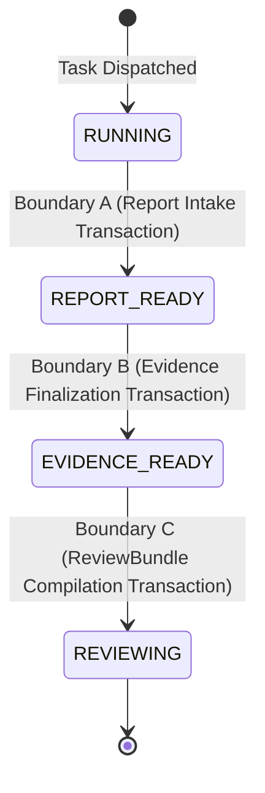
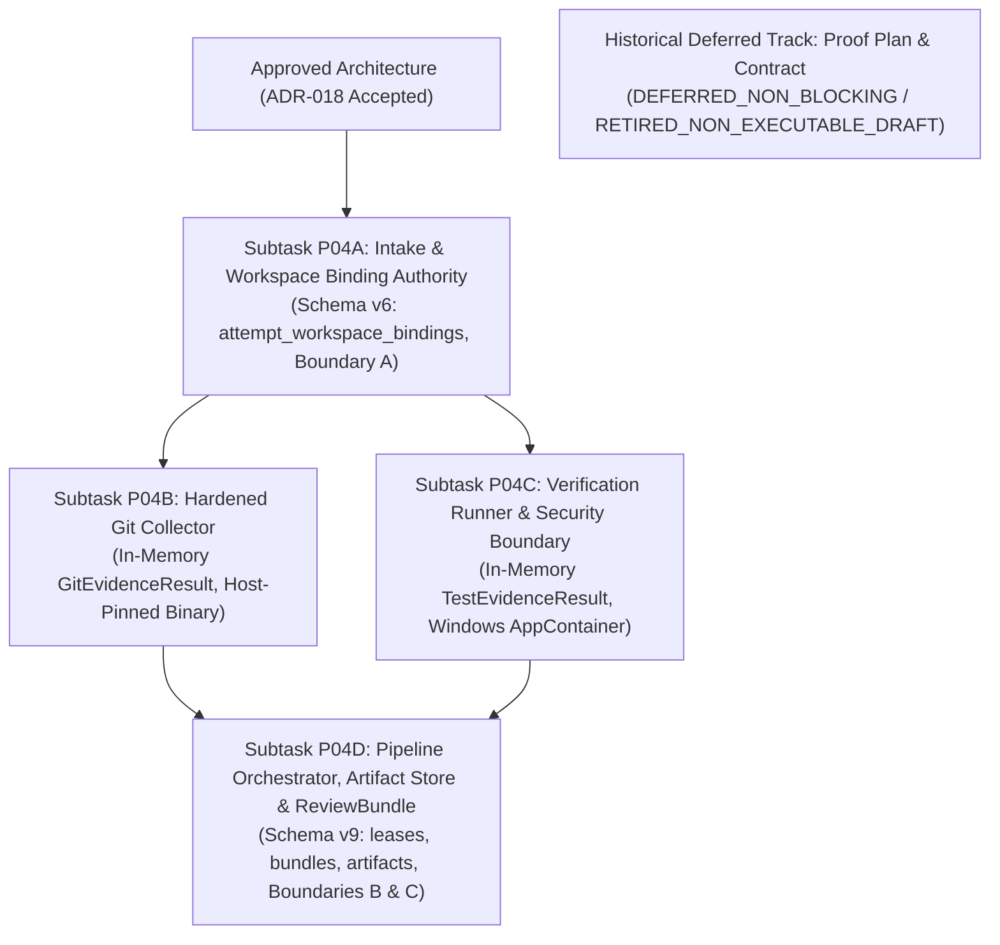

# PROPOSAL-P04-001: Evidence & Review Engine Architecture, Execution Isolation, and ReviewBundle Reconciliation

> **Proposal ID**: `PROPOSAL-P04-001`
> **Revision**: 7
> **Status**: `PENDING_EXTERNAL_REVIEW`
> **Author**: AI Engineering Supervisor Team
> **Date**: 2026-09-26
> **Audited Baseline**: `742e2e296db99c19bc7a645ca1842520b2ab23e5`
> **Active Gate**: `P04_PRECONTRACT_ARCHITECTURE_REMEDIATION_6`
> **Supersedes**: `PROPOSAL-P04-001` Revision 6
> **External Audit Tracking**: Remediates Findings `P04-ARCH-R6-001` through `P04-ARCH-R6-006` (`docs/audits/P04_PRECONTRACT_ARCHITECTURE_EXTERNAL_REAUDIT_005.md`); incorporates resolutions from Re-Audits 001..004.
> **Related Documents**: `docs/proposals/PROPOSAL-P04-002-review-bundle-latency-semantics.md`, `docs/adr/DRAFT-ADR-018-evidence-review-and-verification-isolation.md`, `docs/plans/PLAN-P04-EVIDENCE-REVIEW.md`, `docs/plans/PLAN-P04-WORKTREE-BINDING-PROOF.md`, `docs/tasks/DRAFT_TASK_CONTRACT_P04_WORKTREE_BINDING_PROOF.md`

---

## 1. Executive Summary, Provenance & Reuse Boundaries

Phase P04 implements the **Evidence & Review Engine** for the AI Engineering Supervisor Control Plane. Per canonical architecture (`docs/04_ARCHITECTURE.md` Section 7) and requirements (`docs/02_REQUIREMENTS.md` FR-008, FR-009, NFR-005, NFR-007, NFR-008), this subsystem independently verifies worker claims, collects tamper-proof Git diffs, executes test suites in isolated sandboxes, manages content-addressed artifacts, and compiles attempt-scoped `ReviewBundle` audit packets.

### 1.1. Upstream Authority & Reuse
- **Upstream Agent Orchestrator (AO)**: Pinned commit `15e9ea971f1711ec8b50e157d6eb300db6cbe0d6`. AO is the authoritative manager of worker sessions, process lifecycles, and worktrees.
- **Physical Worktree Authority**: AO creates, manages, and cleans up physical worktrees. The Supervisor Control Plane registers durable, immutable attempt-level workspace bindings upon session materialization and enforces physical identity verification across the entire evidence lifecycle.
- **Re-Audit 005 Resolution**: This revision resolves all six findings from External Re-Audit 005:
  1. Fixes worktree binding schema types (`terminal_generation TEXT`, FKs on `contract_id` and `session_id`, lineage guards, 40 lowercase hex GLOB check) and OS handle lifecycle invariants (`P04-ARCH-R6-001`).
  2. Eliminates namespace collisions (renaming physical binding verification to `WORKTREE_BINDING_RUNTIME_VALIDATION`; reserving Stage B strictly for TaskContractValidator semantic validation) and unblocks Subtask P04A by removing the unexecutable proof contract prerequisite edge (`P04-ARCH-R6-002`).
  3. Hardens Git collection with an explicit non-mutating command allowlist, host-configured pinned binary resolution, Windows-safe empty config/hooks directories under `<SUPERVISOR_STATE_ROOT>`, environment sanitization, `--no-ext-diff`, `--no-textconv`, and literal pathspecs (`P04-ARCH-R6-003`).
  4. Replaces undefined read-only mounting and UI-only window isolation with a concrete Windows AppContainer / restricted token security boundary, DACL-protected immutable source snapshots, and Job Object process limits (`P04-ARCH-R6-004`).
  5. Implements a durable, content-addressed artifact store with lowercase hex checks, safe retrieval metadata, atomic `MoveFileExW` write-through rename, post-rename handle verification, collision handling, deferred physical GC, and an authoritative schema reconciliation matrix (`P04-ARCH-R6-005`).
  6. Structures the pipeline into three distinct durable transactions (A: Report Intake, B: Evidence Finalization, C: ReviewBundle Compilation) with lease fencing invariants, crash/replay recovery, and governed NFR-008 measurement semantics via `PROPOSAL-P04-002` (`P04-ARCH-R6-006`).

---

## 2. Current-State Gap Matrix

| Subsystem Seam | Canonical Requirement | Revision 6 State | Revision 7 Resolution |
| :--- | :--- | :--- | :--- |
| **Worktree Authority & Binding** | SEC-002, SEC-003, P04-ARCH-R6-001 | `terminal_generation INTEGER`, missing FKs, loose GLOB, undefined handle lifecycle. | `terminal_generation TEXT NOT NULL`, FKs with `ON DELETE RESTRICT`, lineage triggers, 40 lowercase hex GLOB, strict OS handle lifecycle. |
| **Execution Graph & Namespace Governance** | Governance, P04-ARCH-R6-002 | Blocked proof contract prerequisite blocked P04A; semantic validation naming collided with TaskContractValidator. | Proof contract marked `RETIRED_NON_EXECUTABLE_DRAFT`; P04A unblocked as first releaseable task; runtime check renamed `WORKTREE_BINDING_RUNTIME_VALIDATION`. |
| **Git Evidence Collection** | FR-008, NFR-007, P04-ARCH-R6-003 | Arbitrary PATH lookup, Unix null device syntax on Windows, missing `--no-ext-diff`/`--no-textconv`. | Host-pinned binary, empty config/hooks under state root, complete env sanitization, allowlisted read commands, literal pathspecs, pre/post identity checks. |
| **Verification Isolation** | SEC-003, NFR-005, P04-ARCH-R6-004 | Window Station/Desktop treated as security boundary; undefined "read-only mount". | Windows AppContainer with empty network capabilities / restricted token; DACL-protected immutable snapshot; Job Object; pure UI role for desktop. |
| **Artifact Store & Review Schema** | FR-008, FR-009, P04-ARCH-R6-005 | Length-only hash check; missing media/encoding metadata; loose rename semantics. | 64 lowercase hex GLOB; full retrieval metadata; atomic `MoveFileExW` write-through; post-rename handle recheck; schema reconciliation matrix. |
| **Pipeline Atomicity & Leases** | FR-008, NFR-008, P04-ARCH-R6-006 | Overreaching "zero partial records across pipeline"; informal NFR-008 alteration. | 3 durable transactions (A, B, C); crash/replay matrix; formal `PROPOSAL-P04-002` for NFR-008 measurement semantics ($T_0 	o T_1 \le 3	ext{s}$). |

---

## 3. Worktree Authority & Durable Attempt Binding (P04-ARCH-R6-001)

### 3.1. Authoritative Upstream Reference
Pinned Agent Orchestrator (`backend/internal/domain/session.go`, `git.go`) establishes worktrees at `<AO_DATA_DIR>/worktrees/<sessionId>/`. AO is the sole entity authorized to create and destroy worktrees. The Supervisor Control Plane treats the worktree path as an external resource requiring independent physical verification.

### 3.2. Authoritative Schema: `attempt_workspace_bindings` (Schema v6)
```sql
CREATE TABLE attempt_workspace_bindings (
    attempt_id TEXT PRIMARY KEY REFERENCES task_attempts(attempt_id) ON DELETE RESTRICT,
    task_id TEXT NOT NULL REFERENCES tasks(task_id) ON DELETE RESTRICT,
    contract_id TEXT NOT NULL REFERENCES task_contracts(contract_id) ON DELETE RESTRICT,
    session_id TEXT NOT NULL REFERENCES worker_sessions(session_id) ON DELETE RESTRICT,
    terminal_generation TEXT NOT NULL CHECK (LENGTH(terminal_generation) > 0),
    canonical_worktree_path TEXT NOT NULL CHECK (LENGTH(canonical_worktree_path) > 0),
    managed_root_final_path TEXT NOT NULL CHECK (LENGTH(managed_root_final_path) > 0),
    volume_serial_number TEXT NOT NULL CHECK (LENGTH(volume_serial_number) > 0),
    file_id TEXT NOT NULL CHECK (LENGTH(file_id) > 0),
    pinned_ao_commit TEXT NOT NULL CHECK (LENGTH(pinned_ao_commit) = 40 AND NOT (pinned_ao_commit GLOB '*[^0-9a-f]*')),
    bound_at TEXT NOT NULL CHECK (LENGTH(bound_at) > 0),
    FOREIGN KEY(contract_id, task_id) REFERENCES task_contracts(contract_id, task_id) ON DELETE RESTRICT
);

CREATE TRIGGER trg_attempt_workspace_bindings_lineage_guard
BEFORE INSERT ON attempt_workspace_bindings
FOR EACH ROW
BEGIN
    SELECT RAISE(ABORT, 'lineage mismatch: attempt_id does not match task_id or contract_id in task_attempts')
    WHERE NOT EXISTS (
        SELECT 1 FROM task_attempts a
        WHERE a.attempt_id = NEW.attempt_id
          AND a.task_id = NEW.task_id
          AND a.contract_id = NEW.contract_id
    );
END;

CREATE TRIGGER trg_attempt_workspace_bindings_no_update
BEFORE UPDATE ON attempt_workspace_bindings
BEGIN
    SELECT RAISE(ABORT, 'attempt_workspace_bindings is immutable and cannot be updated');
END;

CREATE TRIGGER trg_attempt_workspace_bindings_no_delete
BEFORE DELETE ON attempt_workspace_bindings
BEGIN
    SELECT RAISE(ABORT, 'attempt_workspace_bindings is immutable and cannot be deleted');
END;
```

### 3.3. OS Handle Lifecycle & Runtime Binding Invariants
1. **Materialization & Initial Identity Check**:
   Upon receiving session creation confirmation from AO, the Supervisor opens a directory handle to `canonical_worktree_path` with `FILE_FLAG_BACKUP_SEMANTICS` and queries `GetFileInformationByHandleEx` (`FileIdInfo`) to retrieve the volume serial number and 128-bit `FileId`.
2. **Immutable Registration (Transaction A Intake)**:
   Prior to issuing `SEND_REQUESTED` or dispatching task instructions to the worker, the Supervisor atomically registers the `attempt_workspace_bindings` row, verifying that `tasks.current_attempt` matches `task_attempts.attempt_number` and that `worker_sessions.terminal_generation` matches the session.
3. **Pre-Lease Identity Re-Opening**:
   Before acquiring a verification lease (`task_verification_leases`), the Supervisor re-opens the worktree path via OS handle and compares `VolumeSerialNumber` and `FileId` against the authoritative binding row. If a mismatch is detected, the lease cannot be acquired and verification fails closed.
4. **Execution Window Pinning & Pre-CAS Revalidation**:
   The root directory handle is held open with shared read permissions during evidence collection or, if closed, revalidated immediately prior to committing the durable evidence CAS. Any rename, junction retargeting, or volume swap results in immediate fail-closed abort.

---

## 4. Hardened In-Memory Git Collector Architecture (P04-ARCH-R6-003)

### 4.1. Threat Vectors in Worker Worktrees
Untrusted worker code or compromised tools can attempt to subvert verification through:
- Malicious repository configuration (`.git/config` hooks, `core.fsmonitor`, credential helpers);
- External diff engines and text converters (`diff.external`, `textconv`);
- Environmental poisoning (`GIT_DIR`, `GIT_WORK_TREE`, object alternate directories);
- Reparse-point traversal and TOCTOU directory swaps;
- Network exfiltration attempts via Git commands (`fetch`, `pull`, `push`, `submodule`).

### 4.2. Hardened Collector Invariants
1. **Host-Pinned Binary Resolution**: The Git executable is resolved strictly from host configuration (`SUPERVISOR_GIT_BIN`). Its version and SHA-256 hash are validated against trusted pins per NFR-007. Arbitrary `PATH` resolution is strictly prohibited.
2. **Windows Configuration Isolation**: Because Windows does not support Unix null device syntax for directories, the Supervisor initializes a trusted empty directory `<SUPERVISOR_STATE_ROOT>/trusted_empty_git/` containing an empty `empty.config` file and an empty `empty_hooks/` directory.
3. **Environment Sanitization**:
   - Explicitly unsets: `GIT_DIR`, `GIT_WORK_TREE`, `GIT_INDEX_FILE`, `GIT_OBJECT_DIRECTORY`, `GIT_ALTERNATE_OBJECT_DIRECTORIES`.
   - Forces: `HOME=<trusted_empty_git>`, `USERPROFILE=<trusted_empty_git>`, `XDG_CONFIG_HOME=<trusted_empty_git>`, `GIT_CONFIG_NOSYSTEM=1`, `GIT_CONFIG_SYSTEM=<trusted_empty_git>/empty.config`, `GIT_CONFIG_GLOBAL=<trusted_empty_git>/empty.config`, `GIT_TERMINAL_PROMPT=0`, `GIT_OPTIONAL_LOCKS=0`, `--no-pager`, `GIT_PAGER=cat`.
4. **Command Allowlist**: Only explicitly allowlisted non-mutating commands may execute:
   - `git rev-parse --verify <ref>`
   - `git merge-base --is-ancestor <base> <head>`
   - `git log --no-ext-diff --no-textconv --no-merges -n 50 --format=...`
   - `git diff --no-ext-diff --no-textconv --raw -z <base>..<head>`
   - `git diff --no-ext-diff --no-textconv --stat <base>..<head>`
   - `git diff --no-ext-diff --no-textconv --patch <base>..<head> -- <literal_pathspecs>`
5. **Execution Controls & Invariants**:
   - Pass `--no-ext-diff` and `--no-textconv` on all diff and log invocations.
   - Use literal pathspecs (`:(literal)path` or `--literal-pathspecs`) for all file filters.
   - Hard execution timeout (10,000 ms) and byte cap (10 MB stdout/stderr).
   - Pre/post identity checks: verify that worktree HEAD, index hash, and OS handle identity are identical before and after collector execution. Zero mutations permitted.
6. **Traceability**: Traced to **FR-008** (Git-Verified Diffs) and **NFR-007** (Immutable Audit Trail).

---

## 5. Windows Verification Security Boundary (P04-ARCH-R6-004)

### 5.1. Concrete Security Boundary Architecture
Window Station and Desktop isolation (`CreateWindowStationW` + `CreateDesktopW`) provides only UI message isolation, not a security boundary. The primary security boundary is implemented via:
1. **AppContainer Isolation**: Subprocesses execute in an isolated Windows AppContainer created via `CreateAppContainerProfile`. The AppContainer token is configured with **empty `SECURITY_CAPABILITIES`** (zero network capabilities: no `internetClient`, no `privateNetworkClientServer`). Alternatively, a restricted primary token (`CreateRestrictedToken`) with network denial is applied.
2. **DACL-Protected Immutable Snapshot**: Verification never executes directly against the active worker worktree. At report intake, an immutable snapshot is created under `<SUPERVISOR_STATE_ROOT>/snapshots/<attempt_id>/`. Filesystem DACLs grant `GENERIC_READ | GENERIC_EXECUTE` to the sandbox SID. The worker worktree is never modified, and changes are never copied from the snapshot back to the worktree.
3. **Confined Sandbox Root**: Ephemeral toolchain writes (`TEMP`, `TMP`, `GOCACHE`, `GOPATH`), build artifacts, and process outputs are redirected to `<SUPERVISOR_STATE_ROOT>/sandboxes/<attempt_id>/`, where the sandbox SID is granted write permissions.
4. **Job Object Containment**: Subprocesses run inside a dedicated Windows Job Object with:
   - `JOB_OBJECT_LIMIT_KILL_ON_JOB_CLOSE` enabled;
   - Breakaway explicitly disabled (`JOB_OBJECT_LIMIT_SILENT_BREAKAWAY_OK` cleared);
   - Hard memory caps (2 GB) and process tree limits;
   - `bInheritHandles = FALSE` (zero inherited handles).
5. **Fail-Closed Principle**: If the AppContainer profile cannot be created, DACLs cannot be applied, or the Job Object fails to bind, the verification runner fails closed immediately. Falling back to executing under the Supervisor daemon token is strictly prohibited.

### 5.2. Verification Authority via `VerificationPolicyCatalog`
Verification commands are governed strictly by trusted profiles in `VerificationPolicyCatalog`. Workers cannot supply arbitrary shell binaries or execution strings. Binary paths must be absolute, host-governed, and validated before launch.

---

## 6. Durable Content-Addressed Artifact Store & Review Schema (P04-ARCH-R6-005)

### 6.1. Append-Only Scope Reduction & Durability Protocol
1. **Scope Reduction**: Initial P04 delivery is strictly append-only with **zero physical garbage collection**. Physical cleanup of orphan files is DEFERRED.
2. **Staging & Final Containment**: Staging (`<SUPERVISOR_STATE_ROOT>/artifacts/.staging/`) and final artifact directories (`<SUPERVISOR_STATE_ROOT>/artifacts/`) are verified to reside on the same filesystem volume.
3. **Atomic Write-Through Rename**:
   - Artifact data is written to `.staging/<attempt_id>-<uuid>.tmp`.
   - File is flushed to physical storage (`FlushFileBuffers`).
   - Atomically renamed to final path `<SUPERVISOR_STATE_ROOT>/artifacts/<captured_sha256>` using `MoveFileExW` with `MOVEFILE_REPLACE_EXISTING | MOVEFILE_WRITE_THROUGH`.
4. **Post-Rename Handle Verification**:
   - The final file is reopened by handle to verify volume identity, file size, and SHA-256 hash before inserting metadata into SQLite.
5. **Collision Handling**:
   - If the canonical destination already exists, its contents are re-hashed and size-checked. If the hash and size match, the write is deduplicated. If a mismatch is detected, the process fails closed and quarantines the file.

### 6.2. Table Schema: `review_bundles` & `review_artifacts` (Schema v9)
```sql
CREATE TABLE review_bundles (
    bundle_id TEXT PRIMARY KEY,
    task_id TEXT NOT NULL REFERENCES tasks(task_id) ON DELETE RESTRICT,
    attempt_id TEXT NOT NULL REFERENCES task_attempts(attempt_id) ON DELETE RESTRICT,
    contract_id TEXT NOT NULL REFERENCES task_contracts(contract_id) ON DELETE RESTRICT,
    bundle_payload_json TEXT NOT NULL CHECK (LENGTH(bundle_payload_json) > 0),
    bundle_hash TEXT NOT NULL CHECK (LENGTH(bundle_hash) = 64 AND NOT (bundle_hash GLOB '*[^0-9a-f]*')),
    generated_at TEXT NOT NULL CHECK (LENGTH(generated_at) > 0),
    FOREIGN KEY(contract_id, task_id) REFERENCES task_contracts(contract_id, task_id) ON DELETE RESTRICT
);

CREATE TRIGGER trg_review_bundles_lineage_guard
BEFORE INSERT ON review_bundles
FOR EACH ROW
BEGIN
    SELECT RAISE(ABORT, 'lineage mismatch: attempt_id does not match task_id or contract_id in task_attempts')
    WHERE NOT EXISTS (
        SELECT 1 FROM task_attempts a
        WHERE a.attempt_id = NEW.attempt_id
          AND a.task_id = NEW.task_id
          AND a.contract_id = NEW.contract_id
    );
END;

CREATE TRIGGER trg_review_bundles_no_update
BEFORE UPDATE ON review_bundles
BEGIN
    SELECT RAISE(ABORT, 'review_bundles is immutable and cannot be updated');
END;

CREATE TRIGGER trg_review_bundles_no_delete
BEFORE DELETE ON review_bundles
BEGIN
    SELECT RAISE(ABORT, 'review_bundles is immutable and cannot be deleted');
END;

CREATE TABLE review_artifacts (
    artifact_id TEXT PRIMARY KEY,
    bundle_id TEXT NOT NULL REFERENCES review_bundles(bundle_id) ON DELETE RESTRICT,
    attempt_id TEXT NOT NULL REFERENCES task_attempts(attempt_id) ON DELETE RESTRICT,
    artifact_type TEXT NOT NULL CHECK (LENGTH(artifact_type) > 0),
    media_type TEXT NOT NULL CHECK (LENGTH(media_type) > 0),
    encoding TEXT NOT NULL CHECK (LENGTH(encoding) > 0),
    canonical_relative_path TEXT NOT NULL CHECK (LENGTH(canonical_relative_path) > 0),
    captured_sha256 TEXT NOT NULL CHECK (LENGTH(captured_sha256) = 64 AND NOT (captured_sha256 GLOB '*[^0-9a-f]*')),
    full_stream_sha256 TEXT NOT NULL CHECK (LENGTH(full_stream_sha256) = 64 AND NOT (full_stream_sha256 GLOB '*[^0-9a-f]*')),
    original_bytes INTEGER NOT NULL CHECK (original_bytes >= 0),
    captured_bytes INTEGER NOT NULL CHECK (captured_bytes >= 0 AND captured_bytes <= original_bytes),
    is_truncated INTEGER NOT NULL CHECK (
        is_truncated IN (0, 1) AND (
            (is_truncated = 1 AND captured_bytes < original_bytes) OR
            (is_truncated = 0 AND captured_bytes = original_bytes)
        )
    ),
    created_at TEXT NOT NULL CHECK (LENGTH(created_at) > 0)
);

CREATE TRIGGER trg_review_artifacts_no_update
BEFORE UPDATE ON review_artifacts
BEGIN
    SELECT RAISE(ABORT, 'review_artifacts is immutable and cannot be updated');
END;

CREATE TRIGGER trg_review_artifacts_no_delete
BEFORE DELETE ON review_artifacts
BEGIN
    SELECT RAISE(ABORT, 'review_artifacts is immutable and cannot be deleted');
END;
```

### 6.3. Schema Reconciliation Matrix

| Conceptual Field (`docs/10`) | JSON Schema (`review-bundle.schema.json`) | Domain Model (`docs/05`) | Proposed DDL Storage | Reconciliation Notes |
| :--- | :--- | :--- | :--- | :--- |
| `bundle_id` | `bundle_id` (string) | `ReviewBundle.BundleID` | `review_bundles.bundle_id` (PK) | Exact 1:1 match. |
| `task_id` | `task_id` (string) | `Task.TaskID` | `review_bundles.task_id` (FK) | Exact 1:1 match. |
| `attempt_id` | `attempt_id` (string) | `TaskAttempt.AttemptID` | `review_bundles.attempt_id` (FK) | Exact 1:1 match. |
| `task_contract` | `task_contract` (object) | `TaskContract` | Embedded in `bundle_payload_json` | Matches contract revision payload. |
| `worker_claims` | `worker_claims` (object) | `WorkerReport.Claims` | Embedded in `bundle_payload_json` | Self-reported claims from WorkerReport. |
| `actual_git_evidence` | `actual_git_evidence` (object) | `Evidence.GitEvidence` | Embedded in `bundle_payload_json` | `diff_summary` in docs/10 aligns with `diff_stat` in schema. `full_diff_url` resolved via artifact store. |
| `actual_test_evidence` | `actual_test_evidence` (object) | `Evidence.TestEvidence` | Embedded in `bundle_payload_json` | Test exit codes and command outputs. |
| `policy_findings` | `policy_findings` (array) | `PolicyFinding[]` | Embedded in `bundle_payload_json` | Structured policy evaluation results. |
| `unverified_claims` | `unverified_claims` (array) | `string[]` | Embedded in `bundle_payload_json` | Uncorroborated worker claims. |
| `recommended_review_focus` | `recommended_review_focus` (string) | `string` | Embedded in `bundle_payload_json` | Audit guidance for ChatGPT reviewer. |
| `generated_at` | `generated_at` (date-time string) | `time.Time` | `review_bundles.generated_at` | RFC 3339 timestamp. |
| Raw Blobs (Diffs, Logs) | Referenced by hash/URL | Content-addressed files | `review_artifacts` | Externalized blobs with metadata. |

---

## 7. Pipeline Orchestration, Three Durable Boundaries & Lease Fencing (P04-ARCH-R6-006)

### 7.1. Three Durable Transaction Boundaries
Rather than claiming unrealistic pipeline-wide atomicity across multi-process workflows, the pipeline enforces strict transactional atomicity at three well-defined durable boundaries:



1. **Transaction A: Report Intake Transaction**
   - Validates worker report structure and syntax.
   - Persists worker claims into `task_attempts.worker_report_raw`.
   - Inserts immutable `attempt_workspace_bindings` (Schema v6).
   - CAS transition: `tasks.state`: `RUNNING -> REPORT_READY` (verifying `current_attempt`, `contract_id`, `session_id`).
2. **Transaction B: Evidence Finalization Transaction**
   - Ingests in-memory results from Hardened Git Collector (Subtask P04B) and Verification Runner (Subtask P04C).
   - Flushes and renames content-addressed artifacts; inserts `review_artifacts` rows.
   - Releases lease: updates `task_verification_leases.state = 'RELEASED'`, setting `released_at_epoch_ms`.
   - CAS transition: `tasks.state`: `REPORT_READY -> EVIDENCE_READY` (verifying unexpired lease and matching fencing token).
3. **Transaction C: ReviewBundle Compilation Transaction**
   - Compiles RFC 8785 JCS canonical `ReviewBundle` payload.
   - Validates payload against `docs/schemas/review-bundle.schema.json`.
   - Inserts `review_bundles` row.
   - Inserts `task_audit_events` row.
   - CAS transition: `tasks.state`: `EVIDENCE_READY -> REVIEWING` (asserting `tasks.state = 'EVIDENCE_READY'`).

### 7.2. Table Schema: `task_verification_leases` (Schema v9)
```sql
CREATE TABLE task_verification_leases (
    task_id TEXT PRIMARY KEY REFERENCES tasks(task_id) ON DELETE RESTRICT,
    fencing_token INTEGER NOT NULL CHECK (fencing_token > 0),
    state TEXT NOT NULL CHECK (state IN ('ACTIVE', 'RELEASED')),
    worker_id TEXT NOT NULL CHECK (LENGTH(worker_id) > 0),
    attempt_id TEXT NOT NULL REFERENCES task_attempts(attempt_id) ON DELETE RESTRICT,
    contract_id TEXT NOT NULL REFERENCES task_contracts(contract_id) ON DELETE RESTRICT,
    acquired_at_epoch_ms INTEGER NOT NULL CHECK (acquired_at_epoch_ms > 0),
    expires_at_epoch_ms INTEGER NOT NULL CHECK (expires_at_epoch_ms > acquired_at_epoch_ms),
    released_at_epoch_ms INTEGER,
    FOREIGN KEY(contract_id, task_id) REFERENCES task_contracts(contract_id, task_id) ON DELETE RESTRICT,
    CHECK (
        (state = 'ACTIVE' AND released_at_epoch_ms IS NULL) OR
        (state = 'RELEASED' AND released_at_epoch_ms IS NOT NULL AND released_at_epoch_ms >= acquired_at_epoch_ms)
    )
);

CREATE TRIGGER trg_task_verification_leases_lineage_guard
BEFORE INSERT ON task_verification_leases
FOR EACH ROW
BEGIN
    SELECT RAISE(ABORT, 'lineage mismatch: attempt_id does not match task_id or contract_id in task_attempts')
    WHERE NOT EXISTS (
        SELECT 1 FROM task_attempts a
        WHERE a.attempt_id = NEW.attempt_id
          AND a.task_id = NEW.task_id
          AND a.contract_id = NEW.contract_id
    );
END;

CREATE TRIGGER trg_task_verification_leases_lineage_update_guard
BEFORE UPDATE ON task_verification_leases
FOR EACH ROW
BEGIN
    SELECT RAISE(ABORT, 'lineage mismatch: attempt_id does not match task_id or contract_id in task_attempts')
    WHERE NOT EXISTS (
        SELECT 1 FROM task_attempts a
        WHERE a.attempt_id = NEW.attempt_id
          AND a.task_id = NEW.task_id
          AND a.contract_id = NEW.contract_id
    );
END;
```

### 7.3. Crash & Replay Recovery Matrix

| Crash Scenario | State at Crash | Observable Artifacts | Recovery / Replay Action | Atomicity Guarantee |
| :--- | :--- | :--- | :--- | :--- |
| **Crash during Transaction A** | `RUNNING` | Staged temp files, uncommitted SQLite write | Transaction rolls back completely. Task remains `RUNNING`. Worker re-submits report or timeout reaper fires. | Zero partial SQLite records committed. |
| **Crash between A and B** (during Git/Tests) | `REPORT_READY` | `attempt_workspace_bindings` committed; active lease expires in memory | Active lease reaches `expires_at_epoch_ms`. New supervisor instance re-acquires lease with incremented `fencing_token`, re-validates binding, and re-executes collectors. | Monotonic fencing token invalidates old worker/collector effects. |
| **Crash during Transaction B** | `REPORT_READY` | Orphan physical files in `.staging/` or `artifacts/` | Transaction rolls back. `tasks.state` remains `REPORT_READY`. Orphan files produce zero authoritative review rows. Next lease holder re-runs and re-commits cleanly. | Physical files without SQLite metadata are inert. |
| **Crash between B and C** | `EVIDENCE_READY` | Evidence and artifacts committed; lease released | Task is durably in `EVIDENCE_READY`. ReviewBundle compiler restarts directly at Boundary C without re-running Git or tests. | Evidence is durable; no duplicate test executions. |
| **Crash during Transaction C** | `EVIDENCE_READY` | In-memory bundle lost | Transaction rolls back. Task remains `EVIDENCE_READY`. ReviewBundle compiler re-evaluates inputs and re-attempts Transaction C. | Idempotent deterministic compilation. |

---

## 8. Worker Report Identity & Verification

Worker reports (`docs/09_WORKER_REPORT.md`) are received at Boundary A as unverified claims. Verification compares self-reported claims against independent evidence:
1. `claims.changed_files` vs `actual_git_evidence.actual_changed_files`;
2. `claims.test_results` vs `actual_test_evidence`;
3. Whitelist check against `task_contracts.payload_json.allowed_scope`.
Any discrepancy marks the claim as `unverified_claims` and generates high-severity `policy_findings`.

---

## 9. NFR-008 Performance SLA & Scope Boundaries (P04-ARCH-R6-006)

### 9.1. Canonical Requirement Citation
Canonical NFR-008 states:
> *"The Supervisor Control Plane shall generate a Review Bundle within 3 seconds of worker completion on repos up to 10,000 files."*

### 9.2. Governance Reconciliation via PROPOSAL-P04-002
Per `docs/24_CHANGE_GOVERNANCE.md`, `docs/02_REQUIREMENTS.md` cannot be modified without formal change governance. We have submitted `docs/proposals/PROPOSAL-P04-002-review-bundle-latency-semantics.md` (`PENDING_EXTERNAL_REVIEW`) proposing a two-interval measurement model:
- **Interval 1: Evidence Acquisition Window**: Bound by attempt verification budgets (`max_verification_budget_ms`), governing external Git and test execution.
- **Interval 2: ReviewBundle Compilation Window ($T_1 - T_0$)**: $T_0$ is the moment all mandatory evidence inputs become terminal; $T_1$ is ReviewBundle persistence and transition to `REVIEWING`.
- Constraint: $T_1 - T_0 \le 3.0	ext{ seconds}$ on repos up to 10,000 files.
- **Governance Gate**: Until PROPOSAL-P04-002 is approved by the External Supervisor, `docs/02_REQUIREMENTS.md` remains unmodified, and `DRAFT-ADR-018` remains in DRAFT status.

---

## 10. Phased Scope Decomposition Plan (P04-ARCH-R6-002)

With the unexecutable proof contract prerequisite unblocked and transitioned to a historical deferred track, Subtask P04A is the first releaseable subtask once architecture is approved. Operational worktree binding validation is embedded directly as `WORKTREE_BINDING_RUNTIME_VALIDATION` in P04A and P04D:



### 10.1. Subtask Decomposition Summary
- **Subtask P04A (Contract: `TASK_CONTRACT_P04_001A`)**: Report Intake, Schema v6 (`attempt_workspace_bindings`), Transaction Boundary A, and `WORKTREE_BINDING_RUNTIME_VALIDATION` intake gate.
- **Subtask P04B (Contract: `TASK_CONTRACT_P04_001B`)**: Hardened In-Memory Git Collector, host-pinned binary resolution, empty config/hooks isolation, non-mutating allowlist, literal pathspecs, and pre/post identity checks. Pure in-memory (zero runtime SQLite writes).
- **Subtask P04C (Contract: `TASK_CONTRACT_P04_001C`)**: Verification Runner, Windows AppContainer security boundary (empty network capabilities), DACL-protected immutable source snapshot, Job Object containment, `VerificationPolicyCatalog` integration. Pure in-memory (zero runtime SQLite writes).
- **Subtask P04D (Contract: `TASK_CONTRACT_P04_001D`)**: Pipeline Orchestrator, Schema v9 (`task_verification_leases`, `review_bundles`, `review_artifacts`), Transaction Boundaries B & C, content-addressed artifact store (`MoveFileExW` write-through), RFC 8785 JCS ReviewBundle synthesis, and latency instrumentation ($T_1 - T_0 \le 3	ext{s}$).

---

## 11. Governance Tracking & Gate

```
PROPOSAL_P04_001 = REVISION_6_REQUIRED (Remediated to Revision 7)
PROPOSAL_P04_002 = PENDING_EXTERNAL_REVIEW
ADR_018 = DRAFT_PENDING_EXTERNAL_APPROVAL (Revision 7)
PLAN_P04_EVIDENCE_REVIEW = PLANNING_PENDING_EXTERNAL_AUDIT (Revision 7)
ACTIVE_GATE = P04_PRECONTRACT_ARCHITECTURE_REMEDIATION_6
P04_TASK_CONTRACT = NOT_RELEASED
P04_CODE = HELD_PENDING_APPROVED_ARCHITECTURE_AND_TASK_CONTRACT
P05_CODE = NOT_AUTHORIZED
AUTOMATIC_RESTORE = DISABLED
LIVE_AO_INTEGRATION = UNVERIFIED_EVIDENCE_TRACK
VERIFIED_OPERATOR_PRINCIPAL = OPEN_FAIL_CLOSED_DEPENDENCY
```
