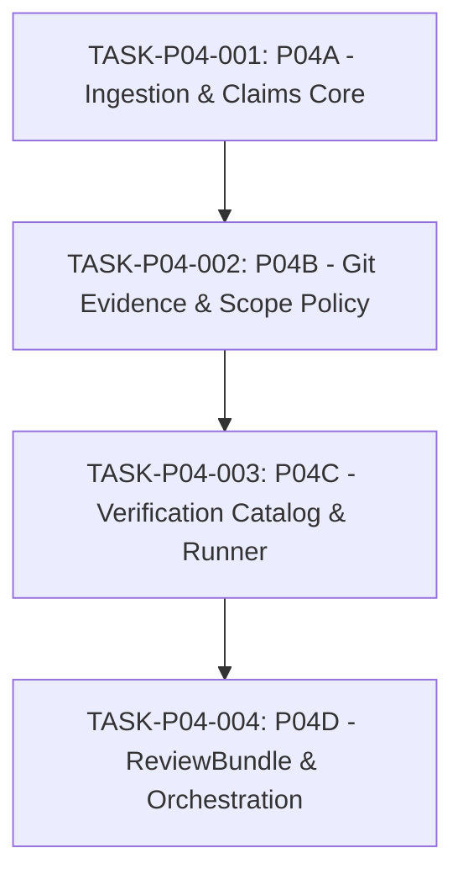

# PROPOSAL-P04-001: Evidence & Review Engine Architecture, Execution Isolation, and ReviewBundle Reconciliation

- **Proposal ID:** `PROPOSAL-P04-001`
- **Revision:** 2 (Remediation of External Audit 001)
- **Target Phase:** Phase P04 — Evidence & Review Engine
- **Status:** `PENDING_EXTERNAL_REVIEW`
- **Audit Reference:** [`docs/audits/P04_PRECONTRACT_ARCHITECTURE_EXTERNAL_AUDIT_001.md`](../audits/P04_PRECONTRACT_ARCHITECTURE_EXTERNAL_AUDIT_001.md)
- **Author:** AI Engineering Supervisor Control Plane Team
- **Governance Authority:** [`docs/24_CHANGE_GOVERNANCE.md`](../24_CHANGE_GOVERNANCE.md)
- **Decision Precedence:** Level 3 (Canonical Architecture) / Level 2 (ADR Required)
- **Related ADRs:** [`ADR-006`](../adr/ADR-006-evidence-first-review.md), [`ADR-011`](../adr/ADR-011-worker-report-handoff-and-agy-invocation-boundary.md), [`ADR-012`](../adr/ADR-012-task-contract-revision-and-attempt-binding.md), [`ADR-013`](../adr/ADR-013-trusted-verification-command-spec.md), [`DRAFT-ADR-018`](../adr/DRAFT-ADR-018-evidence-review-and-verification-isolation.md)
- **Source Provenance:** [`docs/sources/SOURCE_REGISTRY.md`](../sources/SOURCE_REGISTRY.md), [`docs/sources/REUSE_MATRIX.md`](../sources/REUSE_MATRIX.md), [`docs/22_MODULE_PROVENANCE.md`](../22_MODULE_PROVENANCE.md)
- **Primary Traceability:** FR-007, FR-008, FR-009, FR-010, SEC-003, NFR-004, NFR-008, REC-007, REC-008

---

## 1. Executive Summary, Provenance & Reuse Boundaries

Phase P03 established the foundational integration between the Supervisor Control Plane and the upstream Agent Orchestrator (AO REST daemon API `v0.13.0`), achieving clean session provisioning, task dispatch saga, observation reconciliation, raw bounded workspace artifact transport (`GetWorkspaceFile`), and exclusive daemon host bootstrap.

Pursuant to the formal governance boundaries frozen across Phase P01, P02, and P03, and citing [`docs/sources/SOURCE_REGISTRY.md`](../sources/SOURCE_REGISTRY.md) and [`docs/sources/REUSE_MATRIX.md`](../sources/REUSE_MATRIX.md):
1. **Reuse of Upstream Capabilities**: Phase P04 strictly reuses:
   - Untrivial Agent Orchestrator public workspace file reading primitive (`GetWorkspaceFile` in `internal/ao/client.go`), avoiding private database queries or terminal scraping.
   - Upstream Git worktree isolation mechanisms, strictly prohibiting building a custom, unapproved worktree manager.
   - Existing Supervisor domain entities and SQLite store seams established in Phase P02 and P03 (`internal/domain/**`, `internal/store/**`).
2. **Zero-Trust Boundary**: AO session idleness (`AO_IDLE != REPORT_READY`) and worker execution output represent unverified worker hypotheses (`WORKER_CLAIMS`), not objective truth.
3. **P04 Ownership**: Phase P04 owns the exclusive domain authority to parse `worker-report.json`, enforce schema validation, extract `WorkerClaim` entities, collect independent Git evidence, evaluate TaskContract scope compliance via `PolicyEngine`, execute profile-constrained verification commands via `VerificationRunner`, persist immutable evidence rows, and assemble the synthesized `ReviewBundle` for ChatGPT supervisor review.
4. **Pre-Contract Blockers**: Prior to drafting and releasing any formal Task Contract for Phase P04, five critical architectural seams must be evaluated, remediated, and approved:
   - `DESIGN_BLOCKER_P04_WORKTREE_BINDING`: Establishing an authoritative binding between `TaskAttempt` and physical local workspace worktree.
   - `DESIGN_BLOCKER_P04_GIT_EVIDENCE_AUTHORITY`: Enforcing read-only, non-mutating, sanitized Git diff collection with strict descendant ancestry verification and TOCTOU protection.
   - `DESIGN_BLOCKER_P04_VERIFICATION_ISOLATION`: Implementing two-layer verification command execution separating Layer A (command authority) from Layer B (Windows AppContainer untrusted code execution isolation with read-only source tree protection).
   - `DESIGN_BLOCKER_P04_REVIEW_SCHEMA_RECONCILIATION`: Reconciling structural drift across specification markdown, JSON schemas, valid examples, and domain entity types, ensuring inspectable evidence payloads for ChatGPT.
   - `DESIGN_BLOCKER_P04_EVIDENCE_ATOMICITY`: Structuring sequential schema migrations (v6..v9) and complete CAS state progression across short SQLite transactions.

---

## 2. Current-State Gap Matrix

| Deliverable / Component | Canonical Requirement | Code Seam Hiện Có (Baseline P03) | Phần Còn Thiếu Cần Xây Dựng (P04) | Owner Subtask | Dependencies |
| :--- | :--- | :--- | :--- | :--- | :--- |
| **WorkerReport Ingestion** | FR-007, ADR-011, `docs/09_WORKER_REPORT.md` | `AOAdapter.GetWorkspaceFile` (`internal/ao/client.go`), `CanonicalExpectedReportPath` (`internal/store/report_path.go`) | Ingestion orchestrator, JSON schema parser/validator against `worker-report.schema.json`, identity reconciliation (`task_id`, `attempt_id`), size/content bounding. | P04A | AOAdapter, SQLite store |
| **WorkerClaim Creation** | FR-007, ADR-011, `docs/05_DOMAIN_MODEL.md` | `domain.WorkerClaim` entity definition (`internal/domain/entities.go`) | Entity conversion, field normalization, unverified claims extraction, SQLite persistence (`worker_claims` table in Schema v6). | P04A | WorkerReport parser |
| **EvidenceCollector** | FR-008, ADR-011, `docs/04_ARCHITECTURE.md`, `docs/22_MODULE_PROVENANCE.md` | `domain.Evidence` entity definition (`internal/domain/entities.go`) | Evidence coordinator orchestrating Git inspection, scope policy checking, and verification runner execution into atomic evidence bundle. | P04B / P04D | Git adapter, PolicyEngine, VerificationRunner |
| **Git Evidence Adapter** | FR-008, ADR-013 §4.4, `docs/22_MODULE_PROVENANCE.md` | Pure unit/harness mocks in `test/integration/ao_harness_test.go` | Read-only trusted absolute `git.exe` executor, environment sanitization, commit object verification, direct HEAD query, strict descendant check, dirty worktree check, diff byte hasher. | P04B | Host Git binary, Worktree binding |
| **PolicyEngine** | FR-008, ADR-013, `docs/08_TASK_CONTRACT.md` | Pre-dispatch lexical path validator `ValidateCwdContainment` (`internal/contract/path_policy.go`) | Post-execution diff policy evaluator: matching git changed paths against `allowed_scope` and `forbidden_scope`, canonical glob matching, Windows case-insensitivity, scope precedence. | P04B | Git changed files list |
| **VerificationPolicyCatalog Runtime Loader** | ADR-013 §2, `docs/08_TASK_CONTRACT.md` | Pure domain interface `domain.VerificationPolicyCatalog` & `domain.VerificationProfilePolicy` (`internal/domain/verification_policy.go`) | Production host configuration file loader, trusted executable registry, parameter schema validator, timeout ceiling enforcer, capability mapping. | P04C | Host filesystem/config |
| **VerificationRunner** | FR-008, ADR-013 §2-4, `docs/07_SECURITY_MODEL.md` | None in production (P03 harness avoided executing external commands) | Concrete execution runner implementing Layer A command containment and Layer B AppContainer isolation on Windows, read-only worktree mount, zero-secret env, isolated TEMP/TMP, stdout/stderr caps, output hashing. | P04C | Windows OS APIs, Toolchain binaries |
| **Evidence Persistence** | FR-008, ADR-012, `docs/14_FAILURE_RECOVERY.md` | Schema v1-v5 (`internal/store/migrations.go`) without evidence tables | Sequential migrations: Schema v6 (`worker_claims`, `attempt_workspace_bindings`), v7 (`evidence`, `policy_findings`), v8 (`actual_test_results`), v9 (`review_bundles`). Lineage constraints, triggers, short atomic transactions. | P04A, P04B, P04C, P04D | SQLite store |
| **ReviewBundleBuilder** | FR-009, FR-010, ADR-006, `docs/10_REVIEW_BUNDLE.md` | None in production (`internal/domain/entities.go` lacks `ReviewBundle` struct) | Bundle compiler correlating Contract, Claims, Git Evidence (bounded patch), Test Evidence (bounded logs), Policy Findings, generating review focus hints, validating schema against `review-bundle.schema.json`. | P04D | Evidence persistence, Schema validator |
| **State Transitions & Audit** | FR-007, FR-008, FR-009, `docs/06_WORKFLOW_STATE_MACHINE.md` | Pure state machine definition in `internal/workflow/state_machine.go` (`RUNNING -> REPORT_READY -> EVIDENCE_READY -> REVIEWING`) | Orchestrated transactional store methods executing atomic state updates with full CAS guards, audit log appending, and failure handling. | P04A, P04B, P04D | SQLite store, Audit logger |

---

## 3. DESIGN_BLOCKER_P04_WORKTREE_BINDING

### 3.1. Problem Statement & Authority Gap
Phase P04 requires collecting Git diffs, verifying repository state, and executing verification commands against the **exact local worktree** where the worker performed its attempt.
However, analysis of pinned upstream AO (`v0.13.0`) reveals a fundamental authority gap:
1. **Public API Surface Gap**: AO's public session REST API (`GET /api/v1/sessions/{sessionId}`) returns only `session_id`, `activity`, and `is_terminated`. It strictly does **NOT** expose the local physical `worktree_path`.
2. **`Project.RootPath` Insufficiency**: `Project.RootPath` in the Supervisor database denotes the project repository root. It does not prove whether AO created an isolated Git worktree, branch directory, or session checkout. Assuming `Project.RootPath` as the session worktree breaks whenever concurrent sessions or worktrees exist.
3. **Dispatch Integration Seam**: Binding the workspace prior to `POST /api/v1/sessions/{id}/send` requires coordination across `internal/ao/client.go`, `internal/store/**`, and `internal/dispatch/**`.

### 3.2. Mapping Feasibility Analysis: `(session_id, terminal_generation, attempt_id, branch) -> physical worktree`
To resolve this mapping, three potential authority mechanisms are evaluated:
- **Mechanism A: Direct Git Worktree Inspection (`git worktree list --porcelain -z`)**:
  - The host inspects the repository's registered worktrees.
  - *Collision & Uniqueness*: If AO names worktrees or branches with the session ID, matching is deterministic. If AO creates detached HEAD worktrees without metadata, mapping is ambiguous.
  - *Restore / Restart*: Git worktrees survive daemon restarts, but worktree administrative files (`.git/worktrees/<id>/gitdir`) must be verified.
  - *TOCTOU*: If another process mutates or removes the worktree between dispatch and collection, evidence collection fails.
- **Mechanism B: Host-Owned Provisioning with Explicit Worktree Parameter**:
  - The Supervisor provisions the workspace directory before creating the AO session, passing an explicit working directory parameter.
  - However, pinned AO `v0.13.0` public API `POST /api/v1/sessions` takes `AgentId` and `ProjectName`; it does not accept a custom local worktree override.
- **Mechanism C: Upstream Runtime Proof Requirement**:
  - Conduct a bounded proof contract to inspect AO's local session disk layout and verify if AO sessions map deterministically to known worktree paths.

### 3.3. Evaluation of Architectural Options

| Evaluation Criterion | Phương án 1: Host-Owned Immutable `AttemptWorkspaceBinding` Persisted at Dispatch | Phương án 2: `Project.RootPath` Verified via Physical Git Check | Phương án 3: Host Worktree Registry Mapping Session to Local Path |
| :--- | :--- | :--- | :--- |
| **Provenance** | Stamped by Supervisor Core during dispatch saga (`internal/dispatch/**`); tied to `task_attempts.attempt_id`. | Derived statically from `projects.root_path`. | Maintained by centralized Host Daemon service using Git worktree query. |
| **Crash / Restart** | Fully persistent in SQLite; rehydrated without external guessing. | Trivial, but assumes static directory. | Reconstructed on startup from SQLite store and Git worktree verification. |
| **Alias / Symlink / Junction** | Evaluated via `filepath.EvalSymlinks` and Windows `GetFinalPathNameByHandleW`. | Evaluated at collection time. | Centralized normalization at registry entry. |
| **TOCTOU Resistance** | High: Verifies volume serial number and repository commit hash at binding and re-verifies before diff collection. | Poor: Highly vulnerable to concurrent attempts modifying the shared root path. | High: Protected by the single-instance machine exclusivity lock (ADR-017). |
| **Replay & Audit** | Exact historical worktree path is permanently recorded. | Cannot disambiguate historical attempts on branches. | Requires historical registry lookup. |
| **Schema Impact** | Table `attempt_workspace_bindings` (Schema v6). | Zero schema change. | Table `host_worktree_registry` or update `worker_sessions`. |
| **Falsification Test** | Simulated dispatch with invalid/symlinked path fails closed. Diff collection against non-matching worktree halts. | Concurrent attempts pollute diffs, failing falsification. | Session termination unregisters worktree, blocking invalid access. |

### 3.4. Architectural Determination
Because pinned AO (`v0.13.0`) does not expose `worktree_path` via its public REST API, Decision 1 in ADR-018 is formally designated as **CONDITIONAL / UNRESOLVED**.
- **Governance Requirement:** Prior to ADR-018 approval, a bounded runtime proof must establish the authoritative mechanism to map AO sessions to physical worktrees.
- **Fail-Closed Rule:** If the physical worktree cannot be deterministically verified as a clean Git worktree matching the attempt's contract before dispatch, the dispatch saga MUST fail-closed (`FAIL_CLOSED`).
- *Status: `DESIGN_BLOCKER_P04_WORKTREE_BINDING = OPEN`.*

---

## 4. DESIGN_BLOCKER_P04_GIT_EVIDENCE_AUTHORITY

### 4.1. Strict Read-Only Authority & Isolation
The Git evidence collector operates as a deterministic, non-mutating audit probe:
1. **Pinned Trusted Executable**: Binary `git.exe` must reside at an immutable absolute path validated at Supervisor startup via SHA-256 cryptographic hash and PE binary header verification. Resolving `git` via `PATH` or worker-controlled `cwd` is strictly prohibited.
2. **Fixed Command Set**: Only read-only queries are permitted: `rev-parse`, `cat-file`, `status --porcelain=v1 -z -uall`, `diff --binary --no-color`. Mutating commands (`checkout`, `reset`, `clean`, `stash`, `commit`, `merge`, `rebase`, `pull`, `push`, `tag`) are prohibited.
3. **Explicit CLI Hardening Flags**: Every git invocation must pass explicit flags overriding configuration:
   `git --no-optional-locks -c core.hooksPath=/dev/null -c diff.external= -c diff.textconv=false -c core.fsmonitor=false diff --no-ext-diff --no-textconv --ignore-submodules=none`
4. **Environment Sanitization**: Strip:
   - `GIT_DIR`, `GIT_WORK_TREE`, `GIT_INDEX_FILE`, `GIT_OBJECT_DIRECTORY`, `GIT_ALTERNATE_OBJECT_DIRECTORIES`.
   - `GIT_EXTERNAL_DIFF`, `GIT_DIFF_OPTS`.
   - `GIT_ASKPASS`, `SSH_ASKPASS`, `GIT_TERMINAL_PROMPT=0`.
   - `HOME`, `USERPROFILE`, `XDG_CONFIG_HOME`.
   - Inject `GIT_CONFIG_NOSYSTEM=1` and `LC_ALL=C` for deterministic output formatting.

### 4.2. Revision Ancestry: Strict Descendant Policy
- **Ancestry Invariant**:
  The collector executes `git merge-base --is-ancestor <base_sha> <actual_head_sha>`.
  - *Success Case*: If `base_sha` is an ancestor of `actual_head_sha`, the commits form a **Strict Descendant** chain.
  - *Linear History Check*: If project policy requires linear non-merge history, the collector verifies `git rev-list --merges <base_sha>..<actual_head_sha>` returns zero commits. If merge commits exist, they must be documented in evidence.
  - *Divergence Failure*: If `base_sha` is **NOT** an ancestor of `actual_head_sha`, the branch has diverged, rebased onto another branch, or swapped heads. Flag `ANCESTRY_DIVERGENCE_ERROR` and halt fail-closed; do NOT attempt to guess diff notation.

### 4.3. TOCTOU Mitigation & Multi-Step Verification
To prevent worktree state changes between multi-step inspection:
1. Record `pre_head_sha = git rev-parse HEAD` and `pre_status = git status --porcelain=v1 -z -uall`.
2. Execute diff and changed files collection.
3. Re-verify `post_head_sha = git rev-parse HEAD` and `post_status = git status --porcelain=v1 -z -uall`.
4. If `pre_head_sha != post_head_sha` or `pre_status != post_status`, worktree mutated during collection: abort with `CONCURRENT_WORKTREE_MUTATION_ERROR`.

### 4.4. Binary Diff Hashing vs Machine-Readable Manifest
- **Machine-Readable Manifest**: Changed files are parsed via `git diff -z --raw --no-color base head` (NUL-delimited) into a structured manifest of path entries, statuses (`M`, `A`, `D`, `R`), and blob OIDs.
- **Canonical Diff Byte Hash**: SHA-256 computed directly over raw binary patch output (`git diff --binary --no-ext-diff --no-textconv base head`), producing immutable `git_diff_hash`.
- *Status: `DESIGN_BLOCKER_P04_GIT_EVIDENCE_AUTHORITY = OPEN`.*

---

## 5. DESIGN_BLOCKER_P04_VERIFICATION_ISOLATION

### 5.1. Separation of Security Layers
- **Layer A (Command Authority Containment)**: Governed by host-owned `VerificationProfilePolicy` definitions. Prohibits shell strings, command injection, and arbitrary executable execution.
- **Layer B (Untrusted Code Execution Isolation)**: Governs runtime sandbox execution. Safe profile commands (`go test`, `npm test`) execute untrusted worker code:
  ```
  SAFE_COMMAND_SPEC != TRUSTED_CODE_EXECUTION
  ```

### 5.2. Layer B Primary Mechanism: Windows AppContainer Isolation
1. **Primary Mechanism Selection**: **Windows AppContainer Isolation** paired with **Windows Job Object**.
   - AppContainer natively provides low-integrity, capability-based sandboxing, denying network by default and restricting filesystem access strictly to explicitly granted directory ACLs.
   - Secondary Fallback: Restricted Token with Low Integrity Level is permitted **only** if paired with external firewalling (WFP / Windows Firewall) to enforce network isolation, because a Restricted Token standalone **CANNOT** isolate network egress.
2. **Worktree Read-Only Mount**:
   - The audited worktree is granted strictly **READ-ONLY** access (`GENERIC_READ`, deny write/delete) during verification.
   - **Prohibition on Direct Worktree Mutation**: Untrusted verification processes are strictly forbidden from modifying the audited worktree.
   - **Disposable Copy / Snapshot Policy**: If a test toolchain requires write access (e.g. building binaries, updating source files, code generation), execution MUST occur in a **temporary disposable copy / snapshot directory** with verified provenance, never mutating the audited worktree directly.
3. **Child Desktop & Window Station Isolation**:
   - Verification child processes execute on an isolated Window Station and Desktop (`CreateDesktopW`) to prevent Windows GUI message hooking, window injection, or synthetic keyboard/mouse interaction.
4. **Zero-Secret Environment**:
   - Strip all host credentials (`OPENAI_API_KEY`, `ANTHROPIC_API_KEY`, `GITHUB_TOKEN`, AO credentials, tunnel tokens). Provide only bare OS minimums (`SYSTEMROOT`, `WINDIR`, `COMSPEC`) and toolchain home (`GOROOT`).
5. **Isolated Temporary Directories**:
   - Redirect `TEMP` and `TMP` to an attempt-local folder: `.supervisor/tmp/<attempt_id>/`, securely wiped post-execution. Tool caches (`GOCACHE`, `GOPATH` temp) are redirected into this ephemeral directory.
6. **Process Tree Termination**:
   - Windows Job Object enforces `JOB_OBJECT_LIMIT_KILL_ON_JOB_CLOSE` to terminate all background child processes upon timeout or completion.
7. **Operational Ceilings**:
   - Operational limits (e.g. `DEFAULT_VERIFICATION_TIMEOUT`, `MAX_OUTPUT_BYTES`) remain `VALUE = UNSET` or host-injected until formal approval.

### 5.3. Falsification Matrix for Layer B Isolation

| Test Vector | Threat Description | Isolation Mechanism Enforced | Expected Observable Result |
| :--- | :--- | :--- | :--- |
| **Filesystem Escape** | Test code attempts to write to `C:\Users`, `C:\Windows`, or audited worktree. | AppContainer ACL / Read-only mount. | `ERROR_ACCESS_DENIED` (0x5); zero disk mutation. |
| **Network Egress** | Test code attempts outbound HTTP request to external server. | Default-deny network (no network capabilities). | `WSAEACCES` (10013) / connection refused. |
| **Environment Secret Leak** | Test code dumps `os.Environ()` searching for API keys. | Aggressive environment stripping. | Zero keys discovered; only minimal OS variables present. |
| **Child Process Escape** | Test launches detached background process (`Start-Process`, `daemon`). | Job Object process-tree assignment. | Entire process tree terminated on job close; zero orphan processes. |
| **Source Tree Mutation** | Test attempts to mutate `.go` files in audited worktree. | Read-only worktree ACL / post-run status check. | Write denied; post-run `git status` verifies zero dirty files. |

- *Status: `DESIGN_BLOCKER_P04_VERIFICATION_ISOLATION = OPEN`.*

---

## 6. DESIGN_BLOCKER_P04_REVIEW_SCHEMA_RECONCILIATION & REVIEWABLE EVIDENCE

### 6.1. Reviewable Evidence Payload Design
A ReviewBundle containing only cryptographic hashes is useless to ChatGPT, forcing 15–30 low-level tool calls and defeating the primary objective of cognitive compression (FR-009, FR-010).
The ReviewBundle must provide **inspectable, reviewable content**:
1. **Bounded Git Patch Artifact (`bounded_git_patch`)**:
   - *Inline Patch*: Contains the actual unified diff text (up to a bounded limit, e.g. 100 KB).
   - *Artifact ID*: If the diff exceeds the inline limit, provide an opaque `artifact_id` referencing durable local storage.
   - *Metadata*: `git_diff_hash` (SHA-256), `original_bytes`, `captured_bytes`, `is_truncated: boolean`, `has_binary_files: boolean`.
2. **Bounded Test Output Logs (`test_results`)**:
   - *Inline Logs*: Capture bounded stdout and stderr text for each executed verification command.
   - *Metadata*: `exit_code`, `passed: boolean`, `stdout_hash`, `stderr_hash`, `duration_ms`, `is_truncated: boolean`.
   - *Prohibition*: Worker-reported test logs are NEVER used as verified evidence.
3. **Strict Naming Alignment**:
   - Unify field name strictly to `test_results` (eliminate historical drift with `details`).
4. **Strictly Typed TaskContract**:
   - `task_contract` in ReviewBundle is an immutable snapshot object containing `contract_id`, `revision_number`, `requirements`, `allowed_scope`, `forbidden_scope`, and `acceptance_criteria`.
5. **Non-Circular Bundle Hashing**:
   - `bundle_hash` is computed as the SHA-256 digest of the canonical JSON serialization of the ReviewBundle **excluding** the `bundle_hash` field itself.
6. **Phase P05 Bounded Artifact Retrieval**:
   - Phase P05 will access large truncated artifacts via an internal bounded artifact retrieval tool (`get_artifact(artifact_id)`) returning chunked content without granting arbitrary filesystem access to ChatGPT.

### 6.2. Drift Analysis & Reconciliation Plan (S1..S10)

| Field / Concept | `docs/10_REVIEW_BUNDLE.md` | `docs/schemas/review-bundle.schema.json` | `review-bundle.valid.json` | `internal/domain/entities.go` | Reconciled Direction |
| :--- | :--- | :--- | :--- | :--- | :--- |
| **`diff_summary` vs `diff_stat`** | Mermaid: `diff_summary`; text: `diff_stat`. | Requires `diff_stat: string`. | `"diff_stat": "1 file..."`. | Lacks both. | Adopt `diff_stat: string` + add bounded patch payload. |
| **`full_diff_url`** | Present in Mermaid. | Missing. | Missing. | Missing. | Remove `full_diff_url`; replace with local `bounded_git_patch`. |
| **`git_diff_hash`** | Missing. | Missing. | Missing. | Present in `Evidence`. | Add `git_diff_hash: string` to schema and docs. |
| **`actual_test_evidence`** | Summary fields. | `all_passed`, `executed_commands`. | `all_passed`, `commands`. | `TestLogs: []ActualTestResult`. | Add `test_results: []ActualTestResult` with bounded logs. |
| **`worker_claims` Structure** | Claims text. | Untyped `object`. | `claimed_status`, `claims`. | Typed `WorkerClaim` struct. | Formalize schema matching `domain.WorkerClaim`. |
| **`additionalProperties`** | Implied closed. | Closed at root; open in sub-objects. | Compliant. | Closed by policy. | Enforce `additionalProperties: false` recursively. |
| **`ReviewBundle` Domain Entity**| Fully specified. | Fully specified. | Fully specified. | **MISSING**. | Implement `ReviewBundle` Go struct in `entities.go`. |

- **Reconciliation Plan:** S1 (diff_stat + git_diff_hash), S2 (remove full_diff_url), S3 (structured test_results), S4 (worker_claims schema), S5 (nested additionalProperties: false), S6 (string/array bounds), S7 (entities.go alignment), S8 (example JSON update), S9 (non-circular bundle_hash), S10 (supervisor audit).
- *Status: `DESIGN_BLOCKER_P04_REVIEW_SCHEMA_RECONCILIATION = OPEN`.*

---

## 7. DESIGN_BLOCKER_P04_EVIDENCE_ATOMICITY & MIGRATION STRATEGY

### 7.1. Sequential Schema Migration Architecture
To prevent schema versioning conflicts across subtasks, P04 adopts **Sequential Migrations (v6..v9)**:
- **Migration v6 (Subtask P04A)**:
  - `attempt_workspace_bindings` (attempt_id PK, worktree_path, repo_root, bound_at).
  - `worker_claims` (claim_id PK, attempt_id UNIQUE FK, reported_head_sha, claimed_files_changed_json, tests_json, created_at).
- **Migration v7 (Subtask P04B)**:
  - `evidence` (evidence_id PK, attempt_id UNIQUE FK, actual_base_sha, actual_head_sha, actual_files_changed_json, git_diff_hash, diff_stat, scope_verified, collected_at).
  - `policy_findings` (finding_id PK, attempt_id FK, rule_id, passed, severity, details, created_at).
- **Migration v8 (Subtask P04C)**:
  - `actual_test_results` (result_id PK, attempt_id FK, request_id, profile_id, exit_code, passed, stdout_hash, stderr_hash, duration_ms, executed_at, UNIQUE(attempt_id, request_id)).
- **Migration v9 (Subtask P04D)**:
  - `review_bundles` (bundle_id PK, task_id FK, attempt_id UNIQUE FK, contract_id FK, bundle_hash, payload_json, generated_at).

### 7.2. Complete CAS Ingestion Query (`RUNNING -> REPORT_READY`)
Atomic ingestion executes inside a short SQLite transaction enforcing strict CAS:
```sql
BEGIN IMMEDIATE TRANSACTION;
-- 1. CAS Update on task_attempts
UPDATE task_attempts
SET ended_at = :ended_at,
    worker_report_raw = :worker_report_raw
WHERE attempt_id = :attempt_id
  AND ended_at IS NULL
  AND task_id = :task_id
  AND contract_id = :contract_id
  AND session_id = :session_id
  AND terminal_generation = :terminal_generation;

-- 2. CAS Update on tasks
UPDATE tasks
SET state = 'REPORT_READY', updated_at = :ended_at
WHERE task_id = :task_id
  AND state = 'RUNNING'
  AND current_attempt = :attempt_number;

-- 3. Assert affected rows == 1 on both updates; if not, ROLLBACK!

-- 4. Insert WorkerClaim
INSERT INTO worker_claims (claim_id, attempt_id, reported_head_sha, claimed_files_changed_json, tests_json, created_at)
VALUES (:claim_id, :attempt_id, :reported_head_sha, :claimed_files_json, :tests_json, :ended_at);

-- 5. Append audit event
INSERT INTO audit_events (...);
COMMIT;
```
- **CAS Failure Handling**: If `affected_rows != 1`, transaction rolls back immediately. The supervisor re-reads durable state from the database; no duplicate claims or duplicate audit events are generated.
- **`failure_reason` Semantics**: In compliance with the canonical domain model, `failure_reason` is strictly a workflow event detail attribute recorded in audit logs and API responses; it is **NOT** a column in `task_attempts`.

### 7.3. Separation of Long External Execution from Short DB Transactions
- External Git diff execution and verification test runners execute **OUTSIDE** database transactions.
- Long-running commands hold zero SQLite locks.
- Upon completion, results are snapshotted and committed via short, atomic transactions with CAS guards.
- Concurrent runner calls for the same attempt fail-closed via unique database constraints on `(attempt_id, request_id)`.
- *Status: `DESIGN_BLOCKER_P04_EVIDENCE_ATOMICITY = OPEN`.*

---

## 8. PolicyEngine Semantics

1. **Canonical Glob Grammar**: Standard Unix globbing: `*` (segment match), `**` (recursive directory match), `?` (character match), `[...]` (character class). No arbitrary regex or brace expansion.
2. **Slash Normalization**: All paths and glob patterns strictly converted to forward slash (`/`).
3. **Windows Case Insensitivity**: On Windows, matching is case-insensitive (`strings.EqualFold` / lowercase normalization) to eliminate case-variation bypasses.
4. **Precedence Invariant**:
   ```
   forbidden_scope PRECEDENCE > allowed_scope
   ```
   If a path matches `forbidden_scope`, it is strictly rejected, even if it also matches `allowed_scope`.
5. **Special Path Handlings**:
   - Renamed/copied files: Both source and destination paths must satisfy `allowed_scope` and not match `forbidden_scope`.
   - Deleted files: Deleted path must satisfy `allowed_scope`.
   - Submodules: Submodule paths treated as directory entries and must fall in `allowed_scope`.
   - Symlinks: Both symlink and target must fall in `allowed_scope`.
   - Control plane path `.supervisor/**`: Excluded from application diffs; touching `.supervisor/` in an application commit triggers fatal rejection.
6. **Fail-Closed**: Empty `allowed_scope` permits zero files. Invalid glob syntax fails evaluation immediately.

---

## 9. Verification Result Integrity

1. **Request Binding**: Every `ActualTestResult` is immutably bound to `(attempt_id, request_id, profile_id)`.
2. **Execution Metadata**: Wall-clock timestamps, exit code, SHA-256 hashes of stdout and stderr, process-tree termination status (`CLEAN_EXIT`, `TIMEOUT_KILLED`, `OUTPUT_CAPPED`).
3. **Zero Claim Promotion**: Worker self-reported tests are never copied into `actual_test_results`. Only Supervisor-executed commands receive verified status.
4. **Missing Verification Handling**: If a required verification request fails to execute, the attempt is marked `UNVERIFIED` / `FAILED`.

---

## 10. Proposed Concurrency, Recovery, and Replay Scenarios

The following **13 proposed P04 recovery scenarios** govern fault handling during pre-contract evaluation:

| Scenario ID | Failure / Event Trigger | System Impact | Recovery / Resolution Mechanism | Resulting State |
| :--- | :--- | :--- | :--- | :--- |
| **REC-P04-01** | Crash after report fetch, before `REPORT_READY` transaction | Raw report lost from memory; DB unchanged at `RUNNING` | On restart, Supervisor re-reads AO session activity; if IDLE, re-fetches report via `GetWorkspaceFile` | `REPORT_READY` or `FAILED` |
| **REC-P04-02** | Crash after report persistence, before audit log commit | DB transaction rolled back | Atomic transaction ensures zero partial commit; re-ingests on next cycle | Clean retry from `RUNNING` |
| **REC-P04-03** | Git HEAD changes during evidence collection | Git diff inconsistent with worker turn | Verify HEAD against `WorkerReport.head_sha`; mismatch aborts collection | `FAILED (HEAD_MISMATCH)` |
| **REC-P04-04** | Worktree contains uncommitted/staged dirty files | Workspace polluted | `git status --porcelain=v1` detects dirty files; flags `UNCOMMITTED_DIRTY_WORKTREE` | `FAILED (DIRTY_WORKTREE)` |
| **REC-P04-05** | Base or Head commit object missing in repo | Cannot compute diff | `git cat-file -e` check fails; report missing commits | `FAILED (COMMIT_OBJECT_MISSING)` |
| **REC-P04-06** | Verification runner times out | Test exceeds `max_timeout` | Job Object forcefully terminates process tree; records `TIMEOUT_KILLED` | `FAILED (VERIFICATION_TIMEOUT)` |
| **REC-P04-07** | Verification runner stdout/stderr buffer overflow | Worker floods output stream | Stream truncated at cap; records `OUTPUT_CAPPED` flag; hash computed on capped stream | Recorded in evidence |
| **REC-P04-08** | Evidence persistence SQLite failure | Disk full or DB locked | Entire transaction rolls back; no `EVIDENCE_READY` promotion | Retry or `FAILED` |
| **REC-P04-09** | Audit log append failure | Hash chain or trigger violation | Atomic rollback of entire evidence transaction | Fail-closed |
| **REC-P04-10** | Competing collectors for the same attempt | Race condition between threads | `attempt_id UNIQUE` constraint on `evidence` table; second caller loses CAS and rereads committed row | Idempotent duplicate handled |
| **REC-P04-11** | ReviewBundle JSON schema validation failure | Bug in bundle synthesis | Bundle persistence rejected; task halts before `REVIEWING` | `FAILED (BUNDLE_SCHEMA_INVALID)` |
| **REC-P04-12** | Restart with partial rows from prior crashes | Orphaned uncommitted state | Database transactional isolation guarantees no partial rows exist | Clean state rehydration |
| **REC-P04-13** | Repeated request after `EVIDENCE_READY` / `REVIEWING` | Duplicate API call | Idempotent read: returns existing compiled `ReviewBundle` from DB | Unchanged (`REVIEWING`) |

---

## 11. Requirement Clarification: NFR-008 Performance SLA

### 11.1. The Conflict
- **Current Requirement** (`docs/02_REQUIREMENTS.md`):
  *"The Supervisor Control Plane shall generate a Review Bundle within 3 seconds of worker completion on repos up to 10,000 files."*
- **Operational Reality**: Running real verification test suites (e.g. `go test -race ./...`) frequently takes 10 to 60+ seconds, making a literal 3-second end-to-end SLA physically impossible whenever tests are required.

### 11.2. Proposed Canonical Amendment (Two Milestones)
We formally propose amending NFR-008 into two distinct, measurable milestones:
1. **Milestone 1 (Verification Duration)**:
   - Verification execution duration is bounded by `TaskContract.verification_requests[].timeout_seconds` (origin: test process spawn, endpoint: process-tree exit).
2. **Milestone 2 (Bundle Compilation SLA)**:
   - From durable `EVIDENCE_READY` to ReviewBundle validated and persisted in `REVIEWING` must be **<= 3.0 seconds** on repositories up to 10,000 files (origin: `EVIDENCE_READY` transaction commit, endpoint: `review_bundles` insert and `REVIEWING` state transition).
- **Failure Behavior**: If bundle compilation exceeds 3.0 seconds, record performance warning in audit log.
- *Status: `REQUIREMENT_CLARIFICATION_REQUIRED` pending External Supervisor audit.*

---

## 12. Phased Scope Decomposition Plan

Phase P04 is decomposed into four strictly sequential subtasks:



1. **`P04A` — WorkerReport Ingestion, Schema Validation & Claim Persistence**:
   - Scope: `worker-report.schema.json` validation, `AOAdapter.GetWorkspaceFile` (`internal/ao/client.go`), dispatch integration seam (`internal/dispatch/**`), Schema v6 migration (`worker_claims`, `attempt_workspace_bindings`), `RUNNING -> REPORT_READY` CAS transition, `REC-007`/`REC-008` handling.
   - Exit Gate: Ingests valid reports, rejects malformed/missing reports, transitions `REPORT_READY` atomically with zero Git/test dependencies.
2. **`P04B` — Git EvidenceCollector & PolicyEngine**:
   - Scope: Read-only `git.exe` adapter, strict descendant verification, dirty file detection, NUL-delimited parsing, diff byte hashing, `PolicyEngine` glob scope evaluation, Schema v7 migration (`evidence`, `policy_findings`).
   - Exit Gate: Mathematically accurate diffs and scope violations detected against actual Git commits; ancestry divergence flagged fail-closed.
3. **`P04C` — VerificationPolicyCatalog & Isolated VerificationRunner**:
   - Scope: Host verification catalog loader, trusted executable registry, Layer B AppContainer isolation harness on Windows, read-only worktree enforcement, output capping, Schema v8 migration (`actual_test_results`).
   - Exit Gate: Safely executes test profiles inside isolated sandbox; enforces process-tree termination on timeout/cancel; zero secret leakage; zero worktree mutation.
4. **`P04D` — ReviewBundleBuilder & End-to-End Orchestration**:
   - Scope: `ReviewBundleBuilder` implementation (bounded patch, bounded logs), `review-bundle.schema.json` validation, Schema v9 migration (`review_bundles`), `REPORT_READY -> EVIDENCE_READY -> REVIEWING` transitions, integration test harness.
   - Exit Gate: 100% valid ReviewBundles generated; full lifecycle integration test passes with zero race conditions (`go test -race -count=1 ./...`).

---

## 13. Blocker & Governance Tracking

- `DESIGN_BLOCKER_P04_WORKTREE_BINDING = OPEN`
- `DESIGN_BLOCKER_P04_GIT_EVIDENCE_AUTHORITY = OPEN`
- `DESIGN_BLOCKER_P04_VERIFICATION_ISOLATION = OPEN`
- `DESIGN_BLOCKER_P04_REVIEW_SCHEMA_RECONCILIATION = OPEN`
- `DESIGN_BLOCKER_P04_EVIDENCE_ATOMICITY = OPEN`
- `P04_TASK_CONTRACT = NOT_RELEASED`
- `P04_CODE = HELD_PENDING_APPROVED_ARCHITECTURE_AND_TASK_CONTRACT`
- `ACTIVE_GATE = P04_PRECONTRACT_ARCHITECTURE_REMEDIATION`
