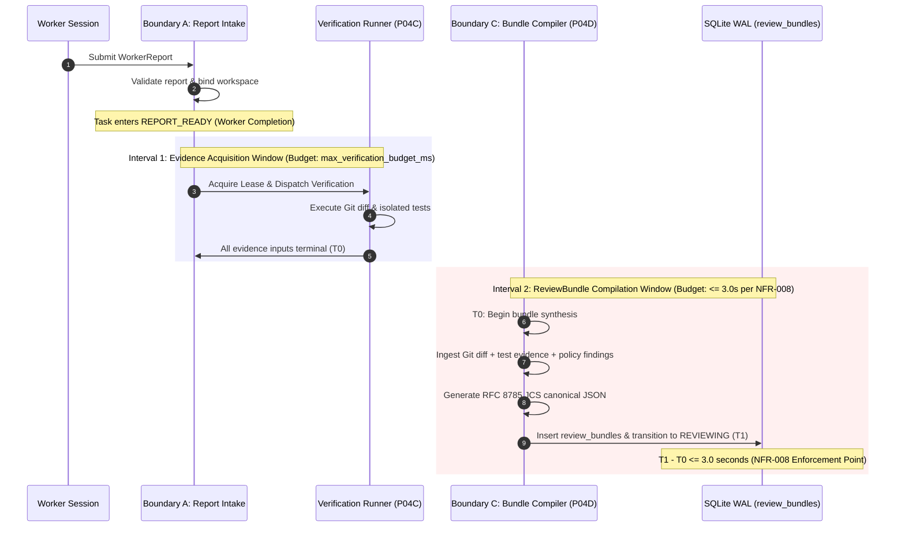

# PROPOSAL-P04-002: ReviewBundle Latency Measurement Semantics (NFR-008 Reconciliation)

> **Proposal ID**: `PROPOSAL-P04-002`
> **Title**: Formal Latency Measurement Semantics for ReviewBundle Compilation & Pipeline Reconciliation
> **Author**: AI Engineering Supervisor Team
> **Status**: `PENDING_EXTERNAL_REVIEW`
> **Date**: 2026-09-26
> **Target Requirement**: `docs/02_REQUIREMENTS.md` (NFR-008)
> **Related Architecture**: `docs/04_ARCHITECTURE.md` (Section 7), `docs/10_REVIEW_BUNDLE.md`, `docs/adr/DRAFT-ADR-018-evidence-review-and-verification-isolation.md`

---

## 1. Executive Summary

Canonical non-functional requirement **NFR-008** specifies:
> *"The Supervisor Control Plane shall generate a Review Bundle within 3 seconds of worker completion on repos up to 10,000 files."*

At the same time, functional requirement **FR-009** and canonical **Architecture Section 7** require that the `ReviewBundle` contain **independent test verification evidence** (`actual_test_evidence`) captured by running test suites, compilers, and linters in isolated execution environments under the Supervisor Control Plane's authority.

Running real-world test suites (e.g. `go test -race ./...`, `npm test`, `pytest`) can legitimately take from tens of seconds to several minutes, which inherently exceeds 3 seconds. If NFR-008's 3-second clock begins at worker report submission and includes external test execution, every realistic engineering task will breach NFR-008 regardless of how fast or optimized the Supervisor Control Plane itself is. Conversely, omitting test execution from the ReviewBundle violates FR-009 and undermines core verification integrity.

This proposal establishes a rigorous, unambiguous measurement model that reconciles NFR-008 with FR-009 without weakening either requirement, and defines the change governance process required before canonical `docs/02_REQUIREMENTS.md` or ADR-018 can be formally adopted.

---

## 2. Problem Statement & Tension Analysis

### 2.1. The Conflict
1. **Canonical NFR-008**: Stipulates a hard performance budget of $\le 3	ext{ seconds}$ from "worker completion" on repositories up to 10,000 files.
2. **Canonical FR-009 & ReviewBundle Schema**: Stipulates that `ReviewBundle.actual_test_evidence` must record the Supervisor's independently executed test commands and exit codes.
3. **Execution Reality**:
   - Compiling and executing test suites (e.g., in Windows AppContainers with zero inherited handles and network denial) is bounded by project build times, external toolchain performance, and test case complexity, not Supervisor Control Plane scheduling.
   - For complex Go or TypeScript projects, verification tests typically run between 5 and 60 seconds.

### 2.2. Governance Conflict
Modifying the text or interpretation of NFR-008 unilaterally in proposals or ADRs violates the 9-level decision hierarchy of `docs/24_CHANGE_GOVERNANCE.md` (Level 4 Requirement Specification cannot be implicitly altered by Level 6 Task Contracts or Level 8 Suggestions). Formal approval of this proposal by the External Supervisor is mandatory before modifying canonical documentation.

---

## 3. Proposed Resolution: Two-Interval Latency Model

We propose structuring the post-worker pipeline into two strictly separated, independently bounded intervals:

### 3.1. Interval 1: Evidence Acquisition Window ($T_{	ext{worker\_completion}} 	o T_0$)
- **Trigger**: Worker submits report; Boundary A validates report, inserts `attempt_workspace_bindings`, and transitions `tasks.state` to `REPORT_READY`.
- **Scope**: Hardened in-memory Git diff/log collection (Subtask P04B) and Windows AppContainer verification runner execution (Subtask P04C).
- **Governing Budget**: Bound by attempt-scoped verification execution limits (`max_verification_budget_ms`, default 60,000 ms, configurable in `VerificationPolicyCatalog`).
- **Enforcement**: Hard timeout enforcement via Windows Job Object (`JOB_OBJECT_LIMIT_KILL_ON_JOB_CLOSE`) and process-tree cancellation.
- **Terminal Moment ($T_0$)**: Defined as the exact timestamp when **all mandatory evidence collection processes have reached a terminal state** (succeeded, failed, timed out, or quarantined) and evidence finalization (Boundary B) completes.

### 3.2. Interval 2: ReviewBundle Compilation & Persistence Window ($T_0 	o T_1$)
- **Start ($T_0$)**: The instant when all mandatory evidence inputs are terminal and Boundary B commits evidence metadata to SQLite.
- **End ($T_1$)**: The instant when:
  1. The canonical RFC 8785 JSON Canonicalization Scheme (JCS) `ReviewBundle` payload is constructed in memory;
  2. The payload is validated against `docs/schemas/review-bundle.schema.json`;
  3. The `review_bundles` row is durably inserted;
  4. The `tasks.state` CAS transition to `REVIEWING` is committed to SQLite WAL.
- **Governing Requirement (NFR-008)**:
  $$T_1 - T_0 \le 3.0	ext{ seconds}$$
  for repositories containing up to 10,000 files.

---

## 4. Evaluation of Alternatives

| Option | Description | Pros | Cons | Verdict |
| :--- | :--- | :--- | :--- | :--- |
| **A. Include test runtime in NFR-008** | Clock runs from worker report to ReviewBundle persistence including tests. | Strict literal reading of "worker completion". | Practically impossible for real projects; tests breach 3s constantly. | **Rejected** |
| **B. Make test execution asynchronous** | Generate partial ReviewBundle in 3s without tests; enrich later. | Meets 3s trivially. | Violates FR-009; ChatGPT reviewer receives incomplete audit data. | **Rejected** |
| **C. Two-Interval Model (Proposed)** | Separate external tool execution budget from Control Plane compilation budget ($T_1 - T_0 \le 3	ext{s}$). | Preserves verification integrity; holds Control Plane strictly accountable for compilation latency ($\le 3	ext{s}$). | Requires explicit measurement definition in requirements. | **Recommended** |

---

## 5. Implementation & Verification Plan

1. **Instrumentation**: Subtask P04D tracks:
   - `evidence_terminal_at_epoch_ms` ($T_0$)
   - `bundle_persisted_at_epoch_ms` ($T_1$)
   - `bundle_compilation_latency_ms` = $T_1 - T_0$
2. **Benchmark Test Suite**: Integration test in Subtask P04D tests a repository with 10,000 committed files, synthesizes a ReviewBundle from pre-computed evidence, and asserts that $T_1 - T_0 \le 3000	ext{ ms}$.
3. **Audit Log Metric**: Emits an audit event `REVIEW_BUNDLE_COMPILED` recording $T_0$, $T_1$, and latency delta.

---

## 6. Governance Next Steps

1. This proposal is submitted as `PENDING_EXTERNAL_REVIEW`.
2. Until formal approval by External Supervisor:
   - Canonical `docs/02_REQUIREMENTS.md` remains **UNMODIFIED**.
   - `docs/adr/DRAFT-ADR-018-evidence-review-and-verification-isolation.md` remains in **DRAFT** status.
   - Task Contract for Phase P04 cannot be released.
3. Upon approval:
   - An approved ADR addendum or revision will record the two-interval model.
   - `docs/02_REQUIREMENTS.md` will be reconciled in a governed canonical update pass.
