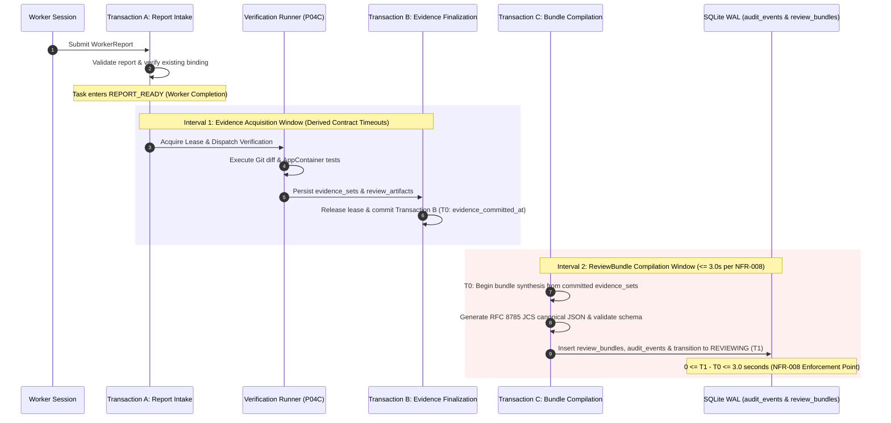

# PROPOSAL-P04-002: ReviewBundle Latency Measurement Semantics (NFR-008 Reconciliation)

> **Proposal ID**: `PROPOSAL-P04-002`
> **Revision**: 2
> **Title**: Formal Latency Measurement Semantics for ReviewBundle Compilation & Pipeline Reconciliation
> **Author**: AI Engineering Supervisor Team
> **Status**: `PENDING_EXTERNAL_REVIEW`
> **Date**: 2026-09-26
> **Target Requirement**: `docs/02_REQUIREMENTS.md` (NFR-008)
> **Related Architecture**: `docs/04_ARCHITECTURE.md` (Section 7), `docs/10_REVIEW_BUNDLE.md`, `docs/adr/DRAFT-ADR-018-evidence-review-and-verification-isolation.md`

---

## 1. Executive Summary

Canonical non-functional requirement **NFR-008** specifies:
> *"The Supervisor Control Plane shall generate a Review Bundle within 3 seconds of worker completion on repos up to 10,000 files."*

At the same time, functional requirement **FR-008** and canonical **Architecture Section 7** require that the `ReviewBundle` contain **independent verification evidence** (`actual_test_evidence` and `actual_git_evidence`) captured by running Git collectors, test suites, compilers, and linters in isolated Windows AppContainers under the Supervisor Control Plane's authority.

Running real-world test suites (e.g., `go test -race ./...`, `npm test`, `pytest`) legitimately requires durations ranging from tens of seconds to several minutes, inherently exceeding 3 seconds. If NFR-008's 3-second clock begins at worker report submission and includes external test execution, every realistic engineering task will breach NFR-008 regardless of Supervisor Control Plane efficiency. Conversely, omitting test execution from the ReviewBundle violates audit integrity.

This proposal establishes a rigorous, unambiguous measurement model that reconciles NFR-008 without weakening audit guarantees, and defines the change governance process required before canonical `docs/02_REQUIREMENTS.md` or ADR-018 can be formally adopted.

---

## 2. Problem Statement & Tension Analysis

### 2.1. The Conflict
1. **Canonical NFR-008**: Stipulates a hard performance budget of <= 3.0 seconds from worker completion on repositories up to 10,000 files.
2. **Canonical FR-008 & ReviewBundle Schema**: Stipulates that `ReviewBundle.actual_test_evidence` must record the Supervisor's independently executed test commands and exit codes.
3. **Execution Reality**:
   - Compiling and executing test suites in Windows AppContainers with zero inherited handles and network denial is bounded by project build times, external toolchain performance, and test complexity.
   - For real projects, verification tests typically run between 5 and 60 seconds.

### 2.2. Governance Conflict
Modifying the text or interpretation of NFR-008 unilaterally violates the 9-level decision hierarchy of `docs/24_CHANGE_GOVERNANCE.md` (Level 4 Requirement Specification cannot be implicitly altered by Level 6 Task Contracts or Level 8 Suggestions). Formal approval of this proposal by the External Supervisor is mandatory before modifying canonical documentation.

---

## 3. Proposed Resolution: Two-Interval Latency Model

We propose structuring the post-worker pipeline into two strictly separated, independently bounded intervals:

### 3.1. Interval 1: Evidence Acquisition Window (Worker Completion to T0)
- **Trigger**: Worker submits report; Transaction A validates report, verifies authoritative `attempt_workspace_bindings`, persists `worker_claims`, and transitions `tasks.state` to `REPORT_READY`.
- **Scope**: Hardened in-memory Git diff/log collection (Subtask P04B) and Windows AppContainer verification runner execution (Subtask P04C).
- **Governing Timeout (No Arbitrary Budget Tokens)**:
  * The timeout for Interval 1 is derived strictly from the validated task contract's `verification_requests[].timeout_seconds`.
  * If a request omits `timeout_seconds`, the default is taken from `MaxTimeoutSeconds` defined in the approved `VerificationPolicyCatalog` profile.
  * Aggregation rules:
    - **Sequential Execution**: Total timeout = sum(request.timeout_seconds).
    - **Parallel Execution**: Total timeout = max(request.timeout_seconds).
  * Arbitrary unapproved tokens (such as `unapproved verification budget tokens` or ungrounded 60,000 ms defaults) are strictly prohibited.
- **Enforcement**: Hard timeout enforcement via Windows Job Object (`JOB_OBJECT_LIMIT_KILL_ON_JOB_CLOSE`) and process-tree termination.
- **Terminal Moment (T0)**: Defined as `evidence_committed_at`, the exact timestamp when Transaction B commits `evidence_sets` and `review_artifacts` to SQLite WAL, releases the verification lease, and transitions `tasks.state`: `REPORT_READY -> EVIDENCE_READY`.

### 3.2. Interval 2: ReviewBundle Compilation & Persistence Window (T0 to T1)
- **Start (T0)**: The instant when `evidence_sets` is durably committed in SQLite (Transaction B commit timestamp).
- **End (T1)**: The instant when:
  1. The canonical RFC 8785 JSON Canonicalization Scheme (JCS) `ReviewBundle` payload is constructed in memory;
  2. The payload is validated against `docs/schemas/review-bundle.schema.json`;
  3. The `review_bundles` row is durably inserted;
  4. The `audit_events` row (`event_type = 'AUDIT_EVENT_BUNDLE_GENERATED'`) is durably inserted;
  5. The `tasks.state` CAS transition to `REVIEWING` is committed to SQLite WAL.
- **Governing Requirement (NFR-008)**:
  $$0 <= T1 - T0 <= 3.0 seconds$$
  for repositories containing up to 10,000 files.
- **Monotonic Duration & Clock Regression Invariant**:
  - In-process execution measures compilation duration using monotonic clocks (`time.Since(t0)`).
  - Persisted epoch timestamps must satisfy `T1 >= T0`. Any clock regression (`T1 < T0`) triggers an immediate fail-closed error and audit alert.

---

## 4. Evaluation of Alternatives

| Option | Description | Pros | Cons | Verdict |
| :--- | :--- | :--- | :--- | :--- |
| **A. Include test runtime in NFR-008** | Clock runs from worker report to ReviewBundle persistence including tests. | Strict literal reading of "worker completion". | Impossible for real projects; tests breach 3s constantly. | **Rejected** |
| **B. Make test execution asynchronous** | Generate partial ReviewBundle in 3s without tests; enrich later. | Meets 3s trivially. | Violates audit integrity; reviewer receives incomplete audit data. | **Rejected** |
| **C. Two-Interval Model (Proposed)** | Separate external test execution timeout from Control Plane compilation budget (T1 - T0 <= 3s). | Preserves audit integrity; holds Control Plane strictly accountable for compilation latency (<= 3s). | Requires explicit measurement definition in requirements. | **Recommended** |

---

## 5. Implementation & Verification Plan

1. **Instrumentation**: Subtask P04D tracks:
   - `evidence_committed_at` (T0, epoch ms)
   - `bundle_committed_at` (T1, epoch ms)
   - `compilation_latency_ms` = T1 - T0 (asserted <= 3000 ms)
2. **Benchmark Test Suite**: Integration test in Subtask P04D tests a repository with 10,000 committed files, synthesizes a ReviewBundle from pre-computed evidence sets, and asserts that T1 - T0 <= 3000 ms.
3. **Audit Log Metric**: Emits an audit event into canonical table `audit_events` with `event_type = 'AUDIT_EVENT_BUNDLE_GENERATED'`, recording T0, T1, and latency delta in `details_json`.

---

## 6. Governance Next Steps

1. This proposal is submitted as `PENDING_EXTERNAL_REVIEW`.
2. Until formal approval by External Supervisor:
   - Canonical `docs/02_REQUIREMENTS.md` remains **UNMODIFIED**.
   - `docs/adr/DRAFT-ADR-018-evidence-review-and-verification-isolation.md` remains in **DRAFT** status.
   - Task Contract for Phase P04 cannot be released.
3. Upon approval:
   - An approved ADR addendum or revision will record the two-interval model.
   - `docs/02_REQUIREMENTS.md` will be reconciled in a governed canonical update pass.
