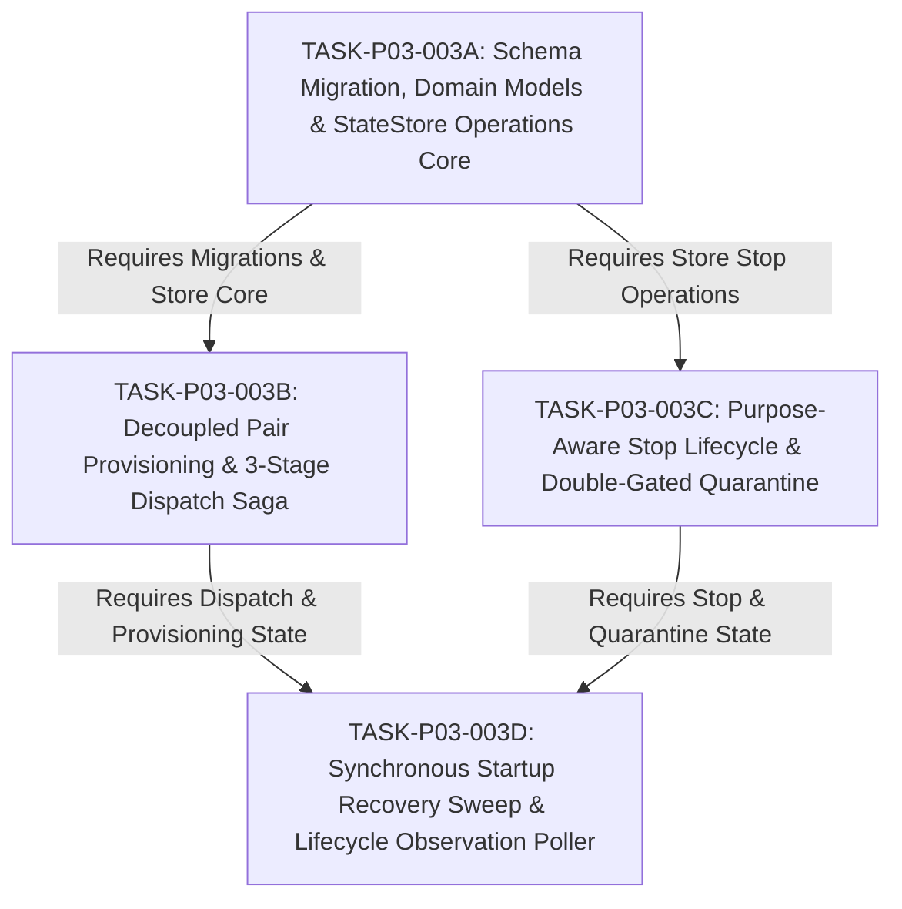

# PARENT-LEVEL TASK DECOMPOSITION: TASK-P03-003

> **Identifier**: `DECOMPOSITION-TASK-P03-003`
> **Task ID**: `TASK-P03-003` (AO Integration Core & Lifecycle Reconciliation)
> **Phase ID**: `P03`
> **Status**: `PLANNING_DECOMPOSITION / NOT_RELEASED`
> **Authority**: Formulated pursuant to accepted [ADR-016](../adr/ADR-016-durable-dispatch-session-binding-and-lifecycle-reconciliation.md) and approved canonical specifications ([docs/04](../04_ARCHITECTURE.md), [docs/05](../05_DOMAIN_MODEL.md), [docs/06](../06_WORKFLOW_STATE_MACHINE.md), [docs/08](../08_TASK_CONTRACT.md), [docs/12](../12_UPSTREAM_INTEGRATION.md), [docs/14](../14_FAILURE_RECOVERY.md), [docs/21](../21_TRACEABILITY_MATRIX.md), [docs/22](../22_MODULE_PROVENANCE.md), [docs/phases/P03_AO_INTEGRATION.md](../phases/P03_AO_INTEGRATION.md)).

---

> [!CRITICAL]
> **GOVERNANCE STATUS: PLANNING DECOMPOSITION ONLY / NOT A RELEASED TASK CONTRACT**.
> This document establishes the **parent-level structural decomposition** of `TASK-P03-003`. It does **NOT** authorize production code execution and does **NOT** grant a shared implementation `allowed_scope` blanket across sub-contracts.
> Implementation authorization is granted exclusively via individual, independently reviewed, immutable Task Contracts (`CONTRACT-TASK-P03-003A-01`, etc.).
> Production coding remains strictly **`HELD_PENDING_TASK_CONTRACT_RELEASE`** (`TASK_P03_003 = NOT_RELEASED`).

---

## 1. Context & Architectural Rationale for Decomposition

`TASK-P03-003` translates the 13 binding decisions of accepted ADR-016 into production code connecting the Supervisor Control Plane to the Untrivial Agent Orchestrator runtime.

A technical complexity assessment reveals that executing `TASK-P03-003` as a single monolithic contract spans:
- 3 new database tables, 2 schema alterations, 1 partial unique index, and foreign key constraints with `ON DELETE RESTRICT`;
- 3 aggregate domain models and Model A snapshot extensions across 2 existing models;
- 10+ StateStore methods including multi-table atomic CAS transitions;
- Decoupled Pair session provisioning coordinator;
- 3-stage dispatch saga state machine and pre-send admissibility check;
- Purpose-aware stop operations coordinator with restart-stable deadlines;
- Double-gated quarantine evaluation engine and Class A/B/C clearance playbooks;
- Synchronous 5-step startup recovery scanner;
- Observation poller mapping engine.

Total blast radius is estimated at **1,800–2,500 lines of Go code and tests**. Executing this in a single review unit introduces severe verification friction and risks multi-round audit churn.

To ensure fail-safe auditability, strict scope containment, and incremental verification without modifying roadmap phase boundaries, `TASK-P03-003` is partitioned into **four sequential, dependency-chained sub-contracts**:

---

## 2. Parent-Level Invariants (Apply Across All Sub-Contracts)

1. **Strict Anti-Reinvention**: Consult `docs/sources/SOURCE_REGISTRY.md` and `docs/sources/REUSE_MATRIX.md`. Never duplicate capabilities provided by Agent Orchestrator or Antigravity CLI.
2. **Operational Policies Neutrality**: All 8 operational policies remain **VALUE = UNSET** with zero hardcoded defaults:
   - `SUPERVISOR_HTTP_TIMEOUT`: UNSET
   - `SUPERVISOR_HEALTH_PROBE_TIMEOUT`: UNSET
   - `SUPERVISOR_SPAWN_TIMEOUT`: UNSET
   - `SUPERVISOR_SEND_TIMEOUT`: UNSET
   - `SUPERVISOR_ACTIVITY_POLL_INTERVAL`: UNSET
   - `SUPERVISOR_EXECUTION_DEADLINE`: UNSET
   - `SUPERVISOR_KILL_STOP_TIMEOUT`: UNSET
   - `SUPERVISOR_WORKSPACE_READ_TIMEOUT`: UNSET
   *(Note: `UPSTREAM_AO_REQUEST_TIMEOUT = 60s` is a server fact of the pinned AO runtime).*
3. **Task Scope Immutability**: No sub-contract may touch files outside its own explicitly assigned `allowed_scope`. There is no shared cross-contract implementation scope.
4. **No Premature Feature Creep**:
   - Zero workspace file fetching or directory tree reading (`TASK-P03-004`).
   - Zero `WorkerReport` schema validation or claim parsing (Phase P04 `EvidenceCollector`).
   - Zero `worker_report_raw` persistence or report interpretation (Phase P04).
   - Zero TaskState transition `RUNNING -> REPORT_READY` (Phase P04).
   - Zero active SSE / `/api/v1/events` streaming integration.
   - Zero synthetic worker heartbeat generation.

---

## 3. Sub-Contract Specifications

### 3.1 Sub-Contract 3A: Schema Migration, Domain Models & StateStore Operations Core
- **Task ID**: `TASK-P03-003A`
- **Contract Document**: [`docs/tasks/DRAFT_TASK_CONTRACT_P03_003A.md`](DRAFT_TASK_CONTRACT_P03_003A.md)
- **Objective**: Implement SQLite schema migration to version 3 in `internal/store/migrations.go` pursuant to ADR-016 §27 (`worker_sessions` creation, `task_attempts` snapshot columns migration, `pair_provisioning_operations`, `dispatch_operations`, `stop_operations`, foreign key `ON DELETE RESTRICT` constraints, partial unique index `idx_pair_provisioning_unresolved`); implement corresponding domain structs in `internal/domain`; implement StateStore CRUD and atomic transitions (`AtomicTerminalTransition`, `AtomicAttemptClosureTransition`) in `internal/store`.
- **Dependencies**: Baseline commit at contract release time; Phase P02 StateStore baseline.
- **Allowed Scope**: Strictly `internal/domain/**` and `internal/store/**`. (Zero access to `internal/ao/**` or coordination packages).
- **Projected Exit Gate**: `go test -v ./internal/store/... ./internal/domain/...` passes with zero race warnings; schema integrity, foreign key constraints, partial unique index, and atomic CAS transitions verified.

---

### 3.2 Sub-Contract 3B: Decoupled Pair Provisioning & 3-Stage Dispatch Saga
- **Task ID**: `TASK-P03-003B`
- **Objective**: Implement the decoupled Pair provisioning coordinator enforcing `CREATE_NEW_WORKER_SESSION_ALLOWED_IFF` (`COUNT(*) == 0` check, session reuse, pinned route `POST /api/v1/sessions/{sessionId}/restore` for terminated sessions); implement the 3-stage dispatch saga (`DISPATCH_BOUND -> pre-send check -> SEND_REQUESTED -> HTTP 200 -> SEND_CONFIRMED`); implement strict pre-send admissibility check matching bound `session_id` and `terminal_generation` with whitelist `('idle', 'waiting_input')`; implement fail-closed quarantine containment on unknown delivery or timeout.
- **Dependencies**: `TASK-P03-003A` approved and released baseline; `internal/ao` client from `TASK-P03-001`/`002`.
- **Projected Exit Gate**: Dispatch saga tests pass; pre-send whitelist rejects `active` and `blocked` statuses; unknown delivery transitions `DISPATCHED -> FAILED` with double-gated quarantine imposed and escalates to `HUMAN_REQUIRED`.

---

### 3.3 Sub-Contract 3C: Purpose-Aware Stop Lifecycle & Double-Gated Quarantine Management
- **Task ID**: `TASK-P03-003C`
- **Objective**: Implement purpose-aware stop operations coordinating `POST /api/v1/sessions/{id}/kill` with Supervisor-owned `stop_operations` metadata; capture target generation for Supervisor-side precheck; track restart-stable `confirmation_deadline_at`; enforce `STOP_REISSUE_REQUIRES_HUMAN` (zero blind re-kill); evaluate all 6 conditions of `WORKER_STOPPED_ALLOWED_IFF` for `RUNNING_ATTEMPT_STOP` on `RUNNING` tasks; implement physical Class A clearance under D5/D6/D11 for `QUARANTINE_CLEANUP` on terminal tasks (zero TaskState transition, zero `ended_at` change, no `WORKER_STOPPED`); implement Class B (HTTP 404 administrative risk resolution) and Class C (human risk acceptance) clearance playbooks.
- **Dependencies**: `TASK-P03-003A` and `TASK-P03-003B` approved and released baselines.
- **Projected Exit Gate**: Stop operations pass purpose matrix tests; deadline-expired observation fails closed to `STOP_CONFIRMATION_TIMEOUT` with quarantine retained; Class A/B/C quarantine clearance invariants verified.

---

### 3.4 Sub-Contract 3D: Synchronous Startup Recovery Sweep & Lifecycle Observation Poller
- **Task ID**: `TASK-P03-003D`
- **Objective**: Implement the synchronous 5-step startup recovery scanner (ADR-016 §19) reconciling crash-interrupted provisioning, dispatch unknown delivery, stop in-flight operations, and blocked attempts with open attempts; implement observation poller mapping AO activity states (`active`, `idle`, `waiting_input`, `blocked`, `exited`) driving TaskState transitions; handle rapid turn completion (`MISSED_ACTIVE_WINDOW`).
- **Dependencies**: `TASK-P03-003A`, `TASK-P03-003B`, and `TASK-P03-003C` approved and released baselines.
- **Projected Exit Gate**: All 5 startup sweep steps verified via deterministic recovery tests; observation poller state transitions pass with `-race`.

> [!WARNING]
> **DESIGN BLOCKER & RUNTIME ORDERING NOTICE (`DESIGN_BLOCKER_3D_STARTUP_WIRING`)**:
> - The repository currently contains exclusively internal Go packages (`internal/domain`, `internal/store`, `internal/ao`, etc.) and does **NOT** yet contain an HTTP/MCP server entrypoint or daemon bootstrap binary (`cmd/` does not exist).
> - Consequently, the architectural assertion that *"startup recovery executes synchronously before accepting incoming API requests"* cannot be guaranteed or proven solely by a poller or scanner library function.
> - **Condition for Contract 3D**: Contract 3D must NOT claim that this runtime sequencing is already guaranteed by the daemon. Instead, Contract 3D must:
>   1. Implement a self-contained, synchronous `StartupRecoveryScanner.Run(ctx)` component;
>   2. Formally declare an architectural contract requirement that any future daemon bootstrap (`cmd/server/main.go` or MCP entrypoint) MUST invoke `StartupRecoveryScanner.Run(ctx)` to completion prior to binding listeners or serving API requests;
>   3. Demonstrate this ordering via an integration test harness verifying that incoming requests are rejected or blocked until `StartupRecoveryScanner.Run(ctx)` completes.

---

## 4. Immediate Next Step

External Supervisor review and formal approval of [`docs/tasks/DRAFT_TASK_CONTRACT_P03_003A.md`](DRAFT_TASK_CONTRACT_P03_003A.md). Production coding remains strictly **HELD** until Contract 3A is released.
