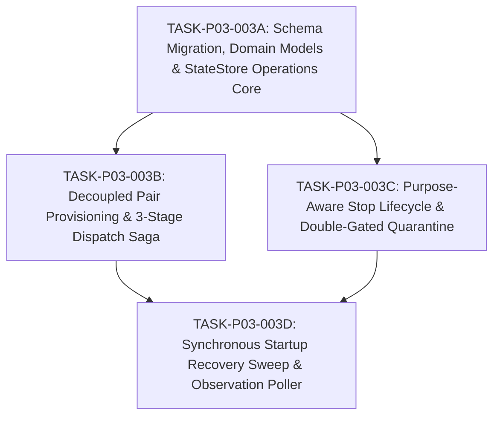

# DRAFT TASK CONTRACT: TASK-P03-003

> **Contract ID**: `CONTRACT-TASK-P03-003-01` (DRAFT — UNRELEASED)
> **Task ID**: `TASK-P03-003`
> **Revision Number**: `1`
> **Supersedes Contract ID**: `null`
> **Phase ID**: `P03`
> **Base SHA**: `41cf769b4cf8a980c95de3aa4be63140b04922c3`
> **Status**: `DRAFT_PENDING_EXTERNAL_SUPERVISOR_APPROVAL`
> **Authority**: Formulated pursuant to accepted [ADR-016](../adr/ADR-016-durable-dispatch-session-binding-and-lifecycle-reconciliation.md) and approved canonical specifications ([docs/04](../04_ARCHITECTURE.md), [docs/05](../05_DOMAIN_MODEL.md), [docs/06](../06_WORKFLOW_STATE_MACHINE.md), [docs/08](../08_TASK_CONTRACT.md), [docs/12](../12_UPSTREAM_INTEGRATION.md), [docs/14](../14_FAILURE_RECOVERY.md), [docs/21](../21_TRACEABILITY_MATRIX.md), [docs/22](../22_MODULE_PROVENANCE.md), [docs/phases/P03_AO_INTEGRATION.md](../phases/P03_AO_INTEGRATION.md)).

---

> [!CRITICAL]
> **GOVERNANCE STATUS: DRAFT ONLY / NOT RELEASED**.
> Production coding remains strictly **`HELD_PENDING_TASK_CONTRACT_RELEASE`** (`TASK_P03_003 = NOT_RELEASED`).
> Absolutely ZERO Go code implementation (`internal/**/*.go`) and ZERO database migration execution is authorized by this document until formally approved and released by External Supervisor audit.

---

## 1. Objective

Implement the durable dispatch saga, worker session lifecycle binding, persistence impact (ADR-016 §27), observation poller activity mapping, purpose-aware stop operations with restart-stable deadlines, double-gated quarantine containment and clearance playbooks, and synchronous 5-step startup recovery sweep connecting the Supervisor Control Plane to the Untrivial Agent Orchestrator runtime.

---

## 2. Traceable Requirements & Architecture References

### 2.1 Traceable Requirements
- `FR-005`: Worker Dispatch (decoupled Pair provisioning, 3-stage dispatch saga)
- `FR-006`: Worker Observation (normalized session snapshot observation, activity mapping)
- `FR-015`: Upstream Health & Preflight (IAOAdapter integration)
- `OPS-002`: Clean Termination & Lifecycle Management (purpose-aware stop provenance)
- `NFR-003`: Crash Recoverability & Idempotence (synchronous startup recovery sweep, restart-stable deadlines)
- `NFR-005`: Upstream Decoupling & Anti-Corruption (Model A snapshot persistence, zero domain pollution)
- `SEC-001`: Sandboxed Containment & Quarantine (double-gated quarantine, Class A/B/C clearance)

### 2.2 Governing Architecture References
- `docs/adr/ADR-016-durable-dispatch-session-binding-and-lifecycle-reconciliation.md` (accepted, immutable)
- `docs/04_ARCHITECTURE.md` (§2.1 Task Dispatch Flow, §2.2 Completion Flow, §3.1 AOAdapter Boundary)
- `docs/05_DOMAIN_MODEL.md` (§1 Class Diagram, §2 Entity Dictionary, §3 Durable Saga Operations, §4 Model A Persistence)
- `docs/06_WORKFLOW_STATE_MACHINE.md` (§1 State Machine, §2 Canonical States & Transitions)
- `docs/08_TASK_CONTRACT.md` (§1 Purpose & Invariants, §2 Field Specification)
- `docs/12_UPSTREAM_INTEGRATION.md` (§1 IAOAdapter Interface, §Pre-Send Admissibility, §Purpose-Aware Stop)
- `docs/14_FAILURE_RECOVERY.md` (§1.1 Recovery Matrix, §1.2 Double-Gated Quarantine & Startup Sweep)
- `docs/21_TRACEABILITY_MATRIX.md` (Complete Traceability Matrix for ADR-016)
- `docs/22_MODULE_PROVENANCE.md` (§1 Planned Modules, §3 Store Entities Provenance)
- `docs/sources/SOURCE_REGISTRY.md` & `docs/sources/REUSE_MATRIX.md` (Strict anti-reinvention mandate)

---

## 3. Ownership & Module Boundaries

### 3.1 What TASK-P03-003 OWNS:
1. **Schema Migration & DDL**:
   - SQLite schema migration implementing ADR-016 §27 authoritative DDL:
     * `pair_provisioning_operations` table + partial unique index `idx_pair_provisioning_unresolved`
     * `dispatch_operations` table (`UNIQUE(attempt_id)`)
     * `stop_operations` table (`stage` vs `resolution_state` separation)
     * `worker_sessions` candidate updates (`quarantine_state`, `worktree_path TEXT NULL`, `terminal_generation`)
     * `task_attempts` candidate snapshot additions (`session_id`, `terminal_generation`, `recovery_disposition`, `quarantine_state`)
     * Strict foreign key constraints with `ON DELETE RESTRICT` on all references
2. **Domain Entities (`internal/domain`)**:
   - Aggregate entities for `PairProvisioningOperation`, `DispatchOperation`, and `StopOperation`.
   - Snapshot fields on `TaskAttempt` and `WorkerSession`.
3. **StateStore Operations Core (`internal/store`)**:
   - CRUD and transition methods for provisioning, dispatch, and stop operations.
   - `AtomicTerminalTransition`: unified CAS transaction committing TaskState, `ended_at = now`, and `recovery_disposition`.
   - `AtomicAttemptClosureTransition`: atomic closure of open attempts upon `BLOCKED -> HUMAN_REQUIRED`.
4. **Decoupled Pair Provisioning Coordinator**:
   - Enforcing `CREATE_NEW_WORKER_SESSION_ALLOWED_IFF`:
     1. `COUNT(*) == 0` for Pair in `worker_sessions`;
     2. Zero unresolved `pair_provisioning_operations` (`stage IN ('PROVISION_REQUESTED', 'PROVISION_FAILED')`);
     3. Zero active quarantine (`worker_sessions` and `task_attempts` clean).
   - Session non-replacement: existing `ACTIVE`/`IDLE` sessions reused; `TERMINATED + CLEAN` sessions restored via pinned route `POST /api/v1/sessions/{sessionId}/restore`.
5. **Durable 3-Stage Dispatch Saga**:
   - Stage 1: `DISPATCH_BOUND` (atomic pre-dispatch persistence of TaskAttempt snapshot + TaskState `READY -> DISPATCHED` + `dispatch_operations`).
   - Pre-Send Admissibility Check: calls `GetWorkerStatus(sessionId)`, matches bound `session_id` and `terminal_generation`, permits dispatch only if status in `('idle', 'waiting_input')`.
   - Stage 2: `SEND_REQUESTED` (persisted immediately prior to issuing loopback `POST /api/v1/sessions/{id}/send`).
   - Stage 3: `SEND_CONFIRMED` (persisted on HTTP 200 write acceptance).
   - Fail-closed quarantine containment on unknown delivery/timeout: `DISPATCHED -> FAILED` (`UNCERTAIN_DELIVERY_CRASH`), double-gated quarantine imposed, escalated to `HUMAN_REQUIRED`.
6. **Purpose-Aware Stop Lifecycle**:
   - Issues `POST /api/v1/sessions/{id}/kill` with Supervisor-owned `stop_operations` row.
   - Purpose-aware divergence:
     * `RUNNING_ATTEMPT_STOP`: evaluates all 6 conditions of `WORKER_STOPPED_ALLOWED_IFF` on `RUNNING` task; if satisfied, sets `ended_at = now`, `recovery_disposition = 'WORKER_STOPPED'`, transitions `RUNNING -> FAILED`, clears quarantine.
     * `QUARANTINE_CLEANUP`: executes on terminal task (`FAILED`/`HUMAN_REQUIRED`); confirmed termination clears quarantine (`CLEAN`), but executes ZERO TaskState transition, ZERO `ended_at` mutation, and does NOT record `WORKER_STOPPED`.
     * `PAIR_MAINTENANCE`: maintenance stop with zero attempt/task mutation.
   - Restart-stable `confirmation_deadline_at` tracking and generation precheck.
   - Enforces `STOP_REISSUE_REQUIRES_HUMAN` (zero blind re-kill on restart).
7. **Double-Gated Quarantine Management**:
   - Evaluates `Pair Lane Gate` (`worker_sessions.quarantine_state`) and `Task Attempt Gate` (`task_attempts.quarantine_state`).
   - Class A (physical termination), Class B (HTTP 404 absence requiring administrative risk resolution), Class C (human risk acceptance).
8. **Observation Poller Activity Mapping**:
   - Poller maps AO status: `active`, `idle`, `waiting_input` (preserves RUNNING), `blocked` (records `AO_BLOCKED_DECISION`), `exited`.
   - Fast `active -> idle` records `MISSED_ACTIVE_WINDOW` on attempt.
9. **Synchronous Startup Recovery Sweep (ADR-016 §19)**:
   - Synchronous 5-step scanner running on daemon boot before accepting API requests:
     1. Sweep `pair_provisioning_operations` (`PROVISION_REQUESTED -> PROVISION_FAILED`);
     2. Sweep `dispatch_operations` (`SEND_REQUESTED -> FAILED`, quarantine imposed);
     3. Sweep in-flight `stop_operations` under deterministic decision order;
     4. Blocked attempt crash escalation (`BLOCKED` with open attempt -> `HUMAN_REQUIRED`);
     5. In-flight task & pair lane reconciliation.

### 3.2 What TASK-P03-003 STRICTLY DOES NOT OWN:
- **NO** workspace file fetching or directory tree reading (`TASK-P03-004`).
- **NO** `WorkerReport` schema validation or claim parsing (Phase P04 `EvidenceCollector`).
- **NO** `worker_report_raw` persistence (Phase P04).
- **NO** TaskState transition `RUNNING -> REPORT_READY` (Phase P04).
- **NO** background ticker threads or uncoordinated polling loops.
- **NO** SSE or `/api/v1/events` integration.
- **NO** synthetic worker heartbeat generation.
- **NO** hardcoded or default numbers for the 8 operational policies.

---

## 4. Operational Policies Status (Strictly UNSET)

Pursuant to ADR-016 §20 and canonical specifications, all 8 operational policies remain **VALUE = UNSET**. The implementation must accept them as caller-injected parameters or context-propagated timeouts with zero hardcoded numeric defaults:

1. `SUPERVISOR_HTTP_TIMEOUT`: `UNSET`
2. `SUPERVISOR_HEALTH_PROBE_TIMEOUT`: `UNSET`
3. `SUPERVISOR_SPAWN_TIMEOUT`: `UNSET`
4. `SUPERVISOR_SEND_TIMEOUT`: `UNSET`
5. `SUPERVISOR_ACTIVITY_POLL_INTERVAL`: `UNSET`
6. `SUPERVISOR_EXECUTION_DEADLINE`: `UNSET`
7. `SUPERVISOR_KILL_STOP_TIMEOUT`: `UNSET`
8. `SUPERVISOR_WORKSPACE_READ_TIMEOUT`: `UNSET`

*(Note: `UPSTREAM_AO_REQUEST_TIMEOUT = 60s` is a verified upstream server fact, not a Supervisor policy).*

---

## 5. Scope Boundaries

### Allowed Scope (`allowed_scope`):
```text
internal/domain/**
internal/store/**
internal/ao/**
internal/dispatch/**
internal/recovery/**
internal/poller/**
migrations/**
```

### Forbidden Scope (`forbidden_scope`):
```text
docs/adr/**
docs/proposals/**
docs/02_REQUIREMENTS.md
docs/04_ARCHITECTURE.md
docs/05_DOMAIN_MODEL.md
docs/06_WORKFLOW_STATE_MACHINE.md
docs/08_TASK_CONTRACT.md
docs/12_UPSTREAM_INTEGRATION.md
docs/14_FAILURE_RECOVERY.md
docs/17_ROADMAP.md
docs/18_CURRENT_STATE.md
docs/21_TRACEABILITY_MATRIX.md
docs/22_MODULE_PROVENANCE.md
docs/phases/**
AGENTS.md
* (any file outside allowed_scope)
```

---

## 6. Acceptance Criteria

| ID | Category | Objective Condition |
|---|---|---|
| **AC-01** | **DDL & Migration** | SQLite migrations execute idempotently; create tables `pair_provisioning_operations`, `dispatch_operations`, `stop_operations`; add columns to `worker_sessions` and `task_attempts`; enforce `ON DELETE RESTRICT` on all foreign keys; create partial unique index `idx_pair_provisioning_unresolved` matching ADR-016 §27 verbatim. |
| **AC-02** | **Domain Entities** | `internal/domain` defines Go structs for `PairProvisioningOperation`, `DispatchOperation`, and `StopOperation`, plus snapshot additions on `TaskAttempt` and `WorkerSession` with zero foreign or undeclared fields. |
| **AC-03** | **Pair Provisioning** | Enforces `CREATE_NEW_WORKER_SESSION_ALLOWED_IFF`: rejects second spawn if `COUNT(*) > 0`, if unresolved operations exist, or if quarantine is active. Enforces reuse of active/idle sessions and `/restore` route for restorable terminated sessions. |
| **AC-04** | **3-Stage Dispatch Saga** | Implements `DISPATCH_BOUND -> pre-send check -> SEND_REQUESTED -> HTTP 200 -> SEND_CONFIRMED`. Pre-send check evaluates `GetWorkerStatus` against `('idle', 'waiting_input')` matching bound `session_id` and `terminal_generation`. Unknown delivery/timeout triggers fail-closed `DISPATCHED -> FAILED` with double-gated quarantine and escalation to `HUMAN_REQUIRED`. |
| **AC-05** | **Purpose-Aware Stop** | Implements `stop_operations` tracking over `POST /api/v1/sessions/{id}/kill`. Separates `RUNNING_ATTEMPT_STOP` (evaluates `WORKER_STOPPED_ALLOWED_IFF`) from `QUARANTINE_CLEANUP` (Class A clearance under D5/D6/D11, zero TaskState change, zero `ended_at` change, no `WORKER_STOPPED`). Prohibits blind re-kill (`STOP_REISSUE_REQUIRES_HUMAN`). |
| **AC-06** | **Double-Gated Quarantine** | Independently evaluates Pair Lane Gate and Task Attempt Gate. Implements Class A (physical termination), Class B (HTTP 404 absence requiring administrative risk resolution), and Class C (human risk acceptance) clearance rules. |
| **AC-07** | **Observation Mapping** | Poller correctly maps AO states: `active`, `idle`, `waiting_input` (preserves `RUNNING`), `blocked` (records `AO_BLOCKED_DECISION`), `exited`. Records `MISSED_ACTIVE_WINDOW` on rapid turn completion. |
| **AC-08** | **Atomic Transitions** | `AtomicTerminalTransition` commits CAS state transition, `ended_at = now`, and `recovery_disposition` in a single SQLite transaction. `AtomicAttemptClosureTransition` atomically closes attempts upon `BLOCKED -> HUMAN_REQUIRED`. |
| **AC-09** | **Startup Recovery** | Synchronous 5-step recovery sweep executes on daemon boot, correctly reconciling crash-interrupted provisioning, dispatch unknown delivery, stop in-flight operations, and blocked open attempts before API request acceptance. |
| **AC-10** | **Policy Neutrality** | All 8 operational policies remain UNSET; zero hardcoded fallback values in implementation. |
| **AC-11** | **Interface Boundaries** | Zero workspace file fetching or WorkerReport parsing code (`TASK-P03-004` / Phase P04 ownership). Zero SSE/events streaming dependencies. |
| **AC-12** | **Test Coverage & Hygiene** | Unit and integration tests pass with `-race`; zero SQLite connection leaks; clean git worktree. |

---

## 7. Runnable Verification Commands

The worker implementation must be verified via the following executable commands:
```powershell
# 1. StateStore and migration tests (including schema integrity and constraints)
go test -v ./internal/store/...

# 2. Domain model serialization and invariant tests
go test -v ./internal/domain/...

# 3. AO client lifecycle, preflight, and command tests
go test -v ./internal/ao/...

# 4. Dispatch saga and pre-send admissibility tests
go test -v ./internal/dispatch/...

# 5. Recovery scanner and stop operations tests
go test -v ./internal/recovery/...

# 6. Full race detection sweep across all internal packages
go test -race ./internal/...

# 7. Git diff and formatting hygiene verification
git diff --check
```

---

## 8. Scope Analysis & Modular Decomposition Recommendation

### 8.1 Complexity Assessment of Single Contract
If executed as a single monolithic contract, `TASK-P03-003` spans:
- 3 new database tables, 2 table schema alterations, 1 partial unique index;
- 3 new aggregate domain models and snapshot extensions across 2 existing models;
- 10+ new StateStore methods including 2 multi-table atomic transactions;
- 3-stage dispatch saga state machine and pre-send whitelist validator;
- Purpose-aware stop operations coordinator with restart-stable deadlines;
- Double-gated quarantine evaluation engine and Class A/B/C clearance handlers;
- Synchronous 5-step startup recovery sweep;
- Observation poller status mapping engine.

Estimated blast radius: **1,800–2,500 lines of production Go code and tests**.
Evaluating this in a single review pass poses high verification friction and elevated risk of re-audit cycles.

### 8.2 Recommended Modular Decomposition (Sub-Contracts)

To ensure fail-safe auditability and incremental verification without altering roadmap boundaries, `TASK-P03-003` is recommended to be partitioned into four sequential, dependency-chained sub-contracts:



#### Sub-Contract 3A: `CONTRACT-TASK-P03-003A-01`
- **Focus**: Persistence Layer, Authoritative DDL Migrations & Domain Models.
- **Deliverables**: SQLite migrations implementing ADR-016 §27 (`pair_provisioning_operations`, `dispatch_operations`, `stop_operations`, `worker_sessions`, `task_attempts`); domain structs in `internal/domain`; StateStore CRUD and atomic transition methods (`AtomicTerminalTransition`, `AtomicAttemptClosureTransition`).
- **Dependencies**: Base SHA `41cf769b4cf8a980c95de3aa4be63140b04922c3`, P02 StateStore baseline.
- **Exit Gate**: `go test -v ./internal/store/... ./internal/domain/...` passes; SQLite schema, foreign key `ON DELETE RESTRICT` constraints, and partial unique index proven.

#### Sub-Contract 3B: `CONTRACT-TASK-P03-003B-01`
- **Focus**: Pair Provisioning Coordinator & 3-Stage Dispatch Saga.
- **Deliverables**: `CREATE_NEW_WORKER_SESSION_ALLOWED_IFF` guard evaluation; session reuse / pinned `/restore` path; 3-stage dispatch saga (`DISPATCH_BOUND -> pre-send check -> SEND_REQUESTED -> SEND_CONFIRMED`); pre-send admissibility whitelist (`idle`, `waiting_input`); fail-closed quarantine on unknown delivery.
- **Dependencies**: Sub-contract 3A approved baseline; `internal/ao` client from TASK-P03-001/002.
- **Exit Gate**: `go test -v ./internal/dispatch/...` passes; dispatch saga stages, pre-send rejection of active/blocked states, and unknown-delivery quarantine proven.

#### Sub-Contract 3C: `CONTRACT-TASK-P03-003C-01`
- **Focus**: Purpose-Aware Stop Lifecycle & Double-Gated Quarantine Management.
- **Deliverables**: Stop operation tracking over `POST /api/v1/sessions/{id}/kill`; restart-stable `confirmation_deadline_at`; `WORKER_STOPPED_ALLOWED_IFF` for live attempt stops; Class A clearance under D5/D6/D11 for `QUARANTINE_CLEANUP`; Class B/C clearance playbooks; `STOP_REISSUE_REQUIRES_HUMAN`.
- **Dependencies**: Sub-contracts 3A and 3B approved baselines.
- **Exit Gate**: `go test -v ./internal/recovery/...` passes; purpose separation, deadline-expired fail-closed behavior, and quarantine gate clearance proven.

#### Sub-Contract 3D: `CONTRACT-TASK-P03-003D-01`
- **Focus**: Synchronous Startup Recovery Sweep & Lifecycle Observation Poller.
- **Deliverables**: Synchronous 5-step startup recovery scanner (ADR-016 §19) executing prior to API request acceptance; observation poller mapping (`active`, `idle`, `waiting_input`, `blocked`, `exited`); rapid turn completion (`MISSED_ACTIVE_WINDOW`) handling.
- **Dependencies**: Sub-contracts 3A, 3B, and 3C approved baselines.
- **Exit Gate**: `go test -v ./internal/recovery/... ./internal/poller/...` passes; full 5-step startup recovery and lifecycle poller verified with `-race`.

---

## 9. Conclusion & Release Gate

This document serves as the **authoritative draft** for `TASK-P03-003`.
Implementation will proceed ONLY upon formal External Supervisor review, decision on whether to execute monolithically or via sub-contracts 3A–3D, and formal release of the active contract.
